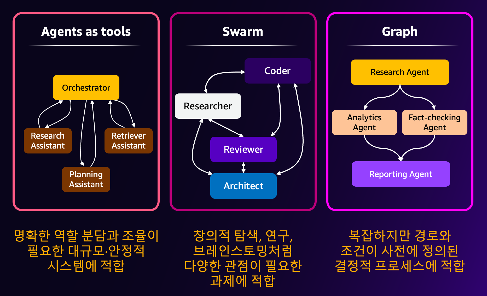
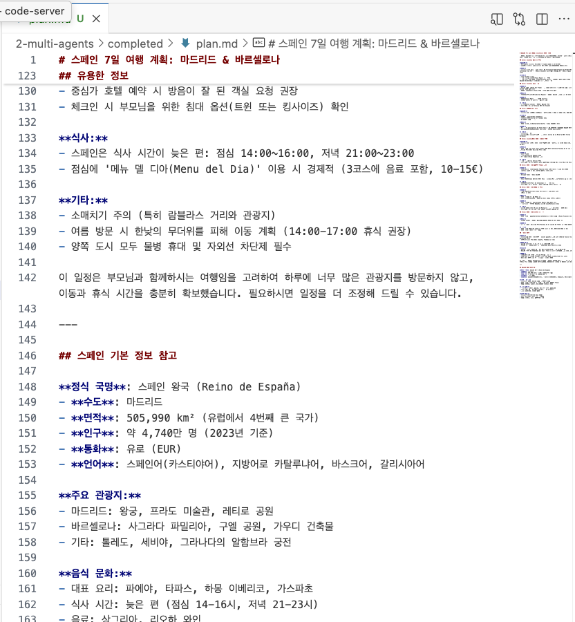
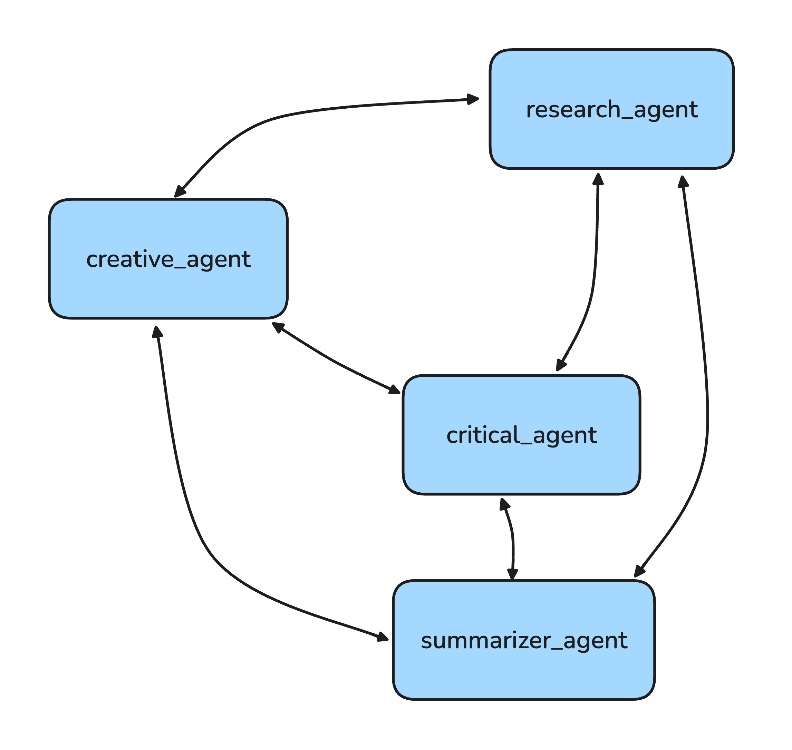
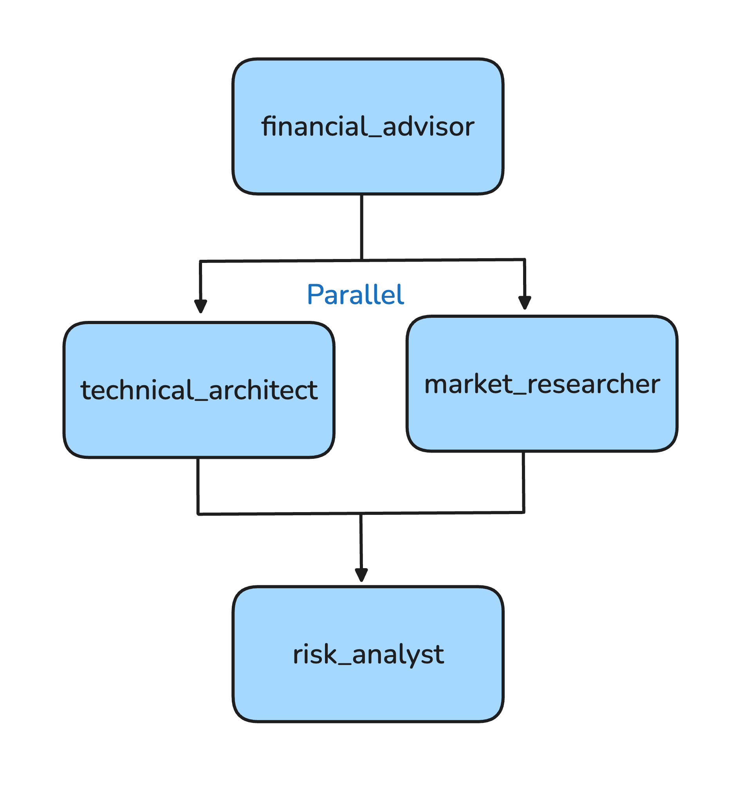
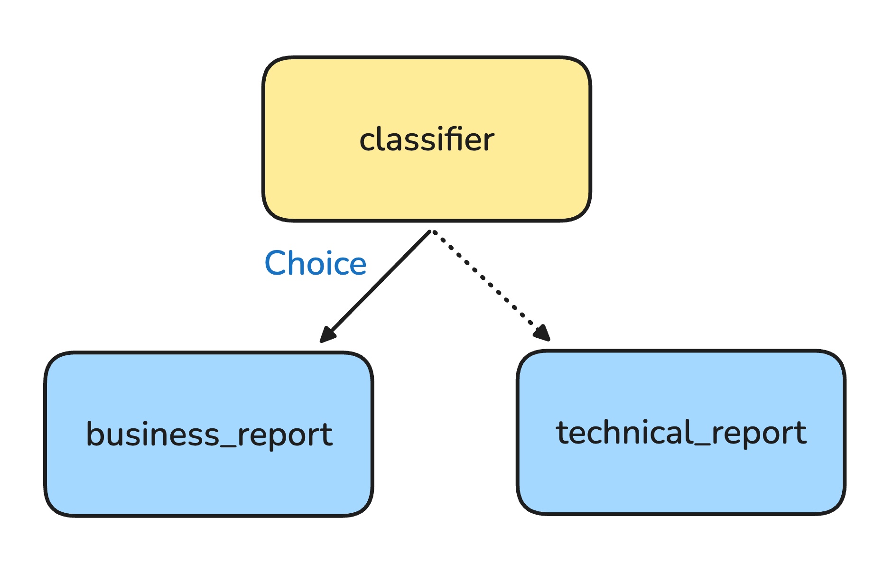

# 2. Building Systems that Perform Complex Tasks through Multi-Agent Patterns

[한국어 README](README.ko.md)

In this chapter you will learn how to build systems where multiple agents collaborate, using the multi-agent patterns of the Strands Agents SDK. You will practice the following three patterns and create agent systems that solve tasks a single agent would struggle with.



> [!NOTE]
> **Prerequisites**
> - Environment set up per [00-setup](../00-setup/README.md)
> - Amazon Bedrock model access in `us-west-2` for `us.anthropic.claude-sonnet-4-20250514-v1:0` (the SDK default) and `us.anthropic.claude-sonnet-4-6`
> - [Chapter 01](../01-single-agent/README.md) is recommended first. This chapter assumes you already know how to create an `Agent` and pass it tools.

**What you will learn**

- Wrapping specialized agents as tools with `@tool` and routing requests through an orchestrator (Agents-as-Tools)
- Letting agents autonomously hand off work to each other with `Swarm`
- Defining explicit execution order and dependencies with `GraphBuilder`, including parallel branches
- Branching a graph to different agents with conditional edges
- Choosing between the three patterns for a given task

**Estimated time:** ~50 minutes

## Files in this chapter

| File | Purpose |
|---|---|
| `labs/agents_as_tools.py` | (empty) you write this |
| `labs/swarms.py` | (empty) you write this |
| `labs/graph_parallel.py` | (empty) you write this |
| `labs/graph_condition.py` | (empty) you write this |
| `completed/agents_as_tools.py` | reference answer |
| `completed/swarms.py` | reference answer |
| `completed/graph_parallel.py` | reference answer |
| `completed/graph_condition.py` | reference answer |
| `completed/artifacts-agents_as_tools/` | sample output from a previous run (`plan.md`) |
| `completed/artifacts-swarms/` | sample output from a previous run (`research.md`, `creative.md`, `critical.md`, `summarizer.md`, `travel_plan.md`) |
| `completed/artifacts-graph/` | sample output from a previous run (`business_report.md`, `technical_report.md`) |

The lab pattern is the same as in the other chapters: you write the code into the empty file in `labs/`, and `completed/` holds the reference answer. Open the completed file only if you get stuck.


> [!NOTE]
> **The `artifacts-*` folders are outputs, not source**
> `completed/artifacts-agents_as_tools/`, `completed/artifacts-swarms/`, and `completed/artifacts-graph/` are markdown files that the scripts produced when they were run. They are checked in so you can see what a finished run looks like. You do not write them yourself, and you do not need to copy them.
>
> Every lab in this chapter uses the `file_write` tool from `strands-agents-tools` with plain relative filenames (`plan.md`, `research.md`, `travel_plan.md`, `business_report.md`, ...), so the files are created in the directory you run the command from. If you run the commands below from the repository root, the generated files appear at the repository root. Move them into a folder of your own (for example `02-multi-agents/labs/artifacts-swarms/`) to keep your working tree tidy, or delete them.

> [!NOTE]
> The reference code in `completed/` uses `us.anthropic.claude-sonnet-4-6` where a model is set explicitly. Agents created without a `model` argument use the SDK default model. If you want to use a different Bedrock model, change the model ID in the code and make sure you have model access for it.

---

## 1. Agents-as-Tools Pattern

The [Agents-as-Tools pattern](https://strandsagents.com/docs/user-guide/concepts/multi-agent/agents-as-tools/) is a method of wrapping specialized agents as tools so that other agents can call them as needed.

### Scenario

What if users make complex requests that mix multiple specialized domains, such as *"Research Spain, plan a family trip, and save the results to a file"*?

A single agent might be overloaded trying to handle all these requests. In such cases, by having each agent specialize in their own field, such as **travel planning agents** and **research agents**, and placing an **Orchestrator agent that uses them as tools** in the middle, each agent can focus only on their specialized area and handle requests more accurately and efficiently.

In this lab we will use the Agents-as-Tools pattern to create a multi-agent system that automatically classifies requests from various specialized domains such as research, product recommendations, and travel planning, and delegates them to appropriate specialized agents.


**1-1.** Open the `02-multi-agents/labs/agents_as_tools.py` file.

**1-2.** Import the necessary libraries.

```python
import os
from strands import Agent, tool
from strands_tools import file_write

# Disable file_write confirmation prompt
os.environ['BYPASS_TOOL_CONSENT'] = 'true' 

```

**1-3.** Wrap the research agent (`research_assistant`) with `@tool`.

Create a tool from an agent specialized in research-related questions. This agent is dedicated to investigating information about countries, topics, etc.

```python
@tool
def research_assistant(query: str) -> str:
    """
    Processes and responds to research-related queries.

    Args:
        query: Research question requiring factual information

    Returns:
        Detailed research answer with citations
    """
    try:
        research_agent = Agent(
            system_prompt="""You are a professional research assistant.
            Focus on providing only factual information with clear sources for research questions.
            Always cite sources whenever possible.""",
        )
        response = research_agent(query)
        return str(response)
    except Exception as e:
        return f"Error in research assistant: {str(e)}"

```

Inside the function wrapped with the `@tool` decorator, we create and call a specialized agent. This makes the agent behave like a single tool.

**1-4.** Add the product recommendation agent (`product_recommendation_assistant`) as a tool.

This is a specialized agent that provides personalized product suggestions based on user preferences.

```python
@tool
def product_recommendation_assistant(query: str) -> str:
    """
    Handles product recommendation queries by suggesting appropriate products.

    Args:
        query: Product inquiry including user preferences

    Returns:
        Personalized product recommendations with reasoning
    """
    try:
        product_agent = Agent(
            model="us.anthropic.claude-sonnet-4-6",
            system_prompt="""You are a professional product recommendation assistant.
            Provide personalized product suggestions based on user preferences. Always cite sources.""",
        )
        response = product_agent(query)
        return str(response)
    except Exception as e:
        return f"Error in product recommendation: {str(e)}"

```

**1-5.** Add the trip planning agent (`trip_planning_assistant`) as a tool.

This is a specialized agent that plans destinations and travel itineraries and provides travel advice.

```python
@tool
def trip_planning_assistant(query: str) -> str:
    """
    Creates travel itineraries and provides travel advice.

    Args:
        query: Travel planning request including destination and preferences

    Returns:
        Detailed travel itinerary or travel advice
    """
    try:
        travel_agent = Agent(
            model="us.anthropic.claude-sonnet-4-6",
            system_prompt="""You are a professional travel planning assistant.
            Create detailed travel itineraries based on user preferences.""",
        )
        response = travel_agent(query)
        return str(response)
    except Exception as e:
        return f"Error in trip planning: {str(e)}"

```

**1-6.** Create and execute the orchestrator agent.

```python
if __name__ == "__main__":

    MAIN_SYSTEM_PROMPT = """
    You are an assistant that routes queries to specialized agents:
    - For research questions and factual information → use the research_assistant tool
    - For product recommendations and shopping advice → use the product_recommendation_assistant tool
    - For travel planning and itineraries → use the trip_planning_assistant tool
    - For simple questions that don't require specialized knowledge → answer directly

    Always select the most appropriate tool based on the user's query.
    """

    orchestrator = Agent(
        system_prompt=MAIN_SYSTEM_PROMPT,
        tools=[
            research_assistant,
            product_recommendation_assistant,
            trip_planning_assistant,
            file_write,
        ],
    )

    os.environ["DEV"] = "true"
    customer_query = "Can you research Spain for me? And I'm planning to travel there with my parents for 7 days, can you help me plan it? Please save the plan you create to a plan.md file."

    response = orchestrator(customer_query)
```

The orchestrator analyzes user requests and selects and calls the appropriate specialized agent (tool).

**1-7.** Run the following command in the terminal to check the results:

```bash
uv run --project 00-setup python 02-multi-agents/labs/agents_as_tools.py
```

You can confirm that the orchestrator analyzes the question and first calls `research_assistant`, then calls `trip_planning_assistant` to create a travel plan, and finally calls `file_write` to save `plan.md`.

| Calling `research_assistant` as tool | Calling `trip_planning_assistant` as tool | Calling `file_write` tool |
|----------|---------|----------|
|  |  |  |

*Final Result:*



<details>
<summary>Understanding the Agents-as-Tools Pattern</summary>

The core of the Agents-as-Tools pattern is **wrapping agents as tools**.

The `research_assistant`, `product_recommendation_assistant`, and `trip_planning_assistant` that we just defined as Tools each have specialized agents inside them. These agents:

1. When they receive specific requests from the orchestrator
2. Autonomously determine methods like agents
3. Use their own tools when necessary to perform tasks

Hierarchical structure:

```
                        Orchestrator (Top-level - Router)
                                   |
        ┌──────────────────────────┼────────────────────────────┬──────────────┐
        ↓                          ↓                            ↓              ↓
   research_assistant    product_recommendation    trip_planning_assistant   file_write
   (Agent and Tool)         (Agent and Tool)           (Agent and Tool)          (Built-in Tool)     
```

This way, the Strands SDK makes it easy to implement **hierarchical multi-agent systems** by wrapping agents as tools.

For more details, refer to the [official documentation](https://strandsagents.com/docs/user-guide/concepts/multi-agent/agents-as-tools/).

</details>

---

## 2. Swarm Pattern

The [Swarm pattern](https://strandsagents.com/docs/user-guide/concepts/multi-agent/swarm/) is a method where multiple specialized agents autonomously collaborate and hand off tasks to each other. Agents pass work to each other as needed to create the final result.

### Scenario

Let's assume a situation where multiple experts need to exchange work and collaborate when performing complex projects.

For example, when planning a travel program, rather than having one expert plan the entire itinerary, if a research expert first investigates information, a planner adds creative ideas, a critic identifies problems with the current materials, and finally all content is synthesized, a much more diverse program can be completed.

While in Agents-as-Tools the orchestrator agent distributed work centrally, **in the Swarm pattern, each agent autonomously decides and hands off work to the next appropriate expert**. This enables more flexible and autonomous collaboration.

In this lab, when a user requests "I am planning a program for traveling Seoul, South Korea with overseas MZ generation. Please create a 3-day travel schedule. Save the final result in Korean in a travel_plan.md file," we will create a system where agents with various specialized domains and characteristics such as research, creativity, criticism, and summarization autonomously collaborate through the Swarm pattern to plan a travel program.

**System to Build:**
- **research_agent**: Dedicated to **information collection and analysis** on topics
- **creative_agent**: Dedicated to **creative idea suggestions** based on research
- **critical_agent**: Dedicated to **identifying problems and suggesting improvements** for proposed ideas
- **summarizer_agent**: Dedicated to **synthesizing results from all agents to write final results**



**2-1.** Open the `02-multi-agents/labs/swarms.py` file.

**2-2.** Import the necessary libraries.

```python
import os
import logging
from strands import Agent
from strands.multiagent import Swarm
from strands.models import BedrockModel
from strands_tools import file_write

os.environ['BYPASS_TOOL_CONSENT'] = 'true' # Disable file_write confirmation prompt

logging.getLogger("strands.multiagent").setLevel(logging.DEBUG)
logging.basicConfig(
    format="%(levelname)s | %(name)s | %(message)s",
    handlers=[logging.StreamHandler()]
)

```

**2-3.** Configure the common model.

```python
model = BedrockModel(
    model_id="us.anthropic.claude-sonnet-4-6",
    max_tokens=64000
)

```

**2-4.** Create the research agent (`research_agent`).

This agent is dedicated to information collection and analysis on topics.

```python
research_agent = Agent(
    name="research_agent",
    model=model,
    system_prompt="""You are a research agent specializing in information collection and analysis.
    Your role in the Swarm is to provide factual information and research insights on topics.
    Focus on providing accurate data and identifying key aspects of problems.

    Important: After completing research, you must save results to a 'research.md' file using the file_write tool, then hand off work to other agents.
    When creative input or critical analysis is needed, use handoff_to_agent to transfer work to appropriate experts.""",
    tools=[file_write]
)

```

In Swarm, each agent can use the `handoff_to_agent` function to transfer work to other agents.

**2-5.** Create the remaining specialized agents.

Create the creative agent (`creative_agent`), critical agent (`critical_agent`), and summarizer agent (`summarizer_agent`) in sequence.

```python
creative_agent = Agent(
    name="creative_agent",
    model=model,
    system_prompt="""You are a creative agent specializing in generating innovative solutions.
    Your role in the Swarm is to think outside the box and suggest creative approaches.
    Based on information from other agents, you should add your own unique creative perspective.

    Important: After completing creative suggestions, you must save them to a 'creative.md' file using the file_write tool, then hand off work to other agents.
    When research data or critical evaluation is needed, transfer work to appropriate agents.""",
    tools=[file_write]
)

critical_agent = Agent(
    name="critical_agent",
    model=model,
    system_prompt="""You are a critical agent specializing in proposal analysis and problem identification.
    Your role in the Swarm is to evaluate solutions proposed by other agents and identify potential issues.
    You should carefully review proposed solutions and find weaknesses or improvement opportunities.

    Important: After completing analysis, you must save results to a 'critical.md' file using the file_write tool, then hand off work to other agents.
    When additional research or creative alternatives are needed, transfer work to appropriate agents.""",
    tools=[file_write]
)

summarizer_agent = Agent(
    name="summarizer_agent",
    model=model,
    system_prompt="""You are a summarizer agent specializing in synthesizing information from multiple sources.
    Your role in the Swarm is to receive input from other agents and create comprehensive, well-structured summaries.
    You should integrate insights from research, creative, and critical perspectives to create coherent final results.

    Important: After writing summaries, you must save them to a 'summarizer.md' file using the file_write tool.""",
    tools=[file_write]
)

```

**2-6.** Create and execute the Swarm.

```python
swarm = Swarm(
    [research_agent, creative_agent, critical_agent, summarizer_agent],
    max_handoffs=20,
    max_iterations=20,
    execution_timeout=900.0,  # 15 minutes
    node_timeout=300.0,       # 5 minutes per agent
    repetitive_handoff_detection_window=8,
    repetitive_handoff_min_unique_agents=3
)

result = swarm("I am planning a program for traveling Seoul, South Korea with the overseas MZ generation. Please create a 3-day travel schedule. Save the final result in a travel_plan.md file.")

```

Swarm receives multiple agents as a list and enables autonomous collaboration.

**2-7.** Check the results.

```python
print(f"Status: {result.status}")
print(f"Node history: {[node.node_id for node in result.node_history]}")
print(f"Final result: {result.results}")

print(f"Total iterations: {result.execution_count}")
print(f"Execution time: {result.execution_time}ms")
print(f"Token usage: {result.accumulated_usage}")

```

**2-8.** Run in the terminal to check the results:

```bash
uv run --project 00-setup python 02-multi-agents/labs/swarms.py
```

You can confirm the process where agents autonomously transfer work to each other and collaborate. For example, handoffs may occur in the order research_agent → creative_agent → critical_agent → summarizer_agent.

| **Final Result** | `creative_agent` Result | `critical_agent` Result | `summarizer_agent` Result |
|----------|---------|----------|----------|
|  |  |  |  |

This run produces up to five markdown files (`research.md`, `creative.md`, `critical.md`, `summarizer.md`, `travel_plan.md`). See `completed/artifacts-swarms/` for an example set.

<details>
<summary>Understanding the Swarm Pattern</summary>

The core of the Swarm pattern is **autonomous collaboration**.

Unlike Agents-as-Tools, in Swarm:
- There is no central orchestrator
- Each agent autonomously decides and transfers work to other agents
- Dynamic collaboration through the `handoff_to_agent` function

Swarm execution flow example:

```
User request: "Please create a 3-day Seoul travel plan"
       ↓
research_agent starts
  - Research Seoul attractions, transportation, accommodation
  - Save research.md file
  - handoff → creative_agent
       ↓
creative_agent
  - Suggest creative itinerary based on research results
  - Save creative.md file
  - handoff → critical_agent
       ↓
critical_agent
  - Analyze feasibility and problems of proposed itinerary
  - Save critical.md file
  - handoff → summarizer_agent
       ↓
summarizer_agent
  - Synthesize all information to create final travel plan
  - Save travel_plan.md file
```

For more details, refer to the [official documentation](https://strandsagents.com/docs/user-guide/concepts/multi-agent/swarm/).

</details>

---

## 3. Graph Pattern: Basic and Parallel Execution

The [Graph pattern](https://strandsagents.com/docs/user-guide/concepts/multi-agent/graph/) is a method of creating structured workflows by explicitly defining execution order and dependencies between agents.

### Scenario

What if multiple experts' independent evaluations are needed simultaneously for complex decision-making?

For example, when reviewing the launch of a new AI platform, a workflow is needed where a financial advisor first conducts financial analysis, then a technical architect and market researcher simultaneously perform their respective analyses, and finally a risk analyst synthesizes all results to evaluate risks.

**In the Graph pattern, developers explicitly define execution order and dependencies**. This enables building predictable and consistent workflows.

In this lab we will create a system that shortens overall execution time by using parallel execution to perform independent tasks simultaneously.

**System to Build:**
- **financial_advisor**: Cost-benefit analysis and ROI calculation
- **technical_architect**: Technical feasibility and implementation risk assessment
- **market_researcher**: Market conditions and competitive environment analysis
- **risk_analyst**: Comprehensive risk assessment and mitigation strategy presentation



**3-1.** Open the `02-multi-agents/labs/graph_parallel.py` file.

**3-2.** Import necessary libraries and create specialized agents.

Create financial advisor (`financial_advisor`), technical architect (`technical_architect`), market researcher (`market_researcher`), and risk analyst (`risk_analyst`).

```python
from strands import Agent
from strands.multiagent import GraphBuilder

financial_advisor = Agent(name="financial_advisor", system_prompt="You are a financial advisor focusing on cost-benefit analysis, budget impact, and ROI calculations. Collaborate with other experts to build comprehensive financial perspectives.")
technical_architect = Agent(name="technical_architect", system_prompt="You are a technical architect evaluating feasibility, implementation challenges, and technical risks. Collaborate with other experts to ensure technical viability.")
market_researcher = Agent(name="market_researcher", system_prompt="You are a market researcher analyzing market conditions, user needs, and competitive environment. Collaborate with other experts to validate market opportunities.")
risk_analyst = Agent(name="risk_analyst", system_prompt="You are a risk analyst identifying potential risks, mitigation strategies, and compliance issues. Collaborate with other experts to ensure comprehensive risk assessment.")

```

**3-3.** Configure the graph using GraphBuilder.

```python
builder = GraphBuilder()

builder.add_node(financial_advisor, "finance_expert")
builder.add_node(technical_architect, "tech_expert")
builder.add_node(market_researcher, "market_expert")
builder.add_node(risk_analyst, "risk_analyst")

# Define parallel execution
builder.add_edge("finance_expert", "tech_expert")
builder.add_edge("finance_expert", "market_expert")
builder.add_edge("tech_expert", "risk_analyst")
builder.add_edge("market_expert", "risk_analyst")

builder.set_entry_point("finance_expert")

graph = builder.build()

```

`add_edge("finance_expert", "tech_expert")` means that `tech_expert` executes after `finance_expert` completes.

In this structure, `finance_expert` executes first, then `tech_expert` and `market_expert` execute in parallel, and finally `risk_analyst` executes.

**3-4.** Execute the graph and check results from each node.

```python
result = graph("Our company is considering launching a new AI-based customer service platform. The initial investment is $2 million with an expected 3-year ROI of 150%. Please provide a financial evaluation.")

print(f"Response: {result}")

for node in result.execution_order:
    print(f"Executed: {node.node_id}")

print(f"Total nodes: {result.total_nodes}")
print(f"Completed nodes: {result.completed_nodes}")
print(f"Execution time: {result.execution_time}ms")

print("Financial Advisor:")
print(result.results["finance_expert"].result)
print("============================================================\n")

print("Technical Expert:")
print(result.results["tech_expert"].result)
print("============================================================\n")

print("Market Researcher:")
print(result.results["market_expert"].result)
print("============================================================\n")

```

**3-5.** Run in the terminal to check the results:

```bash
uv run --project 00-setup python 02-multi-agents/labs/graph_parallel.py
```

You can confirm that `tech_expert` and `market_expert` execute in parallel, shortening the overall execution time.

<details>
<summary>Understanding the Graph Pattern</summary>

The core of the Graph pattern is **explicit workflow definition**.

Advantages of the Graph pattern:
- **Clear execution order**: Predictable when which agent will execute
- **Conditional branching**: Execute different paths based on previous results
- **Parallel processing**: Improve efficiency by performing independent tasks simultaneously
- **Complex workflows**: Structure multi-step complex processes

Graph vs Swarm comparison:

| Feature | Graph | Swarm |
|---------|-------|-------|
| Execution flow | Explicitly defined | Agents decide autonomously |
| Predictability | High | Low (dynamic) |
| Control | Developer has complete control | Delegated to agents |
| Suitable use cases | Structured processes | Creative collaboration |
| Parallel processing | Can be explicitly defined | Automatically decided |

For more details, refer to the [official documentation](https://strandsagents.com/docs/user-guide/concepts/multi-agent/graph/).

</details>

---

## 4. Graph Pattern: Conditional Routing

Create a Graph that branches execution flow to different paths based on conditions.

### Scenario

What if you need to assign work to different experts based on the type of request?

For example, when a report writing request comes in, you need a system that first classifies whether it's a technical report or business report, then transfers the work to the appropriate expert.

In this lab we will create a system that uses conditional routing to automatically branch to appropriate experts based on classification results.

**System to Build:**
- **classifier**: Classifies requests as Technical or Business
- **technical_report**: Creates reports from technical perspective
- **business_report**: Creates reports from business perspective



**4-1.** Open the `02-multi-agents/labs/graph_condition.py` file.

**4-2.** Import necessary libraries and create agents.

Create classifier agent (`classifier`), technical expert (`technical_report`), and business expert (`business_report`).

```python
import os, argparse
from strands import Agent
from strands.multiagent import GraphBuilder
from strands_tools import file_write

os.environ['BYPASS_TOOL_CONSENT'] = 'true' # Disable file_write confirmation prompt

classifier = Agent(
    name="classifier", 
    system_prompt="You are an agent that classifies report requests. Return only Technical or Business classification."
    )

technical_report = Agent(
    name="technical_expert", 
    system_prompt="You are a technical expert who writes reports from a technical perspective. Save reports as technical_report.md.",
    tools=[file_write]
    )
    
business_report = Agent(
    name="business_expert", 
    system_prompt="You are a business expert who writes reports from a business perspective. Save reports as business_report.md.",
    tools=[file_write]
    )

```

**4-3.** Define condition functions.

```python
def is_technical(state):
    classifier_result = state.results.get("classifier")
    if not classifier_result:
        return False
    result_text = str(classifier_result.result)
    return "technical" in result_text.lower()

def is_business(state):
    classifier_result = state.results.get("classifier")
    if not classifier_result:
        return False
    result_text = str(classifier_result.result)
    return "business" in result_text.lower()

```

Condition functions check results from previous nodes and return True/False.

**4-4.** Configure the graph by adding conditional edges.

```python
builder = GraphBuilder()

builder.add_node(classifier, "classifier")
builder.add_node(technical_report, "technical_report")
builder.add_node(business_report, "business_report")

# Add conditional edges
builder.add_edge("classifier", "technical_report", condition=is_technical)
builder.add_edge("classifier", "business_report", condition=is_business)

builder.set_entry_point("classifier")

graph = builder.build()

```

When you pass a condition function with the `condition` parameter, the edge is activated only when that condition is True.

**4-5.** In the main section, paste code that receives user requests via the `--query` parameter for testing. Additionally, to check which Node the request went to, how many tokens were used, how many seconds it took, etc., extract and output various metadata from the result.

```python

if __name__ == "__main__":
    
    parser = argparse.ArgumentParser()
    parser.add_argument(
        "--query",
        type=str,
        default="Please write a report on the impact of remote work on business. Summarize considerations and key risk factors."
    )

    args = parser.parse_args()
    prompt = args.query

    print(f"Input Prompt: {prompt}")
    print("\n============================================================")

    result = graph(prompt)

    print(f"Response: {result}")

    for node in result.execution_order:
        print(f"Executed: {node.node_id}")

    print("\n============================================================")
    print("Classifier:")
    print(result.results["classifier"].result)

    print(f"Total nodes: {result.total_nodes}")
    print(f"Completed nodes: {result.completed_nodes}")
    print(f"Failed nodes: {result.failed_nodes}")
    print(f"Execution time: {result.execution_time}ms")
    print(f"Token usage: {result.accumulated_usage}")
    print("\n============================================================\n")

```

**4-6.** Run the following query in the terminal and check if the request was properly routed to the business_report node:

```bash
uv run --project 00-setup python 02-multi-agents/labs/graph_condition.py \
--query "Please write a report on the impact of remote work on business. Summarize considerations and key risk factors."
```

*Example Result:*

| Calling business_report node | Summarizing results and saving to business_report.md file |
|----------|------|
|  |  |

**4-7.** Now run the following query in the terminal and check if the request was properly routed to the technical_report node:

```bash
uv run --project 00-setup python 02-multi-agents/labs/graph_condition.py \
--query "Please write a report on the technical aspects of remote work. Summarize considerations and key risk factors."
```

*Example Result:*

| Calling technical_report node | Summarizing results and saving to technical_report.md file |
|----------|------|
|  |  |

You can confirm that the test in **4-6** executes via the classifier → business_report path, while the test in **4-7** executes via the classifier → technical_report path. Both runs write their report next to where you ran the command; `completed/artifacts-graph/` holds an example of each.

---

## Choosing a pattern

You have now built all three multi-agent patterns of the Strands SDK: hierarchical systems with **Agents-as-Tools**, autonomous collaboration with **Swarm**, and structured workflows with **Graph**. The table below summarizes the differences shown in the labs so you can pick a pattern for your own task.

| | Agents-as-Tools | Swarm | Graph |
|---|---|---|---|
| Structure | Hierarchical: an orchestrator on top, specialized agents wrapped as tools below | Flat: no central orchestrator | Explicit graph of nodes and edges |
| Who decides the next step | The orchestrator, by selecting a tool for the query | Each agent, by handing off to another agent | The developer, when defining the edges |
| Execution flow | Routed by the orchestrator's tool choice | Agents decide autonomously | Explicitly defined |
| Predictability | Depends on the orchestrator's routing decision | Low (dynamic) | High |
| Control | Steered through the orchestrator's system prompt | Delegated to agents | Developer has complete control |
| Parallel processing | Tools are called in sequence as the orchestrator needs them | Automatically decided by the agents | Can be explicitly defined with edges |
| Suitable use cases | Requests that mix several specialized domains and need routing to the right expert | Creative collaboration where the useful order of experts is not known in advance | Structured processes, including conditional branching and parallel steps |
| Lab in this chapter | Section 1 | Section 2 | Sections 3 and 4 |

<details>
<summary>Review of key concepts from this chapter</summary>

### 1. Agents-as-Tools pattern

```python
@tool
def specialized_agent(query: str) -> str:
    agent = Agent(system_prompt="...")
    return str(agent(query))

orchestrator = Agent(tools=[specialized_agent, ...])
```

Build hierarchical systems by wrapping specialized agents as tools.

### 2. Swarm pattern

```python
agent1 = Agent(name="agent1", system_prompt="...")
agent2 = Agent(name="agent2", system_prompt="...")

swarm = Swarm([agent1, agent2], max_handoffs=20)
result = swarm("task")
```

Autonomous collaboration and handoff among multiple agents.

### 3. Graph pattern

```python
builder = GraphBuilder()
builder.add_node(agent1, "node1")
builder.add_node(agent2, "node2")
builder.add_edge("node1", "node2")
graph = builder.build()
```

Define explicit workflows and dependencies.

**Conditional routing**

```python
builder.add_edge("node1", "node2", condition=lambda state: ...)
```

**Parallel execution**

```python
builder.add_edge("node1", "node2")
builder.add_edge("node1", "node3")  # node2, node3 execute in parallel
```

</details>

---

## Troubleshooting

**`ThrottlingException` or "Too many requests" from Bedrock**

These patterns fan out to several agents, and the Graph parallel lab calls two agents at the same time, so they hit account-level Bedrock rate limits far more easily than the single-agent labs in chapter 01. If a run fails partway through:

- Rerun the script. Throttling is transient.
- Run one lab at a time instead of several terminals in parallel.
- In `graph_parallel.py`, remove one of the two parallel edges to serialize the branch, for example drop `builder.add_edge("finance_expert", "market_expert")` and chain `tech_expert` to `market_expert` instead.
- Check the `Failed nodes` and `Status` values printed at the end of the graph and swarm labs. A failed node usually means the model call was rejected, not that your graph is wrong.

**The run costs more tokens than the chapter 01 labs**

Every pattern here sends the accumulated context to several models. The Swarm lab in particular runs four agents with `max_tokens=64000` and can loop up to `max_iterations=20`. Expect noticeably higher token usage and a longer wall-clock time than a single-agent run. The scripts print `result.accumulated_usage` at the end so you can see the actual totals. If you want to keep the cost down, lower `max_handoffs` and `max_iterations` in `Swarm(...)`, or shorten the request prompt.

**The Swarm run stops before `travel_plan.md` is written**

`Swarm(...)` sets `execution_timeout=900.0` (15 minutes total) and `node_timeout=300.0` (5 minutes per agent). If a long handoff chain hits either limit, `result.status` will not be complete and the last file will be missing. Raise the timeouts, or lower `max_handoffs` so the swarm reaches the summarizer sooner.

**A tool asks for confirmation before writing a file**

`file_write` prompts for consent unless `BYPASS_TOOL_CONSENT` is set. The three labs that write files (`agents_as_tools.py`, `swarms.py`, `graph_condition.py`) set `os.environ['BYPASS_TOOL_CONSENT'] = 'true'` at import time for this reason. If you omit that line in your own `labs/` version, the run will pause and ask you to confirm each write in the terminal.

**`ValidationException` about the model ID**

The labs pin `us.anthropic.claude-sonnet-4-6`. If your account does not have access to it in `us-west-2`, enable it in the Bedrock console under **Model access**, or replace the model ID in the code with one you do have.

## Cleanup

This chapter creates no billable standing AWS resources. The only cost is the on-demand Bedrock model calls made while the labs run, which stop when the scripts finish, so there is nothing to delete in the AWS console.

The labs do leave generated markdown files in the directory you ran them from. Remove them when you are done:

```bash
rm -f plan.md research.md creative.md critical.md summarizer.md travel_plan.md business_report.md technical_report.md
```

> [!WARNING]
> Run that command from the directory where you ran the labs, and check the file list first. Do not delete the checked-in samples under `02-multi-agents/completed/artifacts-*/`.

---
Prev: [Single agent](../01-single-agent/README.md) | Next: [Chatbot application](../03-chatbot-app/README.md)
