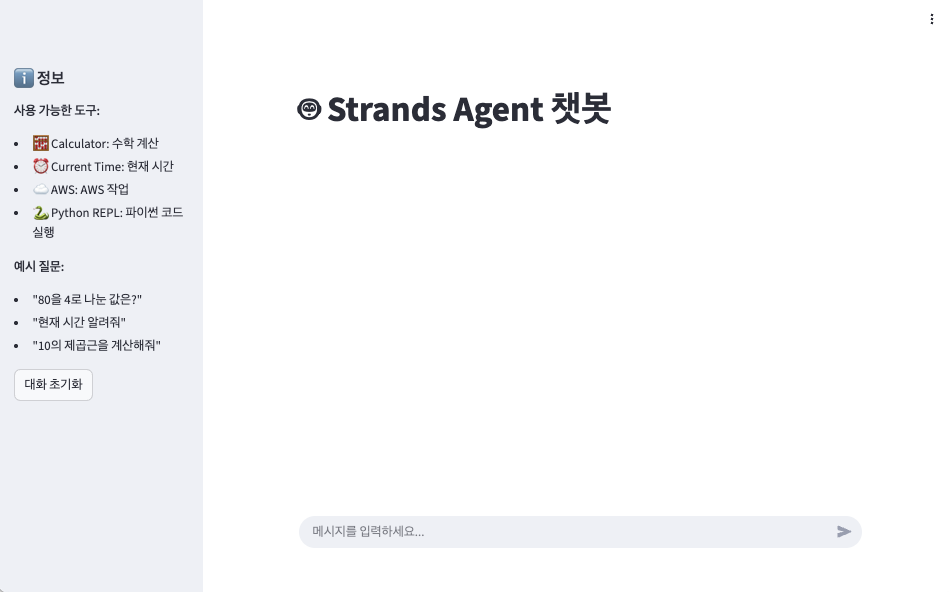
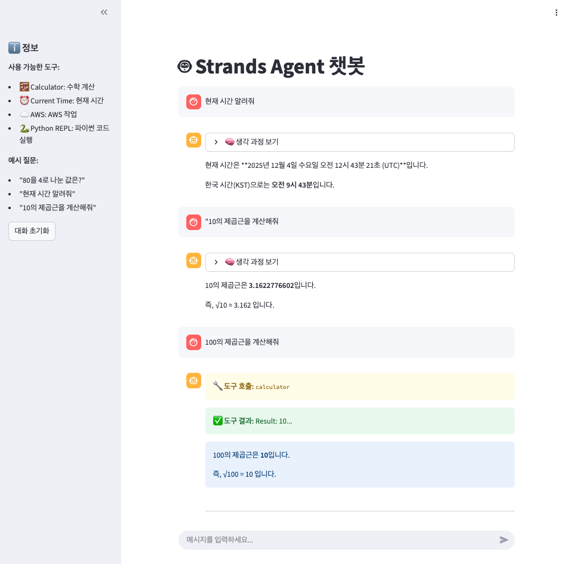

# 3. 에이전트를 실제 챗봇 애플리케이션에 적용하기

이번 실습에서는 터미널에서 실행하던 Strands 에이전트를 Streamlit 웹 애플리케이션으로 변환하는 방법을 학습합니다.

단순히 UI를 추가하는 것을 넘어, 세션 관리, 비동기 처리, 스트리밍 응답 등 실제 애플리케이션에 필요한 핵심 기능들을 구현합니다.

> [!NOTE]
> **이 챕터는 선택 실습입니다.** 챕터 1, 2, 5, 6, 7은 필수 실습이며, 나머지 챕터(3, 4, 8)는 시간 여유에 따라 선택적으로 진행하세요.



> [!NOTE]
> **사전 준비**
> - [00-setup](../00-setup/README.ko.md)에 따라 환경 구성 완료 (`streamlit`은 `00-setup/pyproject.toml`에 이미 포함되어 있습니다)
> - Amazon Bedrock 모델 액세스 활성화
> - [01-single-agent](../01-single-agent/README.ko.md) 챕터를 먼저 진행하는 것을 권장합니다. 이번 챕터는 [`../01-single-agent/completed/basic.py`](../01-single-agent/completed/basic.py)에서 만든 에이전트를 기반으로 합니다.

**학습 목표**
- Streamlit으로 챗봇 UI 구현
- 세션 상태로 대화 히스토리 관리
- 비동기 스트리밍으로 실시간 응답 표시
- 도구 호출 과정 시각화

**예상 소요 시간:** 약 10분

## 이번 챕터의 파일

| 파일 | 용도 |
|---|---|
| `labs/streamlit_app.py` | (빈 파일) 직접 작성합니다 |
| `completed/streamlit_app.py` | 정답 코드 |

이 저장소의 실습 방식은 다음과 같습니다. `labs/` 아래의 빈 파일에 직접 코드를 작성하고, `completed/`에는 정답 코드가 들어 있습니다. `03-chatbot-app/labs/streamlit_app.py`에서 작업하고, 막히는 부분이 있을 때만 `03-chatbot-app/completed/streamlit_app.py`를 참고하세요.

---

## 터미널 실행 vs 웹 애플리케이션

먼저 우리가 만든 `basic.py`와 이를 웹 애플리케이션으로 변환한 `streamlit_app.py`의 차이를 이해해봅시다.

### basic.py (터미널 실행)

```python
from strands import Agent
from strands_tools import calculator, current_time, use_aws, python_repl

agent = Agent(tools=[calculator, current_time, use_aws, python_repl])
response = agent("What is 80/4?")
print(response)
```

**특징:**
- 한 번의 질문과 답변으로 종료
- 결과가 나올 때까지 기다림 (동기 방식)
- 이전 대화를 기억하지 못함
- 결과만 터미널에 출력

### streamlit_app.py (웹 애플리케이션)

**특징:**
- 여러 번의 질문과 답변 가능
- 응답이 생성되는 과정을 실시간으로 확인 (비동기 스트리밍)
- 대화 히스토리 유지
- 도구 호출 과정을 시각적으로 표시

<details>
<summary>streamlit_app.py 코드 전체보기</summary>

```python
import streamlit as st
from strands import Agent
from strands_tools import calculator, current_time, use_aws, python_repl
import json
import asyncio

# Page configuration
st.set_page_config(
    page_title="Strands Agent Chatbot",
    page_icon="🤖",
    layout="centered"
)

# Title
st.title("🤖 Strands Agent Chatbot")

# Agent initialization (stored in session state)
if "agent" not in st.session_state:
    st.session_state.agent = Agent(tools=[calculator, current_time, use_aws, python_repl])

# Chat history initialization
if "messages" not in st.session_state:
    st.session_state.messages = []

# Display chat history
for message in st.session_state.messages:
    with st.chat_message(message["role"]):
        if message["role"] == "user":
            st.markdown(message["content"])
        else:
            # Display thinking process
            if message.get("thinking_steps"):
                with st.expander("🧠 View Thinking Process", expanded=False):
                    for step in message["thinking_steps"]:
                        st.markdown(step)
            # Display final response
            st.markdown(message["content"])

# User input
if prompt := st.chat_input("Enter your message..."):
    # Add and display user message
    st.session_state.messages.append({"role": "user", "content": prompt})
    with st.chat_message("user"):
        st.markdown(prompt)

    # Generate Assistant response
    with st.chat_message("assistant"):
        # Create main container
        main_container = st.container()

        try:
            # Define async function
            async def run_agent():
                final_response = ""
                current_text = ""
                tool_info = {}
                current_text_box = None

                # Execute Agent stream
                agent_stream = st.session_state.agent.stream_async(prompt)

                async for event in agent_stream:
                    # Text streaming
                    if "data" in event:
                        text = event["data"]
                        current_text += text

                        # Create new text box if none exists
                        if current_text_box is None:
                            with main_container:
                                current_text_box = st.empty()

                        # Display current text in text box
                        current_text_box.info(current_text)

                    # Tool call information
                    elif "current_tool_use" in event:
                        # Finish current text box if exists
                        if current_text:
                            current_text_box = None
                            current_text = ""

                        current_tool_use = event["current_tool_use"]
                        tool_name = current_tool_use.get("name", "")
                        tool_input = current_tool_use.get("input", {})
                        tool_use_id = current_tool_use.get("toolUseId", "")

                        # Store tool information
                        if tool_use_id not in tool_info:
                            tool_info[tool_use_id] = {
                                "name": tool_name,
                                "input": tool_input,
                                "result": None
                            }

                            # Display tool call in real-time
                            with main_container:
                                if tool_input:
                                    st.warning(f"🔧 **Tool Call:** `{tool_name}`\n\n**Input:**\n```json\n{json.dumps(tool_input, indent=2, ensure_ascii=False)}\n```")
                                else:
                                    st.warning(f"🔧 **Tool Call:** `{tool_name}`")

                    # Tool results
                    elif "message" in event:
                        message = event["message"]
                        if "content" in message:
                            content = message["content"]
                            if content and "toolResult" in content[0]:
                                tool_result = content[0]["toolResult"]
                                tool_use_id = tool_result["toolUseId"]
                                tool_content = tool_result["content"]
                                result_text = tool_content[0].get("text", "") if tool_content else ""

                                # Store and display tool results
                                if tool_use_id in tool_info:
                                    tool_info[tool_use_id]["result"] = result_text

                                    with main_container:
                                        st.success(f"✅ **Tool Result:** {result_text[:200]}...")

                    # Final result
                    elif "result" in event:
                        # Finish current text box if exists
                        if current_text:
                            current_text_box = None

                        final = event["result"]
                        message = final.message
                        if message:
                            content = message.get("content", [])
                            if content:
                                final_response = content[0].get("text", "")

                return final_response, tool_info

            # Execute async function
            final_response, tool_info = asyncio.run(run_agent())

            # Display final response (as plain text)
            with main_container:
                st.markdown("---")
                st.markdown(final_response)

            # Save message (including reasoning information)
            reasoning_text = ""
            if tool_info:
                reasoning_text = "### 🔧 Tools Used\n\n"
                for tool_id, info in tool_info.items():
                    reasoning_text += f"**Tool Name:** `{info['name']}`\n\n"
                    reasoning_text += f"**Input:** `{json.dumps(info['input'], ensure_ascii=False)}`\n\n"
                    if info['result']:
                        reasoning_text += f"**Result:** {info['result'][:200]}...\n\n"
                    reasoning_text += "---\n\n"

            st.session_state.messages.append({
                "role": "assistant",
                "content": final_response,
                "thinking_steps": [reasoning_text] if reasoning_text else None
            })

        except Exception as e:
            import traceback
            error_message = f"An error occurred: {str(e)}\n\n```\n{traceback.format_exc()}\n```"
            st.error(error_message)
            st.session_state.messages.append({"role": "assistant", "content": f"Error: {str(e)}"})

# Additional information in sidebar
with st.sidebar:
    st.header("ℹ️ Information")
    st.markdown("""
    **Available Tools:**
    - 🧮 Calculator: Mathematical calculations
    - ⏰ Current Time: Current time
    - ☁️ AWS: AWS operations
    - 🐍 Python REPL: Python code execution

    **Example Questions:**
    - "What is 80 divided by 4?"
    - "Tell me the current time"
    - "Calculate the square root of 10"
    """)

    if st.button("Reset Conversation"):
        st.session_state.messages = []
        st.rerun()
```

</details>

---

## 1. Streamlit 기본 설정

**1-1.** `03-chatbot-app/labs/streamlit_app.py` 파일을 엽니다.

**1-2.** 필요한 라이브러리를 import하고 페이지를 설정합니다.

```python
import streamlit as st
from strands import Agent
from strands_tools import calculator, current_time, use_aws, python_repl
import json
import asyncio

# Page configuration
st.set_page_config(
    page_title="Strands Agent Chatbot",
    page_icon="🤖",
    layout="centered"
)

# Title
st.title("🤖 Strands Agent Chatbot")
```

`st.set_page_config()`는 브라우저 탭의 제목과 아이콘, 레이아웃을 설정합니다.

---

## 2. 세션 상태 관리

웹 애플리케이션에서는 사용자가 새로운 메시지를 보낼 때마다 페이지가 다시 실행됩니다. 에이전트와 대화 히스토리를 유지하려면 세션 상태를 사용해야 합니다.

**2-1.** 에이전트를 세션 상태에 저장합니다.

```python
# Agent initialization (stored in session state)
if "agent" not in st.session_state:
    st.session_state.agent = Agent(tools=[calculator, current_time, use_aws, python_repl])
```

`st.session_state`는 페이지가 다시 실행되어도 값을 유지하는 딕셔너리입니다. 에이전트를 한 번만 생성하고 계속 재사용합니다.

**2-2.** 대화 히스토리를 초기화합니다.

```python
# Chat history initialization
if "messages" not in st.session_state:
    st.session_state.messages = []
```

대화 내용을 리스트에 저장하여 이전 대화를 화면에 표시할 수 있게 합니다.

> [!TIP]
> **세션 상태가 필요한 이유**
>
> Streamlit은 사용자가 버튼을 클릭하거나 입력할 때마다 Python 스크립트를 처음부터 끝까지 다시 실행합니다.
>
> ```python
> # 세션 상태 없이 작성하면?
> agent = Agent(tools=[...])  # 매번 새로 생성됨
> messages = []  # 매번 빈 리스트로 초기화됨
> ```
>
> 이렇게 하면:
> - 에이전트가 매번 새로 생성되어 비효율적
> - 대화 히스토리가 초기화되어 이전 대화를 볼 수 없음
>
> `st.session_state`를 사용하면 사용자의 브라우저 세션 동안 값을 유지할 수 있습니다.

---

## 3. 대화 히스토리 표시

**3-1.** 저장된 대화를 화면에 표시합니다.

```python
# Display chat history
for message in st.session_state.messages:
    with st.chat_message(message["role"]):
        if message["role"] == "user":
            st.markdown(message["content"])
        else:
            # Display thinking process
            if message.get("thinking_steps"):
                with st.expander("🧠 View Thinking Process", expanded=False):
                    for step in message["thinking_steps"]:
                        st.markdown(step)
            # Display final response
            st.markdown(message["content"])
```

`st.chat_message()`는 채팅 메시지를 말풍선 형태로 표시합니다. `role`이 "user"면 오른쪽에, "assistant"면 왼쪽에 표시됩니다.

---

## 4. 사용자 입력 받기

**4-1.** 사용자로부터 메시지를 입력받습니다.

```python
# User input
if prompt := st.chat_input("Enter your message..."):
    # Add and display user message
    st.session_state.messages.append({"role": "user", "content": prompt})
    with st.chat_message("user"):
        st.markdown(prompt)
```

`st.chat_input()`은 화면 하단에 메시지 입력창을 표시합니다. 사용자가 엔터를 누르면 `prompt` 변수에 입력 내용이 저장되고, `if` 블록이 실행됩니다.

---

## 5. 비동기 스트리밍 응답 처리

여기가 가장 핵심 부분입니다. 에이전트의 응답을 실시간으로 스트리밍하여 사용자에게 보여줍니다.

### 비동기 처리란?

일반적인 동기 방식:

```python
response = agent("질문")  # 응답이 완성될 때까지 기다림 (10초)
print(response)  # 10초 후에 한 번에 출력
```

비동기 스트리밍 방식:

```python
async for event in agent.stream_async("질문"):  # 응답이 생성되는 과정을 실시간으로 받음
    print(event)  # "안" → "녕" → "하" → "세" → "요" (실시간 출력)
```

**5-1.** Assistant 응답 영역을 생성합니다.

```python
    # Generate Assistant response
    with st.chat_message("assistant"):
        # Create main container
        main_container = st.container()
```

`st.container()`는 나중에 동적으로 내용을 추가할 수 있는 공간을 만듭니다.

**5-2.** 비동기 함수를 정의합니다.

```python
        try:
            # Define async function
            async def run_agent():
                final_response = ""
                current_text = ""
                tool_info = {}
                current_text_box = None

                # Execute Agent stream
                agent_stream = st.session_state.agent.stream_async(prompt)
```

`async def`는 비동기 함수를 정의하는 키워드입니다. `stream_async()`는 에이전트 응답을 실시간으로 받을 수 있게 해줍니다.

**5-3.** 이벤트를 처리합니다.

```python
                async for event in agent_stream:
                    # Text streaming
                    if "data" in event:
                        text = event["data"]
                        current_text += text

                        # Create new text box if none exists
                        if current_text_box is None:
                            with main_container:
                                current_text_box = st.empty()

                        # Display current text in text box
                        current_text_box.info(current_text)
```

`async for`는 비동기적으로 발생하는 이벤트를 하나씩 받아 처리합니다.

> [!NOTE]
> **스트리밍 이벤트 이해하기**
>
> `stream_async()`는 에이전트가 작업하는 과정에서 여러 종류의 이벤트를 발생시킵니다.

<details open>
<summary>이벤트 종류와 처리 방법</summary>

**1. `"data"` 이벤트 - 텍스트 스트리밍**

```python
{"data": "안녕"}
{"data": "하세요"}
```

에이전트가 생성하는 텍스트가 한 조각씩 전달됩니다. 이를 누적하여 파란색 박스에 표시합니다.

**2. `"current_tool_use"` 이벤트 - 도구 호출 시작**

```python
{
  "current_tool_use": {
    "name": "calculator",
    "input": {"expression": "80/4"},
    "toolUseId": "abc123"
  }
}
```

에이전트가 도구를 사용하기 시작하면 발생합니다. 어떤 도구를 어떤 입력으로 호출하는지 알 수 있습니다.

**3. `"message"` 이벤트 - 도구 실행 결과**

```python
{
  "message": {
    "content": [{
      "toolResult": {
        "toolUseId": "abc123",
        "content": [{"text": "20"}]
      }
    }]
  }
}
```

도구 실행이 완료되고 결과가 전달됩니다.

**4. `"result"` 이벤트 - 최종 응답**

```python
{
  "result": {
    "message": {
      "content": [{"text": "80을 4로 나눈 값은 20입니다."}]
    }
  }
}
```

에이전트의 최종 응답이 전달됩니다.

</details>

실시간 처리 흐름:

```text
사용자: "80을 4로 나눈 값은?"
    ↓
[data] "80을"          → 화면: "80을" (파란색 박스)
[data] " 4로"         → 화면: "80을 4로" (업데이트)
[current_tool_use]    → 화면: "🔧 calculator 호출" (주황색 박스)
[message]             → 화면: "✅ 결과: 20" (초록색 박스)
[data] "나눈 값은"    → 화면: "나눈 값은" (파란색 박스)
[data] " 20입니다"    → 화면: "나눈 값은 20입니다" (업데이트)
[result]              → 최종 응답 완성
```

**5-4.** 도구 호출 이벤트를 처리합니다.

```python
                    # Tool call information
                    elif "current_tool_use" in event:
                        # Finish current text box if exists
                        if current_text:
                            current_text_box = None
                            current_text = ""

                        current_tool_use = event["current_tool_use"]
                        tool_name = current_tool_use.get("name", "")
                        tool_input = current_tool_use.get("input", {})
                        tool_use_id = current_tool_use.get("toolUseId", "")

                        # Store tool information
                        if tool_use_id not in tool_info:
                            tool_info[tool_use_id] = {
                                "name": tool_name,
                                "input": tool_input,
                                "result": None
                            }

                            # Display tool call in real-time
                            with main_container:
                                if tool_input:
                                    st.warning(f"🔧 **Tool Call:** `{tool_name}`\n\n**Input:**\n```json\n{json.dumps(tool_input, indent=2, ensure_ascii=False)}\n```")
                                else:
                                    st.warning(f"🔧 **Tool Call:** `{tool_name}`")
```

도구를 호출할 때 주황색 경고 박스로 표시하여 사용자가 에이전트가 무엇을 하고 있는지 알 수 있게 합니다.

**5-5.** 도구 결과 이벤트를 처리합니다.

```python
                    # Tool results
                    elif "message" in event:
                        message = event["message"]
                        if "content" in message:
                            content = message["content"]
                            if content and "toolResult" in content[0]:
                                tool_result = content[0]["toolResult"]
                                tool_use_id = tool_result["toolUseId"]
                                tool_content = tool_result["content"]
                                result_text = tool_content[0].get("text", "") if tool_content else ""

                                # Store and display tool results
                                if tool_use_id in tool_info:
                                    tool_info[tool_use_id]["result"] = result_text

                                    with main_container:
                                        st.success(f"✅ **Tool Result:** {result_text[:200]}...")
```

도구 실행이 완료되면 초록색 성공 박스로 결과를 표시합니다.

**5-6.** 최종 결과를 처리합니다.

```python
                    # Final result
                    elif "result" in event:
                        # Finish current text box if exists
                        if current_text:
                            current_text_box = None

                        final = event["result"]
                        message = final.message
                        if message:
                            content = message.get("content", [])
                            if content:
                                final_response = content[0].get("text", "")

                return final_response, tool_info
```

최종 응답 텍스트와 도구 사용 정보를 반환합니다.

**5-7.** 비동기 함수를 실행합니다.

```python
            # Execute async function
            final_response, tool_info = asyncio.run(run_agent())
```

`asyncio.run()`은 비동기 함수를 실행하고 결과를 기다립니다. 이 함수가 완료될 때까지 모든 스트리밍 처리가 진행됩니다.

> [!NOTE]
> **asyncio.run() 이해하기**
>
> `asyncio.run()`은 비동기 함수를 동기 환경(일반 Python 코드)에서 실행할 수 있게 해주는 다리 역할을 합니다.
>
> ```python
> # 비동기 함수 정의
> async def run_agent():
>     async for event in agent.stream_async(prompt):
>         # 이벤트 처리...
>     return result
>
> # 일반 코드에서 비동기 함수 실행
> result = asyncio.run(run_agent())  # 비동기 함수가 완료될 때까지 기다림
> ```
>
> **왜 필요한가?**
> - Streamlit은 기본적으로 동기 환경에서 실행됨
> - 하지만 에이전트의 `stream_async()`는 비동기 함수
> - `asyncio.run()`이 이 둘을 연결해줌
>
> **내부 동작:**
> 1. 비동기 이벤트 루프를 생성
> 2. `run_agent()` 함수를 이벤트 루프에서 실행
> 3. 함수가 완료될 때까지 대기
> 4. 결과 반환

---

## 6. 결과 표시 및 저장

**6-1.** 최종 응답을 표시합니다.

```python
            # Display final response (as plain text)
            with main_container:
                st.markdown("---")
                st.markdown(final_response)
```

**6-2.** 도구 사용 정보를 정리합니다.

```python
            # Save message (including reasoning information)
            reasoning_text = ""
            if tool_info:
                reasoning_text = "### 🔧 Tools Used\n\n"
                for tool_id, info in tool_info.items():
                    reasoning_text += f"**Tool Name:** `{info['name']}`\n\n"
                    reasoning_text += f"**Input:** `{json.dumps(info['input'], ensure_ascii=False)}`\n\n"
                    if info['result']:
                        reasoning_text += f"**Result:** {info['result'][:200]}...\n\n"
                    reasoning_text += "---\n\n"
```

**6-3.** 대화 히스토리에 저장합니다.

```python
            st.session_state.messages.append({
                "role": "assistant",
                "content": final_response,
                "thinking_steps": [reasoning_text] if reasoning_text else None
            })
```

`thinking_steps`에 도구 사용 정보를 저장하면, 나중에 대화 히스토리를 표시할 때 "생각 과정 보기" expander에서 확인할 수 있습니다.

---

## 7. 에러 처리

**7-1.** 예외를 처리합니다.

```python
        except Exception as e:
            import traceback
            error_message = f"An error occurred: {str(e)}\n\n```\n{traceback.format_exc()}\n```"
            st.error(error_message)
            st.session_state.messages.append({"role": "assistant", "content": f"Error: {str(e)}"})
```

에러가 발생해도 애플리케이션이 죽지 않고 사용자에게 에러 메시지를 표시한 후 계속 실행됩니다.

---

## 8. 사이드바 추가

**8-1.** 사이드바에 정보와 기능을 추가합니다.

```python
# Additional information in sidebar
with st.sidebar:
    st.header("ℹ️ Information")
    st.markdown("""
    **Available Tools:**
    - 🧮 Calculator: Mathematical calculations
    - ⏰ Current Time: Current time
    - ☁️ AWS: AWS operations
    - 🐍 Python REPL: Python code execution

    **Example Questions:**
    - "What is 80 divided by 4?"
    - "Tell me the current time"
    - "Calculate the square root of 10"
    """)

    if st.button("Reset Conversation"):
        st.session_state.messages = []
        st.rerun()
```

`st.rerun()`은 페이지를 새로고침하여 변경사항을 즉시 반영합니다.

---

## 9. 실행하기

**9-1.** 저장소 루트에서 Streamlit 애플리케이션을 실행합니다.

```bash
uv run streamlit run 03-chatbot-app/labs/streamlit_app.py
```

워크샵에서도 별도 플래그 없이 위와 같은 형태를 그대로 사용합니다. 정답 코드를 실행하려면 `completed/` 경로를 지정합니다.

```bash
uv run streamlit run 03-chatbot-app/completed/streamlit_app.py
```

**9-2.** 브라우저에서 앱을 엽니다.

Streamlit이 터미널에 Local URL(기본값 `http://localhost:8501`)을 출력하며, 보통 브라우저가 자동으로 열립니다. 자동으로 열리지 않으면 출력된 URL을 브라우저 주소창에 붙여넣습니다.

AWS에서 호스팅되는 VS Code Server처럼 원격 머신에서 작업하는 경우, 8501 포트에 로컬 PC에서 바로 접근할 수 없습니다. IDE의 포트 포워딩 기능 등으로 포트를 로컬로 포워딩하거나 프록시한 뒤, 포워딩된 URL로 접속하세요.



**9-3.** 챗봇을 테스트해봅니다.

- "80을 4로 나눈 값은?" 입력
- 에이전트가 calculator 도구를 호출하는 과정 확인
- 실시간으로 응답이 생성되는 과정 확인
- "생각 과정 보기"를 클릭하여 도구 사용 정보 확인

---

<details>
<summary>이번 실습에서의 핵심 개념 다시보기</summary>

### 1. 세션 상태 (Session State)

```python
if "agent" not in st.session_state:
    st.session_state.agent = Agent(...)

if "messages" not in st.session_state:
    st.session_state.messages = []
```

페이지가 다시 실행되어도 값을 유지하는 저장소입니다.

### 2. 비동기 스트리밍 (Async Streaming)

```python
async def run_agent():
    agent_stream = agent.stream_async(prompt)
    async for event in agent_stream:
        # 이벤트 처리
    return result

result = asyncio.run(run_agent())
```

응답이 생성되는 과정을 실시간으로 받아 처리합니다.

### 3. 이벤트 처리

| 이벤트 | 내용 | 표시 방법 |
|--------|------|----------|
| `"data"` | 텍스트 스트리밍 | 파란색 info 박스 |
| `"current_tool_use"` | 도구 호출 시작 | 주황색 warning 박스 |
| `"message"` | 도구 실행 결과 | 초록색 success 박스 |
| `"result"` | 최종 응답 | 일반 마크다운 |

### 4. 동기 vs 비동기 비교

**동기 방식 (basic.py):**

```python
response = agent("질문")  # 완료될 때까지 대기 (10초)
print(response)  # 10초 후 출력
```

**비동기 스트리밍 (streamlit_app.py):**

```python
async for event in agent.stream_async("질문"):
    print(event)  # 실시간으로 조금씩 출력
```

**차이점:**
- 동기: 결과를 한 번에 받음, 기다리는 동안 아무것도 할 수 없음
- 비동기: 결과를 조금씩 받음, 받는 즉시 화면에 표시 가능

</details>

<details open>
<summary>전체 실행 흐름 단계별로 보기</summary>

**초기화 단계:**

```text
앱 시작
  ↓
페이지 설정
  ↓
Agent 초기화 (세션 확인)
  ↓
메시지 히스토리 초기화 (세션 확인)
  ↓
이전 대화 표시
```

**사용자 입력 처리:**

```text
사용자가 "80을 4로 나눈 값은?" 입력
  ↓
메시지를 히스토리에 추가
  ↓
화면에 사용자 메시지 표시
```

**비동기 스트리밍 실행:**

```text
run_agent() 비동기 함수 시작
  ↓
stream_async() 호출
  ↓
이벤트 루프 시작
  │
  ├─ [data] "80을" → 화면에 표시
  ├─ [data] " 4로 나눈 값은" → 화면 업데이트
  ├─ [current_tool_use] calculator → "🔧 도구 호출" 표시
  ├─ [message] 결과: 20 → "✅ 도구 결과" 표시
  ├─ [data] " 20입니다" → 화면 업데이트
  └─ [result] 최종 응답 → 함수 종료
  ↓
final_response, tool_info 반환
```

**결과 표시 및 저장:**

```text
최종 응답 화면에 표시
  ↓
도구 사용 정보 정리
  ↓
히스토리에 저장
  ↓
페이지 리렌더링
```

</details>

---

## 트러블슈팅

**8501 포트가 이미 사용 중입니다**

다른 프로세스(대부분 앞서 실행한 이 앱)가 포트를 계속 점유하고 있으면 Streamlit이 바인딩에 실패합니다. 기존 프로세스를 종료하거나, Streamlit의 `--server.port` 옵션으로 다른 포트에서 실행합니다.

```bash
uv run streamlit run 03-chatbot-app/labs/streamlit_app.py --server.port 8502
```

포트를 점유한 프로세스를 확인하려면 다음 명령을 사용합니다.

```bash
lsof -i :8501
```

**메시지를 보낼 때마다 스크립트 전체가 다시 실행되는 것처럼 보입니다**

버그가 아니라 Streamlit의 실행 모델입니다. 메시지를 보내거나 버튼을 클릭하는 등 위젯과 상호작용할 때마다 Streamlit은 스크립트를 첫 줄부터 끝까지 다시 실행합니다. 일반 지역 변수는 매 재실행마다 처음부터 다시 생성됩니다.

그래서 에이전트와 대화 히스토리를 반드시 `st.session_state`에 두어야 합니다.

```python
if "agent" not in st.session_state:
    st.session_state.agent = Agent(tools=[...])

if "messages" not in st.session_state:
    st.session_state.messages = []
```

`if ... not in st.session_state` 가드 덕분에 값이 첫 실행에서 한 번만 생성되고 이후 재실행에서는 재사용됩니다. 대신 모듈 최상단에 `messages = []`라고 작성하면 메시지를 보낼 때마다 히스토리가 지워져 마지막 대화만 보입니다.

**스트리밍이 되지 않거나 응답이 한 번에 나옵니다**

`agent(prompt)`를 호출하고 있지 않은지, `async for ... in agent.stream_async(prompt)`로 순회하고 있는지 확인하세요. 텍스트가 점진적으로 나타나게 하는 `data` 이벤트는 `stream_async()`에서만 발생합니다.

**응답은 나오는데 도구 호출 박스가 표시되지 않습니다**

도구를 사용할지 여부는 에이전트가 스스로 판단합니다. "10의 제곱근을 계산해줘" 또는 "현재 시간 알려줘"처럼 도구가 필요한 질문을 해보세요.

## 앱 종료하기

이번 챕터는 대화 중 발생하는 Bedrock 모델 호출 비용 외에 지속적으로 과금되는 AWS 리소스를 만들지 않습니다. 종료하려면 Streamlit이 실행 중인 터미널에서 `Ctrl+C`를 누릅니다.

---
Prev: [멀티 에이전트](../02-multi-agents/README.ko.md) | Next: [에이전트 가시성](../04-observability/README.ko.md)
