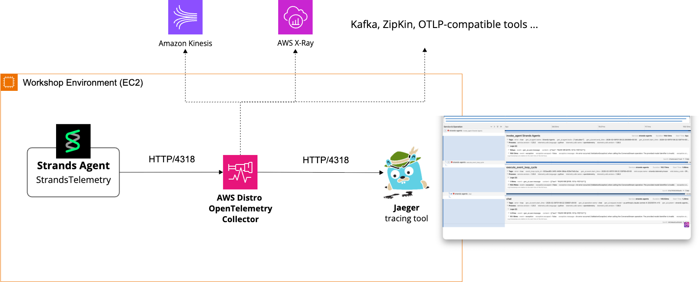
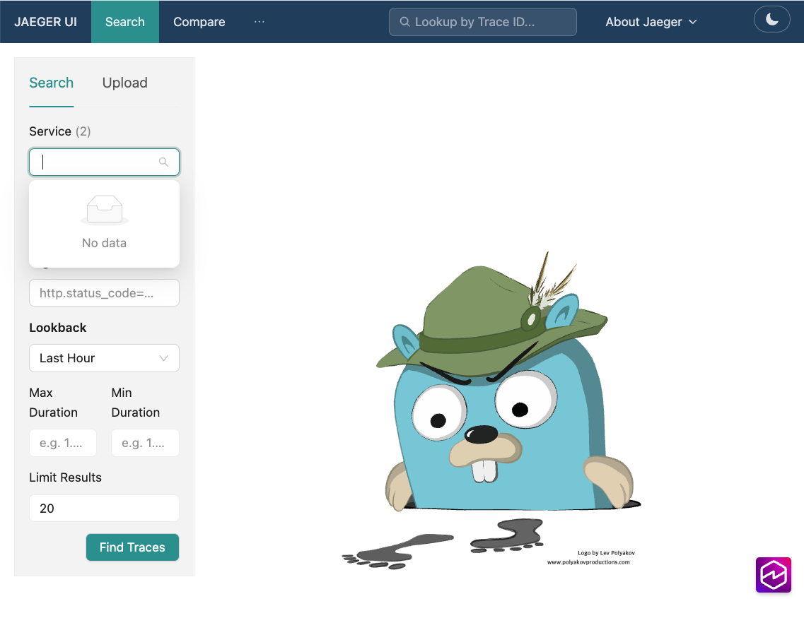
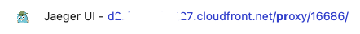
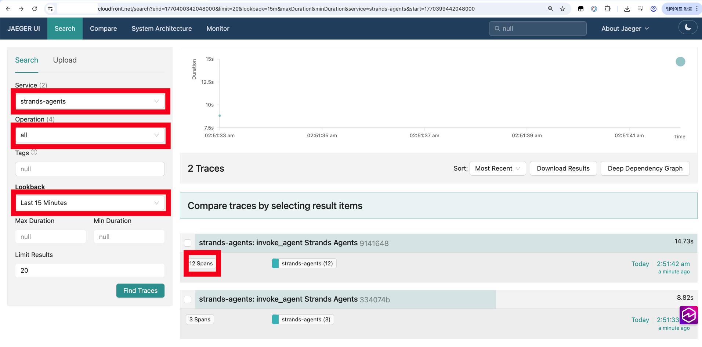
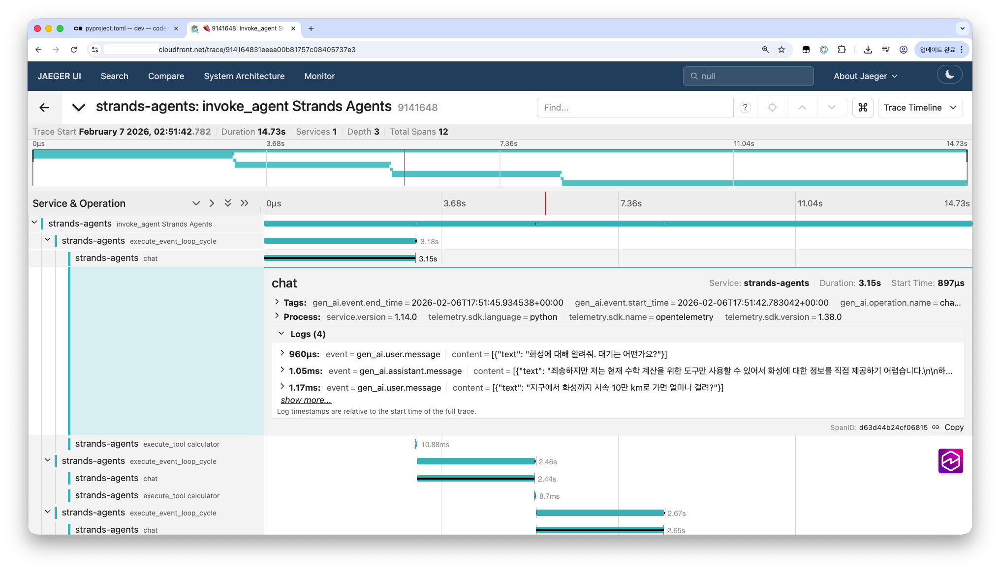

# 4. 에이전트 가시성 (Strands Observability)

이번 챕터에서는 Strands SDK가 제공하는 에이전트 가시성(Observability) 기능을 학습합니다. 에이전트의 동작을 모니터링하고 디버깅하는 데 필수적인 **Metrics**, **Logs**, **Traces**를 다룹니다.

> [!NOTE]
> **선택 실습 (Optional)**
> 이 챕터는 **선택 실습**입니다. 시간이 충분한 경우 진행하세요. 핵심 워크샵 흐름에는 영향을 주지 않으며, 건너뛰고 다음 챕터로 이동해도 됩니다.

> [!TIP]
> **AgentCore Runtime을 사용하고 있다면**
> 이 챕터에서는 Strands SDK가 제공하는 Observability 기능을 직접 구성하는 방법을 다룹니다. Strands 에이전트를 직접 운영하는 환경이라면 이 방식이 적합합니다. 한편, **Amazon Bedrock AgentCore Runtime** 위에서 에이전트를 실행하는 경우라면 [07-agentcore-observability](../07-agentcore-observability/README.ko.md)에서 별도 파이프라인 구성 없이 메트릭, 로그, 트레이스를 통합적으로 수집하는 방법을 확인해보세요.

> [!NOTE]
> **사전 준비 사항**
> - [00-setup](../00-setup/README.ko.md)에 따라 실습 환경을 구성합니다. 트레이스 전송에 필요한 `strands-agents[otel]` 추가 의존성은 `00-setup/pyproject.toml`에 이미 포함되어 있습니다.
> - Amazon Bedrock 모델 액세스: `us.amazon.nova-pro-v1:0` (Metrics 실습), `us.anthropic.claude-sonnet-4-20250514-v1:0` (Traces 실습)
> - **로컬에서 실행 중인 Docker**. OTLP 구간(Traces 실습 2, 실습 3)에만 필요합니다. 워크샵에서 사용하는 AWS 호스팅 VS Code Server에는 Docker가 미리 설치되어 실행 중입니다. 개인 노트북에서 진행하는 경우 Docker Desktop을 먼저 설치해야 할 수 있습니다. Metrics, Logs, 콘솔 익스포터를 사용하는 Traces 실습 1은 Docker가 필요하지 않습니다.

**학습 내용**
- `EventLoopMetrics` 데이터 구조와 에이전트 메트릭(토큰, 사이클, 도구별 통계) 확인 방법
- `strands` 로거 계층과 모듈별 로그 레벨 설정 방법
- OpenTelemetry 계측을 적용하고 콘솔로 스팬을 출력하는 방법
- Docker로 ADOT Collector와 Jaeger를 실행하고 Jaeger UI에서 트레이스를 확인하는 방법

**예상 소요 시간:** 약 30분

## 이 챕터의 파일

이 저장소의 실습 방식은 다음과 같습니다. `labs/`의 빈 파일에 직접 코드를 작성하고, `completed/`에 있는 정답 코드와 비교합니다.

| 파일 | 용도 |
|---|---|
| `labs/metrics_basic.py` | (빈 파일) Metrics 실습에서 직접 작성 |
| `labs/logs_basic.py` | (빈 파일) Logs 실습에서 직접 작성 |
| `labs/traces_console.py` | (빈 파일) Traces 실습 1에서 직접 작성 |
| `labs/traces_otlp.py` | (빈 파일) Traces 실습 3에서 직접 작성 |
| `completed/metrics_basic.py` | 정답 코드 |
| `completed/logs_basic.py` | 정답 코드 |
| `completed/traces_console.py` | 정답 코드 |
| `completed/traces_otlp.py` | 정답 코드 |
| `docker/enable-otlp.sh` | Jaeger와 ADOT Collector 컨테이너를 시작 |
| `docker/disable-otlp.sh` | 위 컨테이너와 Docker 네트워크를 중지하고 삭제 |
| `docker/otel-config.yaml` | ADOT Collector 설정 파일. 컬렉터 컨테이너에 마운트됩니다 |

아래 모든 명령어는 저장소 루트에서 `00-setup`의 uv 환경을 사용할 수 있는 상태를 가정합니다.

---

## 왜 에이전트 가시성이 필요한가?

우리가 개발한 AI 에이전트가 실제로 기대에 맞게 동작하고 있을까요? 에이전트가 의존하는 언어 모델 출력은 비결정적(non-deterministic)이며, 연결된 수많은 도구가 주는 결과를 항상 신뢰할 수는 없습니다. 따라서 에이전트 동작을 이해하고 문제를 진단하기 위해서는 체계적인 가시성 확보가 권장됩니다.

### 가시성이 해결하는 문제들

- 토큰 비용이 예상보다 높음: **Metrics**로 토큰 사용량 모니터링
- 특정 도구가 자주 실패함: **Metrics**로 도구별 성공/실패율 확인
- 응답 시간이 느림: **Metrics**로 지연 시간 분석
- 에이전트 내부 동작 이력이 필요: **Logs** 나 **Traces**로 상세한 실행 과정 확인

### 텔레메트리 3요소

Strands SDK는 에이전트 가시성을 쉽게 향상할 수 있도록 3가지 텔레메트리 요소를 제공하고 있습니다.

**1. Metrics (메트릭)** 는 **정량적 측정값**으로, 에이전트 성능과 리소스 사용량 수치를 알 수 있습니다. 에이전트 수명주기 전반, 에이전트 호출 또는 이벤트 사이클 단위 메트릭을 제공합니다.

- 이벤트 루프 사이클 수 및 사이클별 소요 시간
- 입/출력 토큰 및 캐시 토큰 사용량
- 응답 지연 시간
- 도구별 호출수, 성공/실패 횟수, 총 실행 시간

**2. Logs (로그)** 는 **텍스트 기반 기록**으로, 상세한 에이전트 내부 동작을 묘사합니다.

- 도구 등록 및 검증 과정
- 모델 호출 및 응답
- 에러 발생 시 상세 정보
- 디버깅을 위한 상세 실행 흐름

**3. Traces (트레이스)** 는 **분산 추적**으로, 요청이 실행되는 전체 경로를 계층적으로 시각화합니다.

- 에이전트 호출부터 응답까지 전체 흐름
- 각 사이클의 추론 과정
- 모델 호출과 도구 실행의 타이밍
- 부모-자식 관계로 연결된 스팬(Span) 구조

**참고 자료**

- [Strands Agents - Observability](https://strandsagents.com/latest/user-guide/observability-evaluation/observability/)
- [OpenTelemetry Documentation](https://opentelemetry.io/docs/)

---

## Metrics

이번 실습에서는 Strands SDK가 제공하는 **이벤트 루프 메트릭**의 데이터 구조를 이해하고, 에이전트 메트릭을 확인하는 방법을 학습합니다.

**모범 사례**

1. **토큰 사용량 모니터링**: 비용 최적화와 한도 관리를 위해 토큰 소비를 추적합니다.
2. **도구 성능 분석**: 높은 에러율이나 긴 실행 시간을 가진 도구를 식별합니다.
3. **사이클 효율성 추적**: 많은 사이클이 필요한 에이전트는 프롬프트 개선이 필요할 수 있습니다.
4. **지연 시간 벤치마크**: 지연 시간 메트릭을 사용하여 성능 기준선을 설정합니다.

### 이벤트 루프 메트릭

이벤트 루프 메트릭이란, 에이전트 루프(Agent Loop) 실행에 따른 모든 성능 데이터를 집계한 것입니다. **에이전트 호출 결과**에는 에이전트의 자연어 응답 뿐만이 아니라 **메트릭이 함께 담겨** 있습니다.

> [!NOTE]
> **Developer Tips**
>
> 에이전트 호출 결과는 `AgentResult` 클래스로 표현됩니다. 여기에 `EventLoopMetrics` 의 인스턴스인 `metrics` 멤버를 찾을 수 있습니다.

```python
agent = Agent(tools=[calculator])
result = agent("125 * 37은 얼마야?")

print(result.metrics) # 메트릭 접근
```

**수행 결과**

```
EventLoopMetrics(
    cycle_count=2,
    cycle_durations=[1.0775706768035889],
    tool_metrics={
        'calculator': ToolMetrics(
            tool={
                'toolUseId': 'tooluse_uJvpOKTaJX7azOVIx8w3wk',
                'name': 'calculator',
                'input': {'expression': '125 * 37'}
            },
            call_count=1,
            success_count=1,
            error_count=0,
            total_time=0.007710933685302734
        )
    },
    traces=[
        <strands.telemetry.metrics.Trace object>,
        <strands.telemetry.metrics.Trace object>
    ],
    accumulated_usage={
        'inputTokens': 3109,
        'outputTokens': 73,
        'totalTokens': 3182
    },
    accumulated_metrics={
        'latencyMs': 2018
    }
)
```

자세한 내용은 [Python SDK](https://github.com/strands-agents/sdk-python/blob/main/src/strands/telemetry/metrics.py)를 참고합니다.

### 실습: 메트릭 수집하기

**1.** `04-observability/labs/metrics_basic.py` 빈 파일을 엽니다.

**2.** 필요한 라이브러리를 import 합니다.

```python
from strands import Agent
from strands_tools import calculator, current_time
from strands.models import BedrockModel
```

**3.** 모델과 에이전트를 생성하고 질문을 실행합니다.

```python
model = BedrockModel(model_id="us.amazon.nova-pro-v1:0")
agent = Agent(model=model, tools=[calculator, current_time])
result = agent([
    {
        "role": "user",
        "content": [
            {"text": "125 * 37은 얼마야? 그리고 지금 몇 시야?"},
            {"cachePoint": {"type": "default"}}
        ]
    }
])
```

> [!NOTE]
> **에이전트 호출 방식**
> Strands 에이전트는 다양한 입력 형식을 지원합니다.
> - 문자열: `agent("hello!")`
> - ContentBlock 리스트: `agent([{"text": "hello"}, {"image": {...}}])`
> - Message 리스트: `agent([{"role": "user", "content": [{"text": "hello"}]}])`
> - 입력 없음: `agent()`, 기존 대화 히스토리 사용
>
> 이 실습에서는 Amazon Nova 모델의 [Prompt Caching](https://docs.aws.amazon.com/bedrock/latest/userguide/prompt-caching.html) 동작을 일으키기 위해 Message 리스트 형식과 `cachePoint`를 사용합니다.

**4.** 기본 메트릭을 표시합니다.

```python
metrics = result.metrics

print("=== 기본 메트릭 ===")
print(f"사이클 수: {metrics.cycle_count}")
print(f"사이클별 소요시간: {metrics.cycle_durations}")
print(f"총 소요시간: {sum(metrics.cycle_durations):.2f}초")
```

**5.** 토큰 사용량을 표시합니다.

```python
print("\n=== 토큰 사용량 ===")
usage = metrics.accumulated_usage
print(f"입력 토큰: {usage.get('inputTokens', 0)}")
print(f"출력 토큰: {usage.get('outputTokens', 0)}")
print(f"총 토큰: {usage.get('totalTokens', 0)}")

# 캐시 메트릭
if 'cacheReadInputTokens' in usage:
    print(f"캐시 읽기 토큰: {usage['cacheReadInputTokens']}")
if 'cacheWriteInputTokens' in usage:
    print(f"캐시 쓰기 토큰: {usage['cacheWriteInputTokens']}")
```

**6.** 도구 메트릭을 출력합니다.

```python
print("\n=== 도구 메트릭 ===")
for tool_name, tool_metric in metrics.tool_metrics.items():
    print(f"\n도구: {tool_name}")
    print(f"  호출 횟수: {tool_metric.call_count}")
    print(f"  성공 횟수: {tool_metric.success_count}")
    print(f"  실패 횟수: {tool_metric.error_count}")
    print(f"  총 실행시간: {tool_metric.total_time:.3f}초")
    if tool_metric.call_count > 0:
        print(f"  평균 실행시간: {tool_metric.total_time / tool_metric.call_count:.3f}초")
```

**7.** 코드를 실행합니다.

```bash
uv run python 04-observability/labs/metrics_basic.py
```

> [!WARNING]
> **랩 코드를 여러 번 실행하세요.**
> - **첫 번째 실행**: `cacheWriteInputTokens`에 값이 표시됩니다 (캐시 저장)
> - **두 번째 이후 실행**: `cacheReadInputTokens`에 값이 표시됩니다 (캐시 히트)
>
> 캐시 히트 시 입력 토큰 비용이 90% 절감됩니다. 시스템 프롬프트와 도구 정의가 캐시되어 반복 호출 시 비용이 크게 줄어듭니다.

**8.** 실행 결과입니다.

```
Tool #1: calculator

Tool #2: current_time
125 * 37은 4625입니다. 그리고 현재 시간은 2026년 2월 6일 15:28:18 UTC입니다.
=== 기본 메트릭 ===
사이클 수: 2
사이클별 소요시간: [1.0885756015777588]
총 소요시간: 1.09

=== 토큰 사용량 ===
입력 토큰: 265
출력 토큰: 238
총 토큰: 4891
캐시 읽기 토큰: 4388 #2회 수행시
캐시 쓰기 토큰: 2109 #1회 수행시

=== 도구 메트릭 ===

도구: calculator
  호출 횟수: 1
  성공 횟수: 1
  실패 횟수: 0
  총 실행시간: 0.006초
  평균 실행시간: 0.006초

도구: current_time
  호출 횟수: 1
  성공 횟수: 1
  실패 횟수: 0
  총 실행시간: 0.006초
  평균 실행시간: 0.006초
```

### get_summary() 활용

`EventLoopMetrics`는 모든 메트릭을 구조화된 딕셔너리로 반환하는 편리한 `get_summary()` 메서드를 제공합니다. 아래 코드를 파일 끝에 추가하고 다시 실행해보세요.

```python
# 전체 메트릭 요약 가져오기
summary = result.metrics.get_summary()

print("\n=== 메트릭 요약 ===")
print(f"총 사이클: {summary['total_cycles']}")
print(f"총 소요시간: {summary['total_duration']:.2f}초")
print(f"평균 사이클 시간: {summary['average_cycle_time']:.2f}초")
print(f"누적 사용량: {summary['accumulated_usage']}")
print(f"누적 메트릭: {summary['accumulated_metrics']}")
```

<details>
<summary>Appendix: EventLoopMetrics 구조</summary>

`EventLoopMetrics`는 계층적 구조를 가집니다. 다음 테이블은 레벨별로 모든 속성을 보여줍니다.

| 계층 | 클래스 | 속성명 | 타입 | 설명 |
|------|--------|--------|------|------|
| **1. 최상위** | `EventLoopMetrics` | `cycle_count` | `int` | 실행된 이벤트 루프 사이클 수 |
| | | `cycle_durations` | `list[float]` | 각 사이클의 소요 시간 (초) |
| | | `tool_metrics` | `dict[str, ToolMetrics]` | 도구별 메트릭 (도구명 기준) |
| | | `traces` | `list[Trace]` | 실행 추적 목록 |
| | | `accumulated_usage` | `Usage` | 전체 누적 토큰 사용량 |
| | | `accumulated_metrics` | `Metrics` | 전체 누적 성능 메트릭 |
| | | `agent_invocations` | `list[AgentInvocation]` | 에이전트 호출 목록 |
| **2. 에이전트 호출** | `AgentInvocation` | `cycles` | `list[EventLoopCycleMetric]` | 해당 호출의 사이클 목록 |
| | | `usage` | `Usage` | 해당 호출의 누적 토큰 사용량 |
| **3. 사이클** | `EventLoopCycleMetric` | `event_loop_cycle_id` | `str` | 사이클 고유 ID |
| | | `usage` | `Usage` | 해당 사이클의 토큰 사용량 |
| **4. 도구 메트릭** | `ToolMetrics` | `tool` | `ToolUse` | 추적 대상 도구 정보 |
| | | `call_count` | `int` | 도구 호출 횟수 |
| | | `success_count` | `int` | 성공한 호출 수 |
| | | `error_count` | `int` | 실패한 호출 수 |
| | | `total_time` | `float` | 총 실행 시간 (초) |
| **5. 추적** | `Trace` | `id` | `str` | 추적 고유 ID (UUID) |
| | | `name` | `str` | 작업명 (사람이 읽기 쉬운) |
| | | `raw_name` | `str \| None` | 시스템 레벨 이름 |
| | | `parent_id` | `str \| None` | 부모 추적 ID |
| | | `start_time` | `float` | 시작 타임스탬프 |
| | | `end_time` | `float \| None` | 종료 타임스탬프 |
| | | `children` | `list[Trace]` | 자식 추적 목록 |
| | | `metadata` | `dict[str, Any]` | 추가 컨텍스트 정보 |
| | | `message` | `Message \| None` | 연관 메시지 |

**Usage 타입**

| 속성 | 설명 |
|------|------|
| `inputTokens` | 입력 토큰 수 |
| `outputTokens` | 출력 토큰 수 |
| `totalTokens` | 총 토큰 수 |
| `cacheReadInputTokens` | 캐시 읽기 입력 토큰 (선택) |
| `cacheWriteInputTokens` | 캐시 쓰기 입력 토큰 (선택) |

**Metrics 타입**

| 속성 | 설명 |
|------|------|
| `latencyMs` | 지연 시간 (밀리초) |
| `timeToFirstByteMs` | 첫 바이트까지 시간 (선택) |

**토큰 사용량 집계 계층**

토큰 사용량은 세 가지 레벨에서 추적할 수 있습니다.

```
전체 누적 (accumulated_usage)
    └── 에이전트 호출별 (agent_invocations[].usage)
            └── 사이클별 (agent_invocations[].cycles[].usage)
```

이 구조를 통해 전체 합계부터 개별 사이클까지 토큰 소비를 분석할 수 있습니다.

</details>

---

## Logs

이번 실습에서는 Strands SDK의 로깅 설정 방법을 학습합니다.

Strands SDK는 Python 표준 `logging` 모듈을 사용합니다. 각 모듈은 `strands` 루트 로거의 자식으로 구성되어 있어, 전체 또는 특정 모듈의 로그 레벨을 개별적으로 조정할 수 있습니다.

```
strands                              # 루트 로거 - 전체 SDK 로깅 제어
├── strands.agent                    # 에이전트 생성 및 실행
├── strands.models                   # 모델 상호작용
│   └── strands.models.bedrock       # Bedrock 모델 호출
├── strands.tools                    # 도구 관련
│   └── strands.tools.registry       # 도구 등록 및 검증
└── strands.event_loop               # 이벤트 루프
    └── strands.event_loop.event_loop
```

### 실습: 로깅 설정하기

**1.** `04-observability/labs/logs_basic.py` 파일에 다음 코드를 작성합니다.

```python
import logging
from strands import Agent
from strands_tools import calculator

# 1. 루트 로거 설정 - 전체 SDK 로그 활성화
logging.getLogger("strands").setLevel(logging.DEBUG)

# 2. 특정 모듈만 로그 레벨 조정 (선택적)
# logging.getLogger("strands.tools.registry").setLevel(logging.WARNING)  # 도구 등록 로그 숨기기
# logging.getLogger("strands.models").setLevel(logging.INFO)             # 모델 로그만 INFO 이상

# 3. 로그 출력 포맷 설정
logging.basicConfig(
    format="%(levelname)s | %(name)s | %(message)s",
    handlers=[logging.StreamHandler()]
)

# 에이전트 실행
agent = Agent(tools=[calculator])
result = agent("125 * 37은 얼마야?")
```

**2.** 코드를 실행합니다.

```bash
uv run python 04-observability/labs/logs_basic.py
```

다음과 같이 도구 등록, 모델 호출, 이벤트 루프 처리 과정의 상세 로그를 확인할 수 있습니다:

```
# Bedrock 모델 초기화
DEBUG | strands.models.bedrock | config=<{'model_id': '...'}> | initializing
DEBUG | strands.models.bedrock | region=<ap-northeast-2> | bedrock client created

# 도구 등록 과정
DEBUG | strands.tools.loader | tool_name=<calculator>, module=<calculator> | loading tools from module
DEBUG | strands.tools.registry | tool_name=<calculator>, tool_type=<function>, is_dynamic=<False> | registering tool
DEBUG | strands.tools.registry | tool_count=<1> | tools configured

# 모델 호출 및 응답
DEBUG | strands.event_loop.streaming | model=<...> | streaming messages
DEBUG | strands.models.bedrock | invoking model
DEBUG | strands.models.bedrock | got response from model

# 도구 실행
DEBUG | strands.tools.executors._executor | tool_use=<{'name': 'calculator', 'input': {'expression': '125 * 37'}}> | streaming
```

주석 처리된 라인을 활성화하여 특정 모듈의 로그 레벨을 조정해보세요.

---

## Traces

이번 실습에서는 Strands SDK의 OpenTelemetry 통합을 활용하여 에이전트 실행을 추적하는 방법을 학습합니다.

**모범 사례**

1. **적절한 상세 수준**: 충분한 정보를 캡처하되 과도한 데이터는 피함
2. **비즈니스 컨텍스트 추가**: 고객 ID나 트랜잭션 값 같은 비즈니스 관련 속성 포함
3. **샘플링 구현**: 대용량 애플리케이션에서는 샘플링으로 데이터 볼륨 감소
4. **민감 데이터 보호**: 트레이스에 PII나 민감 정보 캡처 방지
5. **로그 및 메트릭과 연관**: 트레이스 ID를 사용하여 해당 로그와 연결

### OTLP (OpenTelemetry Protocol)

OTLP는 OpenTelemetry에서 정의한 텔레메트리 데이터(트레이스, 메트릭, 로그) 전송을 위한 표준 프로토콜입니다. gRPC와 HTTP 두 가지 전송 방식을 지원하며, 본 실습에서는 **HTTP/4318 포트**를 사용합니다.

#### 트레이스 전송 흐름



트레이스 데이터는 세 가지 구성 요소를 거쳐 수집되고 시각화됩니다. 먼저 **Strands Agent**가 에이전트 실행 과정에서 트레이스 데이터를 생성합니다. 생성된 트레이스는 OTLP 호환 도구로 전송할 수 있는데, 오늘은 **ADOT Collector**를 사용합니다.

ADOT Collector는 HTTP 4318 포트에서 OTLP 프로토콜로 데이터를 수신하고 이를 백엔드 시스템으로 전달하는 중간 수집기 역할을 합니다. 최종적으로 **Jaeger**가 트레이스를 저장하고, 16686 포트의 웹 UI를 통해 시각화된 트레이스 정보를 제공합니다.

| 구성 요소 | 역할 | 엔드포인트 |
|----------|------|-----------|
| **Strands Agent** | 트레이스 데이터 생성 | - |
| **ADOT Collector** | 트레이스 수집 및 전달 | `localhost:4318` |
| **Jaeger** | 트레이스 저장 및 시각화 | UI: `localhost:16686` |

> [!NOTE]
> **참고**
> [ADOT(AWS Distro for OpenTelemetry)](https://aws-otel.github.io/docs/getting-started/collector)는 AWS에서 관리하는 OpenTelemetry 배포판으로, AWS 서비스와의 통합이 용이합니다. Strands SDK 는 Jaeger로 직접 트레이스 데이터를 전송할 수 있지만, ADOT를 두면 프로덕션 환경에서 AWS X-Ray나 CloudWatch 처럼 여러 백엔드와 쉽게 통합할 수 있습니다.

#### 트레이스 구조

트레이싱은 에이전트 실행 경로 전체를 계층적으로 시각화합니다. Strands SDK가 OpenTelemetry 표준을 사용하여 계측하는 정보의 특징입니다.

- **에이전트 수명주기**: 초기 프롬프트부터 최종 응답까지
- **개별 LLM 호출**: 프롬프트, 완료, 토큰 사용량
- **도구 실행**: 호출된 도구, 파라미터, 결과
- **성능 측정**: 병목 현상 및 최적화 기회 식별

Strands 로 계측한 트레이스 구조를 나타내면 다음과 같습니다.

```
┌─────────────────────────────────────────────────────────────────────┐
│ Strands Agent                                                        │
│ - gen_ai.system: strands-agents                                      │
│ - gen_ai.agent.name: <agent name>                                    │
│ - gen_ai.user.message: <user query>                                  │
│ - gen_ai.choice: <agent response>                                    │
│ - gen_ai.usage.total_tokens: <number>                                │
│                                                                      │
│  ┌────────────────────────────────────────────────────────────────┐  │
│  │ Cycle <cycle-id>                                               │  │
│  │ - event_loop.cycle_id: <cycle identifier>                      │  │
│  │                                                                │  │
│  │  ┌──────────────────────────────────────────────────────────┐  │  │
│  │  │ Chat                                                     │  │  │
│  │  │ - gen_ai.request.model: <model identifier>               │  │  │
│  │  │ - gen_ai.usage.input_tokens: <number>                    │  │  │
│  │  │ - gen_ai.usage.output_tokens: <number>                   │  │  │
│  │  └──────────────────────────────────────────────────────────┘  │  │
│  │                                                                │  │
│  │  ┌──────────────────────────────────────────────────────────┐  │  │
│  │  │ Execute Tool: <tool name>                                │  │  │
│  │  │ - gen_ai.tool.name: <tool name>                          │  │  │
│  │  │ - gen_ai.tool.call.id: <tool use identifier>             │  │  │
│  │  │ - tool.status: <execution status>                        │  │  │
│  │  └──────────────────────────────────────────────────────────┘  │  │
│  └────────────────────────────────────────────────────────────────┘  │
└─────────────────────────────────────────────────────────────────────┘
```

- **Agent Span**: 전체 에이전트 호출을 나타내는 최상위 스팬
- **Cycle Spans**: 각 이벤트 루프 사이클의 자식 스팬
- **Model Invoke Spans**: 모델 호출 스팬
- **Tool Spans**: 도구 실행 스팬

### Python 패키지 설치

Strands SDK 가 지원하는 OTEL 내보내기를 활성하려면 `otel` 추가 의존성과 함께 Strands Agents를 설치합니다. [00-setup](../00-setup/README.ko.md)의 환경에는 `strands-agents[otel]`이 이미 포함되어 있으므로, 해당 챕터를 진행했다면 이 단계는 건너뛸 수 있습니다.

```bash
pip install 'strands-agents[otel]'
```

또는 `uv`를 사용하는 경우

```bash
uv add 'strands-agents[otel]'
```

### 실습 1: 콘솔 트레이싱

**1.** `04-observability/labs/traces_console.py` 빈 파일을 엽니다.

**2.** 필요한 라이브러리를 import 합니다.

```python
from strands import Agent
from strands.telemetry import StrandsTelemetry
from strands_tools import calculator
```

**3.** 콘솔 내보내기로 텔레메트리를 설정합니다.

```python
# StrandsTelemetry 인스턴스 생성
strands_telemetry = StrandsTelemetry()

# 콘솔에 트레이스 출력
strands_telemetry.setup_console_exporter()
```

**4.** 에이전트를 생성하고 실행합니다.

```python
agent = Agent(
    model="us.anthropic.claude-sonnet-4-20250514-v1:0",
    system_prompt="당신은 도움이 되는 AI 어시스턴트입니다.",
    tools=[calculator]
)

response = agent("125 * 37은 얼마야?")
print(response)
```

**5.** 코드를 실행합니다.

```bash
uv run python 04-observability/labs/traces_console.py
```

콘솔에 스팬 정보가 출력되는 것을 확인할 수 있습니다. 이 실습은 Docker나 컬렉터 없이 진행할 수 있습니다.

### 실습 2: OTLP 트레이싱 환경 구성

이번에는 OpenTelemetry 프로토콜로 에이전트 호출 트레이스를 전송하고 시각화합니다. 해당 파이프라인을 구성하기 위해, ADOT 와 Jaeger 를 **도커 컨테이너**로 실행시켜 사용할 예정입니다.

- ADOT 컨테이너는 Strands 응용이 전송한 OTLP 트레이스를 수신하고 뒷단의 Jaeger 로 팬아웃(fan-out) 합니다.
- Jaeger 컨테이너는 OTLP 트레이스를 수신하여 UI로 시각화합니다.

> [!WARNING]
> **여기서부터는 Docker가 필요합니다.** 워크샵에서 사용하는 AWS 호스팅 VS Code Server에는 Docker가 미리 설치되어 실행 중입니다. 개인 노트북에서 진행하는 경우 Docker Desktop(또는 동등한 런타임)을 먼저 설치하고 실행해야 합니다. `docker ps` 명령으로 확인할 수 있습니다. Docker를 사용할 수 없다면 실습 1까지만 진행하거나, 로컬 컬렉터가 필요 없는 [07-agentcore-observability](../07-agentcore-observability/README.ko.md)의 관리형 방식을 이용하세요.

**1.** OTLP 파이프라인을 구성하기 위한 스크립트가 준비되어 있습니다.

```bash
cd 04-observability/docker
chmod +x *.sh
./enable-otlp.sh
cd -
```

`enable-otlp.sh`는 다음 작업을 순서대로 수행합니다.

1. `docker network create tracing-net`: 두 컨테이너가 이름으로 서로를 찾을 수 있도록 사용자 정의 브리지 네트워크를 만듭니다.
2. Jaeger 시작: `docker run -d --name jaeger --network tracing-net -e COLLECTOR_OTLP_ENABLED=true -p 16686:16686 jaegertracing/jaeger:latest`. 호스트로 공개되는 포트는 UI 포트인 16686 뿐이며, Jaeger 자체의 OTLP 포트는 Docker 네트워크 내부에만 노출됩니다.
3. Jaeger 준비를 위해 5초 대기합니다.
4. 컬렉터 시작: `docker run -d --name adot --network tracing-net -v "<docker 디렉터리>/otel-config.yaml:/etc/otel-config.yaml" -p 4318:4318 amazon/aws-otel-collector:latest --config=/etc/otel-config.yaml`. 4318 포트가 호스트로 공개되며, 에이전트가 트레이스를 전송할 목적지가 됩니다.

`docker/otel-config.yaml`은 컨테이너에 마운트되는 컬렉터 설정 파일입니다. HTTP `0.0.0.0:4318`에서 수신하는 `otlp` 리시버와, `tracing-net`을 통해 `http://jaeger:4318`로 내보내는 `otlphttp` 익스포터 및 상세 수준의 `debug` 익스포터로 구성된 traces 파이프라인이 정의되어 있습니다. `debug` 익스포터가 있기 때문에 컬렉터 로그에서 수신한 스팬을 확인할 수 있습니다.

```yaml
receivers:
  otlp:
    protocols:
      http:
        endpoint: 0.0.0.0:4318

exporters:
  otlphttp:
    endpoint: http://jaeger:4318
  debug:
    verbosity: detailed

service:
  pipelines:
    traces:
      receivers: [otlp]
      exporters: [otlphttp, debug]
```

스크립트 실행 후 출력을 확인합니다.

```
🔧 Docker 네트워크 생성...
🚀 Jaeger 시작...
⏳ Jaeger 준비 대기 (5초)...
🚀 ADOT Collector 시작...

✅ 트레이싱 스택 시작 완료!

📊 Jaeger UI: http://localhost:16686
📡 OTLP Endpoint: localhost:4318 (HTTP)
```

> [!NOTE]
> 스크립트 마지막 줄에는 `./stop-tracing.sh`로 종료하라고 안내되어 있지만, 이 저장소에는 해당 파일이 없습니다. 대신 `./disable-otlp.sh`를 사용합니다([정리하기](#정리하기) 참고).

**2.** 환경 변수를 설정합니다.

환경 변수에 ADOT 컨테이너의 HTTP/4318 (OTLP) 엔드포인트 정보를 저장합니다. Strands 응용에게 트레이스 전송 목적지를 알려줍니다.

```bash
# 커스텀 OTLP 엔드포인트 지정
export OTEL_EXPORTER_OTLP_ENDPOINT="http://localhost:4318"
```

**3.** Jaeger UI 정상 동작을 확인합니다.

브라우저에서 `http://localhost:16686/`에 접속합니다. 아직 트레이스 데이터가 없으므로 빈 화면이 표시됩니다.



> [!NOTE]
> **Workshop Jaeger 접속 정보**
> AWS Workshop 환경의 VS Code Server를 사용하는 경우, Jaeger UI에 접근하기 위해 다음 URL을 사용해야 합니다.
>
> `https://<CodeServer 도메인>/proxy/16686/`



### 실습 3: OTLP 엔드포인트로 트레이스 전송

이제 트레이싱 스택이 준비되었으니, 에이전트에서 트레이스를 전송해봅니다.

**1.** `04-observability/labs/traces_otlp.py` 파일에 다음 코드를 작성합니다.

```python
"""Traces OTLP 전송 - OpenTelemetry Collector로 트레이스 전송"""
import os
from strands import Agent
from strands.telemetry import StrandsTelemetry
from strands_tools import calculator

# OTLP 엔드포인트 설정 (localhost에 OTEL Collector가 실행 중이라고 가정)
os.environ["OTEL_EXPORTER_OTLP_ENDPOINT"] = "http://localhost:4318"

# 텔레메트리 설정
strands_telemetry = StrandsTelemetry()
strands_telemetry.setup_otlp_exporter()      # OTLP 엔드포인트로 전송
strands_telemetry.setup_console_exporter()   # 콘솔에도 출력 (디버깅용)
strands_telemetry.setup_meter(
    enable_otlp_exporter=True,
    enable_console_exporter=True
)

# 에이전트 생성 (커스텀 속성 포함)
agent = Agent(
    model="us.anthropic.claude-sonnet-4-20250514-v1:0",
    system_prompt="당신은 도움이 되는 AI 어시스턴트입니다.",
    tools=[calculator],
    trace_attributes={
        "session.id": "workshop-demo-001",
        "user.id": "workshop-user",
        "tags": ["Agent-SDK", "Workshop", "Observability"]
    }
)

# 첫 번째 질문
print("=== 첫 번째 질문 ===")
response = agent("화성에 대해 알려줘. 대기는 어떤가요?")

# 후속 질문 (도구 사용)
print("\n=== 후속 질문 ===")
response = agent("지구에서 화성까지 시속 10만 km로 가면 얼마나 걸려?")
```

**2.** 코드를 실행합니다.

```bash
uv run python 04-observability/labs/traces_otlp.py
```

**3.** Jaeger UI에서 트레이스를 확인합니다.

브라우저에서 `http://localhost:16686/`에 접속합니다. 트레이스가 도착하기까지 잠시 대기합니다.

1. **Service** 드롭다운에서 `strands-agents`를 선택합니다
2. **Find Traces** 버튼을 클릭합니다
3. 트레이스를 클릭하여 상세 스팬 정보를 확인합니다




<details>
<summary>Appendix: 스팬 속성과 그 외 내보내기 옵션</summary>

**에이전트 레벨 속성**

| 속성 | 설명 |
|------|------|
| `gen_ai.system` | 에이전트 시스템 식별자 ("strands-agents") |
| `gen_ai.agent.name` | 에이전트 이름 |
| `gen_ai.user.message` | 사용자의 초기 프롬프트 |
| `gen_ai.choice` | 에이전트의 최종 응답 |
| `gen_ai.request.model` | 에이전트가 사용하는 모델 ID |
| `gen_ai.usage.total_tokens` | 총 토큰 사용량 |

**도구 레벨 속성**

| 속성 | 설명 |
|------|------|
| `gen_ai.tool.name` | 호출된 도구 이름 |
| `gen_ai.tool.call.id` | 도구 호출의 고유 식별자 |
| `tool.status` | 실행 상태 (success/error) |
| `gen_ai.choice` | 포맷된 도구 결과 |

**커스텀 속성**

에이전트 생성 시 커스텀 속성을 추가할 수 있습니다. 이 속성들은 모든 스팬에 포함되어 필터링과 분석에 활용할 수 있습니다.

```python
agent = Agent(
    system_prompt="당신은 도움이 되는 어시스턴트입니다.",
    tools=[calculator],
    trace_attributes={
        "session.id": "abc-1234",
        "user.id": "user@example.com",
        "tags": [
            "Agent-SDK",
            "Production",
            "Observability",
        ]
    },
)
```

**샘플링 제어**

대용량 애플리케이션에서는 샘플링을 구현하여 데이터 볼륨을 줄일 수 있습니다.

```python
import os

# 예: 트레이스의 10% 샘플링
os.environ["OTEL_TRACES_SAMPLER"] = "traceidratio"
os.environ["OTEL_TRACES_SAMPLER_ARG"] = "0.1"
```

**파일로 트레이스 저장**

```python
from os import linesep
from strands.telemetry import StrandsTelemetry

strands_telemetry = StrandsTelemetry()

# 로컬 파일에 텔레메트리 저장
logfile = open("traces.jsonl", "wt")
strands_telemetry.setup_console_exporter(
    out=logfile,
    formatter=lambda span: span.to_json() + linesep,
)

# ... 에이전트 실행 코드 ...

logfile.close()
```

</details>

---

## 정리하기

실습이 끝나면 트레이싱 스택을 종료합니다. 실습 2를 진행한 경우에만 필요합니다.

```bash
cd 04-observability/docker
./disable-otlp.sh
cd -
```

`disable-otlp.sh`는 `docker stop adot jaeger`, `docker rm adot jaeger`, `docker network rm tracing-net`을 순서대로 실행합니다. 각 명령에 `2>/dev/null || true`가 붙어 있어 컨테이너나 네트워크가 이미 삭제된 상태에서도 스크립트가 정상 종료됩니다. 실행 후에는 4318, 16686 포트를 점유하는 프로세스가 남지 않습니다.

셸에서 `OTEL_EXPORTER_OTLP_ENDPOINT`를 export 했다면, 이후 챕터에서 종료된 컬렉터로 트레이스를 전송하지 않도록 해제합니다.

```bash
unset OTEL_EXPORTER_OTLP_ENDPOINT
```

이 챕터는 실습 코드가 호출하는 Bedrock 모델 사용량 외에 별도의 과금 대상 AWS 리소스를 생성하지 않습니다.

## 문제 해결

**4318 포트에서 `Connection refused` 또는 `Failed to export spans` 오류가 발생합니다**

ADOT Collector가 실행되고 있지 않은 상태입니다. `docker ps`로 `adot`, `jaeger` 컨테이너가 보이는지 확인하고, 없다면 다시 시작합니다.

```bash
cd 04-observability/docker && ./enable-otlp.sh && cd -
```

트레이스 전송이 실패해도 에이전트 자체는 계속 동작합니다. SDK가 전송 오류를 로그로 남기고 실행을 이어가므로, 에이전트 응답이 정상적으로 출력되었다는 사실만으로 트레이스가 도착했다고 볼 수는 없습니다.

**Jaeger UI가 비어 있거나, Service 드롭다운에 `strands-agents`가 없습니다**

스팬은 배치 단위로 전송되며, 마지막 플러시는 Python 프로세스가 종료될 때 일어납니다. `traces_otlp.py` 실행이 끝난 뒤 몇 초 기다린 다음 Jaeger UI를 새로 고치고 **Find Traces**를 다시 클릭하세요. 실행 시점이 오래 전이라면 **Lookback** 범위도 넓혀야 합니다. `otel-config.yaml`에 `debug` 익스포터가 설정되어 있으므로, 컬렉터 로그로 데이터 수신 여부를 확인할 수 있습니다.

```bash
docker logs adot | tail -50
```

**`docker: command not found` 또는 Docker가 실행 중이 아닙니다**

OTLP 실습에는 로컬 Docker 런타임이 필요합니다. 워크샵의 AWS 호스팅 VS Code Server에는 Docker가 미리 설치되어 있지만, 개인 노트북에는 없을 수 있습니다. Docker Desktop을 설치하고 실행한 뒤 `enable-otlp.sh`를 다시 실행하세요. Docker를 설치할 수 없다면 실습 1(콘솔 익스포터)만 진행하거나, 로컬 컬렉터가 필요 없는 [07-agentcore-observability](../07-agentcore-observability/README.ko.md)의 관리형 파이프라인을 사용하세요.

**`Conflict. The container name "/jaeger" is already in use` 오류가 발생합니다**

이전 실행에서 컨테이너가 남아 있는 경우입니다. `./disable-otlp.sh`를 먼저 실행한 뒤 `./enable-otlp.sh`를 다시 실행합니다.

**콘솔 출력에 `/v1/metrics` 관련 `404` 오류가 표시됩니다**

`traces_otlp.py`는 `setup_meter(enable_otlp_exporter=True)`로 OTLP 메트릭 익스포터도 활성화하지만, `otel-config.yaml`에는 traces 파이프라인만 정의되어 있습니다. 따라서 트레이스는 정상 동작하고 메트릭 전송만 실패합니다. 제공된 설정에서는 예상되는 동작이며, 메트릭은 콘솔 익스포터를 통해 로컬에 계속 출력됩니다.

---
Prev: [3. 챗봇 애플리케이션](../03-chatbot-app/README.ko.md) | Next: [5. 에이전트 메모리](../05-agent-memory/README.ko.md)
