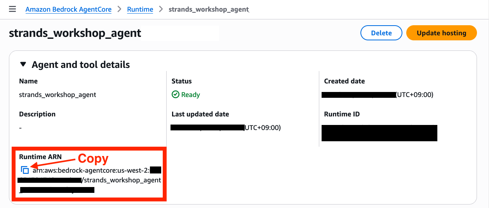
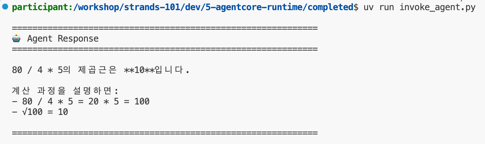
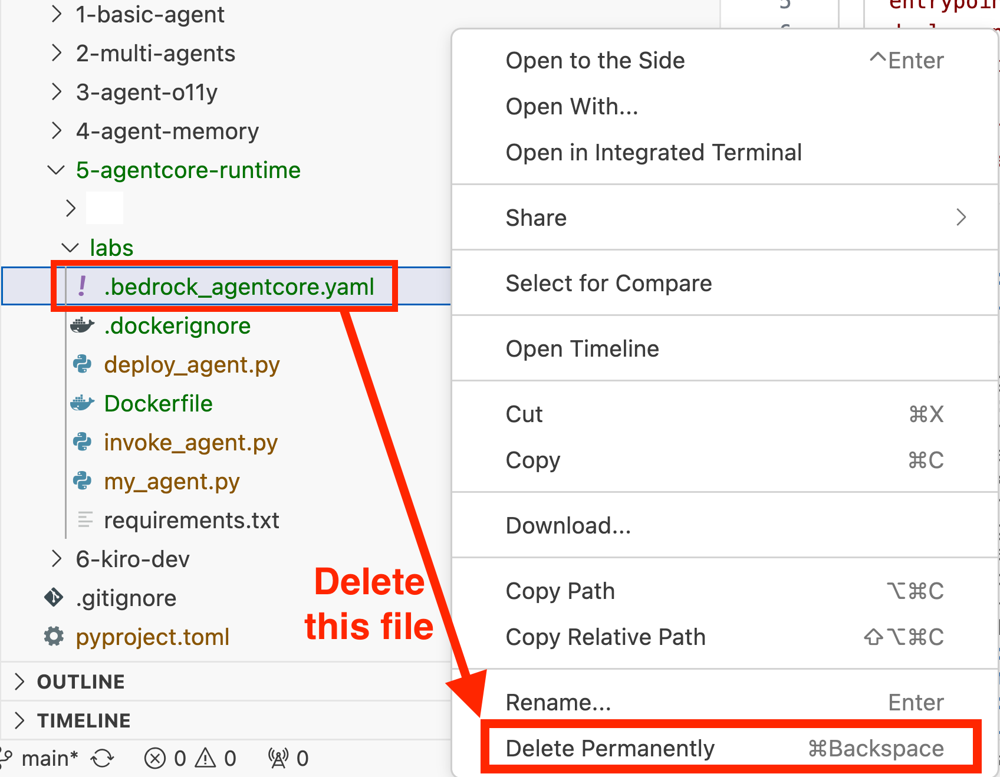
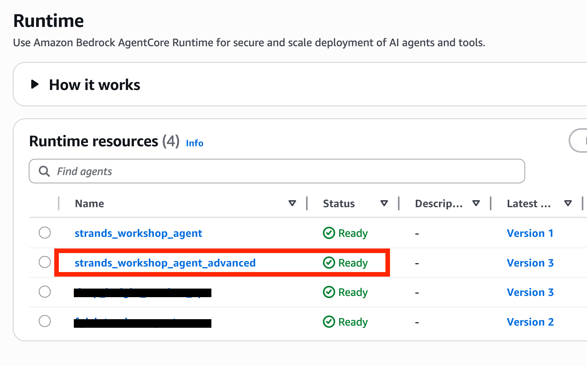
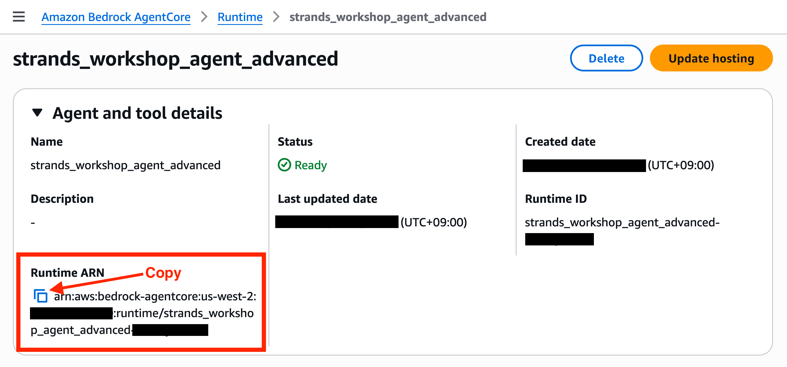
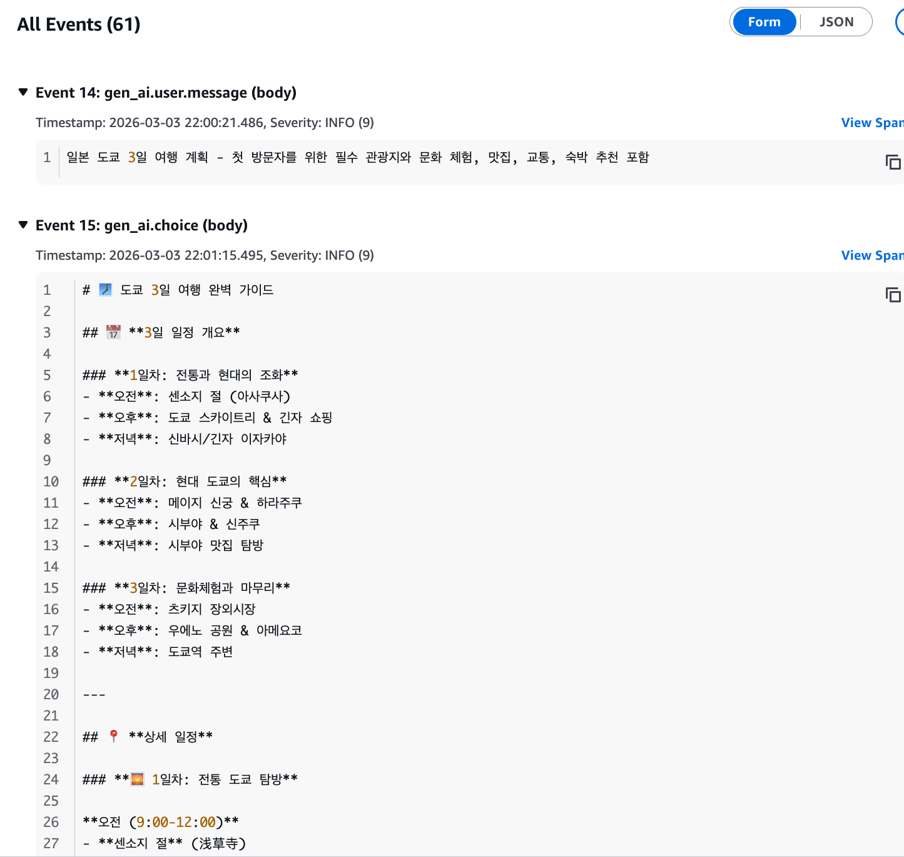

# 6. 에이전트 배포 (AgentCore Runtime)

이번 실습에서는 지금까지 로컬에서 실행하던 Strands 에이전트를 [Amazon Bedrock AgentCore Runtime](https://docs.aws.amazon.com/bedrock-agentcore/latest/devguide/agents-tools-runtime.html)에 배포하는 방법을 학습합니다.

복잡한 인프라 설정이나 코드 재작성 없이, **4줄의 코드만 추가**하면 프로덕션 환경에 배포하여 서버리스 기반 자동 확장과 모니터링의 장점을 가져갈 수 있습니다.

실습 방식은 다른 챕터와 같습니다. `labs/` 폴더의 빈 파일에 직접 코드를 작성하고, `completed/` 폴더에는 정답 코드가 들어 있습니다.

> [!NOTE]
> **사전 준비**
> - [00-setup](../00-setup/README.ko.md)에 따라 환경 구성 및 uv 환경 활성화
> - 이전 챕터와 동일하게 `us-west-2` 리전의 Amazon Bedrock 모델(Claude) 액세스
> - 컨테이너 런타임(Docker Desktop, Finch, Podman 등)이 설치되어 **실행 중**이어야 합니다. AgentCore는 에이전트를 컨테이너 이미지로 패키징하며, `configure()`가 이를 위한 `Dockerfile`을 생성합니다. Starter Toolkit 버전에 따라 `launch()`가 이미지를 로컬에서 빌드하거나(Docker 실행 필요) AWS CodeBuild에서 빌드합니다.
> - Amazon ECR(리포지토리 생성, 이미지 푸시), IAM(역할 생성), Bedrock AgentCore, CloudWatch Logs에 대한 IAM 권한. ECR 리포지토리와 IAM 실행 역할은 Starter Toolkit이 자동으로 생성합니다(3단계 참고).
> - 이 챕터는 **과금되는 AWS 리소스**(AgentCore Runtime, ECR 리포지토리)를 생성합니다. 실습 후 [리소스 정리](#리소스-정리)를 반드시 수행하세요.

> [!IMPORTANT]
> [07-agentcore-observability](../07-agentcore-observability/README.ko.md) 챕터는 이 챕터에 의존합니다. 여기서 배포한 런타임을 사용하며, 아래 **0단계**의 CloudWatch Transaction Search 설정이 반드시 필요합니다. 0단계를 건너뛰지 마시고, 7장을 마치기 전에는 리소스 정리를 수행하지 마세요.

**이번 챕터에서 배우는 내용**

- AgentCore Runtime이 무엇이고, 로컬 실행 대비 어떤 이점이 있는지
- CloudWatch Transaction Search 활성화 방법 (AWS 계정당 1회)
- 로컬 Strands 에이전트에 4줄만 추가해 배포 가능한 형태로 바꾸는 방법
- AgentCore Starter Toolkit(`configure()` + `launch()`)으로 배포하는 방법
- boto3와 세션 ID로 배포된 런타임을 호출하는 방법
- (선택) 멀티 에이전트 시스템을 배포하고 콘솔에서 세션 확장을 확인하는 방법

**예상 소요 시간:** 약 40분 (선택 실습인 5단계 포함 시 약 20분 추가)

## 이번 챕터의 파일

| 파일 | 용도 |
|---|---|
| `labs/my_agent.py` | (빈 파일) 직접 작성: `BedrockAgentCoreApp`으로 래핑한 에이전트 |
| `labs/deploy_agent.py` | (빈 파일) 직접 작성: `configure()` + `launch()` 배포 스크립트 |
| `labs/invoke_agent.py` | (빈 파일) 직접 작성: boto3로 배포된 런타임 호출 |
| `labs/my_agent_advanced.py` | (빈 파일) 선택 실습 5단계에서 작성: 멀티 에이전트 오케스트레이터 |
| `labs/requirements.txt` | 컨테이너 이미지에 설치될 의존성 (이미 작성되어 있음) |
| `completed/my_agent.py` | 정답 코드 |
| `completed/deploy_agent.py` | 정답 코드 |
| `completed/invoke_agent.py` | 정답 코드 (5단계용 버전이 파일 하단에 주석 블록으로 포함되어 있습니다) |
| `completed/requirements.txt` | 정답 코드 |
| `completed/Dockerfile` | `configure()`가 생성한 파일, 참고용으로 포함 |
| `completed/.dockerignore` | `configure()`가 생성한 파일, 참고용으로 포함 |

> [!NOTE]
> `completed/my_agent_advanced.py`는 존재하지 않습니다. 선택 실습용 멀티 에이전트 코드 전체는 이 README의 [5단계](#선택-5-에이전트-배포-과정을-console에서-직접-확인하기)에 그대로 실려 있습니다.

---

## AgentCore Runtime이란?


AgentCore Runtime은 AI 에이전트를 위한 서버리스 호스팅 환경입니다. 로컬에서 개발한 에이전트 코드를 **최소한의 변경**만으로 클라우드에 배포할 수 있습니다.

- **프레임워크 무관**: Strands, LangGraph, CrewAI 등 어떤 프레임워크든 배포 가능
- **세션 격리**: 각 사용자 세션이 전용 microVM에서 실행되어 완전한 격리 보장
- **자동 스케일링**: 사용량 기반 과금으로 리소스를 자동 프로비저닝
- **내장 Observability**: 트레이스, 메트릭, 로그가 자동으로 CloudWatch에 수집
- **최대 8시간 실행**: 실시간 대화부터 장시간 비동기 작업까지 지원

---

## 0. (사전 준비) CloudWatch Transaction Search 활성화

AgentCore Runtime에 배포된 에이전트의 트레이스, 메트릭, 세션 정보를 대시보드에서 확인하려면 CloudWatch Transaction Search가 활성화되어 있어야 합니다. 이 설정은 AWS 계정당 한 번만 수행하면 됩니다.

> [!WARNING]
> 이 단계를 먼저 수행해야 이후 실습에서 AgentCore 대시보드의 Session, Traces 등의 데이터를 정상적으로 확인할 수 있습니다. 활성화 후 스팬이 검색 가능해지기까지 약 10분이 소요될 수 있으므로, 배포 전에 미리 활성화해두는 것을 권장합니다.

**0-1.** AWS 콘솔에서 [CloudWatch](https://console.aws.amazon.com/cloudwatch/) 서비스를 엽니다.


**0-2.** 좌측 메뉴에서 **Settings**를 클릭하고, **Application Signals** 탭에서 **Edit** 버튼을 클릭합니다.


**0-3.** **Enable Transaction Search**를 토글하여 활성화합니다. 이때 **Sample rate를 반드시 100%로 설정**한 후 **Save**를 클릭합니다.

> [!WARNING]
> Sample rate가 기본값(1%)으로 되어 있으면 대부분의 트레이스가 수집되지 않아 대시보드에서 데이터를 확인할 수 없습니다. 워크샵 환경에서는 반드시 **100%**로 설정하세요.


---

## 1. 기존 로컬 에이전트 확인

먼저 로컬에서 실행하던 일반적인 Strands 에이전트 코드를 살펴보겠습니다. (참고용이므로 파일에 붙여넣을 필요는 없습니다)

```python
# 로컬 실행용 에이전트 (기존 코드)
from strands import Agent
from strands_tools import calculator, current_time

agent = Agent(
    system_prompt="You are a helpful AI assistant.",
    tools=[calculator, current_time]
)

# 로컬에서 직접 호출
user_message = "80 / 4 * 5 의 제곱근은?"
result = agent(user_message)
print(result.message)
```

이 코드를 AgentCore Runtime에 배포하려면 어떻게 해야 할까요?

---

## 2. 클라우드 배포를 위한 코드 변환

기존 로컬 코드에 **4줄만 추가**하면 AgentCore Runtime에 배포할 수 있습니다.

**2-1.** `06-agentcore-runtime/labs/my_agent.py` 파일을 엽니다.

**2-2.** 다음과 같이 코드를 작성합니다:

```python
from bedrock_agentcore.runtime import BedrockAgentCoreApp  # ← 1️⃣ 추가
from strands import Agent
from strands_tools import calculator, current_time

app = BedrockAgentCoreApp()  # ← 2️⃣ 추가

agent = Agent(
    system_prompt="You are a helpful AI assistant.",
    tools=[calculator, current_time]
)

@app.entrypoint  # ← 3️⃣ 추가
def invoke(payload):
    """Agent invocation entrypoint"""
    user_message = payload.get("prompt", "Hello!")
    result = agent(user_message)
    return {"result": result.message}

if __name__ == "__main__":
    app.run()  # ← 4️⃣ 추가
```

<details>
<summary>변경사항 상세 비교 (Before/After)</summary>

### Before (로컬 실행용)
```python
from strands import Agent
from strands_tools import calculator, current_time

agent = Agent(
    system_prompt="You are a helpful AI assistant.",
    tools=[calculator, current_time]
)

user_message = "80 / 4 * 5 의 제곱근은?"
result = agent(user_message)
print(result.message)
```

### After (AgentCore Runtime용)
```python
from bedrock_agentcore.runtime import BedrockAgentCoreApp  # 1️⃣ Import 추가
from strands import Agent
from strands_tools import calculator, current_time

app = BedrockAgentCoreApp()  # 2️⃣ App 인스턴스 생성

agent = Agent(
    system_prompt="You are a helpful AI assistant.",
    tools=[calculator, current_time]
)

@app.entrypoint  # 3️⃣ 데코레이터 추가
def invoke(payload):
    user_message = payload.get("prompt", "Hello!")
    result = agent(user_message)
    return {"result": result.message}

if __name__ == "__main__":
    app.run()  # 4️⃣ App 실행
```

### 추가된 내용 요약
1. `BedrockAgentCoreApp` import
2. `app = BedrockAgentCoreApp()` 인스턴스 생성
3. `@app.entrypoint` 데코레이터로 호출 함수 래핑
4. `app.run()` 호출

**핵심 에이전트 로직은 전혀 변경되지 않습니다.** 기존 `Agent` 객체와 프롬프트를 그대로 사용합니다.

</details>

> [!NOTE]
> **전체 코드 확인**
> 지금까지 작성한 `my_agent.py`의 전체 코드는 `06-agentcore-runtime/completed/my_agent.py` 파일에서 확인할 수 있습니다.

**2-3.** 배포 전에 로컬에서 에이전트를 테스트합니다.

`app.run()`은 런타임이 호출하는 것과 동일한 두 개의 엔드포인트(`POST /invocations`, `GET /ping`)를 제공하는 로컬 HTTP 서버(uvicorn)를 실행합니다. 컨테이너 밖에서 실행하면 `127.0.0.1:8080`에 바인딩됩니다. 클라우드 배포는 수 분이 걸리므로, 먼저 로컬에서 실행해 import 오류나 프롬프트 오류를 미리 잡는 것이 가장 빠릅니다.

```bash
uv run python 06-agentcore-runtime/labs/my_agent.py
```

그다음 다른 터미널을 열어 런타임이 보내는 것과 같은 형태의 페이로드를 전송합니다.

```bash
curl -X POST http://localhost:8080/invocations \
  -H "Content-Type: application/json" \
  -d '{"prompt": "80 / 4 * 5 의 제곱근은?"}'
```

`invoke()` 함수가 반환한 `result` 키가 포함된 JSON 응답을 확인할 수 있습니다. `curl http://localhost:8080/ping`은 런타임이 사용하는 헬스 상태를 반환합니다. 다음 단계로 넘어가기 전에 `Ctrl+C`로 서버를 종료해 8080 포트를 비워두세요.

---

## 3. AgentCore Runtime에 배포

이제 앞서 작성한 에이전트를 AWS 클라우드에 배포해보겠습니다.

배포 스크립트는 AgentCore에서 제공하는 Starter Toolkit을 활용해서, **1) runtime을 정의**하고, **2) `.configure()` 명령어로 런타임을 설정**한 뒤, **3) `.launch()` 명령어를 통해 런타임을 배포**하면 됩니다. 아래 코드를 따라가보세요.

**3-1.** `06-agentcore-runtime/labs/deploy_agent.py` 파일을 엽니다.

**3-2.** 필요한 라이브러리를 import 합니다.

- `Runtime`은 AgentCore Starter Toolkit에서 제공하는 배포 관리 클래스입니다.

```python
from bedrock_agentcore_starter_toolkit import Runtime
from boto3.session import Session

```

**3-3.** Runtime 인스턴스를 생성하고 배포를 구성합니다.

- `entrypoint`는 앞서 작성한 에이전트 파일을 지정합니다.
- `auto_create_execution_role=True`로 IAM 역할을 자동 생성합니다.
- `requirements_file`은 배포 환경에서 설치할 의존성 파일을 지정합니다.

```python
boto_session = Session()
region = boto_session.region_name

agentcore_runtime = Runtime()

response = agentcore_runtime.configure(
    entrypoint="my_agent.py",
    agent_name="strands_workshop_agent",
    requirements_file="requirements.txt",
    auto_create_execution_role=True,
    auto_create_ecr=True,
    region=region,
)

```

> [!NOTE]
> **두 플래그가 실제로 하는 일**
> - `auto_create_execution_role=True`: IAM 역할을 직접 만들거나 전달할 필요가 없습니다. Toolkit이 `AmazonBedrockAgentCoreSDKRuntime-<region>-<suffix>` 형식의 역할을 런타임에 필요한 신뢰 정책 및 인라인 정책과 함께 생성하고, 이미 존재하면 재사용합니다. 직접 만든 역할을 사용하려면 이 플래그 대신 `execution_role="<역할 이름 또는 ARN>"`을 전달합니다.
> - `auto_create_ecr=True`: Toolkit이 ECR 리포지토리(`bedrock_agentcore-<agent_name>` 형식)를 생성하고 빌드한 이미지를 푸시합니다.
>
> `configure()`는 `deploy_agent.py`와 같은 디렉토리에 세 개의 파일을 생성합니다: 생성된 `Dockerfile`, `.dockerignore`, `.bedrock_agentcore.yaml`. 앞의 두 파일은 참고용으로 `completed/`에 포함되어 있습니다.

**3-4.** 에이전트를 빌드하고 배포합니다.

- `launch()`는 코드 패키징, AWS 리소스 생성, AgentCore Runtime 배포, CloudWatch 로깅 구성을 자동으로 수행합니다.

```python
print("🚀 Starting deployment...")
launch_result = agentcore_runtime.launch()
print(launch_result)

```

**3-5.** 이제 위 코드를 저장하고, 터미널로 돌아가 아래 배포 명령어를 실행합니다:

```bash
cd 06-agentcore-runtime/labs
uv run deploy_agent.py
cd -
```

> [!TIP]
> 배포 스크립트는 위와 같이 `labs/` 디렉토리 안에서 실행하세요. `entrypoint="my_agent.py"`와 `requirements_file="requirements.txt"`는 현재 디렉토리 기준으로 해석되며, 생성되는 `Dockerfile`과 `.bedrock_agentcore.yaml`도 해당 디렉토리에 만들어집니다.

배포가 완료되면 아래와 같은 로그가 출력됩니다.


> [!NOTE]
> **`.bedrock_agentcore.yaml` 파일에 대하여**
> 배포 단계에서 `06-agentcore-runtime/labs/` 디렉토리에 `.bedrock_agentcore.yaml` 파일이 생성됩니다. 이 파일에는 배포 상태(에이전트 ID, 에이전트 ARN, ECR 리포지토리 URI, 실행 역할 ARN, 리전)가 기록됩니다. 값이 특정 AWS 계정에 종속되므로 이 파일은 **gitignore 처리되어 리포지토리에 커밋되지 않습니다.** 최초 `configure()` 시 자동으로 생성되며, 아래의 리소스 정리 및 재배포 단계에서 이 파일을 읽어 사용하므로 7장까지 실습을 마칠 때까지 삭제하지 말고 유지하세요.

> [!NOTE]
> **전체 코드 확인**
> 지금까지 작성한 `deploy_agent.py`의 전체 코드는 `06-agentcore-runtime/completed/deploy_agent.py` 파일에서 확인할 수 있습니다. 해당 파일은 boto3 세션에서 리전을 읽는 대신 `region="us-west-2"`를 직접 지정하고 있으며, `entrypoint`와 `agent_name` 라인에는 선택 실습 5단계에서 사용하는 값이 주석으로 함께 표기되어 있습니다.

**3-6.** AWS 콘솔로 이동해 에이전트가 배포된 것을 확인하고, 에이전트 호출을 위한 정보를 복사하겠습니다.

먼저 [Amazon Bedrock AgentCore 콘솔](https://us-west-2.console.aws.amazon.com/bedrock-agentcore/home?region=us-west-2#/runtimes)에 접속하여 **Runtime** 메뉴에서 `strands_workshop_agent`가 생성되었는지 확인합니다.


`strands_workshop_agent`를 클릭해 들어간 후, **Runtime ARN** 아래의 복사 버튼을 눌러 **에이전트의 ARN을 복사**해둡니다. 이는 다음 단계에서 에이전트를 호출할 때 사용됩니다.



---

## 4. 배포된 에이전트 테스트

**4-1.** `06-agentcore-runtime/labs/invoke_agent.py` 파일을 엽니다.

**4-2.** 필요한 라이브러리를 import 합니다.

```python
import json
import uuid
import boto3

```

**4-3.** 배포 출력에서 확인한 Agent ARN을 입력합니다.

```python
agent_arn = "<<Enter the copied Runtime ARN>>"
prompt = "What is the square root of 80 / 4 * 5?"

```

**4-4.** AgentCore 클라이언트를 생성하고 에이전트를 호출합니다.

- `runtimeSessionId`는 세션을 식별하는 고유 ID입니다. 동일한 세션 ID를 사용하면 VM의 임시 메모리(Ephemeral Memory)에 대화 컨텍스트가 유지됩니다.

```python
client = boto3.client('bedrock-agentcore')

payload = json.dumps({"prompt": prompt}).encode()

response = client.invoke_agent_runtime(
    agentRuntimeArn=agent_arn,
    runtimeSessionId=str(uuid.uuid4()),
    payload=payload,
)

```

**4-5.** 응답을 파싱하여 출력합니다.

```python
content = []
for chunk in response.get("response", []):
    content.append(chunk.decode('utf-8'))

result = json.loads(''.join(content))

print("\n" + "=" * 60)
print("🤖 Agent Response")
print("=" * 60 + "\n")

if 'result' in result and 'content' in result['result']:
    for item in result['result']['content']:
        if 'text' in item:
            print(item['text'])
else:
    print(json.dumps(result, indent=2, ensure_ascii=False))
```

**4-6.** 이제 파일을 저장하고, 터미널을 열고 아래 명령어를 실행하여 결과를 확인합니다:

```bash
uv run 06-agentcore-runtime/labs/invoke_agent.py
```



> [!NOTE]
> **축하드립니다!**
> 로컬에서 개발한 Strands 에이전트를 **단 4줄의 코드 추가만으로** AgentCore Runtime에 배포했습니다. 복잡한 인프라 설정 없이 서버리스 환경에서 에이전트를 운영할 수 있습니다.

---

## (선택) 5. 에이전트 배포 과정을 Console에서 직접 확인하기

> [!NOTE]
> **선택 실습 (Optional)**
> 이 섹션은 **선택 실습**입니다. 핵심 워크샵 흐름에는 영향을 주지 않으며, 건너뛰고 다음 챕터로 이동해도 됩니다.
>
> 방금까지는 간단한 수식 계산 에이전트를 AgentCore Runtime에 배포하고 호출해보았습니다.
> 이번 섹션에서는 **보다 실행시간이 긴** 에이전트 시스템을 AgentCore Runtime에 배포하고, 이 에이전트를 **여러 번 동시 호출**해봄으로써, 실제 에이전트 시스템이 Runtime에서 어떻게 **확장되어 안정적으로 실행되는지**를 직접 확인하는 실습을 진행해보겠습니다.
>
> 이를 위해 앞서 진행한 **에이전트 생성 > 배포 > 호출** 과정을 **5-1**에서부터 **5-5**까지 코드를 통해 다시 진행한 뒤, **5-6**에서 에이전트를 여러 번 실행하는 과정을 수행할 예정입니다.

**5-1.** `06-agentcore-runtime/labs/my_agent_advanced.py` 파일을 열고, 다음 코드를 붙여넣습니다.

<details>
<summary>코드 설명</summary>

이 코드는 여러 개의 에이전트가 서로 협업하며 하나의 목표를 달성하는 멀티에이전트 시스템을 구현한 내용입니다. 자세한 내용은 [2. 멀티 에이전트 패턴을 통해 복잡한 작업을 수행하는 시스템 구축하기](../02-multi-agents/README.ko.md)를 참고하실 수 있습니다.

1. **전문 에이전트를 `@tool`로 래핑**: 각 에이전트가 도구처럼 동작 (아래 코드에는 리서치, 제품 추천, 여행 계획 3개가 정의되어 있습니다)
2. **오케스트레이터 에이전트**: 사용자 요청을 분석하여 적절한 전문 에이전트를 선택
3. **`BedrockAgentCoreApp`으로 래핑**: AgentCore Runtime에 배포 가능하도록 변환

실행 흐름:
```
사용자: "도쿄에 대해 리서치하고 여행 계획 세워줘"
         ↓
   Orchestrator 분석
         ↓
  research_assistant 호출 → 도쿄 정보 조사
         ↓
  trip_planning_assistant 호출 → 여행 계획 수립
         ↓
    최종 결과 반환
```

</details>

```python
from bedrock_agentcore.runtime import BedrockAgentCoreApp
from strands import Agent, tool

app = BedrockAgentCoreApp()

# 리서치 에이전트를 도구로 래핑
@tool
def research_assistant(query: str) -> str:
    """
    Processes and responds to research-related queries.

    Args:
        query: Research question requiring factual information

    Returns:
        Detailed research answer with citations
    """
    try:
        research_agent = Agent(
            system_prompt="""You are a professional research assistant.
            Focus on providing only factual information with clear sources for research questions.
            Always cite sources whenever possible.""",
        )
        response = research_agent(query)
        return str(response)
    except Exception as e:
        return f"Error in research assistant: {str(e)}"

# 제품 추천 에이전트를 도구로 래핑
@tool
def product_recommendation_assistant(query: str) -> str:
    """
    Handles product recommendation queries by suggesting appropriate products.

    Args:
        query: Product inquiry including user preferences

    Returns:
        Personalized product recommendations with reasoning
    """
    try:
        product_agent = Agent(
            system_prompt="""You are a professional product recommendation assistant.
            사용자의 선호도를 바탕으로 개인화된 제품 제안을 제공하세요.
            항상 추천 이유를 명확히 설명하세요.""",
        )
        response = product_agent(query)
        return str(response)
    except Exception as e:
        return f"Error in product recommendation: {str(e)}"

# 여행 계획 에이전트를 도구로 래핑
@tool
def trip_planning_assistant(query: str) -> str:
    """
    Creates travel itineraries and provides travel advice.

    Args:
        query: Travel planning request including destination and preferences

    Returns:
        Detailed travel itinerary or travel advice
    """
    try:
        travel_agent = Agent(
            system_prompt="""You are a professional travel planning assistant.
            사용자의 선호도를 바탕으로 상세한 여행 일정을 작성하세요.
            예산, 교통, 숙박, 관광지 등을 포함한 실용적인 계획을 제공하세요.""",
        )
        response = travel_agent(query)
        return str(response)
    except Exception as e:
        return f"Error in trip planning: {str(e)}"

# 오케스트레이터 에이전트 생성
MAIN_SYSTEM_PROMPT = """
당신은 쿼리를 특화된 에이전트로 라우팅하는 멀티 에이전트 오케스트레이터입니다.

사용 가능한 전문 에이전트:
- research_assistant: 연구 질문 및 사실적 정보 조사
- product_recommendation_assistant: 제품 추천 및 쇼핑 조언
- trip_planning_assistant: 여행 계획 및 일정 작성

작업 방식:
1. 사용자의 쿼리를 분석하여 가장 적절한 전문 에이전트를 선택하세요
2. 필요시 여러 에이전트를 순차적으로 호출할 수 있습니다
3. 복잡한 요청의 경우 여러 에이전트의 결과를 조합하세요
4. 간단한 질문은 직접 답변하세요

항상 사용자의 요구사항에 맞는 최적의 에이전트를 선택하고,
명확하고 유용한 답변을 제공하세요.
"""

@app.entrypoint
def invoke(payload):
    """멀티 에이전트 오케스트레이터 엔트리포인트"""
    user_message = payload.get("prompt", "Hello!")
    
    orchestrator = Agent(
        system_prompt=MAIN_SYSTEM_PROMPT,
        tools=[
            research_assistant,
            product_recommendation_assistant,
            trip_planning_assistant,
        ],
    )
    
    result = orchestrator(user_message)
    
    return {
        "result": result.message,
        "agent_type": "multi-agent-orchestrator",
    }

if __name__ == "__main__":
    app.run()
```

**5-2.** `06-agentcore-runtime/labs/deploy_agent.py` 파일을 열고, **기존 내용을 모두 지운 후** 다음 코드를 붙여넣습니다:

```python
from bedrock_agentcore_starter_toolkit import Runtime
from boto3.session import Session

boto_session = Session()
region = boto_session.region_name

agentcore_runtime = Runtime()

response = agentcore_runtime.configure(
    entrypoint="my_agent_advanced.py",  # 멀티에이전트 파일로 변경
    agent_name="strands_workshop_agent_advanced",  # 멀티에이전트용 이름으로 변경
    requirements_file="requirements.txt",
    auto_create_execution_role=True,
    auto_create_ecr=True,
    region=region,
)

print("🚀 Starting deployment...")
launch_result = agentcore_runtime.launch()
print(launch_result)
```

> [!NOTE]
> **이전 코드와의 차이 확인**
> 앞서 작성한 deploy_agent.py와의 차이는 10-11번째 라인의 단 두 줄로, 나머지는 앞서 작성한 배포 로직과 동일한 코드입니다.
>
> entrypoint 파일을 `my_agent.py`에서 `my_agent_advanced.py`로 변경하고, 에이전트의 이름만 업데이트해주었습니다.

**5-3.** 배포하기 전, 기존 Runtime으로 배포했던 설정을 초기화하기 위해 `.bedrock_agentcore.yaml` 파일을 삭제해주겠습니다. deploy_agent.py와 동일한 디렉토리에 있는 `.bedrock_agentcore.yaml` 파일을 찾아 **'Delete Permanently'** 버튼을 눌러 삭제해주세요.



터미널에서 삭제하려면 아래 명령어를 사용합니다.

```bash
rm 06-agentcore-runtime/labs/.bedrock_agentcore.yaml
```

> [!WARNING]
> 이 파일을 삭제하면 첫 번째 배포에 대한 로컬 기록(에이전트 ID, ECR 리포지토리, 실행 역할)이 사라집니다. `strands_workshop_agent` 런타임 자체는 계속 실행되며 계속 과금됩니다. 이후 [리소스 정리](#리소스-정리) 항목의 안내대로 콘솔이나 AWS CLI로 직접 삭제해야 합니다.

**5-4.** 터미널에서 아래 명령어를 실행해 새 Runtime을 배포합니다.

```bash
cd 06-agentcore-runtime/labs
uv run deploy_agent.py
cd -
```

배포가 완료되면 아래와 같은 로그가 출력됩니다.


> [!NOTE]
> AWS 콘솔의 AgentCore Runtimes에서 `strands_workshop_agent`와 `strands_workshop_agent_advanced` 두 개의 런타임이 생성된 것을 확인할 수 있습니다.

**5-5.** AWS 콘솔로 이동해 에이전트가 배포된 것을 확인하고 에이전트 ARN을 복사하겠습니다.

[Amazon Bedrock AgentCore 콘솔](https://us-west-2.console.aws.amazon.com/bedrock-agentcore/home?region=us-west-2#/runtimes)에 접속하여 **Runtime** 메뉴에서 `strands_workshop_agent_advanced`가 생성되었는지 확인합니다.



`strands_workshop_agent_advanced`를 클릭해 들어간 후, **Runtime ARN** 아래의 복사 버튼을 눌러 **에이전트의 ARN을 복사**해둡니다. 이는 다음 단계에서 에이전트를 호출할 때 사용됩니다.



**5-6.** `06-agentcore-runtime/labs/invoke_agent.py` 파일을 열고, **기존 내용을 모두 지운 후** 다음 코드를 붙여넣습니다. **방금 전 단계(5-5)에서 복사해둔 ARN을 코드의 `agent_arn` 변수에 붙여넣어 줍니다.**

```python
import json
import uuid
import boto3
from urllib.parse import quote

agent_arn = "<<Enter the copied Runtime ARN>>"
region = "us-west-2"
prompt = "Can you research Tokyo, Japan? Also plan a 3-day trip there and recommend products needed for the trip."

# Generate session ID
session_id = str(uuid.uuid4())

# Extract Agent name (from ARN)
agent_name = agent_arn.split("/")[-1]

# Construct CloudWatch Logs group name
log_group_name = f"/aws/bedrock-agentcore/runtimes/{agent_name}-DEFAULT"

# Generate CloudWatch Logs group URL
log_group_url = (
    f"https://console.aws.amazon.com/cloudwatch/home?region={region}"
    f"#logsV2:log-groups/log-group/{quote(log_group_name, safe='')}"
)

client = boto3.client('bedrock-agentcore')
payload = json.dumps({"prompt": prompt}).encode()

print(f"\n\nPrompt: {prompt}\n")
print(f"Session ID: {session_id}\n")
print("⏳ Invoking agent...\n")
print(f"📊 CloudWatch Logs (filter by session ID): {log_group_url}\n\n")

try:
    response = client.invoke_agent_runtime(
        agentRuntimeArn=agent_arn,
        runtimeSessionId=session_id,
        payload=payload,
    )

    # Consume response stream (without printing)
    for _ in response.get("response", []):
        pass

    print("✅ Agent invocation complete\n")
    print(f"📊 Check logs (Session ID: {session_id}): {log_group_url}\n")
except Exception as e:
    print(f"⚠️  Error: {str(e)}\n")
    print(f"📊 Check logs (Session ID: {session_id}): {log_group_url}\n")
```

**5-7.** 터미널에서 아래 명령어를 실행하여 Runtime에 올라간 에이전트를 호출해봅니다.

```bash
uv run 06-agentcore-runtime/labs/invoke_agent.py
```


**5-8.** [Amazon Bedrock AgentCore 콘솔](https://us-west-2.console.aws.amazon.com/bedrock-agentcore/home?region=us-west-2#/runtimes)에 접속하여, `strands_workshop_agent_advanced` 런타임을 클릭하면 아래와 같은 화면을 보실 수 있습니다. Observability 란의 **Dashboard**를 클릭하여 에이전트 호출 로그를 확인하는 대시보드로 이동합니다.


**5-9.** 대시보드에서 **'Session' 탭을 클릭해 이동**하면 특정 세션을 찾을 수 있습니다. 세션 ID를 클릭해 이동합니다.


Traces가 ID별로 표시됩니다. 이 중 가장 최근에 활성화된 Trace ID를 클릭해보면, 오른쪽에 창이 열리며 에이전트의 작업 흐름 로그를 확인하실 수 있습니다.


토글을 펼쳐보면, 스크린샷과 같이 Trip Planning Agent의 출력을 확인하실 수도 있고, 터미널에서만 확인하던 에이전트의 작업 출력을 AWS 콘솔에서 확인하실 수 있습니다.



> [!NOTE]
> **AgentCore Runtime의 네이티브 가시성을 확인했습니다.**
> 이와 같이 AgentCore Runtime은 별도의 설정 없이도 CloudWatch Logs와 Traces를 통해 에이전트의 실행 흐름, 도구 호출, 응답 내용을 실시간으로 확인할 수 있습니다.
>
> 더 자세한 Observability는 다음 챕터인 [7. 에이전트 가시성 (AgentCore Observability)](../07-agentcore-observability/README.ko.md)에서 다룹니다.

**5-10.** (Optional) 다시 터미널로 돌아가, 에이전트가 실행 중인 터미널 외에 새 터미널을 열고 3개 이상 invoke_agent.py를 동시 실행해봅니다.


다시 [Amazon Bedrock AgentCore 콘솔](https://us-west-2.console.aws.amazon.com/bedrock-agentcore/home?region=us-west-2#/runtimes)로 돌아가 `strands_workshop_agent_advanced` 런타임을 확인하면, 직전 호출로 인해 **총 세션이 3개로 늘어난 것을 확인**하실 수 있습니다.


> [!NOTE]
> **AgentCore Runtime의 서버리스 확장성을 체험했습니다.**
> 이와 같이 AgentCore Runtime은 동시 요청 시 각 세션마다 독립적인 microVM을 자동으로 프로비저닝하여, 인프라 관리 없이도 트래픽 증가에 자동으로 대응합니다. 사용하지 않을 때는 0으로 유지하며 과금되지 않게 하고, 사용한 만큼만 스케일링하여 안정적으로 유지하는 서버리스의 장점을 활용할 수 있습니다.

---

## 리소스 정리

> [!WARNING]
> **반드시 수행하세요.** 배포된 AgentCore Runtime과 ECR 리포지토리에 저장된 컨테이너 이미지는 에이전트를 호출하지 않아도 존재하는 동안 계속 비용이 발생합니다. 선택 실습 5단계를 진행했다면 삭제할 런타임이 **2개**, ECR 리포지토리도 **2개**입니다.

> [!IMPORTANT]
> [07-agentcore-observability](../07-agentcore-observability/README.ko.md) 챕터는 여기서 배포한 런타임을 사용합니다. 7장을 이어서 진행할 예정이라면, 7장을 마친 후에 정리하세요.

### 삭제할 리소스

| 리소스 | 이름 / 확인 방법 |
|---|---|
| AgentCore Runtime | `strands_workshop_agent`, 5단계를 진행했다면 `strands_workshop_agent_advanced` |
| ECR 리포지토리 (및 이미지) | `bedrock_agentcore-strands_workshop_agent`, `bedrock_agentcore-strands_workshop_agent_advanced` |
| IAM 실행 역할 | 자동 생성된 `AmazonBedrockAgentCoreSDKRuntime-<region>-<suffix>` |
| CloudWatch 로그 그룹 | `/aws/bedrock-agentcore/runtimes/<agent-id>-DEFAULT` |

내 계정의 정확한 이름은 `06-agentcore-runtime/labs/.bedrock_agentcore.yaml` 파일에 기록되어 있습니다(`aws.ecr_repository`, `aws.execution_role`, `bedrock_agentcore.agent_id`, `bedrock_agentcore.agent_arn` 항목).

### 방법 A: Starter Toolkit 사용 (권장)

최신 버전의 Starter Toolkit은 `agentcore destroy` 명령어를 제공합니다. `.bedrock_agentcore.yaml`을 읽어 런타임, 엔드포인트, ECR 이미지, 자동 생성된 IAM 실행 역할(다른 에이전트가 사용하지 않는 경우에만), 배포 설정을 삭제합니다. `.bedrock_agentcore.yaml`이 있는 디렉토리에서 실행하세요.

```bash
cd 06-agentcore-runtime/labs

# 먼저 미리보기: 삭제 대상만 표시하고 실제로 삭제하지 않습니다
uv run agentcore destroy --agent strands_workshop_agent --dry-run

# 실제 삭제 (ECR 리포지토리 자체까지 함께 삭제)
uv run agentcore destroy --agent strands_workshop_agent --delete-ecr-repo

# 선택 실습 5단계를 진행했다면 advanced 에이전트도 동일하게 삭제
uv run agentcore destroy --agent strands_workshop_agent_advanced --delete-ecr-repo

cd -
```

`--delete-ecr-repo`를 생략하면 이미지만 삭제되고 빈 리포지토리는 남습니다. 설치된 Toolkit 버전에 `destroy`가 없거나 5-3 단계에서 이미 `.bedrock_agentcore.yaml`을 삭제했다면 방법 B 또는 C를 사용하세요.

### 방법 B: AWS 콘솔

1. **Bedrock AgentCore**: [Runtime 목록](https://us-west-2.console.aws.amazon.com/bedrock-agentcore/home?region=us-west-2#/runtimes)에서 `strands_workshop_agent`를 선택하고 **Delete**를 클릭합니다. `strands_workshop_agent_advanced`도 동일하게 삭제합니다.
2. **Amazon ECR**: [ECR 리포지토리 목록](https://us-west-2.console.aws.amazon.com/ecr/repositories?region=us-west-2)에서 `bedrock_agentcore-strands_workshop_agent`(그리고 `_advanced`)를 선택하고 **Delete**를 클릭합니다. 저장된 이미지가 함께 삭제되며, 스토리지 비용이 계속 발생하는 부분이 바로 이 이미지입니다.
3. **IAM**: [역할 목록](https://console.aws.amazon.com/iam/home#/roles)에서 `AmazonBedrockAgentCoreSDKRuntime`을 검색해 이번 워크샵에서 생성된 역할을 삭제합니다.
4. **CloudWatch Logs**: [로그 그룹](https://us-west-2.console.aws.amazon.com/cloudwatch/home?region=us-west-2#logsV2:log-groups)에서 `/aws/bedrock-agentcore/runtimes/`를 검색해 해당 에이전트의 로그 그룹을 삭제합니다.

### 방법 C: AWS CLI

```bash
# 1. 런타임 ID를 확인한 뒤 각 런타임을 삭제
aws bedrock-agentcore-control list-agent-runtimes --region us-west-2
aws bedrock-agentcore-control delete-agent-runtime \
  --agent-runtime-id <AGENT_RUNTIME_ID> --region us-west-2

# 2. ECR 리포지토리를 내부 이미지와 함께 삭제
aws ecr delete-repository \
  --repository-name bedrock_agentcore-strands_workshop_agent \
  --force --region us-west-2

# 3. CloudWatch 로그 그룹 삭제
aws logs delete-log-group \
  --log-group-name "/aws/bedrock-agentcore/runtimes/<AGENT_ID>-DEFAULT" \
  --region us-west-2

# 4. 자동 생성된 IAM 실행 역할 삭제 (인라인 정책을 먼저 제거)
aws iam list-role-policies --role-name <ROLE_NAME>
aws iam delete-role-policy --role-name <ROLE_NAME> --policy-name <POLICY_NAME>
aws iam delete-role --role-name <ROLE_NAME>
```

> [!NOTE]
> AgentCore Runtime은 세션을 처리하지 않을 때 컴퓨팅 유휴 비용이 발생하지 않지만, 런타임 리소스와 특히 ECR 이미지 스토리지에는 비용이 누적됩니다. 따라서 ECR 리포지토리 삭제가 가장 중요합니다. IAM 역할과 빈 로그 그룹 자체는 무료이지만, 계정을 깔끔하게 유지하기 위해 함께 삭제하는 것을 권장합니다.

---

## 트러블슈팅

<details>
<summary>배포 시작과 동시에 Docker 또는 컨테이너 런타임 오류가 발생합니다</summary>

증상: `Cannot connect to the Docker daemon`, `docker: command not found`, `No container runtime available`.

- Docker Desktop(또는 Finch, Podman)을 실행하고 정상 구동될 때까지 기다린 뒤 배포 스크립트를 다시 실행합니다.
- `docker info`로 확인하세요. 이 명령이 실패하면 Toolkit도 이미지를 빌드할 수 없습니다.
- 로컬에서 Docker를 사용할 수 없는 환경이라면, AWS CodeBuild로 빌드하는 Starter Toolkit 버전을 사용해 로컬 데몬 없이 배포할 수 있습니다. `uv run agentcore launch --help`로 설치된 버전이 지원하는 빌드 옵션을 확인하세요.

</details>

<details>
<summary>ECR 인증 또는 푸시 실패</summary>

증상: `no basic auth credentials`, `denied: Your authorization token has expired`, `ecr:GetAuthorizationToken` 또는 `ecr:PutImage`에 대한 `AccessDeniedException`.

- ECR 로그인 토큰은 12시간 동안만 유효합니다. 재인증 후 다시 시도하세요.
  ```bash
  aws ecr get-login-password --region us-west-2 | docker login --username AWS --password-stdin <ACCOUNT_ID>.dkr.ecr.us-west-2.amazonaws.com
  ```
- `aws sts get-caller-identity`로 자격 증명과 계정을 확인합니다. ECR URI의 계정 번호와 일치해야 합니다.
- 리전이 일관적인지 확인하세요. 가이드의 `configure()`는 boto3 세션에서 리전을 읽지만 `completed/deploy_agent.py`는 `us-west-2`를 직접 지정합니다. CLI 기본 리전이 다르면 Toolkit이 한 리전에 리포지토리를 만들고 다른 리전에서 찾는 상황이 발생할 수 있습니다. 리전을 명시적으로 지정하세요.
  ```bash
  export AWS_REGION=us-west-2
  export AWS_DEFAULT_REGION=us-west-2
  ```
- IAM 주체에 `ecr:CreateRepository`, `ecr:GetAuthorizationToken`, `ecr:BatchCheckLayerAvailability`, `ecr:InitiateLayerUpload`, `ecr:UploadLayerPart`, `ecr:CompleteLayerUpload`, `ecr:PutImage` 권한이 필요합니다.

</details>

<details>
<summary>배포가 멈추거나 타임아웃됩니다</summary>

첫 배포는 이미지 빌드, ECR 푸시, 런타임이 `READY` 상태가 될 때까지의 대기를 포함하므로 수 분이 걸립니다.

- 추측하지 말고 런타임 상태를 직접 확인하세요.
  ```bash
  aws bedrock-agentcore-control list-agent-runtimes --region us-west-2
  ```
  상태가 `CREATING`이면 아직 진행 중이며, `CREATE_FAILED`이면 컨테이너가 시작에 실패한 것입니다.
- CloudWatch Logs에서 런타임의 로그 그룹 `/aws/bedrock-agentcore/runtimes/<agent-id>-DEFAULT`를 열어 컨테이너 시작 로그를 확인합니다.
- 컨테이너가 시작되었는데 healthy 상태가 되지 않는다면 대부분 `GET /ping` 체크에 실패한 경우이며, `app.run()`이 실행되지 않았다는 의미입니다. 파일 마지막에 `if __name__ == "__main__": app.run()` 블록이 있는지, 2-3 단계의 로컬 테스트가 정상 동작했는지 확인하세요.
- 실행이 중간에 끊겼다면 `uv run deploy_agent.py`를 다시 실행하면 됩니다. `.bedrock_agentcore.yaml`을 재사용해 중복 생성 대신 기존 에이전트를 업데이트합니다.

</details>

<details>
<summary>로컬에서는 동작하는데 런타임에서는 실패합니다 (의존성 누락)</summary>

배포 후 가장 흔한 실패 유형입니다. 로컬 uv 환경(`00-setup/pyproject.toml`)에는 많은 패키지가 설치되어 있지만, 컨테이너 이미지에는 `06-agentcore-runtime/labs/requirements.txt`에 적힌 것만 설치됩니다.

```text
bedrock-agentcore
strands-agents
strands-agents-tools
```

증상: 호출이 에러를 반환하거나 응답이 오지 않고, CloudWatch 로그 그룹 `/aws/bedrock-agentcore/runtimes/<agent-id>-DEFAULT`에 `ModuleNotFoundError: No module named '<package>'`가 출력됩니다.

해결 방법:

1. 누락된 패키지를 `06-agentcore-runtime/labs/requirements.txt`에 한 줄씩 추가합니다.
2. 새 이미지가 빌드/푸시되도록 다시 배포합니다.
   ```bash
   cd 06-agentcore-runtime/labs
   uv run deploy_agent.py
   cd -
   ```
3. 다시 호출하고 로그 그룹을 확인합니다.

이 왕복을 줄이려면, `my_agent.py`에 import를 추가할 때마다 로컬에서 이미 동작하더라도 `requirements.txt`에 해당 줄을 함께 추가하세요.

</details>

<details>
<summary>호출 시 ValidationException 또는 ResourceNotFoundException이 발생합니다</summary>

- `agent_arn` 자리표시자를 콘솔에서 복사한 실제 ARN으로 교체했는지 확인하세요. `<<복사해둔 Runtime ARN을 입력하세요>>` 문자열 그대로 두면 validation 오류가 발생합니다.
- ARN의 리전과 boto3 클라이언트가 사용하는 리전이 일치해야 합니다. `boto3.client('bedrock-agentcore')`는 `AWS_REGION` / `AWS_DEFAULT_REGION` 또는 CLI 프로파일을 따르므로, `us-west-2`의 런타임을 다른 리전 클라이언트로 호출하면 찾을 수 없습니다.
- 에이전트를 삭제하고 다시 배포했다면 ARN이 변경됩니다. 새 ARN을 복사하세요.

</details>

<details>
<summary>AgentCore 대시보드에 Session이나 Traces가 보이지 않습니다</summary>

- 0단계(CloudWatch Transaction Search)가 활성화되어 있고 Sample rate가 **100%**로 설정되어 있는지 확인하세요.
- 활성화 후 스팬이 검색 가능해지기까지 최대 10분이 소요될 수 있습니다. 그 이후에 에이전트를 다시 호출해보세요.
- 세션은 최소 한 번 호출한 뒤에 표시됩니다. 호출이 실제로 컨테이너에 도달했는지 CloudWatch 로그 그룹에서 먼저 확인하세요.

</details>

---

## 참고 자료

- [AgentCore Runtime 문서](https://docs.aws.amazon.com/bedrock-agentcore/latest/devguide/agents-tools-runtime.html)
- [AgentCore Starter Toolkit](https://github.com/aws/bedrock-agentcore-starter-toolkit)
- [AgentCore Runtime Quickstart](https://aws.github.io/bedrock-agentcore-starter-toolkit/user-guide/runtime/quickstart.html)

---
Prev: [5. 에이전트 메모리](../05-agent-memory/README.ko.md) | Next: [7. 에이전트 가시성 (AgentCore Observability)](../07-agentcore-observability/README.ko.md)
