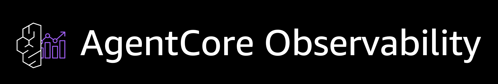
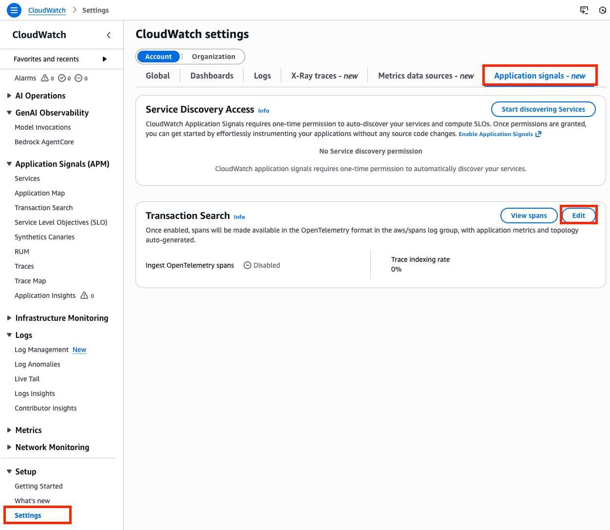
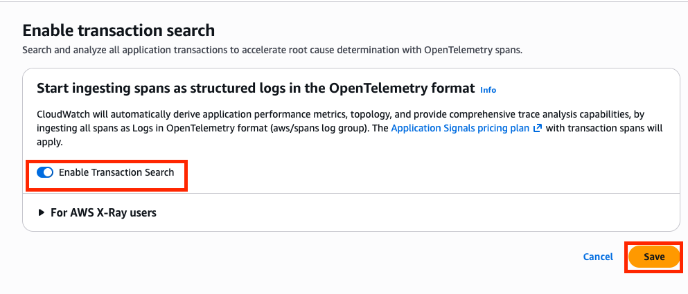
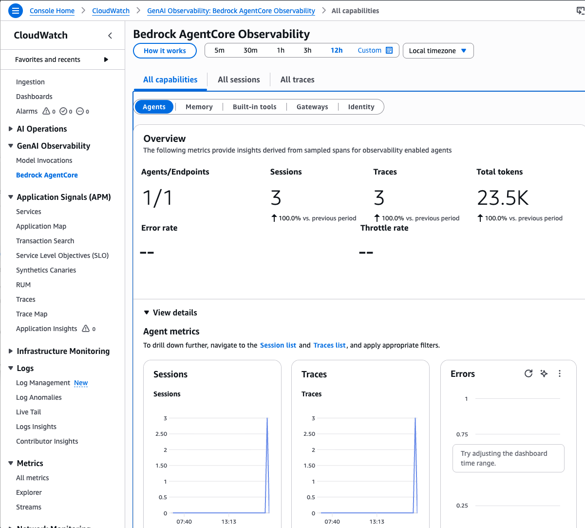
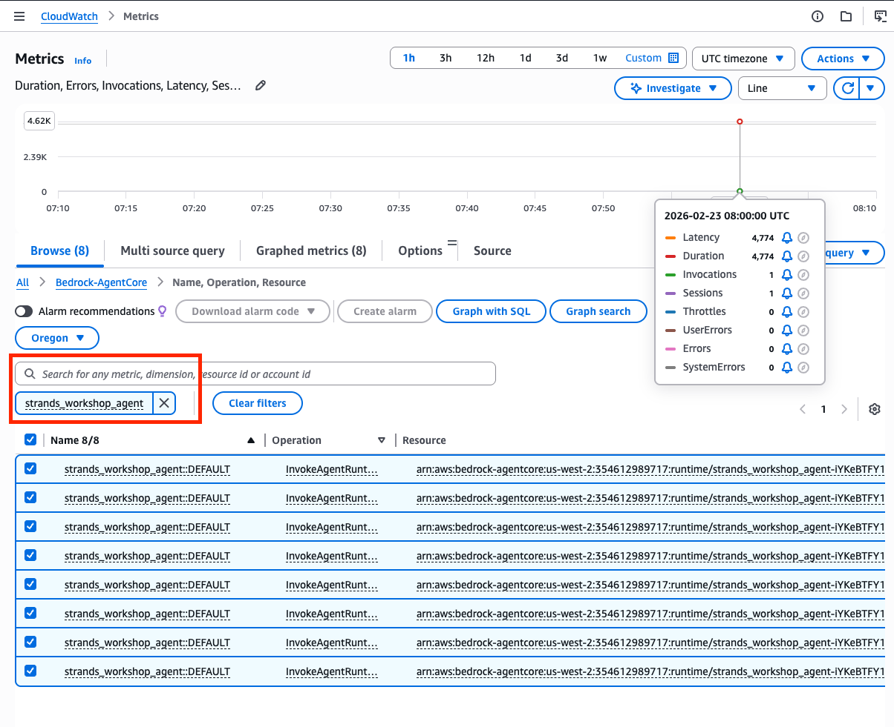
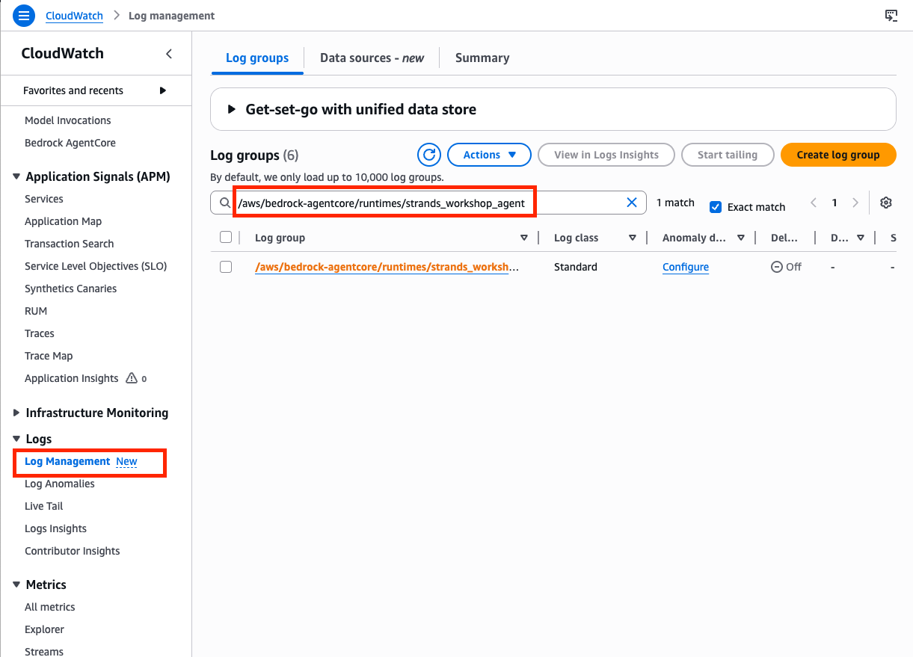
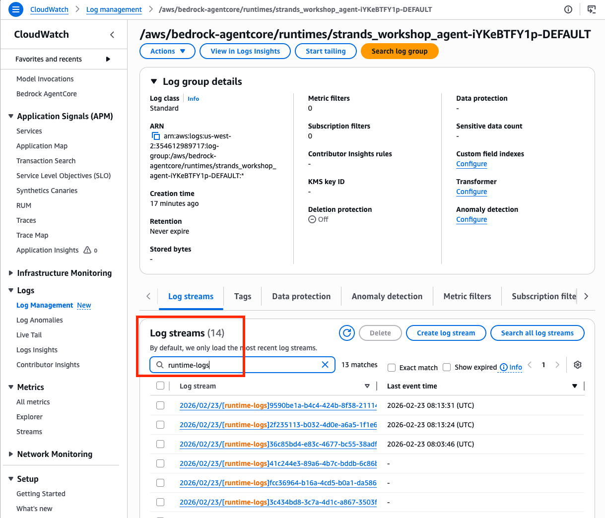
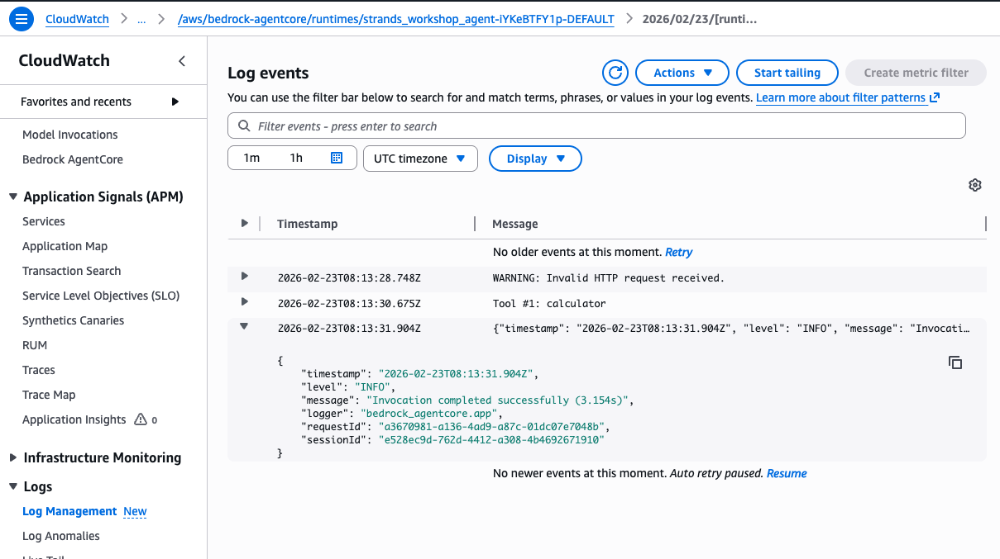

# 07. Agent Observability (AgentCore Observability)

[한국어 README](README.ko.md)

> [!WARNING]
> You must complete [06. AgentCore Runtime](../06-agentcore-runtime/README.md) before starting this chapter. This chapter inspects telemetry produced by the agent you deployed there. Without a deployed agent, the dashboards will be empty.

In this lab you will view traces, metrics, and logs for the agent deployed to AgentCore Runtime in the previous chapter, using the Amazon CloudWatch GenAI Observability dashboard.

> [!NOTE]
> **Prerequisites**
> - Environment set up per [00-setup](../00-setup/README.md)
> - [06. AgentCore Runtime](../06-agentcore-runtime/README.md) completed, with `strands_workshop_agent` deployed and invocable
> - CloudWatch Transaction Search enabled in the account (done in chapter 06, verified again below)
> - AWS Management Console access with permission to read CloudWatch metrics, logs, and traces

**What you will learn**

- What telemetry AgentCore Runtime emits automatically, and where it lands
- How to read the CloudWatch GenAI Observability dashboard: Agents, Sessions, and Traces views
- Which Runtime metrics AgentCore publishes under the `Bedrock-AgentCore` namespace
- Where the agent's stdout/stderr and OTEL structured logs are stored in CloudWatch Logs

**Estimated time:** ~20 minutes

## Files in this chapter

This chapter has no code of its own. Everything is done in the AWS Management Console, on top of the agent you deployed in chapter 06. The only command you run is the invocation script from the previous chapter:

| File | Purpose |
|---|---|
| `../06-agentcore-runtime/labs/invoke_agent.py` | Invoke the deployed agent to generate telemetry |

---

## What is AgentCore Observability?



Agents deployed to AgentCore Runtime automatically generate telemetry data. [AgentCore Observability](https://docs.aws.amazon.com/bedrock-agentcore/latest/devguide/observability.html) collects this data in Amazon CloudWatch and visualizes it through a GenAI-specific dashboard.

### Automatically collected data

- **Traces**: Full path from agent invocation to model inference to tool execution
- **Metrics**: Session count, latency, token usage, error rates
- **Logs**: stdout/stderr output from the agent process

No instrumentation code is required. This is the difference from [04. Observability with Strands](../04-observability/README.md), where you wired up the OTLP exporter and ran your own collector.

---

## 1. Verify Transaction Search is enabled

> [!WARNING]
> To view traces, sessions, and metrics data in the dashboards in this chapter, **CloudWatch Transaction Search must be enabled**. If you already enabled it during the prerequisite step in [chapter 06](../06-agentcore-runtime/README.md), you can skip this section.

Transaction Search is a one-time setting per AWS account. It may take up to 10 minutes after enabling for traces to become searchable, so confirm it now rather than after you start looking at the dashboard.

**1-1.** Open the [CloudWatch](https://console.aws.amazon.com/cloudwatch/) service in the AWS Console.


**1-2.** Click **Settings** in the left menu, then open the **Application signals** tab and click **Edit** in the **Transaction Search** panel.



**1-3.** Confirm that **Enable Transaction Search** is toggled on and the sample rate is **100%**, then click **Save**.



> [!WARNING]
> If the sample rate is left at the default (1%), most traces will not be collected and you will not see data in the dashboard. For this workshop it must be **100%**.

---

## 2. Invoke the agent to generate telemetry

Invoke the agent deployed in chapter 06 to generate observability data. Invoke it several times to see richer data in the dashboard.

```bash
uv run --project 00-setup python 06-agentcore-runtime/labs/invoke_agent.py
```

---

## 3. View the GenAI Observability dashboard

The CloudWatch GenAI Observability dashboard provides immediate insight into agent activity, sessions, and traces without any additional setup.

**3-1.** In the CloudWatch console left menu, select **GenAI Observability** > **Bedrock AgentCore**.

### Agents view

**3-2.** In the **Agents** tab, you can view the overall status of deployed agents:

- **Summary metrics**: Total sessions, traces, errors, throttles
- **Runtime metrics**: Session count, invocations, errors, latency trends (time-series graphs)
- **Per-agent breakdown**: Sessions, traces, errors, P95 latency per agent

### Sessions view

**3-3.** In the **Sessions** tab, you can view conversation flows per session:

- Sortable by session ID, trace count, errors, P95 latency
- Click a session ID to navigate to detailed metrics and traces for that session
- Compare sessions with high latency or repeated errors to identify anomalies

### Traces view

**3-4.** In the **Traces** tab, you can view the execution path of individual requests:

- Sort and filter by trace ID, span count, errors, latency
- Click a trace to view the agent's execution path hierarchically:
  - Agent invocation, then model inference, then tool execution
  - Duration of each step
  - Tool call parameters and results



---

## 4. View CloudWatch metrics

AgentCore automatically publishes metrics under the **AWS/Bedrock-AgentCore** namespace.

**4-1.** In the CloudWatch console left menu, select **Metrics** > **All metrics**.

**4-2.** In the metrics browser, select the namespace **Bedrock-AgentCore**.

**4-3.** Enter `strands_workshop_agent` in the search bar to filter metrics for your deployed agent.

**4-4.** You can view the following Runtime metrics:

| Metric | Description |
|--------|-------------|
| **Invocations** | Total requests received by the agent |
| **Latency** | End-to-end response time from request to final response |
| **Sessions** | Number of active agent sessions |
| **UserErrors** | Client-side errors (400, 403, 404) |
| **SystemErrors** | Server-side errors (500) |
| **Throttles** | Requests rejected due to rate limits (429) |



---

## 5. View CloudWatch logs

AgentCore Runtime automatically sends agent logs to CloudWatch Logs.

**5-1.** In the CloudWatch console left menu, select **Log Management**.

**5-2.** Enter `/aws/bedrock-agentcore/runtimes/strands_workshop_agent` in the search bar.



**5-3.** Click the log group to see two types of log streams:

- **runtime-logs**: Agent stdout/stderr output (Python print statements, error tracebacks, and so on)
- **otel-rt-logs**: OTEL structured logs (execution details, error tracking, performance data)

**5-4.** Click a log stream containing `runtime-logs` to view detailed agent execution logs.





---

## Managed vs. self-managed observability

You have now seen both ends of the spectrum:

| | [04. Observability with Strands](../04-observability/README.md) | This chapter |
|---|---|---|
| Instrumentation | You add `StrandsTelemetry` and set `OTEL_EXPORTER_OTLP_ENDPOINT` in your code | None, emitted by AgentCore Runtime |
| Backend | A collector you run yourself (local Jaeger via Docker) | Amazon CloudWatch |
| Where it works | Anywhere you can run the agent, including your laptop | Agents deployed to AgentCore Runtime |

Use chapter 04's approach when you are running the agent locally or sending telemetry to your own OpenTelemetry backend. Use this chapter's approach once the agent is deployed to AgentCore Runtime.

---

## Cleanup

This chapter creates no new resources, but the data it reads is billable.

- **CloudWatch Transaction Search** ingests every span as a structured log in the `aws/spans` log group and is billed under the Application Signals pricing plan. At the 100% sample rate used in this workshop, this costs more than the default 1%.
- **CloudWatch Logs and traces** are retained and billed for storage until they expire or you delete them.

If you do not want Transaction Search enabled after the workshop, turn it off in the same place you enabled it: CloudWatch console > **Settings** > **Application signals** tab > **Transaction Search** > **Edit**, then toggle **Enable Transaction Search** off and save. You can also delete the `/aws/bedrock-agentcore/runtimes/strands_workshop_agent` log group, or set a shorter retention period on it, from **Log Management**.

The deployed agent itself, and the ECR image and IAM role behind it, are resources from [chapter 06](../06-agentcore-runtime/README.md). Remove them there when you are done.

---

## References

- [Get started with AgentCore Observability](https://docs.aws.amazon.com/bedrock-agentcore/latest/devguide/observability-get-started.html)
- [View AgentCore Observability data](https://docs.aws.amazon.com/bedrock-agentcore/latest/devguide/observability-view.html)
- [Configure AgentCore Observability resources](https://docs.aws.amazon.com/bedrock-agentcore/latest/devguide/observability-configure.html)
- [AgentCore Starter Toolkit - Observability Quickstart](https://aws.github.io/bedrock-agentcore-starter-toolkit/user-guide/observability/quickstart.html#getting-started-with-agentcore-observability)

---
Prev: [AgentCore Runtime](../06-agentcore-runtime/README.md) | Next: [Developing with Kiro IDE](../08-kiro-dev/README.md)
