# 08. Developing with Kiro IDE

[한국어 README](README.ko.md)

> [!NOTE]
> This chapter is **optional**. It does not build on chapters 01 to 07 and nothing later depends on it. Skip it if you only want the Strands Agents and AgentCore path.

In this chapter you will set up a Strands Agents development environment using **Kiro**, AWS's AI-powered IDE, and experience the development workflow: install a Power, define Steering rules, wire up an MCP server, then have Kiro write a Strands agent for you.

## What is Kiro?

[Kiro](https://kiro.dev/) is an AI-powered integrated development environment (IDE) provided by AWS. Built on VS Code, it offers a familiar development experience while AI agents support the entire development process.

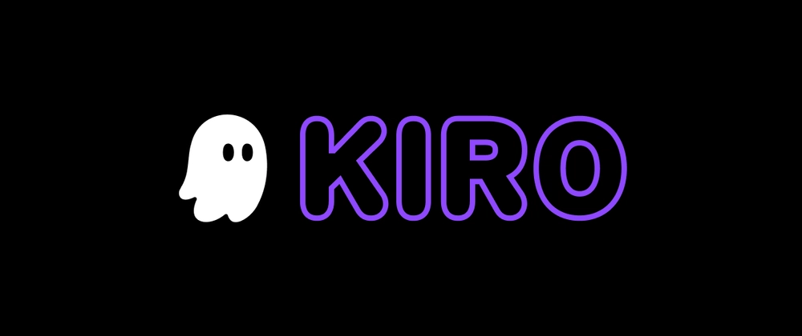

### Key features of Kiro

- **Spec-driven development**: Systematic development process from requirements to design and implementation
- **Steering**: Define project-specific context and rules for consistent AI code generation
- **Hooks**: Configure automated workflows that respond to IDE events
- **Powers**: Extend AI capabilities by packaging MCP servers and documentation for specific domains

> [!NOTE]
> **Prerequisites**
> - Environment set up per [00-setup](../00-setup/README.md)
> - Amazon Bedrock model access for Anthropic Claude in `us-west-2`, so the agent Kiro generates can actually run
> - Kiro IDE, either installed locally from [kiro.dev](https://kiro.dev/) or provided by the workshop environment (see below)
> - A Kiro subscription (the Free tier is enough to try the lab; the workshop uses Kiro Pro)

**What you will learn**

- How a Kiro Power packages MCP servers and documentation for a technology stack
- How Steering files constrain what Kiro generates, and where they live
- How to register an MCP server in Kiro so it can look up Strands SDK documentation
- How to produce a working Strands agent from a single natural-language prompt, then review and run it

**Estimated time:** ~10 minutes

## Files in this chapter

| File | Purpose |
|---|---|
| `labs/hanoi_tower.py` | (empty) Kiro generates this for you during the lab |
| `completed/hanoi_tower.py` | reference output, the agent Kiro produced when this lab was written |
| `.kiro/steering/strands-dev.md` | Steering rules Kiro follows when generating code in this folder |
| `.kiro/settings/mcp.json` | MCP server configuration for this folder |

This chapter follows the same `labs/` and `completed/` pattern as the rest of the workshop, with one difference: you do not type the code into `labs/hanoi_tower.py` yourself. Kiro writes it. `completed/hanoi_tower.py` is the reference output so you can compare what Kiro generated for you against what it generated for us. Because a language model produces the file, your version will not be identical, and that is expected.

---

## Environment: workshop-hosted vs. your own machine

The AWS-hosted workshop environment provisions an EC2 instance with Kiro IDE pre-installed and exposes it over a NICE DCV remote desktop session, so participants do not install anything locally. The two `<details>` sections below cover that path: creating a Kiro subscription user in the AWS Console, and connecting to the remote desktop.

**If you are working through this repo on your own machine, skip both sections.** Install Kiro from [https://kiro.dev/](https://kiro.dev/), sign in with the method you prefer, open this repository as a folder, and continue from [Set up the development environment](#set-up-the-development-environment).

<details>
<summary>Kiro subscription setup (workshop-hosted environment)</summary>

Create a Kiro profile and set up your subscription in the AWS Management Console.

### What is a Kiro subscription?

Kiro offers credit-based pricing plans. You can create organization users and link subscription plans in the AWS Console.

| Tier | Monthly Fee | Credits | Overage |
|------|-------------|---------|---------|
| **Free** | $0 | 50 credits | - |
| **Pro** | $20 | 1,000 credits | $0.04/credit |
| **Pro+** | $40 | 2,000 credits | $0.04/credit |
| **Power** | $200 | 10,000 credits | $0.04/credit |

> [!NOTE]
> **What are credits?**
> Credits are units that measure your usage of Kiro AI features. Credits are consumed whenever you use AI features such as code generation, chat, and Spec creation.

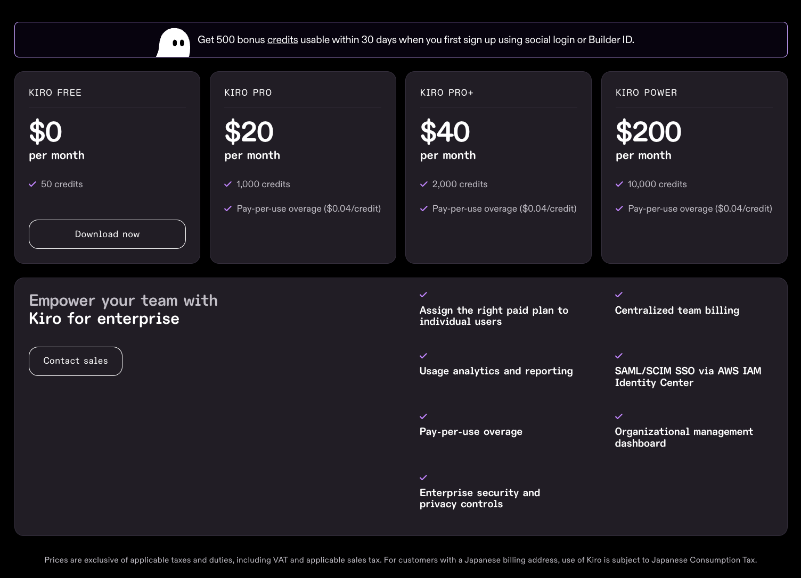

### Step 1: Create a Kiro profile

Create a Kiro profile in the AWS Console in the N.Virginia region.

**1.** Navigate to the [Kiro Console](https://us-east-1.console.aws.amazon.com/amazonq/developer/home) in the AWS Console.

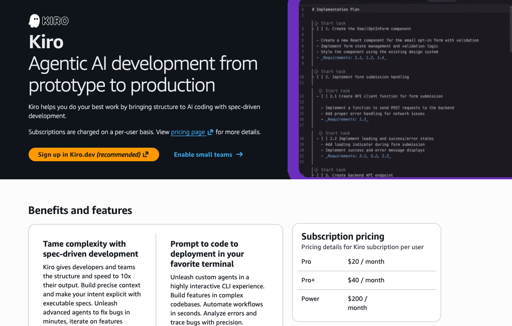

**2.** Click **Enable small teams**. This feature allows you to register new Kiro users and link subscription plans.

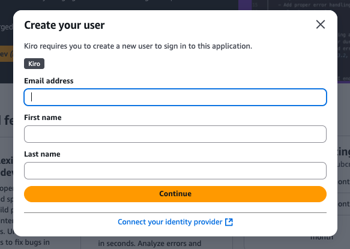

**3.** Enter the user information:
- **Email address**: Enter accurately (required for subsequent steps)
- **First name**
- **Last name**

**4.** Enter the user information and click **Continue**.

**5.** Select the Kiro subscription plan to assign to this user. Select **Kiro Pro** and click **Continue**.

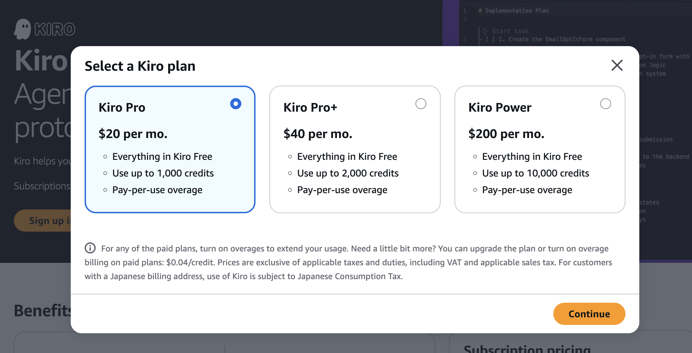

**6.** Click **Enable and Subscribe**.

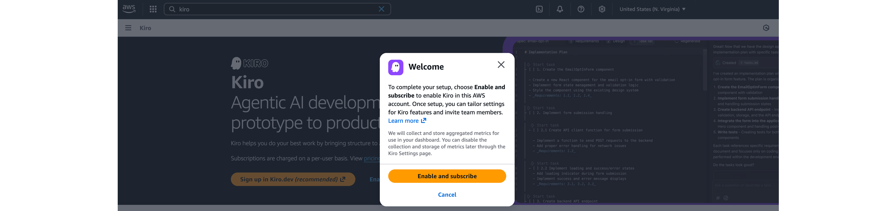

### Step 2: Configure Multi-Factor Authentication (MFA)

Configure the MFA policy for the IAM Identity Center organization instance that was set up when creating the Kiro profile.

**7.** Navigate to the [AWS IAM Identity Center Console](https://us-east-1.console.aws.amazon.com/singlesignon/home) in N.Virginia.

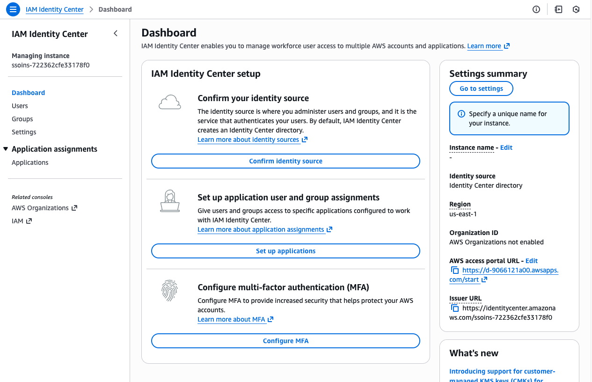

**8.** Click **Configure MFA**.

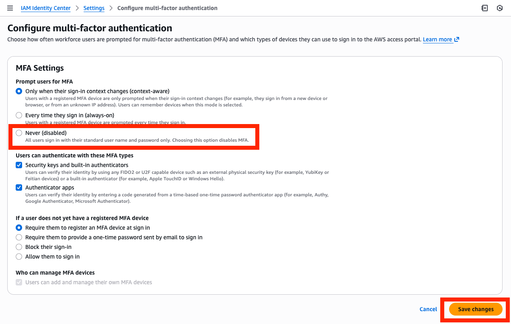

**9.** For this lab, we will skip the MFA authentication process. Select **Never** for the **Prompt users for MFA** attribute and save.

> [!WARNING]
> **Production environment recommendation**
> In production environments, it is recommended to configure multi-factor authentication policies in the IAM Identity Center organization instance for enhanced security.

### Step 3: Email verification and subscription confirmation

Accept the invitation sent to your registered email and activate your subscription.

**10.** Click the **Accept invitation** button in the invitation email sent to your registered email address.

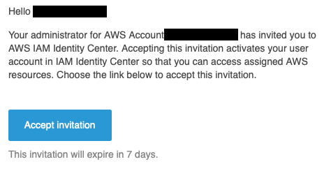

> [!NOTE]
> **Important information**
> The invitation email provides information needed to log in as a Kiro IDE organization user. Make note of the following:
> - **Your AWS access portal URL**

**11.** Set a password for the new user.

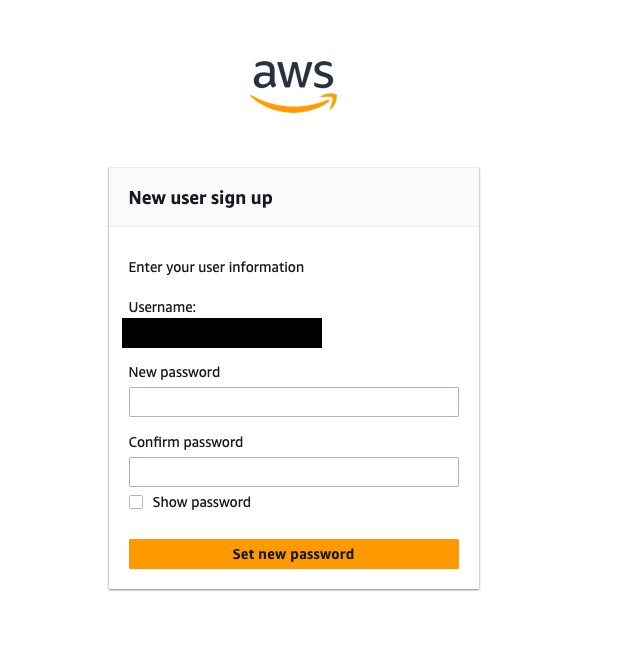

**12.** You will be redirected to the AWS access portal. This is the process to authorize this user to access the Kiro service.


### Verify the subscription

**13.** Return to the [Kiro Console](https://us-east-1.console.aws.amazon.com/amazonq/developer/home).

**14.** Check the **Users & Groups** > **Users** tab in the left menu.

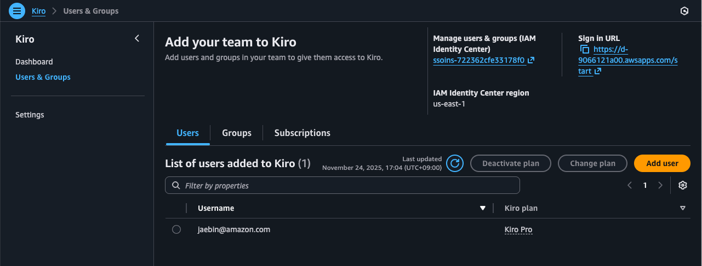

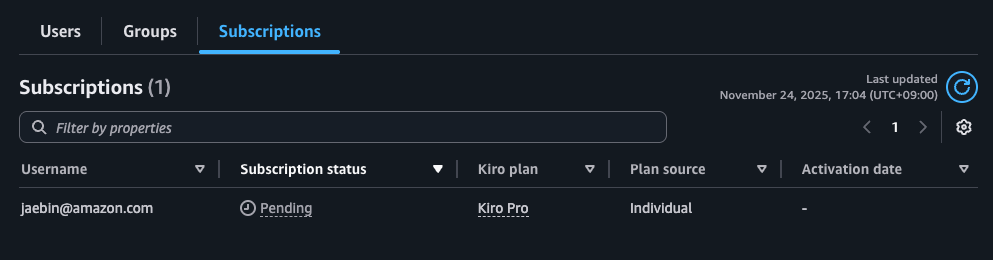

You can see the user currently registered with the Kiro Pro plan. Verify that it matches the information you provided.

> [!NOTE]
> **Subscription activation timing**
> A Kiro subscription in **Pending** status will change to **Active** status after first use.

</details>

<details>
<summary>Connect to Kiro IDE over NICE DCV (workshop-hosted environment)</summary>

### What is Amazon DCV?

[Amazon DCV](https://aws.amazon.com/hpc/dcv/) is a high-performance remote desktop protocol that enables secure access to graphics workstations in cloud environments. In this workshop, DCV is used to connect to the environment where Kiro IDE is installed.

### Connect to Kiro IDE

**1.** Navigate to the **CloudFormation** service in the AWS Console.

**2.** Select the workshop stack and click the **Outputs** tab.

**3.** Note the following values:

| Output Key | Description |
|------------|-------------|
| **KiroIDEURL** | Kiro IDE access URL (DCV web client) |
| **Password** | Login password |

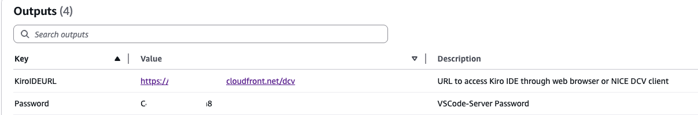

**4.** Copy the **KiroIDEURL** value and open it in a new browser tab.

**5.** When the DCV login screen appears, enter the following information:

- **Username**: `ec2-user`
- **Password**: The **Password** value from CloudFormation Output

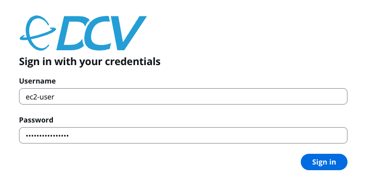

**6.** After login, the desktop environment will be displayed.

**7.** Find and click the **Kiro IDE** icon in the app list or on the desktop to launch it.

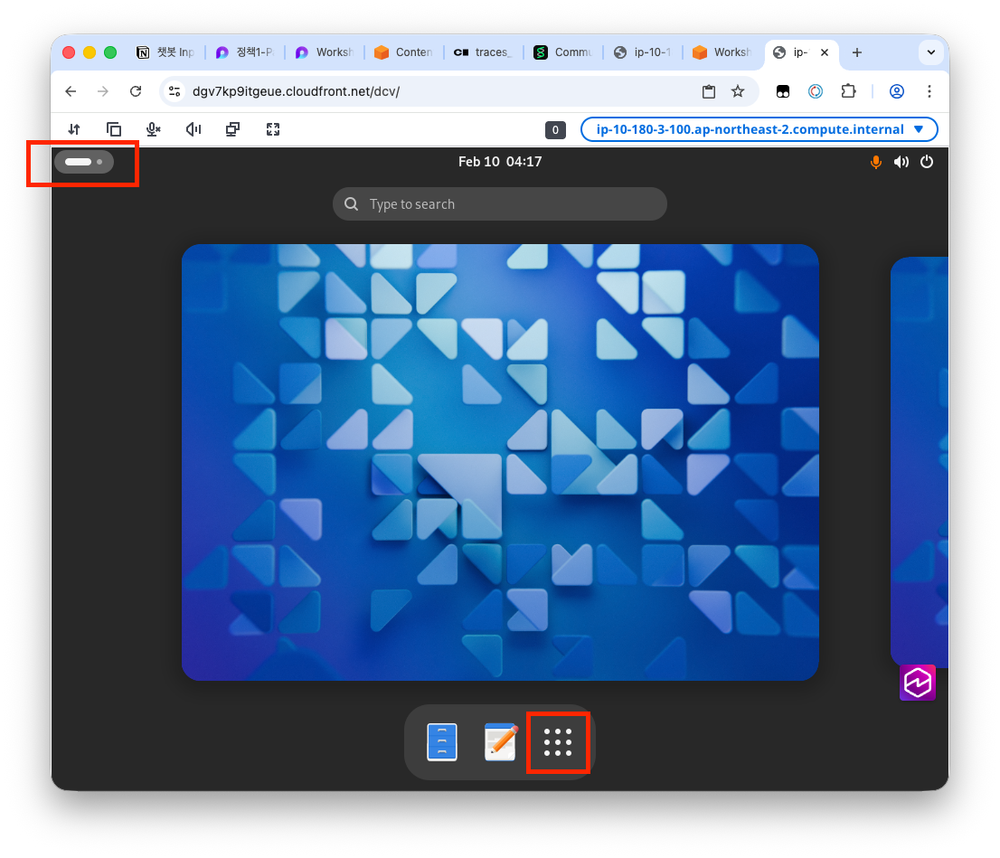

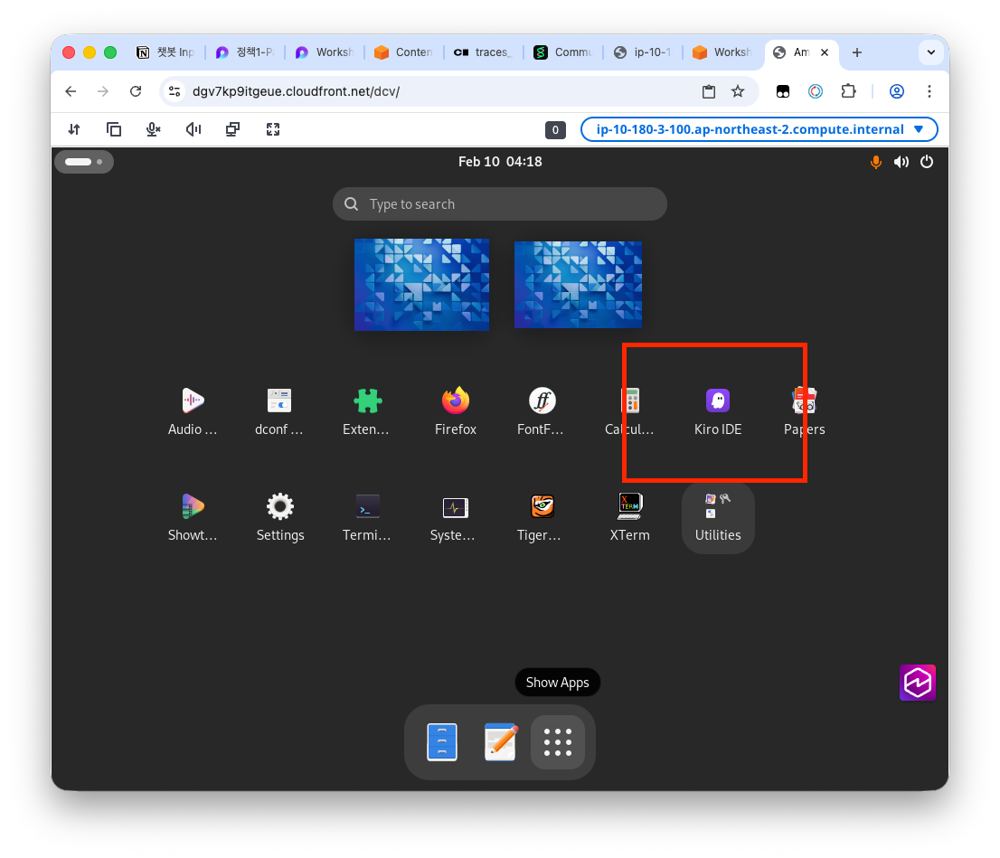

### Kiro IDE initial setup

**8.** When Kiro IDE launches, click **Sign in** and select the **Your organization** option to log in.

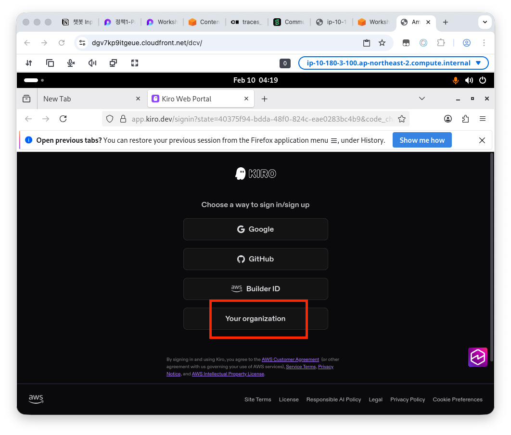

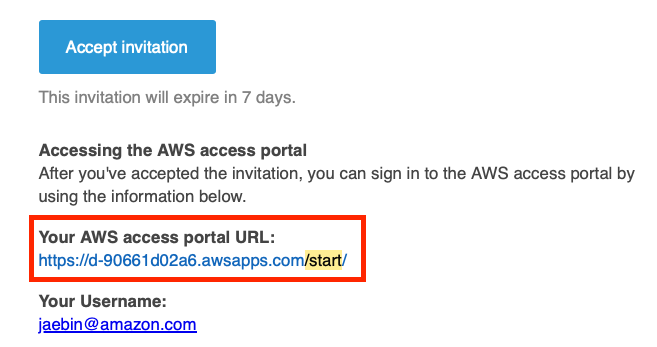

- Start URL: Check the email you received during the organization invitation process for the Start URL information.

**9.** Once signed in, the Kiro IDE main screen will be displayed.

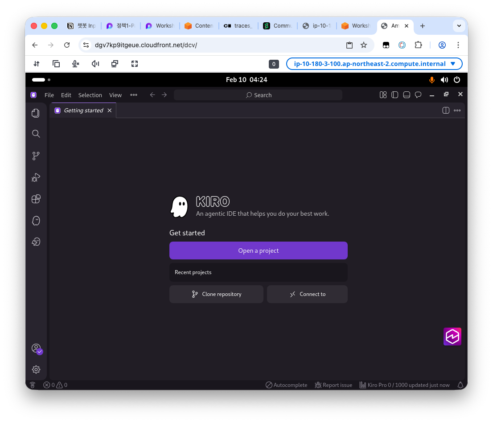

> [!WARNING]
> **Troubleshooting connection issues**
> If DCV connection fails:
> 1. Verify the CloudFormation stack is in `CREATE_COMPLETE` state
> 2. Check that the DCV port (8443) is open in the security group
> 3. Ensure browser popup blocking is disabled

### Open the workshop project

**10.** In Kiro IDE, select **File** > **Open Folder**.

**11.** Select the workshop lab directory.

```text
/home/ec2-user/workspace/my-workspace/dev
```

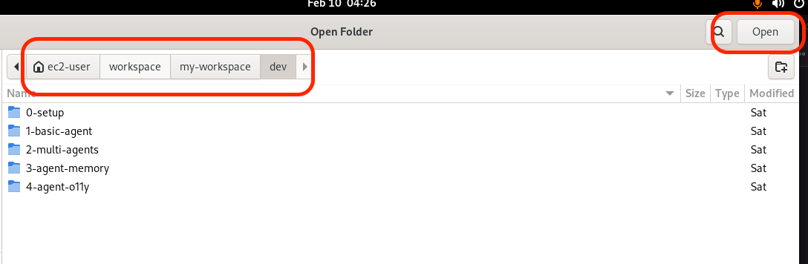

**12.** Once the project opens, you can see the file structure in the left Explorer.

</details>

---

## Set up the development environment

Configure an environment for Strands Agents development using Kiro's **Power** and **Steering** features.

### What is a Kiro Power?

Power is a package in Kiro that bundles MCP (Model Context Protocol) servers, documentation, and workflow guides. It extends AI capabilities tailored to specific domains or technology stacks.

**Components of a Power**

- **MCP servers**: Connect to external tools and data sources
- **Documentation (POWER.md)**: Domain knowledge and usage guides
- **Steering files**: Detailed instructions for specific workflows

### Install the Strands Agents Power

**1.** Open the **Command Palette** in Kiro IDE (`Cmd+Shift+P` or `Ctrl+Shift+P`).

**2.** Search for and run `View: Show Powers`.

**3.** Click **Browse Powers** in the Powers panel.

**4.** Find the **Build an agent with Strands** Power in the Available window.

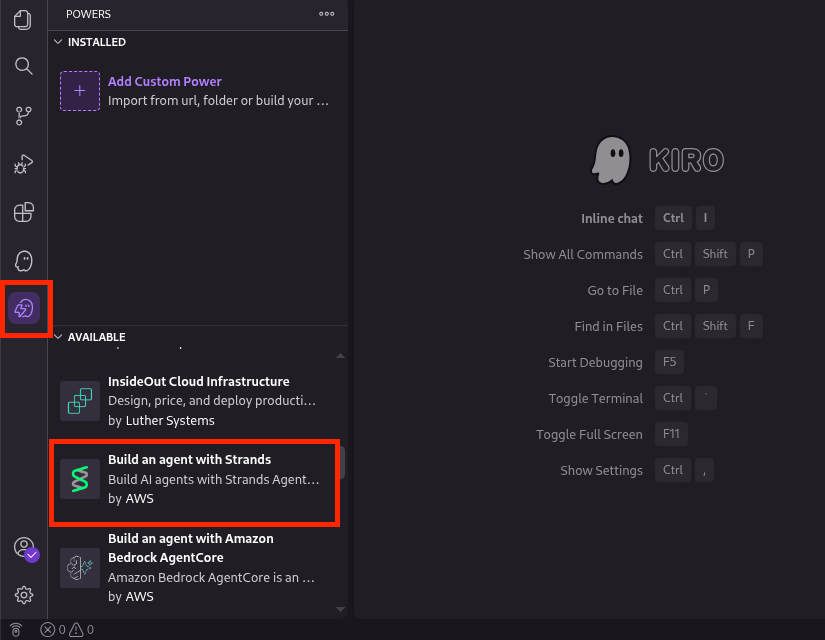

**5.** Click the **Install** button to install the Power.

> [!NOTE]
> **Verify Power installation**
> Installed Powers are saved in the `.kiro/powers/` directory. You can verify them in the **Installed** tab of the Powers panel.

### Steering rules

Steering defines rules and context that Kiro AI should follow when generating code. A Steering file is a markdown file under `.kiro/steering/` with a small frontmatter block. With `inclusion: always`, Kiro loads the file into context on every request in that workspace, so the rules apply without you restating them in each prompt.

This repository already ships the Steering file for the lab at [`.kiro/steering/strands-dev.md`](.kiro/steering/strands-dev.md). It is written in Korean, since that is what the workshop used. Its key rules are:

**Working directory**

> Create code artifacts under `08-kiro-dev/labs/`.

> [!NOTE]
> This rule is what makes Kiro write the generated agent into `08-kiro-dev/labs/` rather than wherever it likes. If you open Kiro on a different folder, adjust the path so it stays relative to your workspace root.

**Code style**

> - Use Python 3.11+ syntax
> - Type hints are mandatory
> - Use Google style for docstrings

**Strands SDK rules**

> - Always specify `system_prompt` when creating an Agent
> - Use the `@tool` decorator for tool functions
> - Use Amazon Bedrock Claude models
> - Develop accurately by referencing the Strands SDK documentation provided by MCP tools

**Model configuration**

> - Default model: `us.anthropic.claude-sonnet-4-20250514-v1:0`
> - Region: `us-west-2`

**Error handling**

> - Wrap all agent calls with try-except
> - Use the strands built-in logger for logging

**OTLP trace generation**

> - Use the Strands SDK Otel extension to send OTLP traces.
> - OTLP Receiver address (`OTEL_EXPORTER_OTLP_ENDPOINT`) = `"http://localhost:4318"`

The file closes with a basic example that fixes the shape of the generated code:

```python
import os
from strands import Agent
from strands.tools import tool
from strands.telemetry import StrandsTelemetry

os.environ["OTEL_EXPORTER_OTLP_ENDPOINT"] = "<OTLP Receiver Endpoint>"

strands_telemetry = StrandsTelemetry()
strands_telemetry.setup_otlp_exporter()

@tool
def my_tool(param: str) -> str:
    """Tool description"""
    return result

agent = Agent(
    model="us.anthropic.claude-sonnet-4-20250514-v1:0",
    system_prompt="You are a helpful AI assistant.",
    name="<adequate name>",
    tools=[my_tool]
)

response = agent("Hello World!")
```

> [!NOTE]
> The OTLP endpoint `http://localhost:4318` is the local collector from [04. Observability with Strands](../04-observability/README.md). If you are not running that collector, the generated agent still works, the traces simply have nowhere to go. Start the Jaeger container from chapter 04 first if you want to see the traces.

If you want to write the Steering file from scratch instead of using the one in this repo, create `.kiro/steering/` in the project root, add `strands-dev.md`, and give it frontmatter of:

```markdown
---
inclusion: always
---
```

followed by the rules above.

### MCP server configuration

Kiro reads workspace MCP servers from `.kiro/settings/mcp.json`. The file in this repository, [`.kiro/settings/mcp.json`](.kiro/settings/mcp.json), ships as an empty placeholder:

```json
{
  "mcpServers": {
  }
}
```

Fill it in with the `strands-docs` server so Kiro can look up Strands Agents documentation while it writes code:

```json
{
  "mcpServers": {
    "strands-docs": {
      "command": "uvx",
      "args": ["strands-agents-mcp-server"],
      "env": {
        "FASTMCP_LOG_LEVEL": "ERROR"
      },
      "disabled": false,
      "autoApprove": ["search_docs", "fetch_doc"]
    }
  }
}
```

This configures a single server, `strands-docs`, launched on demand with `uvx strands-agents-mcp-server`. It gives Kiro two tools over the Strands Agents documentation: `search_docs` to find relevant pages and `fetch_doc` to read one. Both are listed in `autoApprove`, so Kiro calls them without asking for confirmation each time. This is what makes the Steering rule "develop accurately by referencing the Strands SDK documentation provided by MCP tools" enforceable: Kiro can check the current API instead of guessing.

Restart Kiro IDE, or run `Kiro: Reconnect MCP Servers` from the Command Palette, to pick up the change.

---

## Vibe coding lab

### Generate the Tower of Hanoi agent

With the Power installed, the Steering rules in place, and the MCP server connected, ask Kiro to build an agent. Enter the following in the Kiro chat window:

```text
Create an Agent using Strands SDK that solves the Tower of Hanoi puzzle.
```

Kiro reads `.kiro/steering/strands-dev.md`, looks up the SDK through the `strands-docs` MCP server, and writes the agent into `08-kiro-dev/labs/hanoi_tower.py`. If Kiro generates code that follows the Steering rules, your environment is configured correctly.

Review what it produced, then run it:

```bash
uv run --project 00-setup python 08-kiro-dev/labs/hanoi_tower.py
```

The reference output for this prompt is in [`completed/hanoi_tower.py`](completed/hanoi_tower.py). It defines five `@tool` functions (`initialize_hanoi`, `move_disk`, `get_current_state`, `check_solution`, `get_hint`) over a shared puzzle state, creates an agent named `hanoi_tower_solver` with the model and system prompt required by the Steering rules, wraps the invocation in try-except, and sets up the OTLP exporter to `http://localhost:4318`. Compare it against yours: the structure should match the Steering rules even though the details will differ.

With the chapter 04 collector running, the agent's tool calls show up as spans:

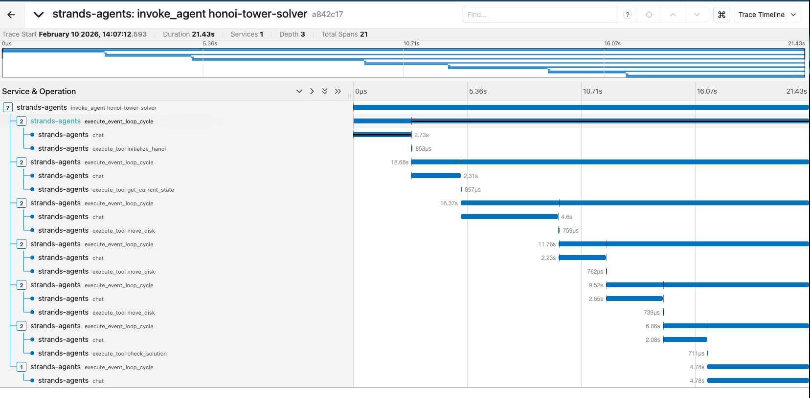

### Free practice

Now experience **Vibe Coding** on code you already wrote. Select one of the files from previous chapters and improve it with Kiro.

| Chapter | File | Improvement ideas |
|---------|------|-------------------|
| **01** | `01-single-agent/labs/custom_tool1.py` | Error handling, logging |
| **02** | `02-multi-agents/labs/agents_as_tools.py` | Add new agent |
| **03** | `03-chatbot-app/labs/streamlit_app.py` | UI improvements |
| **04** | `04-observability/labs/traces_otlp.py` | Custom metrics |
| **05** | `05-agent-memory/labs/stm_persistence.py` | Print summary at end of conversation |

> [!TIP]
> Type `#` in the chat to specify a file or folder as context. Example: `#custom_tool1.py`

**01 - Single agent**
```text
#custom_tool1.py Analyze this code. Are there any areas that can be improved?
```

**02 - Multi agents**
```text
#agents_as_tools.py Add a new expert agent
```

**03 - Application**
```text
#streamlit_app.py Improve the UI and add conversation history saving
```

**04 - Observability**
```text
#traces_otlp.py Add custom metrics
```

**05 - Agent memory**
```text
#stm_persistence.py Print a summary of the conversation when it ends
```

---

## Cleanup

Kiro itself creates no AWS resources, but the subscription and the model calls are billable.

- A **Kiro Pro** subscription is $20/month per user. If you created one only for this workshop, remove the user's subscription in the [Kiro Console](https://us-east-1.console.aws.amazon.com/amazonq/developer/home) under **Users & Groups** when you are done, or downgrade to the Free tier.
- If you created an **IAM Identity Center** organization instance solely for the Kiro profile, and you do not need it, delete it.
- The agent Kiro generates calls **Amazon Bedrock** on each run and is billed per token like every other chapter.
- The workshop's EC2 instance running Kiro IDE and DCV is billed while it is running. In the AWS-hosted workshop environment it is removed with the CloudFormation stack.

---

## References

- [Kiro Official Site](https://kiro.dev/)
- [Kiro Documentation](https://kiro.dev/docs/)
- [Strands Agents SDK](https://strandsagents.com/docs/)
- [Amazon DCV](https://aws.amazon.com/hpc/dcv/)

---

You have completed all chapters of the workshop. Experiment freely with Kiro and build your own AI agents.

---
Prev: [AgentCore Observability](../07-agentcore-observability/README.md) | Back to [workshop overview](../README.md)
