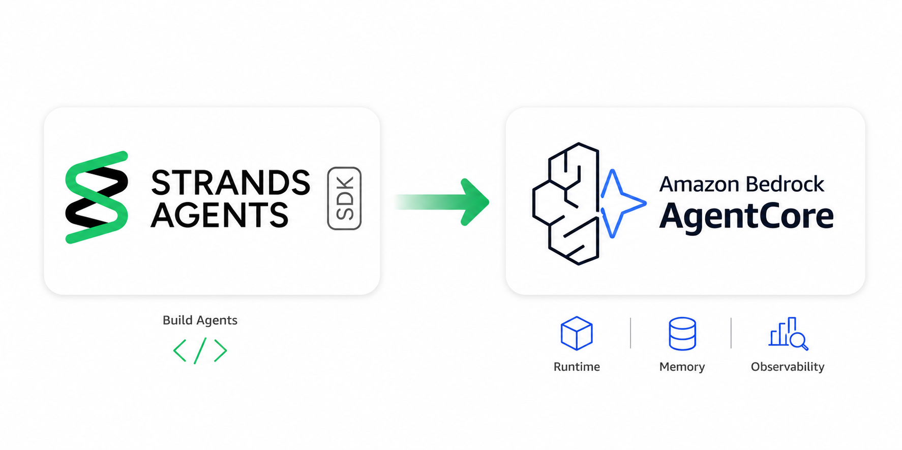
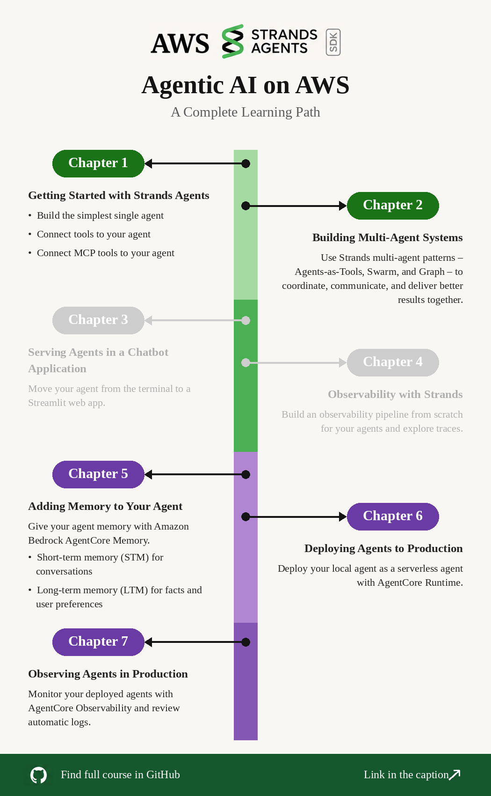

<h1 align="center">Agentic AI on AWS Workshop</h1>

<p align="center"><a href="README.ko.md">한국어</a> | <a href="README.md">English</a></p>

[Strands Agents SDK](https://strandsagents.com/docs/)로 AI 에이전트를 처음부터 만들고, [Amazon Bedrock AgentCore](https://aws.amazon.com/ko/bedrock/agentcore/)로 배포·운영하는 과정을 다루는 핸즈온 워크샵입니다.

<!--  -->
<p align="center">
  
</p>

- **학습 방법:** 각 챕터는 `labs/` 폴더와 `completed/` 폴더로 구성됩니다. `labs/`의 빈 파일에 직접 코드를 작성하고, `completed/`의 완성된 코드와 비교하면서 학습합니다.

- **레벨:** 100~200 (입문~중급). 에이전트나 LLM 사전 경험이 없어도 진행할 수 있습니다.

- **소요 시간:** 필수 챕터 기준 약 2시간, 8개 챕터 전체는 약 3시간 소요됩니다. 

---

## 📚 학습 내용

- **Strands Agents SDK**: Prompt, Model, Tools로 에이전트를 만들고 커스텀 도구와 MCP 서버로 확장합니다
- **검색(RAG)**: Amazon Bedrock Knowledge Base를 `retrieve` 도구로 조회합니다
- **멀티 에이전트**: Agents-as-Tools, Swarm, Graph 패턴과 각각의 선택 기준을 다룹니다
- **메모리**: Amazon Bedrock AgentCore Memory로 단기·장기 메모리를 구성합니다
- **배포**: 코드 4줄을 추가해 로컬 에이전트를 AgentCore Runtime의 서버리스 에이전트로 배포합니다
- **관측(Observability)**: 에이전트 메트릭·로그·OpenTelemetry 트레이스를 직접 구성하는 방법과 CloudWatch GenAI Observability로 확인하는 방법을 모두 다룹니다

---

## 🗂️ 챕터 구성

| # | 챕터 | 내용 | ⏱️ 소요 시간 | 📊 난이도 | 구분 |
|---|------|------|--------------|-----------|------|
| 00 | [환경 설정](dev/00-setup/README.ko.md) | Python 환경, AWS 자격 증명, Bedrock 모델 액세스 | 10분 |  | 필수 |
| 01 | [단일 에이전트](dev/01-single-agent/README.ko.md) | Prompt·Model·Tools 기본 구성, Bedrock Knowledge Base, MCP 도구, 자가개선 에이전트 | 30분 |  | 필수 |
| 02 | [멀티 에이전트 패턴](dev/02-multi-agents/README.ko.md) | Agents-as-Tools, Swarm, Graph | 30분 |  | 필수 |
| 03 | [챗봇 애플리케이션](dev/03-chatbot-app/README.ko.md) | Streamlit 채팅 UI, 스트리밍 응답, 도구 호출 시각화 | 10분 |  | 선택 |
| 04 | [Strands Observability](dev/04-observability/README.ko.md) | 메트릭, 로그, OTLP 트레이스와 로컬 Jaeger | 30분 |  | 선택 |
| 05 | [에이전트 메모리](dev/05-agent-memory/README.ko.md) | AgentCore Memory 단기·장기 메모리 | 30분 |  | 필수 |
| 06 | [AgentCore Runtime](dev/06-agentcore-runtime/README.ko.md) | 에이전트 서버리스 배포 | 20분 |  | 필수 |
| 07 | [AgentCore Observability](dev/07-agentcore-observability/README.ko.md) | CloudWatch GenAI Observability 대시보드 | 10분 |  | 필수 |
| 08 | [Kiro IDE로 개발하기](dev/08-kiro-dev/README.ko.md) | Steering, MCP 설정, 스펙 기반 개발 | 10분 |  | 선택 |

> [!IMPORTANT]
> 01, 02, 05, 06, 07 챕터가 핵심 경로입니다. 03, 04, 08 챕터는 독립적으로 구성되어 있어 건너뛸 수 있습니다. 챕터 간 의존성은 하나뿐입니다. 07 챕터는 06 챕터에서 배포한 에이전트의 텔레메트리를 확인하는 실습입니다.

---

## 🚀 빠르게 시작하기

**사전 요구사항**

- Amazon Bedrock 호출과 AgentCore 리소스 생성이 가능한 권한의 AWS 계정
- `us-west-2` 리전에서 아래 표의 Anthropic Claude 모델 액세스 활성화
- Python 3.12
- [uv](https://docs.astral.sh/uv/getting-started/installation/)
- Docker (04, 06 챕터에만 필요)
- AWS CLI 설정 완료 (`aws configure`), 기본 리전 `us-west-2`

**설치**

```bash
git clone https://github.com/aws-samples/sample-aws-agentic-ai-workshop.git
cd sample-aws-agentic-ai-workshop/00-setup
uv sync
cd ..
```

**첫 에이전트 실행**

```bash
uv run --project 00-setup python 01-single-agent/completed/basic.py
```

에이전트 응답이 출력되면 환경 준비가 끝났습니다. 자세한 설정 안내는 [00-setup/README.ko.md](dev/00-setup/README.ko.md)를 참고하고, [01 챕터](dev/01-single-agent/README.ko.md)부터 실습을 시작하세요.

---

## 🤖 사용 모델과 리전

모든 실습은 **`us-west-2`** 리전의 Amazon Bedrock을 사용합니다. 시작 전에 아래 모델의 액세스를 활성화하세요.

| 모델 ID | 사용 위치 |
|---|---|
| `us.anthropic.claude-sonnet-4-20250514-v1:0` | 01~06 챕터 |
| `us.anthropic.claude-sonnet-4-6` | 01 챕터 자가개선 에이전트 실습, 02 챕터 |
| `us.amazon.nova-pro-v1:0` | 04 챕터 메트릭 실습 |

[Bedrock 콘솔](https://us-west-2.console.aws.amazon.com/bedrock/home?region=us-west-2#/modelaccess)의 **Model access**에서 활성화합니다. `us.` 접두사가 붙은 모델 ID는 교차 리전 추론 프로파일이며, 프로파일 대상 리전의 액세스는 콘솔에서 함께 처리됩니다.

---

## 🛠️ 사용 기술과 서비스

| 기술 | 용도 | 사용 챕터 | 문서 |
|---|---|---|---|
| **Strands Agents SDK** | 에이전트 프레임워크 | 전체 | [문서](https://strandsagents.com/docs/) |
| **Amazon Bedrock** | 관리형 모델 추론 | 전체 | [문서](https://docs.aws.amazon.com/bedrock/) |
| **Bedrock Knowledge Bases** | 관리형 RAG | 01 | [문서](https://docs.aws.amazon.com/bedrock/latest/userguide/knowledge-base.html) |
| **Model Context Protocol** | 도구 연동 표준 | 01, 08 | [문서](https://modelcontextprotocol.io/docs/getting-started/intro) |
| **AWS MCP 서버** | AWS용 사전 제공 MCP 서버 | 01, 08 | [문서](https://awslabs.github.io/mcp/) |
| **Streamlit** | 채팅 UI | 03, 05 | [문서](https://docs.streamlit.io/) |
| **OpenTelemetry, ADOT, Jaeger** | 트레이스 수집과 확인 | 04 | [문서](https://opentelemetry.io/docs/) |
| **AgentCore Memory** | 에이전트 단기·장기 메모리 | 05 | [문서](https://docs.aws.amazon.com/bedrock-agentcore/latest/devguide/memory.html) |
| **AgentCore Runtime** | 서버리스 에이전트 호스팅 | 06 | [문서](https://docs.aws.amazon.com/bedrock-agentcore/latest/devguide/agents-tools-runtime.html) |
| **AgentCore Observability** | CloudWatch GenAI Observability | 07 | [문서](https://docs.aws.amazon.com/bedrock-agentcore/latest/devguide/observability.html) |
| **uv** | Python 환경·의존성 관리 | 전체 | [문서](https://docs.astral.sh/uv/) |
| **Kiro** | AI 기반 IDE | 08 | [문서](https://kiro.dev/docs/) |

---

## 📁 레포지토리 구조

```
sample-aws-agentic-ai-workshop/
├── 00-setup/                     # 환경 설정, uv 프로젝트, 의존성
│   ├── pyproject.toml
│   ├── uv.lock
│   └── create-uv-env.sh
├── 01-single-agent/
│   ├── labs/                     # 직접 작성하는 파일
│   ├── completed/                # 완성된 참고 코드
│   └── README.md
├── 02-multi-agents/
├── 03-chatbot-app/
├── 04-observability/
│   └── docker/                   # OTel Collector + Jaeger
├── 05-agent-memory/
├── 06-agentcore-runtime/
├── 07-agentcore-observability/   # 콘솔 실습 전용, README만 존재
├── 08-kiro-dev/
│   └── .kiro/                    # steering 규칙과 MCP 설정
└── docs/images/                  # 챕터 README에서 참조하는 스크린샷
```

모든 챕터 폴더는 동일한 구조를 따릅니다.

```
NN-chapter/
├── README.md        # 영문 실습 가이드
├── README.ko.md     # 한글 실습 가이드
├── labs/            # 빈 파일, 직접 코드를 작성합니다
└── completed/       # 참고 답안, 막히면 실행해 보세요
```

---

## 💰 비용과 리소스 정리

실습은 Bedrock 모델을 호출하며, 일부 챕터는 존재하는 동안 계속 과금되는 AWS 리소스를 생성합니다.

| 챕터 | 생성되는 리소스 |
|---|---|
| 01 | Bedrock Knowledge Base, OpenSearch Serverless 컬렉션, S3 버킷 |
| 05 | AgentCore Memory 리소스 |
| 06 | AgentCore Runtime, ECR 리포지토리, IAM 실행 역할, CloudWatch 로그 그룹 |
| 07 | CloudWatch Transaction Search 수집, 트레이스·로그 보관 |

> [!WARNING]
> 각 챕터에는 **리소스 정리** 섹션이 있습니다. 실습을 마치면 특히 01, 05, 06 챕터의 정리 단계를 반드시 수행하세요. 특히 OpenSearch Serverless 컬렉션은 조회하지 않아도 계속 과금됩니다.

---

## 🐛 트러블슈팅

여러 챕터에서 공통으로 겪는 문제들입니다. 챕터별 고유 문제는 각 챕터의 트러블슈팅 섹션을 참고하세요: [00](00-setup/README.ko.md#트러블슈팅), [01](01-single-agent/README.ko.md#트러블슈팅), [02](02-multi-agents/README.ko.md#트러블슈팅), [03](03-chatbot-app/README.ko.md#트러블슈팅), [04](04-observability/README.ko.md#트러블슈팅), [05](05-agent-memory/README.ko.md#트러블슈팅), [06](06-agentcore-runtime/README.ko.md#트러블슈팅).

| 증상 | 원인과 해결 |
|---|---|
| `uv: command not found` | 설치 스크립트가 바이너리를 `~/.local/bin`에 둡니다. 새 셸을 열거나 `export PATH="$HOME/.local/bin:$PATH"`를 실행하세요. |
| `strands` 또는 `bedrock_agentcore` `ModuleNotFoundError` | 시스템 Python으로 실행하고 있습니다. `uv run --project 00-setup python ...`을 쓰거나 `00-setup/.venv`를 활성화하세요. |
| 모델 호출 시 `AccessDeniedException` | 해당 모델 ID의 `us-west-2` 액세스가 없거나 자격 증명에 `bedrock:InvokeModel` 권한이 없습니다. [모델 액세스 페이지](https://us-west-2.console.aws.amazon.com/bedrock/home?region=us-west-2#/modelaccess)를 확인하세요. |
| 리전 관련 `ValidationException` 또는 모델을 찾을 수 없음 | 기본 리전이 `us-west-2`가 아닙니다. `aws configure get region`으로 확인하세요. |
| 04, 06 챕터에서 `Cannot connect to the Docker daemon` | Docker Desktop(또는 Finch, Podman)을 실행하고 `docker info`로 확인한 뒤 다시 실행하세요. |
| 메모리 생성 직후 호출 실패 (05 챕터) | 새로 만든 AgentCore Memory가 `ACTIVE`가 되기까지 1~2분 걸립니다. LTM 추출도 비동기로 처리됩니다. 잠시 후 다시 시도하세요. |
| CloudWatch GenAI Observability 대시보드가 비어 있음 (07 챕터) | Transaction Search가 활성화되어 있어야 하고, 06 챕터에서 배포한 에이전트를 최소 1회 호출해야 합니다. |

---

## 📚 참고 자료

**공식 문서**
- [Strands Agents SDK 공식 문서](https://strandsagents.com/docs/)
- [Strands Agents Observability & Evaluation](https://strandsagents.com/docs/user-guide/observability-evaluation/observability/)
- [멀티 에이전트 패턴 가이드](https://strandsagents.com/docs/user-guide/concepts/multi-agent/multi-agent-patterns/)
- [Amazon Bedrock 사용자 가이드](https://docs.aws.amazon.com/bedrock/)
- [Amazon Bedrock AgentCore 개발자 가이드](https://docs.aws.amazon.com/bedrock-agentcore/latest/devguide/)
- [AgentCore 스타터 툴킷](https://aws.github.io/bedrock-agentcore-starter-toolkit/user-guide/runtime/quickstart.html)
- [Model Context Protocol 명세](https://modelcontextprotocol.io/docs/getting-started/intro)
- [AWS MCP 서버](https://awslabs.github.io/mcp/)

**코드와 샘플**
- [Strands Agents SDK 소스](https://github.com/strands-agents/harness-sdk)
- [Strands Agents 기본 제공 도구](https://github.com/strands-agents/tools)
- [Strands Agents 샘플 모음](https://github.com/strands-agents/samples)

## 보안

보안 이슈 제보 방법은 [CONTRIBUTING](CONTRIBUTING.md#security-issue-notifications)을 참고하세요.

## 라이선스

이 코드는 MIT-0 라이선스를 따릅니다. [LICENSE](LICENSE)를 참고하세요.
