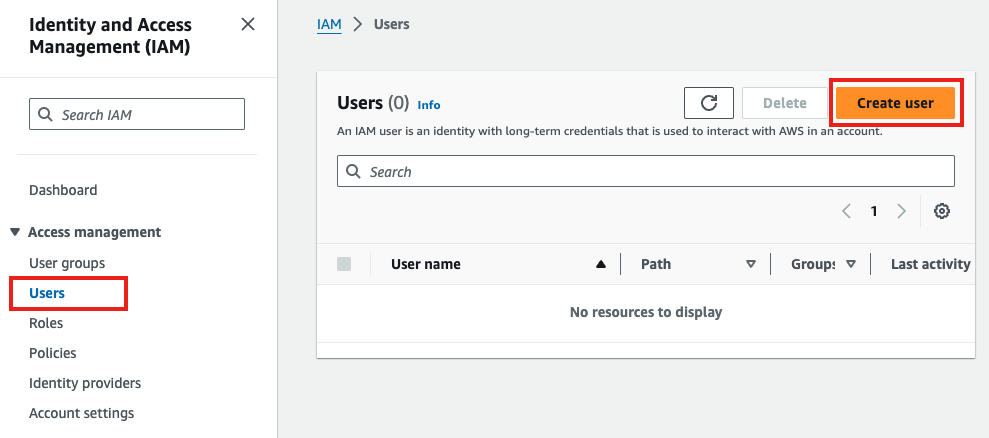
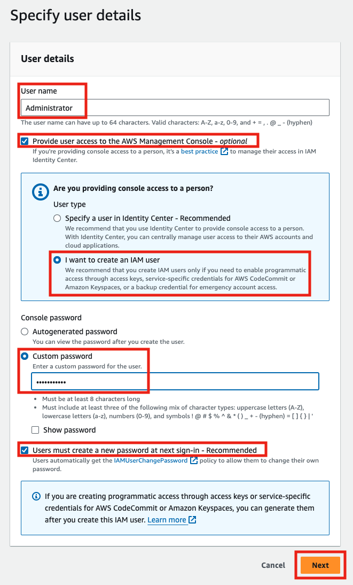
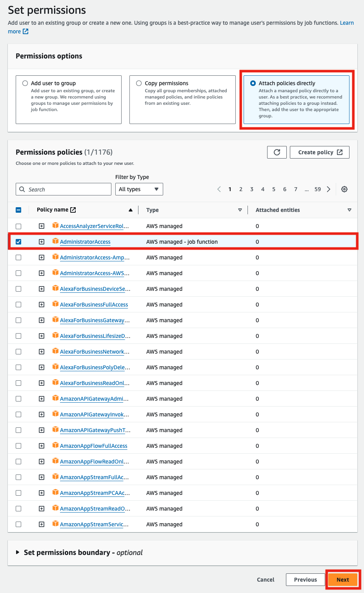
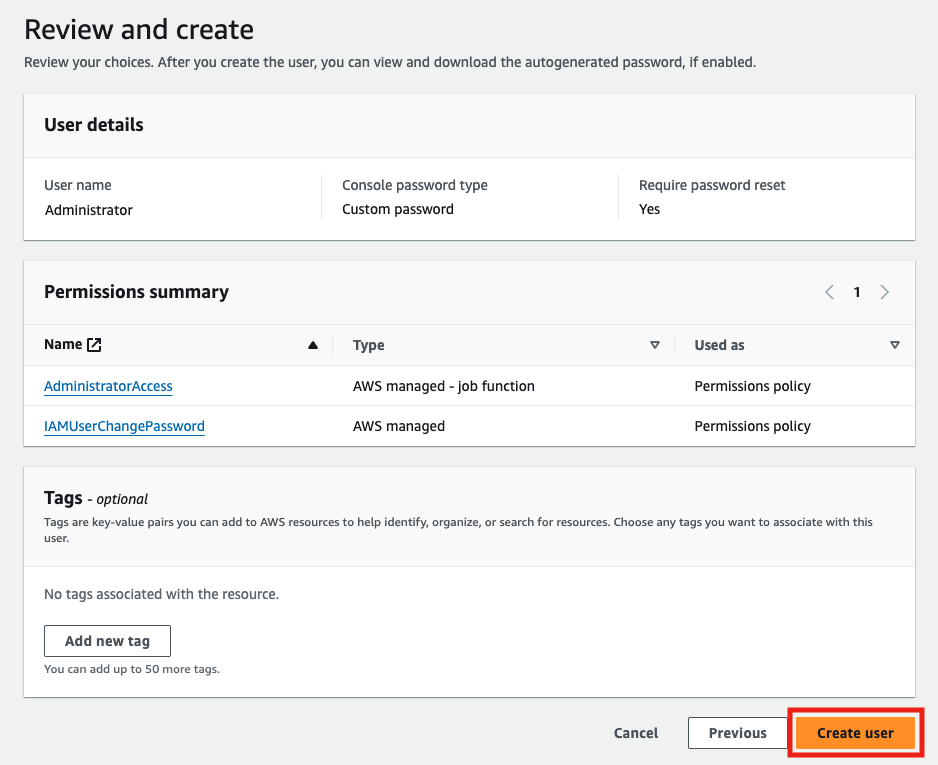
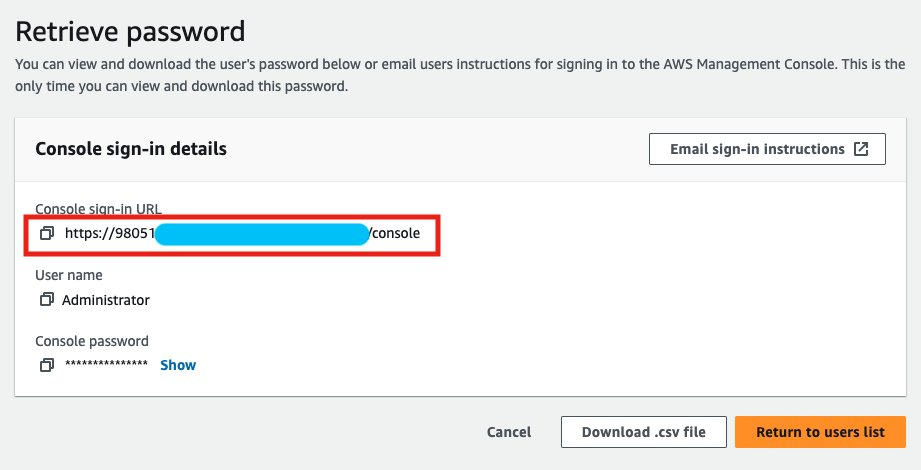
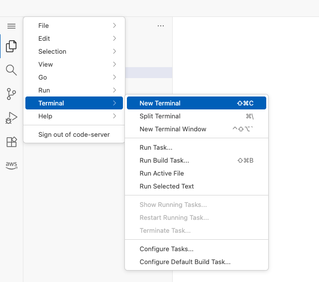
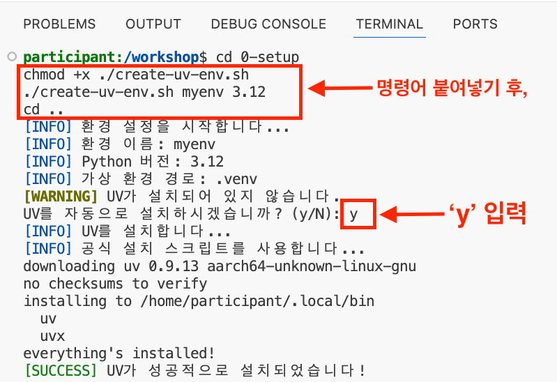
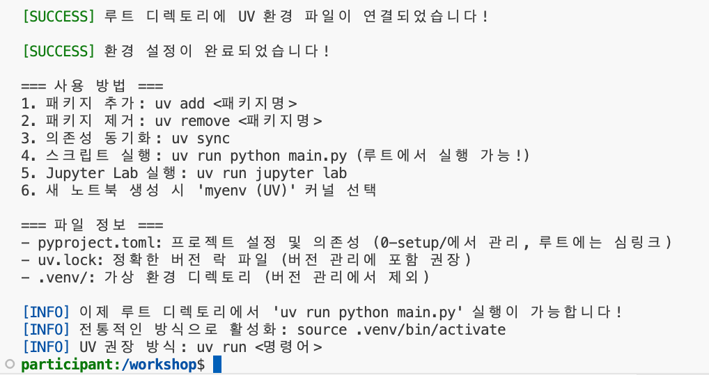

# 00. 환경 설정

[English](README.md) | [한국어](README.ko.md)

이 챕터에서는 이후 모든 챕터에서 사용할 환경을 준비합니다. [uv](https://docs.astral.sh/uv/)로 관리되는 Python 3.12 프로젝트, Amazon Bedrock을 호출할 수 있는 AWS 자격 증명, 그리고 `us-west-2` 리전의 Bedrock 모델 액세스가 필요합니다.

실습에는 AWS 계정이 필요합니다. 환경을 준비하는 방법은 두 가지이며, 둘 중 하나만 수행하면 됩니다. 경로 A는 본인 컴퓨터에서 실습을 실행하는 방법으로, GitHub에서 이 리포지토리를 보고 계신 경우 더 빠른 방법입니다. 경로 B는 CloudFormation으로 AWS에 VS Code Server를 배포하는 방법이며, 강사가 진행하는 워크샵에서 사용하는 환경입니다.


> [!NOTE]
> **실습 진행 방식**
> 이후 모든 챕터에는 `labs/` 폴더와 `completed/` 폴더가 있습니다. `labs/`의 빈 파일에 직접 코드를 작성하고, `completed/`에는 비교하거나 막혔을 때 그대로 실행할 수 있는 정답 코드가 들어 있습니다. 이 챕터에는 실습 파일이 없으며, 환경 설정 스크립트와 의존성 정의만 포함되어 있습니다.

**어떤 경로를 선택할까요**

| 경로 | 이런 경우에 사용합니다 | 소요 시간 |
|---|---|---|
| [경로 A: 본인 컴퓨터](#경로-a-본인-컴퓨터) | 노트북이나 이미 보유한 머신에서 실습을 실행하려는 경우 | 약 10분 |
| [경로 B: AWS에 배포한 VS Code Server](#경로-b-aws에-배포한-vs-code-server) | 강사가 진행하는 워크샵에 참석했거나, 필요한 도구가 미리 설치된 임시 클라우드 환경을 원하는 경우 | 약 30분 (대부분 CloudFormation 대기 시간) |

**이 챕터에서 배우는 내용**

- `uv`로 워크샵 Python 환경을 설치하고 리포지토리 루트에서 실습 파일을 실행하는 방법
- AWS 자격 증명을 설정하고 `us-west-2` 리전에서 Amazon Bedrock 모델 액세스를 활성화하는 방법
- 워크샵 스크립트 `create-uv-env.sh`가 수행하는 작업과, 이 스크립트가 필요하지 않은 경우
- 워크샵 전체에서 사용하는 AWS 서비스와, 실습이 끝난 뒤에도 계속 과금되는 리소스

**예상 소요 시간:** 경로 A는 약 10분, 경로 B는 약 30분

> [!TIP]
> 최신 브라우저라면 문제없이 진행할 수 있으나, 워크샵 스크린샷과 code-server UI는 **Mozilla Firefox** 및 **Google Chrome**에서 호환성이 검증되었습니다.

## 이 챕터의 파일

| 파일 | 용도 |
|---|---|
| `pyproject.toml` | uv 프로젝트 정의. Python `>=3.12`와 실습에 필요한 모든 의존성 |
| `uv.lock` | `pyproject.toml`의 고정된 해석 결과. `uv sync`가 실습 제작 시점과 동일한 버전을 설치합니다 |
| `.python-version` | uv가 사용할 Python 버전을 `3.12`로 고정 |
| `create-uv-env.sh` | 워크샵 환경 설정 스크립트. AWS에 배포한 VS Code Server(경로 B)를 기준으로 작성되었습니다 |
| `install_korean_font.sh` | 나눔 폰트를 설치하고 matplotlib이 이를 사용하도록 설정합니다. 선택 사항이며 Linux 기준입니다 |
| `test_korean_font.py` | 한글 라벨이 포함된 차트를 그려 폰트 설정을 확인하고 `korean_font_test.png`를 저장합니다 |

## 경로 A: 본인 컴퓨터

### 1. 사전 준비 사항

- **Python 3.12.** `pyproject.toml`은 `>=3.12`를 요구하고 `.python-version`은 `3.12`로 고정되어 있습니다. 직접 설치하지 않아도 되며, 머신에 해당 버전이 없으면 uv가 알맞은 인터프리터를 내려받습니다.
- **uv.** macOS 또는 Linux에서는 다음과 같이 설치합니다.

  ```bash
  curl -LsSf https://astral.sh/uv/install.sh | sh
  ```

  Windows 및 다른 설치 방법은 [uv 설치 가이드](https://docs.astral.sh/uv/getting-started/installation/)를 참고하세요.
- **AWS 계정.** Amazon Bedrock을 호출하고 [필요한 IAM 권한](#필요한-iam-권한)에 정리된 리소스를 생성할 수 있는 권한이 있어야 합니다.
- **AWS CLI 설정.** 해당 계정의 자격 증명이 구성되어 있고 기본 리전이 `us-west-2`여야 합니다.
- **Docker.** [04-observability](../04-observability/README.ko.md)의 OTLP 실습에서만 필요합니다. 그 외에는 사용하지 않습니다.

### 2. AWS 자격 증명 설정

```bash
aws configure
```

**Default region name**을 `us-west-2`로 설정합니다. 리전을 명시하는 실습 코드는 모두 `us-west-2`를 사용하며(예: `05-agent-memory/completed/stm_persistence.py`, `06-agentcore-runtime/completed/deploy_agent.py`), 리전을 명시하지 않는 코드는 AWS 설정에서 결정된 리전을 사용합니다. 기본 리전을 `us-west-2`로 두면 불일치를 피할 수 있습니다.

자격 증명이 정상적으로 인식되는지 확인합니다.

```bash
aws sts get-caller-identity
```

### 3. Amazon Bedrock 모델 액세스 활성화

실습은 `us-west-2` 리전의 Amazon Bedrock을 통해 Anthropic Claude 및 Amazon Nova 모델을 호출합니다. 새 계정에서는 모델 액세스가 기본적으로 비활성화되어 있으므로, Bedrock 콘솔의 **Model access**에서 활성화합니다: [us-west-2 모델 액세스 페이지](https://us-west-2.console.aws.amazon.com/bedrock/home?region=us-west-2#/modelaccess).

실습 코드에서 실제로 사용하는 모델 ID는 다음과 같습니다.

| 모델 ID | 사용하는 파일 |
|---|---|
| `us.anthropic.claude-sonnet-4-20250514-v1:0` | `01-single-agent/completed/models.py`, `04-observability/completed/traces_console.py`, `04-observability/completed/traces_otlp.py`, `08-kiro-dev/completed/hanoi_tower.py` |
| `us.anthropic.claude-sonnet-4-6` | `01-single-agent/completed/self_extending.py`, `01-single-agent/completed/self_modifying.py`, `02-multi-agents/completed/agents_as_tools.py`, `02-multi-agents/completed/swarms.py` |
| `us.amazon.nova-pro-v1:0` | `04-observability/completed/metrics_basic.py` |

`us.` 접두사는 교차 리전 추론 프로파일을 의미합니다. 프로파일의 대상 리전에 대한 액세스 활성화는 콘솔이 함께 처리해 줍니다.

위 표에 없는 실습들은 `Agent()`에 모델을 지정하지 않고 생성하므로 Strands Agents SDK의 기본 Bedrock 모델을 사용합니다. 따라서 표에 없는 챕터를 위해서도 `us-west-2`의 Anthropic Claude 모델 액세스를 활성화해 두시기 바랍니다.

계정에서 사용 가능한 모델 목록은 다음 명령으로 확인할 수 있습니다.

```bash
aws bedrock list-foundation-models --region us-west-2 --output table --query "modelSummaries[?providerName=='Anthropic'].modelId"
```

> [!NOTE]
> 01 챕터는 Bedrock Knowledge Base용으로 `amazon.titan-embed-text-v2:0`(Titan Text Embeddings V2)도 필요하며, 05~07 챕터는 Amazon Bedrock AgentCore를 사용합니다. 각 챕터의 안내에 따라 모델 액세스를 활성화하세요.

### 4. Python 환경 설치

```bash
cd 00-setup
uv sync
cd ..
```

`uv sync`는 `pyproject.toml`과 `uv.lock`을 읽어 필요하면 Python 3.12를 내려받고 `00-setup/.venv`에 가상 환경을 만듭니다. `00-setup` 밖의 파일은 건드리지 않습니다.

> [!TIP]
> 본인 컴퓨터에서는 `create-uv-env.sh`를 사용할 필요가 없습니다. 이 스크립트는 워크샵의 VS Code Server 환경을 기준으로 작성되어 `.venv`를 삭제하고, uv와 Node.js를 설치할 수 있으며, `sudo`로 Linux 시스템 폰트를 설치하고, 상위 디렉터리에 심링크를 만듭니다. 자세한 내용은 [create-uv-env.sh가 수행하는 작업](#create-uv-envsh가-수행하는-작업)을 참고하세요.

### 5. 실습 실행

리포지토리 루트에서 `00-setup`의 프로젝트를 지정해 실행합니다.

```bash
uv run --project 00-setup python 01-single-agent/completed/basic.py
```

에이전트 응답이 출력되면 환경과 Bedrock 액세스가 모두 정상입니다.

또는 환경을 한 번 활성화한 뒤 `python`을 그대로 사용할 수도 있습니다.

```bash
source 00-setup/.venv/bin/activate
python 01-single-agent/completed/basic.py
```

Windows에서는 활성화 스크립트 경로가 `00-setup\.venv\Scripts\activate`입니다.

노트북으로 진행하는 부분을 위해서는 이 환경을 Jupyter 커널로 등록합니다.

```bash
uv run --project 00-setup python -m ipykernel install --user --name agentic-ai-101 --display-name "agentic-ai-101 (uv)"
uv run --project 00-setup jupyter lab
```

실습을 진행하면서 유용한 uv 명령어입니다. 모두 `00-setup` 안에서 실행합니다.

```bash
uv add <패키지명>       # 의존성 추가
uv remove <패키지명>    # 의존성 제거
uv sync                # pyproject.toml과 uv.lock 기준으로 다시 설치
uv pip list            # 설치된 패키지 확인
```

### 6. (선택) matplotlib 한글 폰트 설정

일부 실습은 한글 라벨이 포함된 차트를 그립니다. 라벨이 빈 사각형으로 표시된다면 한글 폰트를 설치합니다. `install_korean_font.sh`가 이 작업을 수행합니다.

```bash
cd 00-setup
sh ./install_korean_font.sh
cd ..
```

이 스크립트는 나눔 폰트를 설치하고(Debian/Ubuntu는 `apt-get install fonts-nanum`, RHEL/CentOS는 `yum install nanum-fonts-all`, 그 외에는 `NanumGothic.ttf`를 `~/.fonts`로 다운로드), `fc-cache`로 폰트 캐시를 갱신하고, matplotlib의 `matplotlibrc`를 수정해 `NanumGothic`을 우선 사용하고 `axes.unicode_minus: False`로 설정하며, `~/.cache/matplotlib`을 비우고, 현재 디렉터리에 `test_korean_font.py`를 생성합니다.

```bash
uv run --project 00-setup python 00-setup/test_korean_font.py
```

스크립트는 `korean_font_test.png`를 저장합니다. 파일을 열어 한글 라벨이 정상적으로 보이는지 확인합니다.

> [!WARNING]
> 이 스크립트는 Linux를 기준으로 작성되었습니다. `sudo`를 호출하고 `apt-get`, `yum`, `fc-cache`가 있다고 가정하며, GNU `sed -i`로 파일을 수정하기 때문에 macOS에 기본 포함된 BSD `sed`에서는 실패합니다. macOS에서는 이 단계를 건너뛰세요. `pyproject.toml`에 `koreanize-matplotlib`이 이미 포함되어 있으므로, 노트북이나 스크립트에서 `import koreanize_matplotlib`을 사용하는 것이 이식성 있는 대안입니다. 에이전트 동작 자체는 이 단계와 무관합니다.

## 경로 B: AWS에 배포한 VS Code Server

강사가 진행하는 워크샵에서 사용하는 환경입니다. CloudFormation 템플릿이 필요한 도구가 미리 설치된 VS Code Server(code-server)를 AWS에 구축하며, 브라우저에서 실습을 진행합니다.

먼저 Workshop Studio 이벤트 또는 개인 계정으로 AWS 계정에 접근할 수 있어야 합니다.

<details>
<summary>(옵션 1) 워크샵 이벤트로 시작하기</summary>

AWS 이벤트 중에 워크샵을 진행하며 이벤트에서 제공하는 AWS 계정을 사용하는 경우에만 해당됩니다.

1. 이벤트 주최자로부터 로그인 URL을 받습니다. 해당 URL에 접속하면 아래와 같은 페이지가 나타납니다. **Email One-Time Password (OTP)** 버튼을 클릭합니다.

   

2. 이메일 주소를 입력하고 **Send passcode**를 클릭합니다.

   

3. 입력한 이메일 계정에서 "Your one-time passcode" 메일을 열어 암호를 복사합니다. 복사한 암호를 붙여넣고 **Sign in** 버튼을 클릭합니다.

   

4. 이벤트 주최자가 제공한 코드를 입력하고 **Next**를 클릭합니다. 보통 자동으로 기재되어 있거나 AWS 이벤트 진행자가 공지합니다.

   

5. **I agree with the Terms and Conditions** 체크박스를 체크하고 **Join event**를 클릭합니다.

   

6. 왼쪽 메뉴에서 **Open AWS Console** 버튼을 클릭하면 새 브라우저 창에서 AWS 콘솔이 열립니다.

   

</details>

<details>
<summary>(옵션 2) 개인 계정으로 시작하기</summary>

**AWS 계정 생성하기**

> [!WARNING]
> 이미 AWS 계정을 가지고 있다면 바로 이 가이드를 따라 진행할 수 있으나, 계정이 없다면 먼저 AWS 계정을 만들어야 합니다. AWS 계정을 생성 및 활성화하는 방법은 [AWS 계정 생성 및 활성화](https://repost.aws/ko/knowledge-center/create-and-activate-aws-account) 문서를 참조하시기 바랍니다.

**IAM 사용자 생성**

AWS 계정을 생성했거나 이미 있는 경우, AWS 계정에 접근할 수 있는 IAM 사용자를 생성합니다. 아래 순서에 따라 Administrator(관리자) 권한을 가진 사용자를 생성합니다. 이미 관리자 권한을 가진 IAM 사용자가 있다면 이 과정을 건너뜁니다.

1. [로그인 페이지](https://console.aws.amazon.com/)에서 AWS 계정 이메일 주소와 비밀번호를 사용하여 **AWS 계정의 루트 사용자**로 [IAM 콘솔](https://console.aws.amazon.com/iam/home#/home)에 로그인합니다.
2. IAM 콘솔 화면 왼쪽 사이드바에서 **Users**(사용자)를 클릭한 다음, **Add user**(사용자 추가) 버튼을 클릭합니다.

   

3. **User name**(사용자 이름)은 `Administrator`로 입력합니다.
4. **AWS Management Console access** 체크박스를 선택하고, **I want to create an IAM user**를 체크합니다.
5. **Custom password**를 선택한 다음 비밀번호를 입력합니다.
6. **Next**(다음)를 클릭합니다.

   

7. **Attach existing policies directly**(기존 정책 직접 연결)를 선택하고, **AdministratorAccess** 정책의 체크박스를 선택한 후 **Next**(다음)를 클릭합니다.

   

8. Administrator 사용자에 AdministratorAccess 관리형 정책이 추가된 것을 확인하고 **Create user**(사용자 만들기)를 클릭합니다.

   

9. 사용자가 추가되면 **Console sign-in URL**을 복사합니다. 해당 URL은 아래의 형식을 가집니다.

   ```text
   https://<your_aws_account_id>.signin.aws.amazon.com/console
   ```

   > [!WARNING]
   > `<your_aws_account_id>`는 본인 AWS 계정의 고유 ID가 들어가는 자리입니다. 루트 사용자로 실습을 진행하는 것은 권고하지 않습니다. 반드시 Administrator 사용자로 로그인하여 실습을 진행하세요.

   

10. 이제 루트 사용자에서 로그아웃하고, 방금 복사한 URL로 접속해서 **새로 생성한 Administrator 사용자로 로그인**합니다.

</details>

### 1. code-server CloudFormation 스택 배포

> [!IMPORTANT]
> CloudFormation 템플릿(`code-server-python.yaml`)은 **이 리포지토리에 포함되어 있지 않습니다.** 이 파일은 AWS Workshop Studio 가이드의 정적 자산으로 제공되므로, 워크샵 가이드의 'Code Server 배포하기' 페이지에서 다운로드해야 합니다. Workshop Studio 이벤트에 참석한 경우에는 보통 계정에 스택이 미리 배포되어 있으므로 2단계로 넘어가면 됩니다. 그 외의 경우에는 템플릿이 필요하지 않은 [경로 A](#경로-a-본인-컴퓨터)를 사용하시기 바랍니다.

템플릿을 다운로드한 뒤 다음 순서로 진행합니다.

1. AWS 콘솔에서 CloudFormation으로 이동한 뒤 **Create stack**, **With new resources (standard)**를 클릭합니다.

   

2. **Upload a template file**을 클릭한 뒤 다운로드한 yaml 파일을 업로드합니다.

   

3. Stack 이름을 다음과 같이 입력합니다.

   ```text
   code-server-python
   ```

   

4. IAM 리소스 생성에 동의한다는 체크박스를 선택합니다.
5. 이후 모두 default로 두고 **Next**, **Submit**을 눌러 스택을 배포합니다.

> [!NOTE]
> CloudFormation 스택 생성은 약 10분 이상 소요됩니다.

### 2. 환경 접속

1. AWS 콘솔에서 [CloudFormation](https://us-east-1.console.aws.amazon.com/cloudformation/home)으로 이동한 뒤 `code-server-python` 스택이 배포된 것을 확인합니다.
2. **Outputs** 탭을 눌러 code server의 password를 복사하고, 같은 탭의 code server URL에 접속해 복사한 password를 붙여넣습니다.

   
   

3. 아래 화면을 확인합니다.

   

4. 터미널을 엽니다.

   

### 3. Python 환경 생성

아래 명령어를 code-server 터미널에 입력합니다. 세팅을 위한 uv가 설치됩니다.

```bash
cd 00-setup
chmod +x ./create-uv-env.sh
./create-uv-env.sh myenv 3.12
cd ..
```




> [!NOTE]
> **코드 이해하기**
> 3번째 줄의 코드는 다음 인자들로 구성되어 있습니다.
> - 실행할 파일 위치: `./create-uv-env.sh`
> - 가상환경 이름: `myenv`
> - 가상환경에 설치할 Python의 버전: `3.12`
>
> 버전 인자는 반드시 지정해야 합니다. 스크립트의 기본값은 `3.11`이지만 `pyproject.toml`은 `>=3.12`를 요구하므로, 항상 `3.12`를 전달하세요.

### create-uv-env.sh가 수행하는 작업

스크립트는 다음 순서로 동작합니다.

1. 현재 디렉터리에 있는 기존 `.venv`를 `rm -rf .venv`로 삭제합니다.
2. `uv`가 있는지 확인하고, 없으면 `curl -LsSf https://astral.sh/uv/install.sh | sh`로 설치할지 대화형으로 묻습니다. 입력을 기다리므로 무인 실행에는 적합하지 않습니다.
3. `uv python pin <버전>`을 실행하고, `pyproject.toml`이 없을 때만 `uv init`을 실행하며(이 리포지토리에는 이미 있으므로 그대로 유지됩니다), 이어서 `uv add ipykernel jupyter`와 `uv sync`를 실행합니다.
4. `install_korean_font.sh`를 실행합니다. 이 과정에서 `sudo`로 시스템 폰트를 설치합니다.
5. Node.js가 없으면 설치합니다(macOS는 Homebrew, Linux는 NodeSource와 `dnf`).
6. 첫 번째 인자를 이름으로 하는 Jupyter 커널을 등록합니다. 표시 이름은 `myenv (UV)`가 됩니다.
7. Python 버전, 설치된 패키지 목록, 등록된 커널 목록을 출력합니다.
8. 상위 디렉터리로 이동해 `pyproject.toml`, `.venv`, `uv.lock`에 대한 심링크를 만듭니다. 리포지토리 루트에서도 `uv run`을 사용할 수 있도록 하기 위한 것이며, 같은 이름의 심링크가 아닌 파일이 이미 있으면 `<이름>.backup`으로 이름을 바꿉니다.

> [!NOTE]
> 8번 단계는 리포지토리 루트에 `00-setup`을 가리키는 심링크 3개를 남깁니다. 루트에서 `uv run`을 그대로 쓸 수 있게 하기 위한 것입니다. 심링크를 두고 싶지 않다면 삭제하고 `--project` 옵션을 쓰면 됩니다.
>
> ```bash
> rm -f pyproject.toml .venv uv.lock
> uv run --project 00-setup python 01-single-agent/completed/basic.py
> ```
>
> `rm` 명령은 세 이름이 실제 파일이 아니라 심링크인 리포지토리 루트에서만 실행하세요.

## 필요한 IAM 권한

워크샵 전체에서 다음 서비스를 사용합니다. 00 챕터 자체는 Bedrock 조회 및 모델 호출 권한만 필요합니다.

| 서비스 | 워크샵에서의 용도 | 챕터 |
|---|---|---|
| Amazon Bedrock | `bedrock:InvokeModel`, `bedrock:InvokeModelWithResponseStream`, `bedrock:ListFoundationModels` | 전체 |
| Amazon Bedrock Knowledge Bases | 지식 기반 생성 및 조회, 인제스션 작업 실행 | 01 |
| Amazon S3 | 지식 기반의 원본 문서를 저장하는 버킷 | 01 |
| Amazon OpenSearch Serverless | 지식 기반의 벡터 스토어 컬렉션 | 01 |
| Amazon Bedrock AgentCore Memory | 메모리 리소스 생성, 이벤트 기록 및 조회 | 05 |
| Amazon Bedrock AgentCore Runtime | 호스팅되는 에이전트의 빌드, 배포, 호출 | 06 |
| Amazon ECR | AgentCore Runtime이 배포하는 컨테이너 이미지 리포지토리 | 06 |
| IAM | 지식 기반과 런타임을 위한 실행 역할 생성 | 01, 06 |
| Amazon CloudWatch | 로그 그룹, 지표, GenAI Observability 대시보드 | 04, 06, 07 |
| AWS X-Ray | 트레이스 및 CloudWatch Transaction Search | 07 |

워크샵은 폭넓은 권한을 전제로 하며, 일부 단계에서 IAM 역할을 생성합니다. 개인 샌드박스 계정이라면 실습에 사용할 사용자에게 **AdministratorAccess**를 연결하는 것이 가장 간단하며, 위의 개인 계정 설정 과정도 그렇게 진행합니다.

> [!WARNING]
> `AdministratorAccess`는 공용 계정이나 프로덕션 계정에 적합하지 않습니다. 그런 계정에서 진행해야 한다면 위 표의 서비스로 범위를 좁힌 역할을 사용하고 계정 관리자와 협의하시기 바랍니다.

## 비용 안내

이 챕터에서 과금이 발생하는 리소스는 경로 B의 CloudFormation 스택뿐입니다. 이 스택은 EC2 기반 code-server 환경을 구성하므로 스택이 존재하는 동안 계속 과금됩니다. 워크샵을 마치면 스택을 삭제하세요.

01 챕터부터는 모든 실습이 Bedrock 모델을 호출하며, 이는 토큰 단위로 과금됩니다. 또한 일부 챕터는 사용 여부와 무관하게 존재하는 동안 계속 과금되는 리소스를 생성합니다.

| 챕터 | 유지되는 리소스 |
|---|---|
| 01 | Bedrock Knowledge Base, OpenSearch Serverless 컬렉션, S3 버킷 |
| 05 | AgentCore Memory 리소스 |
| 06 | AgentCore Runtime, ECR 리포지토리, IAM 실행 역할, CloudWatch 로그 그룹 |
| 07 | CloudWatch Transaction Search 인제스션, 트레이스 및 로그 보관 |

해당 챕터에는 각각 **정리(Cleanup)** 섹션이 있습니다. 실습을 마친 뒤 반드시 수행하세요. 특히 OpenSearch Serverless 컬렉션은 조회하지 않아도 계속 과금됩니다.

## 트러블슈팅

**uv를 설치했는데 `uv: command not found`가 표시됩니다**
설치 스크립트는 바이너리를 `~/.local/bin`에 배치합니다. 새 셸을 열거나 `PATH`에 추가하세요: `export PATH="$HOME/.local/bin:$PATH"`.

**실습이 모델을 호출할 때 `AccessDeniedException`이 발생합니다**
`us-west-2`에서 해당 모델 ID의 액세스가 활성화되지 않았거나, 자격 증명에 `bedrock:InvokeModel` 권한이 없습니다. [모델 액세스 페이지](https://us-west-2.console.aws.amazon.com/bedrock/home?region=us-west-2#/modelaccess)를 확인하고, 실습 파일의 모델 ID가 활성화한 모델과 일치하는지 확인하세요.

**리전 관련 `ValidationException`이 발생하거나 모델을 찾을 수 없습니다**
기본 리전이 `us-west-2`가 아닙니다. `aws configure get region`으로 확인하세요.

**`strands` 또는 `bedrock_agentcore`에 대해 `ModuleNotFoundError`가 발생합니다**
프로젝트 환경이 아닌 시스템 Python으로 실행하고 있습니다. `uv run --project 00-setup python ...`을 사용하거나 `00-setup/.venv`를 먼저 활성화하세요.

**차트의 한글 라벨이 사각형으로 표시됩니다**
[(선택) matplotlib 한글 폰트 설정](#6-선택-matplotlib-한글-폰트-설정)을 참고하세요.

---
Prev: [Agentic AI on AWS Workshop](../README.ko.md) | Next: [01. 기본 단일 에이전트 만들어보기](../01-single-agent/README.ko.md)
