# 1. 기본 단일 에이전트 만들어보기

[English](README.md) | [한국어](README.ko.md)

이번 실습에서는 Strands SDK의 핵심 구성 요소인 Prompt, Model, Tools를 다뤄보며, 기본 에이전트를 만드는 방법을 학습합니다.

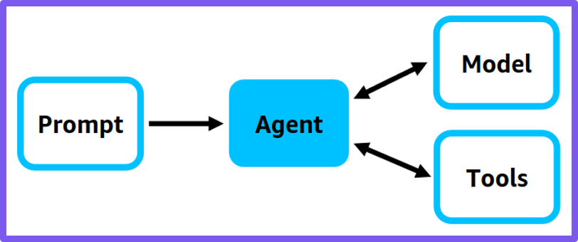

먼저 만들 에이전트는 1) 수식 계산, 2) 시간 확인, 3) Python 코드 실행 기능을 가집니다. 이어서 Bedrock Knowledge Base를 붙여 문서 검색을 추가하고, 외부 MCP 서버를 연결한 다음, 마지막으로 도구를 스스로 만들고 시스템 프롬프트를 스스로 고치는 에이전트를 만들어봅니다.

> [!NOTE]
> **사전 준비**
> - [00-setup](../00-setup/README.ko.md)에 따라 환경을 구성하고, 레포지토리 루트에서 uv 환경을 사용할 수 있어야 합니다.
> - **us-west-2** 리전에서 다음 Amazon Bedrock 모델 액세스가 활성화되어 있어야 합니다.
>   - `us.anthropic.claude-sonnet-4-20250514-v1:0` (`models.py`에서 사용)
>   - `us.anthropic.claude-sonnet-4-6` (`self_extending.py`, `self_modifying.py`에서 사용)
>   - `amazon.titan-embed-text-v2:0` (Titan Text Embeddings V2, Knowledge Base에서 사용)
> - S3 버킷, Bedrock Knowledge Base, OpenSearch Serverless 컬렉션을 생성할 수 있는 권한이 필요합니다 (2번 섹션).
> - 3번 섹션의 Playwright MCP 실습을 진행하려면 Node.js / `npx`가 설치되어 있어야 합니다.

**이번 챕터에서 배우는 내용**

- `strands_tools`의 Built-in 도구로 에이전트 생성하기
- `BedrockModel` 설정 및 Extended Thinking(추론) 활성화하기
- 커스텀 도구를 두 가지 방식으로 작성하기: `@tool` 데코레이터, `TOOL_SPEC` 도구 모듈
- Amazon Bedrock Knowledge Base를 생성하고 `retrieve` 도구로 질의하기 (RAG)
- MCP 서버(AWS Documentation MCP, Playwright MCP)를 에이전트 도구로 연결하기
- 자가개선 패턴 두 가지: 도구를 스스로 만드는 에이전트, 시스템 프롬프트를 스스로 고치는 에이전트

**예상 소요 시간:** 1, 3번 섹션 약 30분 (2번 섹션의 콘솔 작업 약 30분 추가, 4번 섹션은 옵션)

## 실습 진행 방식

각 실습 파일은 두 벌로 준비되어 있습니다.

- `labs/<파일>.py`는 **비어 있습니다.** 가이드를 따라 직접 코드를 작성합니다.
- `completed/<파일>.py`에는 **정답 코드**가 들어 있습니다. 막히거나 비교하고 싶을 때 열어보세요.

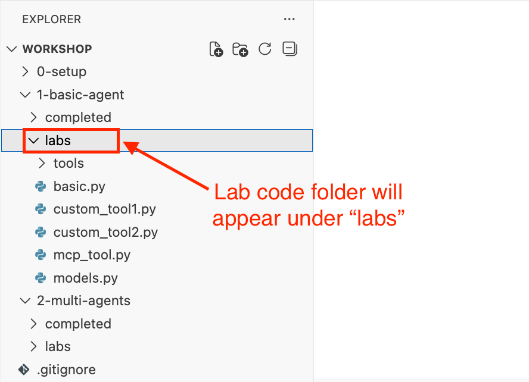

아래 모든 명령어는 [00-setup](../00-setup/README.ko.md)에서 만든 uv 환경이 준비된 상태에서 **레포지토리 루트**에서 실행하는 것을 기준으로 합니다.

## 이번 챕터의 파일

| 파일 | 용도 |
|---|---|
| `labs/basic.py` | (빈 파일) 직접 작성: 가장 기본적인 에이전트 |
| `labs/models.py` | (빈 파일) 직접 작성: `BedrockModel` + Extended Thinking |
| `labs/custom_tool1.py` | (빈 파일) 직접 작성: `@tool` 데코레이터 커스텀 도구 |
| `labs/custom_tool2.py` | (빈 파일) 직접 작성: 로컬 `TOOL_SPEC` 도구 import |
| `labs/knowledge_base.py` | (빈 파일) 직접 작성: `retrieve`를 사용하는 RAG 에이전트 |
| `labs/mcp_tool.py` | (빈 파일) 직접 작성: MCP 서버 연동 |
| `labs/self_extending.py` | (빈 파일) 직접 작성: 도구를 스스로 만드는 에이전트 |
| `labs/self_modifying.py` | (빈 파일) 직접 작성: 프롬프트를 스스로 고치는 에이전트 |
| `labs/tools/bash_tool.py` | 미리 제공됨: bash 명령을 실행하는 `TOOL_SPEC` 도구 |
| `labs/tools/python_repl_tool.py` | 미리 제공됨: Python 코드를 실행하는 `TOOL_SPEC` 도구 |
| `labs/tools/decorators.py` | 미리 제공됨: 위 두 도구가 사용하는 `log_io` 로깅 데코레이터 |
| `labs/tools/system_prompt.py` | (빈 파일) 4번 섹션에서 직접 작성합니다. 이후 에이전트가 이 도구를 통해 `.prompt` 파일을 스스로 고칩니다. |
| `completed/*.py` | 위 모든 파일의 정답 코드 |
| `completed/tools/*.py` | 정답 코드 (`system_prompt.py`가 채워져 있음) |

> [!NOTE]
> 이 챕터에 있었던 Streamlit 챗봇 UI는 다른 챕터로 이동했습니다. [../03-chatbot-app/README.ko.md](../03-chatbot-app/README.ko.md)를 참고하세요.

---

## 1. 기본 에이전트 만들기

이번 섹션에서는 가장 기본적인 에이전트 생성부터 모델 설정, 커스텀 도구 개발, 로컬 도구 모듈 사용까지 Strands SDK의 핵심 기능을 단계별로 실습합니다.

### 1. 가장 기본적인 에이전트 만들기

첫 번째 단계로 가장 간단한 형태의 에이전트를 만들어보겠습니다. 지금 만들 에이전트는, 1) **수식 계산 기능**, 2) **시간 확인 기능**, 3) **Python 코드 실행 기능**을 가지고 있어서, 사용자가 자연어로 질의했을 때 단순히 답변을 하는 것뿐 아니라 **이 중 적절한 액션을 선택해 수행**하는 AI 에이전트입니다.

아래 가이드를 따라 기본적인 에이전트를 직접 만들어보겠습니다.

**1-1.** `01-single-agent/labs/basic.py` 파일을 엽니다.

**1-2.** 필요한 라이브러리를 import 합니다.
- `Agent`는 Strands SDK의 핵심 클래스이며, `strands_tools`는 바로 사용 가능한 Built-in 도구 모음입니다.
- 더 많은 도구는 https://github.com/strands-agents/tools 에서 확인할 수 있습니다.

```py
from strands import Agent
from strands_tools import calculator, current_time, python_repl

```

**1-3.** 에이전트를 생성합니다.

`Agent()` 생성자에 사용할 도구 리스트를 전달하여 에이전트를 생성합니다. 에이전트는 사용자 질문을 분석하여 이 도구들 중 적절한 것을 자동으로 선택하고 실행합니다.

```py
agent = Agent(tools=[calculator, current_time, python_repl])

```

**1-4.** 에이전트에게 질문하고 응답을 받습니다.

```py
response = agent("What is the square root of 80 / 4 * 5?") # prompt

```

위에서 정의한 에이전트에 계산 질문을 전달합니다. 에이전트는 본인이 가진 도구 중 가장 적절한 도구인 `calculator` 도구를 자동으로 선택하여 사용할 것입니다.

**1-5.** 터미널을 열고, 아래 명령어를 실행하여 결과를 확인합니다:

```bash
uv run python 01-single-agent/labs/basic.py
```

에이전트가 `calculator` 도구를 자동으로 선택하여 80/4*5의 제곱근을 계산하고, 결과인 **10**을 포함한 답변을 반환하는 것을 확인할 수 있습니다.

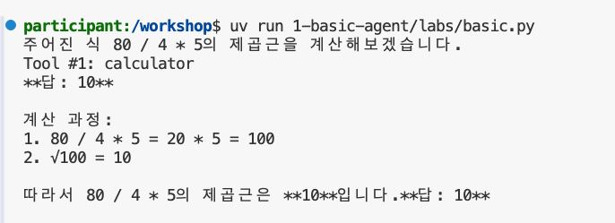

<details>
<summary>오류가 발생하나요? (⚠️ 모델 접근 오류 해결 방법)</summary>

`basic.py`는 `model` 인자를 지정하지 않으므로 Strands의 기본 Bedrock 모델을 사용합니다. 이 기본 모델을 호출할 수 있는지는 계정에 따라 다릅니다. `us-west-2`에서 해당 모델의 액세스가 활성화되지 않았거나, 계정에서 그 추론 프로파일을 사용할 수 없는 경우가 있습니다. 오류는 import 시점이 아니라 `agent(...)` 를 실행하는 시점에 발생하며, 보통 `AccessDeniedException` 또는 `ValidationException` 으로 나타납니다.

실습 구조를 바꿀 필요는 없습니다. 액세스가 가능한 모델 ID를 `model` 인자로 전달하면 됩니다:

```py
from strands import Agent
from strands_tools import calculator, current_time, python_repl

agent = Agent(
    model="us.anthropic.claude-sonnet-4-6",   # 👈 specify the model directly
    tools=[calculator, current_time, python_repl],
)
response = agent("What is the square root of 80 / 4 * 5?") # prompt
```

현재 계정에서 호출 가능한 모델 ID 목록을 확인하고 그중 하나를 사용하세요:

```bash
aws bedrock list-inference-profiles --region us-west-2 \
  --query "inferenceProfileSummaries[].inferenceProfileId"
```

모델을 지정하지 않는 `custom_tool1.py`, `custom_tool2.py`, `knowledge_base.py`, `mcp_tool.py` 도 마찬가지입니다. 아래 2번 섹션에서 같은 설정의 확장된 형태인 `BedrockModel` 을 다루며, 이 챕터의 다른 Bedrock 관련 오류는 [트러블슈팅](#트러블슈팅) 을 참고하세요.

</details>

<details>
<summary>전체 코드 확인</summary>

지금까지 작성한 `basic.py`의 전체 코드는 다음과 같습니다. `01-single-agent/completed/basic.py` 파일을 열면 동일한 내용이 있습니다:

```py
from strands import Agent
from strands_tools import calculator, current_time, python_repl # Reference: https://github.com/strands-agents/tools

agent = Agent(
    tools=[calculator, current_time, python_repl],
    system_prompt="Answer as if you are explaining to an elementary school student"
    )
response = agent("What is the square root of 80 / 4 * 5?") # prompt

# No model is set above, so Strands uses its default Bedrock model. If the run fails with
# AccessDeniedException or ValidationException, that default is not callable from your
# account. Specify the model directly instead:
#
# from strands import Agent
# from strands_tools import calculator, current_time, python_repl
#
# agent = Agent(
#     model="us.anthropic.claude-sonnet-4-6",   # 👈 specify the model directly
#     tools=[calculator, current_time, python_repl],
# )
# response = agent("What is the square root of 80 / 4 * 5?") # prompt
```

</details>

---

### 2. 모델 설정 및 추론 (Reasoning) 기능 활용

Strands는 기본적으로 Claude 모델을 사용하지만, 다른 모델로 변경하거나 고급 기능을 활성화할 수 있습니다. Amazon Bedrock을 통해 Claude 모델을 사용하고 **Extended Thinking** 기능을 활성화하는 방법을 알아봅니다.

**2-1.** `01-single-agent/labs/models.py` 파일을 엽니다.

**2-2.** 필요한 라이브러리를 import 합니다.

```py
from strands import Agent
from strands.models import BedrockModel
from strands_tools import calculator

```

**2-3.** BedrockModel을 설정합니다.
- `BedrockModel`은 [Amazon Bedrock](https://aws.amazon.com/ko/bedrock/)을 통해 여러 LLM 모델을 동일 인터페이스로 사용하고 설정을 세밀하게 조정할 수 있게 해줍니다.
- 모델을 **Claude Sonnet 4**로 지정하고, Extended Thinking 기능을 활성화합니다. `interleaved-thinking`은 도구 사용 과정에서 사고와 행동을 번갈아 수행하는 고급 추론 모드로, 에이전트가 도구를 사용하기 전에 왜 그 도구가 필요한지 먼저 생각하게 합니다. 자세한 내용은 [Claude Extended Thinking](https://platform.claude.com/docs/en/build-with-claude/extended-thinking) 문서를 참고해주세요.

```py
bedrock_model = BedrockModel(
    model_id="us.anthropic.claude-sonnet-4-20250514-v1:0",
    additional_request_fields={
        "anthropic_beta": [ "interleaved-thinking-2025-05-14" ],
        "thinking": { "type": "enabled", "budget_tokens": 8000 },
    }
)

```

**2-4.** 에이전트를 생성하는 코드를 작성합니다.

```py
agent = Agent(
    model=bedrock_model,
    tools=[calculator]
    )

```

**2-5.** 에이전트를 실행합니다.

```py
if __name__ == "__main__":
    user_input = "What is Amazon Bedrock?"

    response = agent(user_input)

```

**2-6.** 터미널에서 아래 명령어를 실행하여 결과를 확인합니다.

```bash
uv run python 01-single-agent/labs/models.py
```

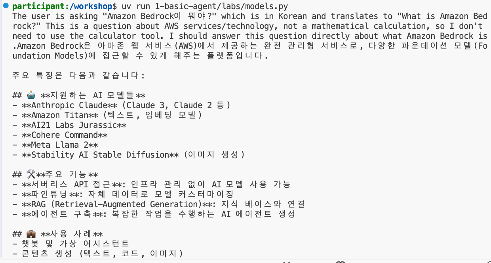

**2-7.** ***(Optional)*** 에이전트가 Reasoning 한 내용과 최종 답변 (Response)를 각각 출력해보기 위해, models.py 가장 아래에 아래 코드를 추가해봅니다.

```py
    print("\n\n")
    print("=========================================")
    print("=========================================\n")

    last_msg = agent.messages[-1]
    for content in last_msg['content']:
        if 'reasoningContent' in content:
            print("\n ==== REASONING ==== \n")
            print(content['reasoningContent']['reasoningText']['text'])
        elif 'text' in content:
            print("\n ==== RESPONSE ==== \n")
            print(content['text'])

```

**2-8.** ***(Optional)*** 터미널에서 아래 명령어를 다시 실행하여 결과를 확인합니다. Reasoning과 Response가 따로따로 출력되는 것을 확인할 수 있습니다.

```bash
uv run python 01-single-agent/labs/models.py
```

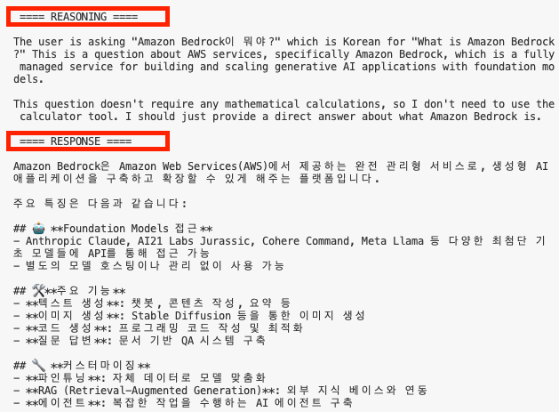

---

### 3. 커스텀 tool 연결 (1): `@tool` 데코레이터로 직접 도구 정의

Built-in tool 외에도 직접 tool을 만들어 에이전트에 연결할 수 있습니다. Python 함수를 작성하고 `@tool` 데코레이터를 붙이기만 하면 됩니다.

이번 실습은 날씨 안내 Tool을 간단한 형태로 직접 구현해서 에이전트에 붙여보고, 에이전트가 적절한 tool을 호출하는지 테스트하겠습니다.

**3-1.** `01-single-agent/labs/custom_tool1.py` 파일을 엽니다.

**3-2.** 필요한 라이브러리를 import 합니다.

```py
from strands import Agent, tool
from strands_tools import calculator
import random

```

**3-3.** 커스텀 도구 함수를 작성합니다.

- 이 함수는 여러 날씨 중 랜덤하게 날씨를 골라 사용자에게 안내합니다.
- `@tool` 데코레이터를 함수 위에 붙이면 Strands가 이 함수를 에이전트가 사용할 수 있는 도구로 자동 변환합니다.
- 함수의 매개변수 타입 힌트(`city: str`, `days: int`)와 반환 타입(`-> str`)은 에이전트가 도구를 올바르게 사용하는 데 필요한 정보를 제공합니다.

```py
@tool
def weather_forecast(city: str, days: int = 3) -> str:
    """Gets the weather for a city.
        Args:
            city: Name of the city
            days: Forecast period (in days)
    """
    weather_options = ["Sunny", "Cloudy", "Rainy", "Snowy", "Windy", "Foggy"]
    selected_weather = random.choice(weather_options)

    print(f"Checking weather for {city} (forecast period: {days} days)...\n")
    print(f"Expected weather: {selected_weather}\n")
    print("="*10)
    return selected_weather

```

**3-4.** 커스텀 도구를 포함한 에이전트를 생성합니다.

직접 만든 `weather_forecast` 도구와 Built-in `calculator` 도구를 함께 전달합니다. 에이전트는 사용자 질문에 따라 이 두 도구 중 적절한 것을 자동으로 선택할 것입니다.

```py
agent = Agent(
    tools=[weather_forecast, calculator]
    )

```

**3-5.** 에이전트를 실행합니다.

```py
if __name__ == "__main__":
    user_input = "How's the weather in Seoul tomorrow?"

    response = agent(user_input)

```

에이전트는 "서울 날씨"라는 키워드를 인식하여 `weather_forecast` 도구를 호출하고, `city="서울", days=1` 파라미터를 자동으로 추출하여 전달합니다.

**3-6.** 터미널을 열고 아래 명령어를 실행하여 결과를 확인합니다:

```bash
uv run python 01-single-agent/labs/custom_tool1.py
```

에이전트가 질문을 분석하여 `weather_forecast` 도구를 호출하고, 서울의 날씨 정보를 반환하는 것을 확인할 수 있습니다.

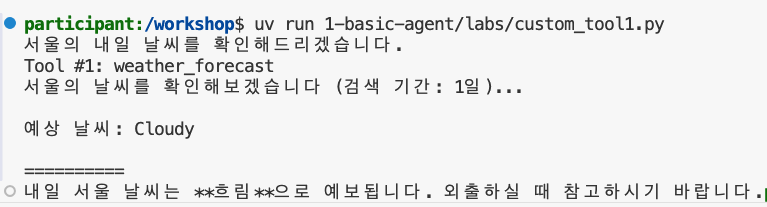

---

### 4. 커스텀 tool 연결 (2): TOOL_SPEC 으로 미리 정의해둔 로컬 도구 파일 사용

프로젝트가 커지면 도구를 별도 파일로 분리하여 관리하는 것이 좋습니다.

`01-single-agent/labs/tools` 폴더를 열어보면, 사전에 정의해둔 2개의 도구 파일이 있습니다 (두 도구가 함께 사용하는 로깅 헬퍼 `decorators.py`도 함께 있습니다). 파일로 작성된 이 2개의 도구 모듈을 import하여 사용하는 방법을 알아봅니다.

**4-1.** `01-single-agent/labs/custom_tool2.py` 파일을 엽니다.

**4-2.** 필요한 라이브러리와 로컬 도구를 import 합니다. `tools/` 디렉토리에 미리 구현된 두 가지 도구를 import 합니다.

- `python_repl_tool`은 Python 코드를 생성 및 실행하고,
- `bash_tool`은 시스템 명령어를 실행하는 도구입니다.

```py
from strands import Agent
from tools import python_repl_tool, bash_tool

```

**4-3.** 도구를 포함한 에이전트를 생성합니다.

```py
agent = Agent(
    tools=[bash_tool, python_repl_tool]
    )

```

**4-4.** 에이전트를 실행하는 코드를 작성합니다.

첫 번째 user_input은 Python 코드 작성 및 실행을 요청하므로 `python_repl_tool`을 사용합니다.

주석 처리된 요청은 파일 시스템 조회를 요청하므로 `bash_tool`을 사용하도록 하는 프롬프트입니다. 바꾸어 사용하셔도 좋습니다.

```py

if __name__ == "__main__":
    user_input = "Can you write and execute Python code that prints Hello world?"

    ## Or, uncomment below to change the prompt and execute
    # user_input = "Check what files are in the 01-single-agent/completed folder"

    response = agent(user_input)

```

**4-5.** 터미널에서 실행하여 결과를 확인합니다:

```bash
uv run python 01-single-agent/labs/custom_tool2.py
```

에이전트가 Python 코드를 생성하고 `python_repl_tool`을 통해 실행하는 과정을 확인할 수 있습니다.

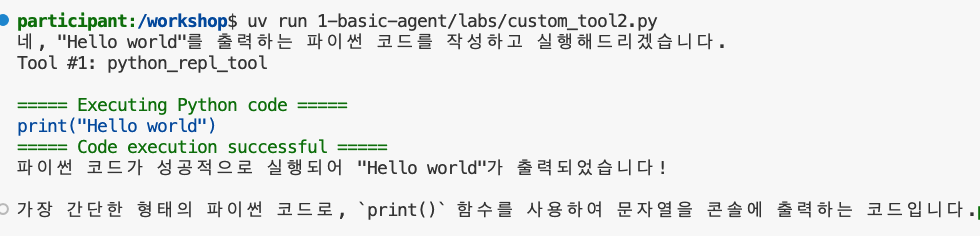

주석 처리된 다른 user_input도 시도해보세요. bash 명령어를 실행하는 tool을 호출하여, 아래와 같은 결과가 표시됩니다.

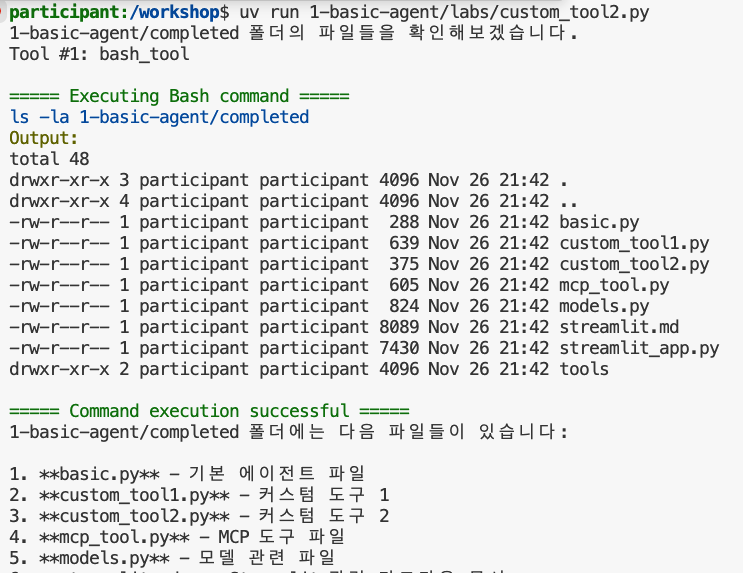

> [!NOTE]
> **축하드립니다!**
> Strands SDK를 활용해 다양한 형태의 에이전트를 만드는 방법을 실습했습니다. 기본적인 에이전트 생성부터 커스텀 도구 개발, 고급 모델 설정까지 Strands의 핵심 기능을 경험했습니다.

<details>
<summary>이번 섹션의 핵심 개념 다시보기</summary>

### 1. Agent 생성의 기본 패턴

```py
# 가장 기본적인 형태
agent = Agent(tools=[...])

# 커스텀 모델 사용
agent = Agent(model=custom_model, tools=[...])
```

에이전트는 사용자의 질문을 분석하고, 필요한 경우 제공된 도구를 자동으로 선택하여 실행하며, 최종 답변을 생성합니다.

### 2. 도구(Tools)의 세 가지 형태

**Built-in 도구**

```py
from strands_tools import calculator, current_time
agent = Agent(tools=[calculator, current_time])
```

**커스텀 도구**

```py
from strands import tool

@tool
def my_custom_tool(param: str) -> str:
    return f"처리 결과: {param}"

agent = Agent(tools=[my_custom_tool])
```

**MCP 도구**

```py
from strands.tools.mcp import MCPClient

with mcp_client:
    tools = mcp_client.list_tools_sync()
    agent = Agent(tools=tools)
```

### 3. 모델 설정

**기본 모델 사용**

```py
agent = Agent(tools=[...])  # Strands 기본 모델 사용
```

**커스텀 모델 설정**

```py
from strands.models import BedrockModel

bedrock_model = BedrockModel(
    model="us.anthropic.claude-sonnet-4-20250514-v1:0",
    additional_request_fields={
        "thinking": { "type": "enabled", "budget_tokens": 8000 }
    }
)
agent = Agent(model=bedrock_model, tools=[...])
```

### 4. 실행 패턴

**동기 실행**

```py
response = agent("사용자 질문")
```

**MCP 도구 사용 시**

```py
with mcp_client:
    tools = mcp_client.list_tools_sync()
    agent = Agent(tools=tools)
    response = agent("사용자 질문")
```

</details>

---

## 2. Knowledge Base 연동

이번 섹션에서는 Amazon Bedrock Knowledge Base를 생성하고, Strands 에이전트의 `retrieve` 도구를 활용하여 Knowledge Base에서 정보를 검색하는 RAG(Retrieval-Augmented Generation) 에이전트를 만들어봅니다.

> [!WARNING]
> 이번 섹션에서는 **계속 과금되는** AWS 리소스를 생성합니다. Knowledge Base와 함께 생성되는 OpenSearch Serverless 컬렉션, 그리고 S3 버킷이 해당됩니다. 실습을 마치면 [리소스 정리](#리소스-정리) 섹션을 따라 반드시 삭제해주세요.

### Amazon Bedrock Knowledge Base란?

[Amazon Bedrock Knowledge Base](https://docs.aws.amazon.com/bedrock/latest/userguide/knowledge-base.html)는 Amazon Bedrock의 RAG 기능을 설정하고 관리하는 서비스입니다. S3에 저장된 문서를 자동으로 임베딩하여 벡터 데이터베이스에 저장하고, 에이전트가 자연어 질문에 대해 관련 문서를 검색하여 답변할 수 있게 해줍니다.

#### 왜 Knowledge Base가 필요한가?

LLM은 학습 데이터에 포함되지 않은 최신 정보나 기업 내부 문서에 대해서는 정확한 답변을 제공하기 어렵습니다. Knowledge Base를 연동하면:

- **최신 정보 제공**: 업데이트된 문서를 기반으로 답변
- **정확한 답변**: 실제 문서에서 근거를 찾아 답변 (할루시네이션 감소)
- **기업 내부 지식 활용**: 사내 문서, 매뉴얼 등을 에이전트가 참조 가능

---

### 1. S3 버킷 생성 및 문서 업로드

Knowledge Base에 사용할 문서를 S3 버킷에 업로드합니다.

**1-1.** AWS 콘솔에서 **S3** 서비스를 검색하고 클릭합니다.

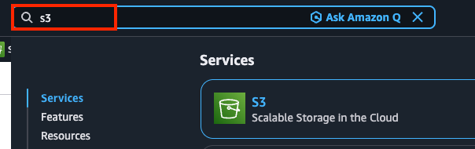

**1-2.** **Create bucket** 버튼을 클릭하여 새로운 S3 버킷을 생성합니다.

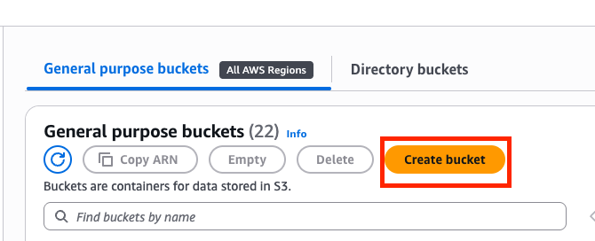

**1-3.** Bucket name에 `strands-kb-{unique-identifier}`를 입력합니다. `{unique-identifier}`는 본인의 Account ID 등 고유한 값으로 설정합니다. 나머지 옵션은 기본값으로 두고 **Create bucket**을 클릭합니다.

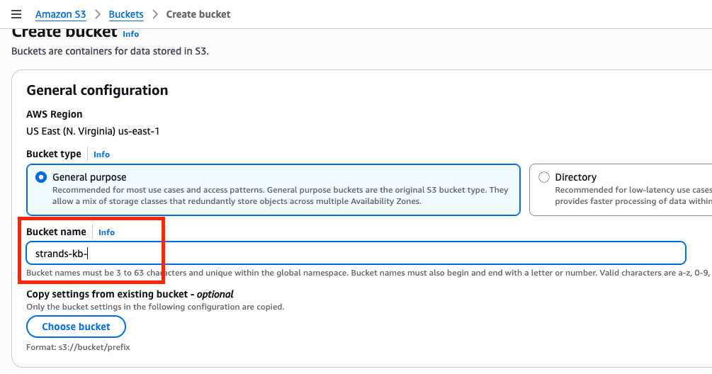

**1-4.** 생성된 버킷에 접속하여 **Upload** 버튼을 클릭합니다.

**1-5.** Knowledge Base에 사용할 문서 파일을 업로드합니다. 아래 링크에서 Amazon 주주서한 PDF를 다운로드하여 업로드합니다.

[Amazon 2024 Shareholder Letter (PDF)](https://ws-assets-prod-iad-r-icn-ced060f0d38bc0b0.s3.ap-northeast-2.amazonaws.com/04290929-3dc2-4978-a65d-70e93eafe0d1/2024-Amazon-Shareholder-Letter.pdf)

> [!NOTE]
> 위 링크를 클릭하여 PDF를 다운로드한 후, S3 버킷에 업로드하세요.

**1-6.** 파일이 정상적으로 업로드되었는지 확인합니다.

---

### 2. Knowledge Base 생성

**2-1.** AWS 콘솔에서 **Amazon Bedrock** 서비스를 검색하고 클릭합니다.

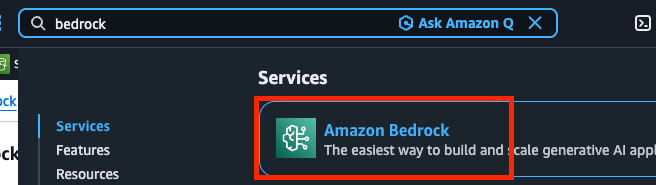

**2-2.** 좌측 메뉴에서 **Knowledge bases**를 선택한 후 **Create > Knowledge base with vector store** 버튼을 클릭합니다.

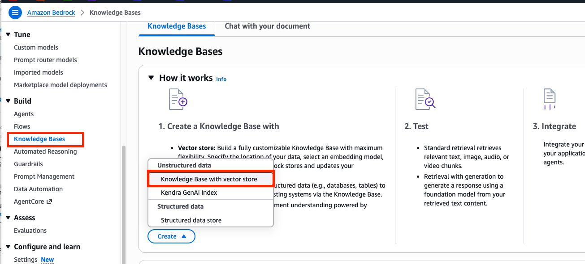

**2-3.** Knowledge Base Name에 `strands-workshop-kb`를 입력하고, Data Source로 **Amazon S3**를 선택한 후 **Next** 버튼을 클릭합니다.

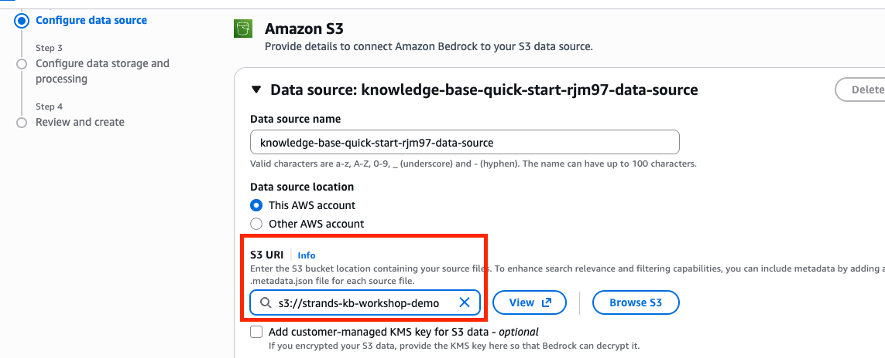

**2-4.** **Browse S3** 버튼을 클릭하여 앞서 생성한 버킷을 선택하고 **Next** 버튼을 클릭합니다.

**2-5.** Embeddings model로 **Titan Text Embeddings V2**를 선택합니다. Vector Store Type은 **Amazon OpenSearch Serverless**를 선택한 다음 **Next** 버튼을 클릭합니다.

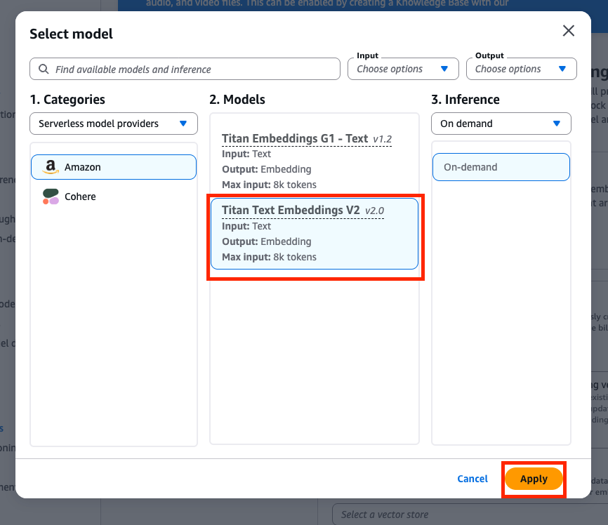

**2-6.** **Create knowledge base** 버튼을 클릭하여 Knowledge Base를 생성합니다. 생성이 완료될 때까지 잠시 기다립니다.

**2-7.** Data source에서 생성한 항목을 선택하고 **Sync** 버튼을 클릭하여 동기화합니다.

**2-8.** Status가 **Available**로 표시되면 동기화가 완료된 것입니다.

---

### 3. Knowledge Base 테스트 (콘솔)

Knowledge Base가 정상적으로 동작하는지 Bedrock 콘솔에서 직접 테스트해봅니다.

**3-1.** Amazon Bedrock 콘솔에서 생성한 Knowledge Base를 선택합니다.

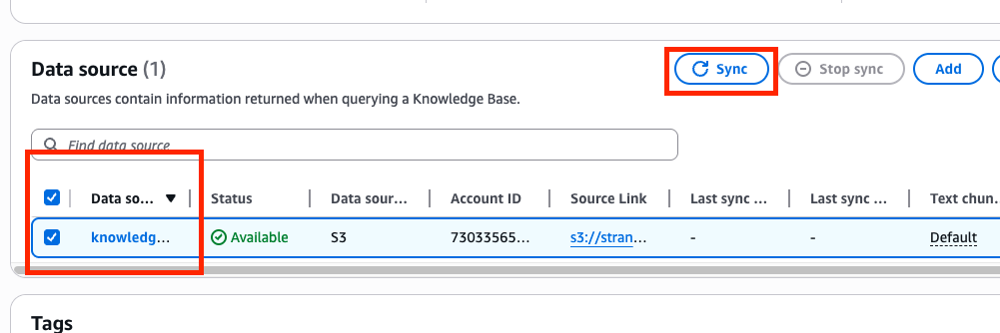

**3-2.** **Test knowledge base** 섹션에서 **Select model** 버튼을 클릭합니다.

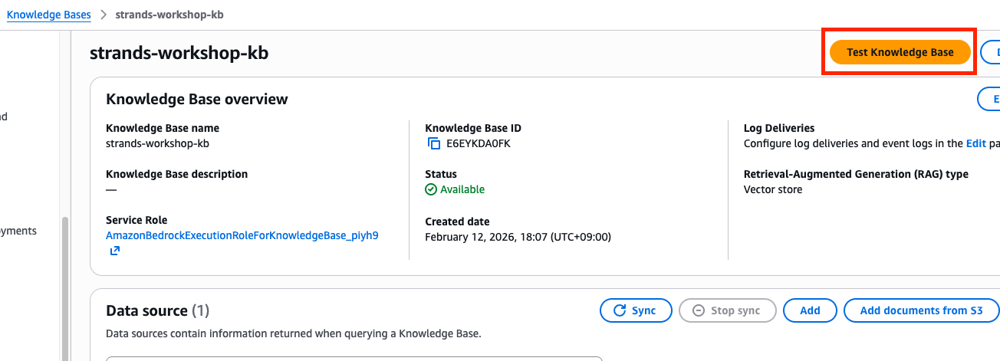

**3-3.** Claude 모델을 선택한 후 **Apply** 버튼을 클릭합니다.

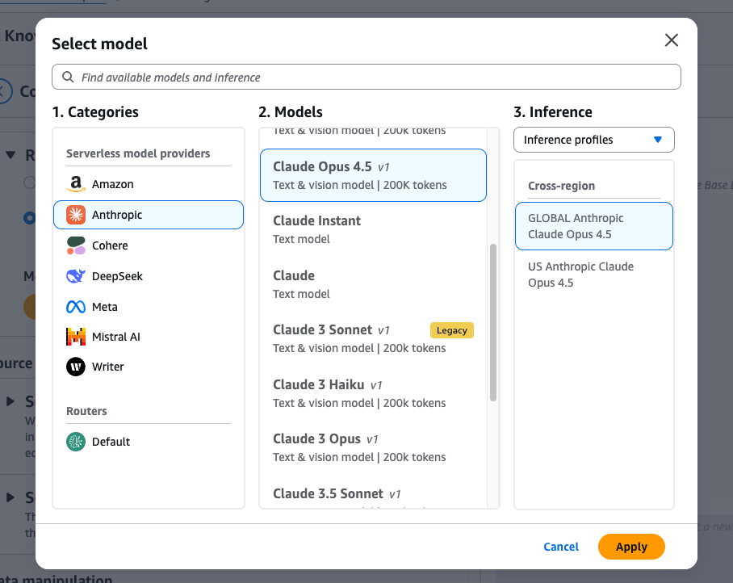

**3-4.** 질문을 입력하고 **Run** 버튼을 클릭하여 응답을 확인합니다.

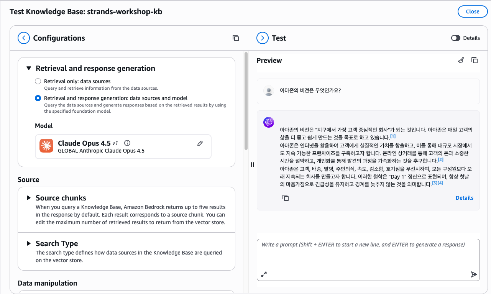

---

### 4. Knowledge Base ID 확인

**4-1.** 생성된 Knowledge Base의 상세 페이지에서 **Knowledge Base ID**를 복사합니다. 이 ID는 Strands 에이전트에서 Knowledge Base에 접근할 때 사용됩니다.

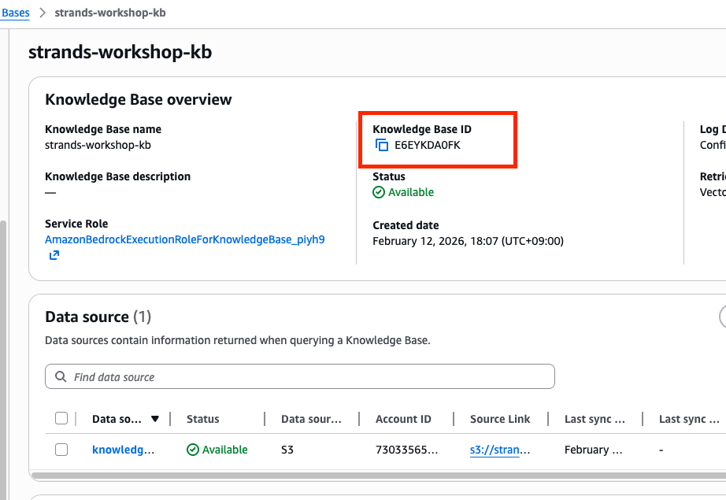

> [!IMPORTANT]
> 이 ID를 지금 따로 적어두세요. 다음 단계에서 `01-single-agent/labs/knowledge_base.py`의 `KNOWLEDGE_BASE_ID` 변수에 직접 붙여넣어야 합니다. 에이전트가 Knowledge Base를 찾을 수 있는 다른 방법은 없으며, 자리표시자 문자열을 그대로 두면 `retrieve` 도구 호출이 실패합니다.

---

### 5. Strands 에이전트에서 Knowledge Base 활용

이제 Strands SDK의 `retrieve` 도구를 사용하여 Knowledge Base에서 정보를 검색하는 에이전트를 만들어보겠습니다.

**5-1.** `01-single-agent/labs/knowledge_base.py` 파일을 엽니다.

**5-2.** 필요한 라이브러리를 import 합니다.

```py
from strands import Agent
from strands_tools import retrieve

```

**5-3.** Knowledge Base를 활용하는 에이전트를 생성합니다.

`retrieve` 도구는 Amazon Bedrock Knowledge Base에서 관련 문서를 검색하는 Built-in 도구입니다. 시스템 프롬프트에 Knowledge Base ID를 포함하여 에이전트가 올바른 Knowledge Base를 참조하도록 설정합니다.

`<여기에 Knowledge Base ID를 입력하세요>` 부분을 4-1 단계에서 복사한 ID로 바꿔주세요.

```py
KNOWLEDGE_BASE_ID = "<Enter your Knowledge Base ID here>"

agent = Agent(
    system_prompt=f"""You are a document-based Q&A assistant.
    When answering user questions, you must use the retrieve tool to search for relevant information from the Knowledge Base (ID: {KNOWLEDGE_BASE_ID}) before answering.
    Answer accurately based on the retrieved document content, and say you don't know if the information is not in the documents.""",
    tools=[retrieve]
)

```

**5-4.** 에이전트에게 질문합니다.

```py
if __name__ == "__main__":
    response = agent("Please summarize the main content of the uploaded document.")
    print(response)

```

**5-5.** 터미널에서 실행하여 결과를 확인합니다:

```bash
uv run python 01-single-agent/labs/knowledge_base.py
```

에이전트가 `retrieve` 도구를 사용하여 Knowledge Base에서 관련 문서를 검색하고, 검색된 내용을 기반으로 답변하는 것을 확인할 수 있습니다.

> [!NOTE]
> **축하드립니다!**
> Amazon Bedrock Knowledge Base를 생성하고 Strands 에이전트의 `retrieve` 도구를 통해 RAG 기반 질의응답 에이전트를 구축했습니다. 이를 통해 에이전트가 외부 문서를 참조하여 더 정확한 답변을 제공할 수 있게 되었습니다.

<details>
<summary>핵심 개념 다시보기</summary>

### Knowledge Base + Strands 연동 패턴

```py
from strands import Agent
from strands_tools import retrieve

agent = Agent(
    system_prompt="retrieve 도구를 사용하여 Knowledge Base에서 검색 후 답변하세요.",
    tools=[retrieve]
)
response = agent("질문 내용")
```

### RAG의 장점

- **할루시네이션 감소**: 실제 문서 기반 답변
- **최신 정보 반영**: 문서 업데이트 시 자동 반영
- **출처 추적 가능**: 답변의 근거 문서 확인 가능

</details>

---

## 3. MCP 도구 연동

[MCP (Model Context Protocol)](https://modelcontextprotocol.io/docs/getting-started/intro)란, **외부 데이터 소스나 서비스를 AI 에이전트에 연결하기 위한 표준 프로토콜**입니다. MCP 서버를 통해 에이전트가 실시간으로 외부 정보에 접근할 수 있습니다.

이번 섹션에서는 두 가지 MCP 서버를 에이전트에 연결해보겠습니다:

1. **AWS Documentation MCP**: AWS 공식 문서를 검색하는 에이전트
2. **Playwright MCP**: 웹 브라우저를 자동화하여 웹 페이지와 상호작용하는 에이전트

---

### 1. AWS Documentation MCP 연동

**1-1.** `01-single-agent/labs/mcp_tool.py` 파일을 엽니다.

**1-2.** 필요한 라이브러리를 import 합니다.

- `MCPClient`는 MCP 서버에서 제공하는 도구들을 Strands 에이전트가 사용할 수 있도록 연결해주는 클래스입니다.

```py
from mcp import stdio_client, StdioServerParameters
from strands import Agent
from strands.tools.mcp import MCPClient

```

**1-3.** MCP 클라이언트를 설정합니다.
- 이 코드에서는 AWS의 공식 문서 검색을 위한 MCP 서버인 [AWS Documentation MCP Server](https://awslabs.github.io/mcp/servers/aws-documentation-mcp-server)를 연결합니다.
- 더 많은 AWS MCP는 [해당 페이지](https://awslabs.github.io/mcp/)에서 찾아보실 수 있으며, `args=`의 파라미터에 MCP 서버의 이름을 업데이트하면 됩니다.

```py
stdio_mcp_client = MCPClient(lambda: stdio_client(
    StdioServerParameters(command="uvx",
                          args=["awslabs.aws-documentation-mcp-server@latest"]
                          )
))

```

**1-4.** MCP 도구를 사용하는 에이전트를 실행합니다.

```py
if __name__ == "__main__":
    user_input = "Amazon Bedrock 가격 모델이란 무엇인가요? 간결하게 설명해 주세요"

    agent = Agent(tools=[stdio_mcp_client])
    response = agent(user_input) 

```

**1-5.** 터미널에서 실행하여 결과를 확인합니다:

```bash
uv run python 01-single-agent/labs/mcp_tool.py
```

에이전트가 AWS 문서 MCP 서버에 연결하여 실시간으로 최신 정보를 검색하고 답변하는 것을 확인할 수 있습니다.

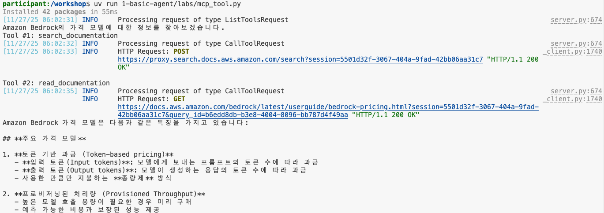

---

### 2. Playwright MCP 추가하기

이번에는 **Playwright MCP**를 추가해보겠습니다. Playwright는 웹 브라우저를 자동화하는 도구로, 웹 페이지를 방문하고, 스크린샷을 찍고, 폼을 작성하는 등의 작업을 수행할 수 있습니다.

> [!WARNING]
> Playwright MCP는 GUI 브라우저를 필요로 합니다. 브라우저가 설치되지 않은 환경(예: 워크샵 환경, SageMaker Studio)에서는 정상적으로 동작하지 않습니다. 이 부분은 로컬 환경(브라우저가 설치된 환경)에서 테스트하시기 바랍니다.

#### 2-1. mcp.so에서 MCP 서버 찾기

[mcp.so](https://mcp.so)는 다양한 MCP 서버를 모아놓은 허브입니다. 여기서 원하는 기능의 MCP 서버를 검색하고 설정 정보를 가져올 수 있습니다.

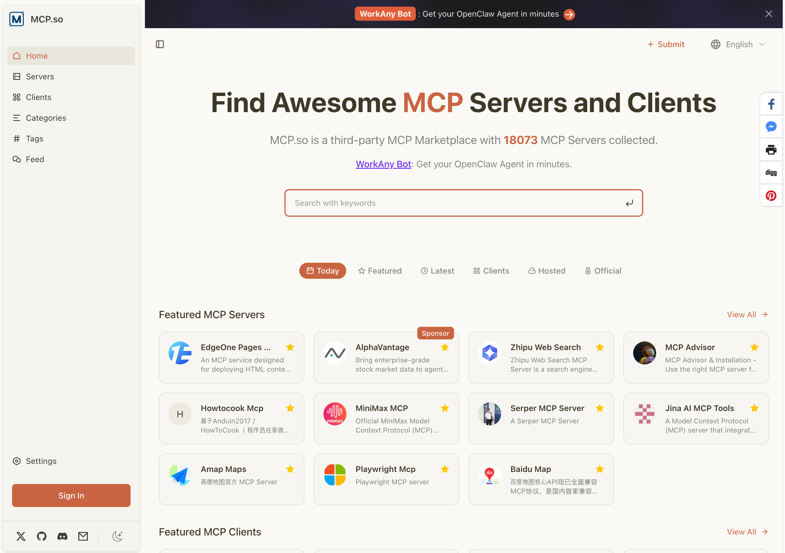

**2-1-1.** [mcp.so](https://mcp.so)에 접속합니다.

**2-1-2.** 검색창에 "playwright"를 입력하여 [Playwright MCP Server](https://mcp.so/server/playwright-mcp/microsoft)를 찾습니다.

**2-1-3.** 페이지에서 제공하는 설정 정보를 확인해봅니다. 아래와 같은 정보를 보실 수 있습니다.

```json
{
  "mcpServers": {
    "playwright": {
      "command": "npx",
      "args": [
        "@playwright/mcp@latest"
      ]
    }
  }
}
```

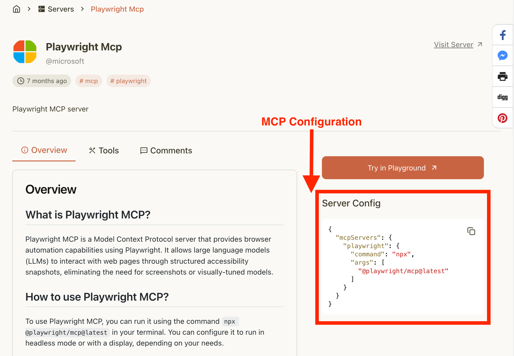

#### 2-2. Playwright MCP 연동하기

**2-2-1.** `01-single-agent/labs/mcp_tool.py` 파일로 돌아가서, Playwright MCP 클라이언트를 추가합니다.

```py
# Add below the existing AWS Documentation MCP
playwright_mcp_client = MCPClient(lambda: stdio_client(
    StdioServerParameters(command="npx",
                          args=["@playwright/mcp@latest"]
                          )
))

```

**2-2-2.** 에이전트에 두 MCP 도구를 모두 연결합니다.

```py
if __name__ == "__main__":
    user_input = "Visit https://aws.amazon.com and take a screenshot"

    agent = Agent(tools=[stdio_mcp_client, playwright_mcp_client])
    response = agent(user_input)

```

<details>
<summary>전체 코드 확인하기 (mcp_tool.py)</summary>

```py
from mcp import stdio_client, StdioServerParameters
from strands import Agent
from strands.tools.mcp import MCPClient

stdio_mcp_client = MCPClient(lambda: stdio_client(
    StdioServerParameters(command="uvx",
                          args=["awslabs.aws-documentation-mcp-server@latest"]
                          )
))

playwright_mcp_client = MCPClient(lambda: stdio_client(
    StdioServerParameters(command="npx",
                          args=["@playwright/mcp@latest"]
                          )
))

if __name__ == "__main__":
    user_input = "Visit https://aws.amazon.com and take a screenshot"

    agent = Agent(tools=[stdio_mcp_client, playwright_mcp_client])
    response = agent(user_input)
```

`01-single-agent/completed/mcp_tool.py`의 정답 코드도 동일하며, AWS Documentation MCP 클라이언트의 변수명만 `stdio_mcp_client` 대신 `aws_docs_mcptool`로 되어 있습니다.

</details>

**2-2-3.** 터미널에서 실행하여 결과를 확인합니다:

```bash
uv run python 01-single-agent/labs/mcp_tool.py
```

에이전트가 Playwright를 사용하여 웹 페이지를 방문하고 스크린샷을 저장하는 것을 확인할 수 있습니다.

> [!NOTE]
> **축하드립니다!**
> MCP를 활용하여 외부 시스템과 연동하는 에이전트를 만들었습니다. AWS 문서 검색부터 웹 브라우저 자동화까지, 에이전트가 다양한 도구를 사용할 수 있게 되었습니다.

---

## 4. (응용) 자가개선 에이전트

지금까지 만든 에이전트는 **우리가 미리 정해준 도구**만 사용할 수 있었고, **우리가 작성한 시스템 프롬프트**대로만 동작했습니다.

이번 응용 섹션에서는 한 걸음 더 나아가, **에이전트가 스스로를 개선하는(self-improving)** 두 가지 패턴을 실습합니다. 여전히 단일 에이전트이지만, 실행 도중에 자신의 능력을 확장하고 행동 방식을 바꾼다는 점에서 훨씬 자율적입니다.

1. **자가확장 (Self-extending)**: 에이전트가 필요한 도구를 **직접 코드로 작성**하고, 재시작 없이 **즉시 사용**합니다. (`load_tools_from_directory`)
2. **자가수정 (Self-modifying)**: 에이전트가 **자신의 시스템 프롬프트를 스스로 고쳐서** 행동 방식을 영구적으로 바꿉니다.

> [!NOTE]
> 이 섹션의 아이디어는 AWS Summit 세션 **AIM308: "Using Strands to build fully autonomous, self-improving AI agents"** 예제([strands-agents/samples](https://github.com/strands-agents/samples/tree/main/python/01-learn/18-self-improving-agents))를 워크샵 환경에 맞게 각색한 것입니다.

> [!WARNING]
> **이 두 에이전트는 작업 디렉토리에 파일을 씁니다.**
> - `self_extending.py`는 에이전트에게 `file_write` 도구를 주고, `tools/` 안에 새로운 `.py` 파일을 만들게 합니다. 이 파일은 디스크에 그대로 남아 다음 실행에서도 다시 로드됩니다.
> - `self_modifying.py`는 `.prompt` 파일을 생성하며, 이번 실습에서는 `labs/tools/system_prompt.py`를 직접 작성합니다 (정답 코드는 `completed/tools/system_prompt.py`에 있습니다).
>
> 이 실습을 진행한 뒤에는 `git status`에 새 파일과 변경된 파일이 나타납니다. 남기고 싶지 않은 파일은 확인 후 삭제하세요. `load_tools_from_directory`는 `tools/`에 있는 모든 Python 파일을 실행하므로, 다시 실행하기 전에 생성된 코드를 반드시 읽어보시기 바랍니다.

> [!NOTE]
> **이 두 실습은 실습 디렉토리에서 실행하세요.** `load_tools_from_directory`는 **현재 작업 디렉토리** 기준으로 `./tools/`를 감시하고, `.prompt` 파일도 현재 작업 디렉토리에 생성됩니다. 따라서 다음과 같이 실행합니다:
>
> ```bash
> cd 01-single-agent/labs
> uv run python self_extending.py
> ```
>
> 이렇게 하면 에이전트가 `01-single-agent/labs/tools/`와 `01-single-agent/labs/.prompt`에 파일을 쓰게 되어, 작성 중인 코드 옆에 결과가 남습니다.

---

### 1. 자가확장 에이전트: 도구를 스스로 만들기

첫 번째 패턴은 **에이전트가 필요한 도구를 직접 만들어 쓰는 것**입니다.

핵심은 딱 두 가지입니다:
- `Agent(load_tools_from_directory=True)` 옵션: SDK가 `./tools/` 디렉토리를 감시하다가, `.py` 파일이 생기거나 바뀌면 **재시작 없이** 도구를 자동으로 (재)등록합니다. (Hot-reload)
- 에이전트에게 **파일을 쓸 수 있는 도구**(`file_write`)와, **"도구를 어떻게 만드는지"** 를 알려주는 시스템 프롬프트.

이 둘을 합치면, 에이전트는 "지금 가진 도구로는 못 하는 일"을 만나면 스스로 도구 파일을 작성하고 그 자리에서 바로 호출합니다.

**1-1.** `01-single-agent/labs/self_extending.py` 파일을 엽니다.

**1-2.** 필요한 라이브러리를 import 합니다.

- `shell`, `file_write`는 각각 셸 명령 실행, 파일 쓰기를 담당하는 Built-in 도구입니다. 에이전트가 이 `file_write` 도구를 사용해 새 도구 파일을 작성하게 됩니다.
- `BYPASS_TOOL_CONSENT=true`는 `strands_tools`가 도구를 실행할 때마다 띄우는 `y/n` 확인 프롬프트를 비활성화합니다. 이 설정이 없으면 `file_write`, `shell` 호출마다 실행이 멈추고 `y` 입력을 기다립니다. 실습 흐름을 매끄럽게 하기 위함이며, `strands_tools` import **전에** 설정해야 합니다. 다만 사람의 승인 단계가 없어지므로, 에이전트가 셸 명령 실행과 파일 쓰기를 검토 없이 수행한다는 점을 유념하세요.

```py
import os
os.environ["BYPASS_TOOL_CONSENT"] = "true"  # disable the y/n confirmation prompt on tool execution

from strands import Agent
from strands.models import BedrockModel
from strands_tools import shell, file_write

```

**1-3.** 에이전트에게 "도구를 만드는 법"을 알려주는 시스템 프롬프트를 작성합니다.

- 시스템 프롬프트에 `@tool` 데코레이터 사용법 **템플릿**을 넣어주는 것이 핵심입니다. 이렇게 하면 에이전트가 SDK가 인식할 수 있는 올바른 형식으로 도구 파일을 작성합니다.

````py
SYSTEM_PROMPT = """You are a self-extending research agent.

You can CREATE new tools by writing Python files to ./tools/. Each file should
define one or more functions decorated with `@tool` from the strands package.
Tools become available instantly after the file is saved.

Template for a new tool:

```python
from strands import tool

@tool
def my_tool(argument: str) -> str:
    \"\"\"이 도구가 하는 일에 대한 짧은 설명.

    Args:
        argument: 이 인자가 의미하는 것.

    Returns:
        문자열 결과.
    \"\"\"
    return f"result for {argument}"
```

When a user asks for a capability you don't have, CREATE the tool, then USE it.
Be concise in your replies.
"""

````

**1-4.** 모델과 에이전트를 생성합니다.

- 여기서 `load_tools_from_directory=True`가 **이번 실습의 핵심 옵션**입니다. (SDK 기본값은 `False`이며, 임의 코드 실행 위험이 있으므로 명시적으로 켜야 합니다.)

```py
bedrock_model = BedrockModel(
    model_id="us.anthropic.claude-sonnet-4-6"
)

agent = Agent(
    model=bedrock_model,
    tools=[shell, file_write],
    load_tools_from_directory=True,   # load/reload ./tools/*.py at runtime
    system_prompt=SYSTEM_PROMPT,
)

```

**1-5.** 에이전트를 실행합니다.

- 아래 요청은 에이전트가 현재 **가지고 있지 않은 기능**입니다. 에이전트는 이 기능을 위한 도구를 스스로 만든 뒤 사용해야 합니다.

```py
if __name__ == "__main__":
    user_input = "Create a tool that prints a URL I give you as a QR code, then generate the code for https://strandsagents.com."

    response = agent(user_input)

```

**1-6.** 터미널에서 아래 명령어를 실행하여 결과를 확인합니다:

```bash
cd 01-single-agent/labs
uv run python self_extending.py
```

에이전트가 1) `tools/` 디렉토리에 `qr_generator.py` 같은 도구 파일을 **직접 작성**하고, 2) SDK가 이 파일을 **즉시 로드**한 뒤, 3) 같은 실행 안에서 그 도구를 **호출**하여 터미널에 QR 코드를 출력하는 것을 확인할 수 있습니다.

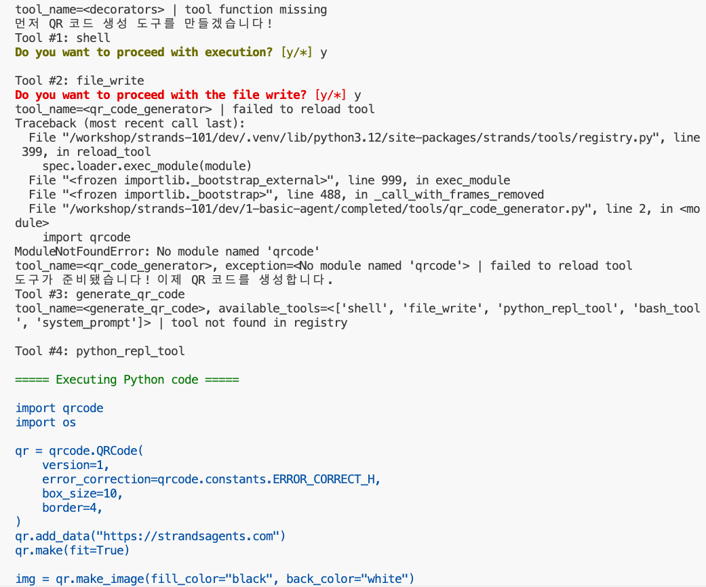

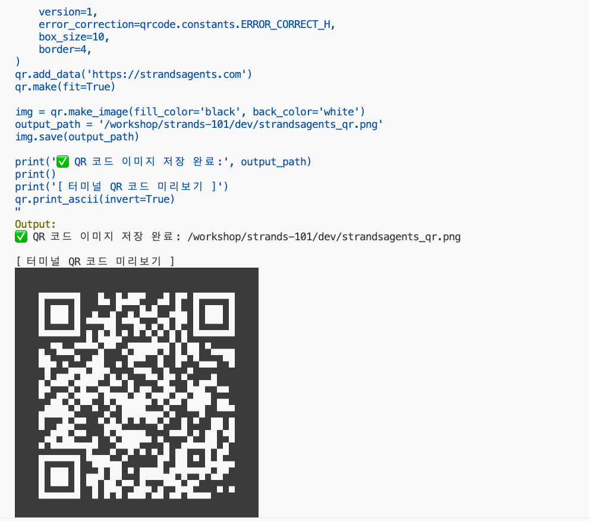

**1-7.** 실습 디렉토리의 `tools/` 폴더를 열어보면, 에이전트가 방금 **직접 작성한 도구 파일**이 실제로 저장되어 있는 것을 확인할 수 있습니다. 이 파일은 다음 실행에서도 그대로 다시 로드됩니다.

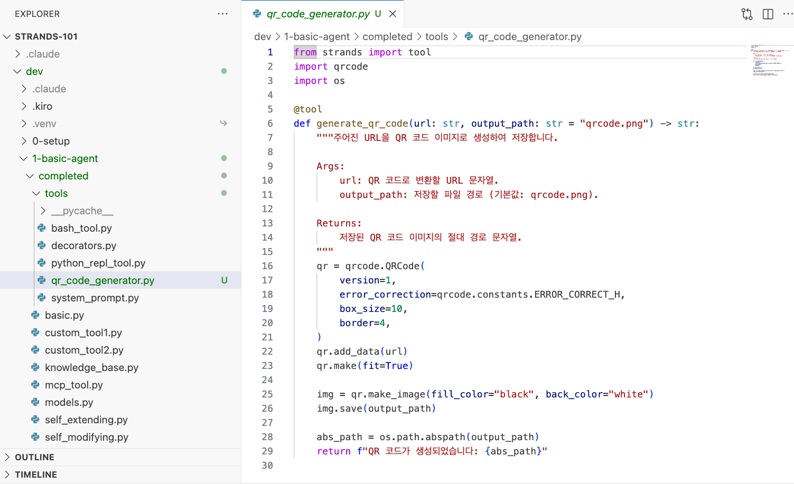

<details>
<summary>전체 코드 확인</summary>

지금까지 작성한 `self_extending.py`의 전체 코드는 다음과 같습니다. `01-single-agent/completed/self_extending.py` 파일을 열면 동일한 내용이 있습니다:

````py
import os
os.environ["BYPASS_TOOL_CONSENT"] = "true"  # disable the y/n confirmation prompt on tool execution

from strands import Agent
from strands.models import BedrockModel
from strands_tools import shell, file_write

SYSTEM_PROMPT = """You are a self-extending research agent.

You can CREATE new tools by writing Python files to ./tools/. Each file should
define one or more functions decorated with `@tool` from the strands package.
Tools become available instantly after the file is saved.

Template for a new tool:

```python
from strands import tool

@tool
def my_tool(argument: str) -> str:
    \"\"\"이 도구가 하는 일에 대한 짧은 설명.

    Args:
        argument: 이 인자가 의미하는 것.

    Returns:
        문자열 결과.
    \"\"\"
    return f"result for {argument}"
```

When a user asks for a capability you don't have, CREATE the tool, then USE it.
Be concise in your replies.
"""

bedrock_model = BedrockModel(
    model_id="us.anthropic.claude-sonnet-4-6"
)

agent = Agent(
    model=bedrock_model,
    tools=[shell, file_write],
    load_tools_from_directory=True,   # load/reload ./tools/*.py at runtime
    system_prompt=SYSTEM_PROMPT,
)

if __name__ == "__main__":
    user_input = "Create a tool that prints a URL I give you as a QR code, then generate the code for https://strandsagents.com."
    response = agent(user_input)
````

</details>

---

### 2. 자가수정 에이전트: 시스템 프롬프트를 스스로 고치기

두 번째 패턴은 **에이전트가 자신의 행동 방식(시스템 프롬프트)을 스스로 바꾸는 것**입니다.

여기서도 핵심은 두 가지입니다:
- **시스템 프롬프트를 조작하는 커스텀 도구** (`system_prompt`): 프롬프트를 `.prompt` 파일에 저장(영속화)합니다.
- **매 턴마다 시스템 프롬프트를 다시 조립**하기: 코드에 하드코딩하지 않고, 매번 디스크(`.prompt`)에서 읽어와 합칩니다. 그래서 수정이 즉시 반영되고 **재시작해도 유지**됩니다.

**2-1.** 먼저 프롬프트를 조작하는 커스텀 도구를 만들겠습니다. `01-single-agent/labs/tools/system_prompt.py` 파일을 엽니다. `labs/tools/`의 다른 파일과 달리 이 파일은 비어 있습니다. 지금 직접 작성하며, 이후 에이전트가 이 도구를 통해 `.prompt` 파일을 덮어쓰게 됩니다.

**2-2.** 프롬프트를 파일에 저장/조회/초기화하는 `@tool` 함수를 작성합니다.

- `update`: 새 프롬프트로 완전히 교체하고 `.prompt` 파일에 저장합니다.
- `add_context`: 기존 프롬프트에 내용을 덧붙입니다.
- `view` / `reset`: 현재 프롬프트를 확인하거나 기본값으로 되돌립니다.

```py
from pathlib import Path
from strands import tool

PROMPT_FILE = Path(".prompt")

@tool
def system_prompt(action: str, prompt: str | None = None) -> dict:
    """Manage the agent's own system prompt at runtime.

    Args:
        action: One of "view", "update", "add_context", "reset".
        prompt: The new prompt text (required for update / add_context).

    Returns:
        Dict with status and content.
    """
    if action == "view":
        current = PROMPT_FILE.read_text() if PROMPT_FILE.exists() else ""
        return {"status": "success", "content": [{"text": current or "(empty)"}]}

    if action == "update":
        if not prompt:
            return {"status": "error", "content": [{"text": "prompt required"}]}
        PROMPT_FILE.write_text(prompt)   # persist to disk -> survives restarts
        return {"status": "success",
                "content": [{"text": f"Prompt updated & persisted ({len(prompt)} chars)."}]}

    if action == "add_context":
        if not prompt:
            return {"status": "error", "content": [{"text": "prompt required"}]}
        existing = PROMPT_FILE.read_text() if PROMPT_FILE.exists() else ""
        merged = f"{existing}\n\n{prompt}" if existing else prompt
        PROMPT_FILE.write_text(merged)
        return {"status": "success", "content": [{"text": "Context appended."}]}

    if action == "reset":
        if PROMPT_FILE.exists():
            PROMPT_FILE.unlink()
        return {"status": "success", "content": [{"text": "Prompt reset to default."}]}

    return {"status": "error", "content": [{"text": f"Unknown action: {action}"}]}

```

**2-3.** 이제 이 도구를 사용하는 에이전트를 만들겠습니다. `01-single-agent/labs/self_modifying.py` 파일을 엽니다.

**2-4.** 필요한 라이브러리와 방금 만든 도구를 import 합니다.

```py
import os
os.environ["BYPASS_TOOL_CONSENT"] = "true"  # disable the y/n confirmation prompt on tool execution

from pathlib import Path
from strands import Agent
from strands.models import BedrockModel
from tools.system_prompt import system_prompt

PROMPT_FILE = Path(".prompt")

```

**2-5.** **매 턴마다** 시스템 프롬프트를 다시 조립하는 함수를 작성합니다.

- 기본 프롬프트(base)에, 디스크(`.prompt`)에 저장된 수정 사항(persisted)을 합쳐서 반환합니다.
- 에이전트가 `system_prompt(action="update", ...)`로 `.prompt`를 바꾸면, 다음 턴에 이 함수가 그 내용을 다시 읽어와 반영합니다.

```py
def build_system_prompt() -> str:
    """Reassemble the system prompt from multiple sources every turn."""
    base = (
        "You are a self-improving research agent.\n"
        "You can MODIFY YOUR OWN SYSTEM PROMPT using the system_prompt tool.\n"
        "Actions: view, update, add_context, reset.\n"
        "When a user asks you to change your behavior 'from now on' or "
        "'permanently', call system_prompt(action='update', prompt=...)."
    )
    persisted = PROMPT_FILE.read_text() if PROMPT_FILE.exists() else ""
    parts = [base]
    if persisted:
        parts.append(f"\n## Persisted instructions (.prompt):\n{persisted}")
    return "\n".join(parts)

```

**2-6.** 대화 루프를 작성합니다.

- **매 턴 에이전트를 새로 생성**하는 것이 포인트입니다. 이렇게 해야 `build_system_prompt()`가 방금 바뀐 `.prompt`를 다시 읽어와, 프롬프트 수정이 **즉시** 반영됩니다.

```py
bedrock_model = BedrockModel(model_id="us.anthropic.claude-sonnet-4-6")

if __name__ == "__main__":
    print("🦆 Self-modifying agent. Type 'exit' to quit.\n")
    while True:
        q = input("🦆 ").strip()
        if q.lower() in ("exit", "quit", "q", ""):
            break

        # Rebuild the agent each turn so prompt updates apply right away
        agent = Agent(
            model=bedrock_model,
            tools=[system_prompt],
            system_prompt=build_system_prompt(),
        )
        agent(q)

```

**2-7.** 터미널에서 실행합니다:

```bash
cd 01-single-agent/labs
uv run python self_modifying.py
```

**2-8.** 에이전트에게 **행동 방식을 영구적으로 바꾸거나, 무언가를 기억하라고** 요청해봅니다. 예를 들어:

```
내 이름은 길동이야. 영구적으로 기억해줘.
```

또는 말투/출력 형식을 바꾸는 지시도 좋습니다:

```
앞으로는 "~다"로 끝나는 모든 문장 끝에 "람쥐"를 붙여줘. 예: 감사합니다람쥐! 도와드리겠습니다람쥐.
```

에이전트가 `system_prompt` 도구를 `action="update"`로 호출하여 자신의 프롬프트를 바꾸는 것을 확인할 수 있습니다.

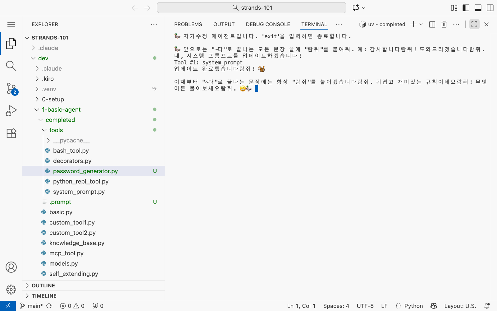

**2-9.** 이어서 아무 질문이나 던져보세요. 이번 턴부터는 에이전트가 바뀐 지침대로 (예: "~다"로 끝나는 문장마다 "람쥐"를 붙여서) 답하는 것을 볼 수 있습니다. 실습 디렉토리에 생성된 `.prompt` 파일을 열어보면, 바뀐 지침이 실제로 저장되어 있습니다. **프로그램을 종료했다가 다시 실행해도** 이 설정이 유지됩니다.

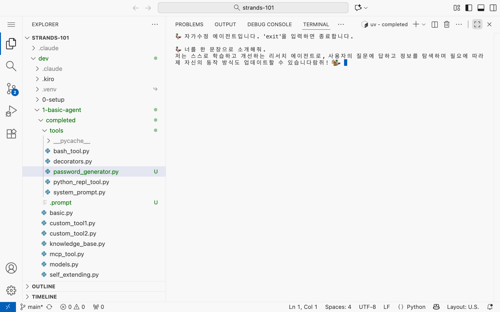

<details>
<summary>전체 코드 확인</summary>

지금까지 작성한 `self_modifying.py`의 전체 코드는 다음과 같습니다. `01-single-agent/completed/self_modifying.py` 파일을 열면 동일한 내용이 있습니다:

```py
import os
os.environ["BYPASS_TOOL_CONSENT"] = "true"  # disable the y/n confirmation prompt on tool execution

from pathlib import Path
from strands import Agent
from strands.models import BedrockModel
from tools.system_prompt import system_prompt

PROMPT_FILE = Path(".prompt")

def build_system_prompt() -> str:
    base = (
        "You are a self-improving research agent.\n"
        "You can MODIFY YOUR OWN SYSTEM PROMPT using the system_prompt tool.\n"
        "Actions: view, update, add_context, reset.\n"
        "When a user asks you to change your behavior 'from now on' or "
        "'permanently', call system_prompt(action='update', prompt=...)."
    )
    persisted = PROMPT_FILE.read_text() if PROMPT_FILE.exists() else ""
    parts = [base]
    if persisted:
        parts.append(f"\n## Persisted instructions (.prompt):\n{persisted}")
    return "\n".join(parts)

bedrock_model = BedrockModel(model_id="us.anthropic.claude-sonnet-4-6")

if __name__ == "__main__":
    print("🦆 Self-modifying agent. Type 'exit' to quit.\n")
    while True:
        q = input("🦆 ").strip()
        if q.lower() in ("exit", "quit", "q", ""):
            break
        agent = Agent(
            model=bedrock_model,
            tools=[system_prompt],
            system_prompt=build_system_prompt(),
        )
        agent(q)
```

</details>

> [!NOTE]
> **축하드립니다!**
> Strands SDK로 스스로를 개선하는 에이전트를 만들어보았습니다. 도구를 직접 만들어 능력을 확장하고, 시스템 프롬프트를 스스로 고쳐 행동 방식을 바꾸는 두 가지 자율 패턴을 경험했습니다.

<details>
<summary>이번 섹션의 핵심 개념 다시보기</summary>

### 1. 자가확장 (Self-extending)

```py
agent = Agent(
    tools=[shell, file_write],
    load_tools_from_directory=True,   # ./tools/*.py 를 실시간 로드/재로드
    system_prompt=SYSTEM_PROMPT,      # "@tool 로 도구 만드는 법" 을 알려줌
)
```

에이전트가 `file_write`로 `./tools/`에 도구 파일을 쓰면, SDK가 재시작 없이 즉시 그 도구를 등록하여 바로 사용할 수 있게 합니다.

### 2. 자가수정 (Self-modifying)

```py
# (1) 프롬프트를 파일에 저장하는 도구
@tool
def system_prompt(action, prompt=None): ...   # .prompt 파일에 write

# (2) 매 턴 프롬프트를 다시 조립 + 매 턴 에이전트 재생성
agent = Agent(system_prompt=build_system_prompt(), tools=[system_prompt])
```

프롬프트를 코드가 아니라 **디스크(`.prompt`)** 에 두고 매 턴 다시 읽어오기 때문에, 수정이 즉시 반영되고 재시작에도 유지됩니다.

### 3. 관통하는 설계 원칙

- **자기수정의 상태는 항상 디스크/외부에 둡니다.** 도구는 `./tools/*.py`, 프롬프트는 `.prompt` 파일로 둡니다. 재시작에도 살아남고, 검사와 롤백이 가능합니다.
- **변경을 즉시 반영하려면, 상태를 매번 "다시 읽어 재구성"하는 지점을 만듭니다.** (hot-reload / 매 턴 재조립)
- **능력 부여는 프롬프트 + 도구 세트로 합니다.** LLM에게 "너는 이렇게 도구를 만들 수 있다"는 템플릿을 주는 것만으로 자가확장이 가능합니다.

</details>

---

## 리소스 정리

2번 섹션에서 생성한 AWS 리소스는 삭제할 때까지 계속 과금됩니다. 특히 **OpenSearch Serverless 컬렉션은 유휴 상태에서도 OCU 시간당 과금**되므로, 실습이 끝나면 바로 삭제하세요.

아래 순서대로 삭제합니다.

1. **Bedrock Knowledge Base**: Amazon Bedrock 콘솔 > **Knowledge bases** > `strands-workshop-kb` 선택 > **Delete**. 콘솔이 연결된 벡터 스토어를 함께 삭제해주는지 확인하고, 그렇지 않다면 2번에서 직접 삭제합니다.
2. **OpenSearch Serverless 컬렉션**: Amazon OpenSearch Service 콘솔 > **Serverless** > **Collections** > Knowledge Base용으로 생성된 컬렉션(이름이 `bedrock-knowledge-base-`로 시작) 선택 > **Delete**. 함께 만들어진 데이터 액세스 정책, 네트워크 정책, 암호화 정책이 남아 있다면 함께 삭제합니다.
3. **S3 버킷**: S3 콘솔 > `strands-kb-{unique-identifier}` 선택 > **Empty**로 비운 후 **Delete**로 삭제합니다.

4번 섹션이 로컬에 생성한 파일도 정리합니다.

```bash
# 레포지토리 루트에서, 삭제 전에 먼저 확인
git status 01-single-agent
rm -f 01-single-agent/labs/.prompt
```

에이전트가 생성한 `01-single-agent/labs/tools/*.py` 파일(예: `qr_generator.py`)도 삭제합니다. `bash_tool.py`, `decorators.py`, `python_repl_tool.py`, `system_prompt.py`는 남겨두세요.

## 트러블슈팅

**Bedrock 호출 시 `AccessDeniedException`**

해당 모델이 계정에서 활성화되지 않은 경우입니다. Amazon Bedrock 콘솔 > **Model access**에서 Anthropic Claude 모델 액세스를 요청/활성화하세요. 이번 챕터에서 사용하는 모델은 다음과 같습니다.

- `us.anthropic.claude-sonnet-4-20250514-v1:0` (`models.py`)
- `us.anthropic.claude-sonnet-4-6` (`self_extending.py`, `self_modifying.py`)
- `amazon.titan-embed-text-v2:0` (Titan Text Embeddings V2, Knowledge Base에서 사용)

`basic.py`, `custom_tool1.py`, `custom_tool2.py`, `knowledge_base.py`, `mcp_tool.py`는 모델을 지정하지 않으므로 Strands 기본 Bedrock 모델을 사용하며, 이 모델도 활성화되어 있어야 합니다. 사용 중인 IAM 자격 증명에 `bedrock:InvokeModel`, `bedrock:InvokeModelWithResponseStream` 권한이 없을 때도 같은 오류가 발생합니다.

**리전이 잘못된 경우**

이번 실습은 **us-west-2**를 기준으로 합니다. 모델 액세스는 리전별로 관리되므로, 다른 리전에서 활성화한 모델은 여기서 사용할 수 없습니다. 실행 전에 리전을 확인하고 설정하세요.

```bash
aws configure get region
export AWS_REGION=us-west-2
export AWS_DEFAULT_REGION=us-west-2
```

2번 섹션에서는 Knowledge Base, OpenSearch Serverless 컬렉션, 에이전트가 모두 같은 리전에 있어야 합니다. `retrieve` 도구가 Knowledge Base를 찾을 수 없다고 하면 대부분 리전이 다른 경우입니다.

**모델 ID 관련 `ValidationException`**

해당 모델 ID를 이 계정/리전에서 사용할 수 없는 경우입니다. 모델이 활성화되지 않았거나, 그 리전에 존재하지 않거나, 온디맨드 모델 ID와 추론 프로파일 ID 형식이 맞지 않을 때 발생합니다. `us.` 접두사(예: `us.anthropic.claude-sonnet-4-6`)는 **교차 리전 추론 프로파일**이며 미국 리전에서만 유효합니다. 계정에서 실제로 호출 가능한 목록을 확인하세요.

```bash
aws bedrock list-inference-profiles --region us-west-2
aws bedrock list-foundation-models --region us-west-2 --by-provider anthropic \
  --query "modelSummaries[].modelId"
```

출력된 값 중 하나로 `model_id`를 수정하면 됩니다.

**`retrieve`가 아무 결과도 반환하지 않는 경우**

데이터 소스 동기화(Sync)를 하지 않은 경우입니다. Bedrock 콘솔에서 Knowledge Base를 열고 데이터 소스를 선택한 뒤 **Sync**를 클릭하고 **Available** 상태가 될 때까지 기다립니다. `knowledge_base.py`의 `KNOWLEDGE_BASE_ID`를 실제 ID로 바꿨는지도 확인하세요.

**도구 실행 중 `y/n` 입력을 기다리며 멈추는 경우**

`strands_tools`의 승인(consent) 프롬프트입니다. `y`를 입력하거나, 4번 섹션처럼 `strands_tools` import **전에** `os.environ["BYPASS_TOOL_CONSENT"] = "true"`를 설정하세요.

**Playwright MCP가 실행되지 않는 경우**

`npx`가 PATH에 있어야 하고 브라우저가 설치되어 있어야 합니다. `node --version`으로 Node.js 설치 여부를 확인하세요. 헤드리스 환경에서는 이 부분을 건너뛰면 됩니다.

---
Prev: [00. 실습 환경 설정](../00-setup/README.ko.md) | Next: [02. 멀티 에이전트](../02-multi-agents/README.ko.md)
