# 2. 멀티 에이전트 패턴을 통해 복잡한 작업을 수행하는 시스템 구축하기

<p align="center"><a href="README.ko.md">한국어</a> | <a href="README.md">English</a></p>

[English README](README.md)

이번 실습에서는 Strands Agents SDK의 멀티 에이전트 패턴을 사용하여 여러 에이전트가 협업하는 시스템을 구축하는 방법을 학습합니다. 아래 3가지의 멀티 에이전트 패턴을 실습하며, 단일 에이전트로는 해결하기 어려운 복잡한 태스크를 처리하는 에이전트 시스템을 만들어봅니다.


> [!NOTE]
> **사전 준비 사항**
> - [00-setup](../00-setup/README.ko.md) 에 따라 환경 설정 완료
> - `us-west-2` 리전에서 `us.anthropic.claude-sonnet-4-20250514-v1:0`(SDK 기본 모델)과 `us.anthropic.claude-sonnet-4-6` 에 대한 Amazon Bedrock 모델 액세스 활성화
> - [01 챕터](../01-single-agent/README.ko.md)를 먼저 진행하는 것을 권장합니다. 이번 챕터는 `Agent` 를 생성하고 도구를 전달하는 방법을 이미 알고 있다고 가정합니다.

**이번 챕터에서 배우는 내용**

- `@tool` 로 전문 에이전트를 도구로 래핑하고, 오케스트레이터가 요청을 라우팅하도록 구성하기 (Agents-as-Tools)
- `Swarm` 으로 에이전트들이 자율적으로 작업을 handoff 하도록 구성하기
- `GraphBuilder` 로 실행 순서와 의존성을 명시적으로 정의하고 병렬 분기를 만들기
- 조건부 엣지로 그래프를 서로 다른 에이전트로 분기하기
- 주어진 작업에 어떤 패턴이 적합한지 판단하기

**예상 소요 시간:** 약 30분

## 이번 챕터의 파일

| 파일 | 용도 |
|---|---|
| `labs/agents_as_tools.py` | (빈 파일) 직접 작성합니다 |
| `labs/swarms.py` | (빈 파일) 직접 작성합니다 |
| `labs/graph_parallel.py` | (빈 파일) 직접 작성합니다 |
| `labs/graph_condition.py` | (빈 파일) 직접 작성합니다 |
| `completed/agents_as_tools.py` | 정답 코드 |
| `completed/swarms.py` | 정답 코드 |
| `completed/graph_parallel.py` | 정답 코드 |
| `completed/graph_condition.py` | 정답 코드 |
| `completed/artifacts-agents_as_tools/` | 이전 실행 결과 예시 (`plan.md`) |
| `completed/artifacts-swarms/` | 이전 실행 결과 예시 (`research.md`, `creative.md`, `critical.md`, `summarizer.md`, `travel_plan.md`) |
| `completed/artifacts-graph/` | 이전 실행 결과 예시 (`business_report.md`, `technical_report.md`) |

실습 방식은 다른 챕터와 동일합니다. `labs/` 폴더의 빈 파일에 코드를 직접 작성하고, `completed/` 폴더의 완성된 코드는 정답으로 참고합니다. 막힐 때만 completed 파일을 열어보세요.

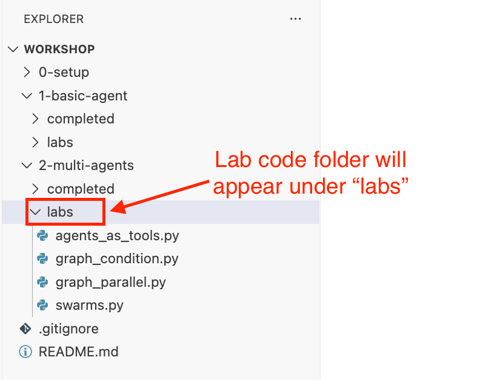

> [!NOTE]
> **`artifacts-*` 폴더는 소스 코드가 아니라 실행 결과입니다**
> `completed/artifacts-agents_as_tools/`, `completed/artifacts-swarms/`, `completed/artifacts-graph/` 는 스크립트를 실행했을 때 생성된 마크다운 파일입니다. 완성된 실행 결과가 어떤 형태인지 확인할 수 있도록 저장해 둔 것이며, 직접 작성하거나 복사할 필요는 없습니다.
>
> 이번 챕터의 모든 실습은 `strands-agents-tools` 의 `file_write` 도구에 상대 경로 파일명(`plan.md`, `research.md`, `travel_plan.md`, `business_report.md` 등)을 전달합니다. 따라서 파일은 **명령어를 실행한 디렉토리**에 생성됩니다. 아래 명령어를 리포지토리 루트에서 실행하면 생성된 파일도 리포지토리 루트에 생깁니다. 작업 디렉토리를 깔끔하게 유지하려면 `02-multi-agents/labs/artifacts-swarms/` 처럼 별도 폴더로 옮기거나 삭제하세요.

> [!NOTE]
> `completed/` 의 정답 코드는 모델을 명시적으로 지정하는 부분에서 `us.anthropic.claude-sonnet-4-6` 을 사용합니다. `model` 인자 없이 생성된 에이전트는 SDK 기본 모델을 사용합니다. 다른 Bedrock 모델을 사용하려면 코드의 모델 ID를 변경하고, 해당 모델의 액세스 권한이 있는지 확인하세요.

---

## 1. Agents-as-Tools 패턴

[Agents-as-Tools 패턴](https://strandsagents.com/docs/user-guide/concepts/multi-agent/agents-as-tools/)은 전문화된 에이전트를 도구로 래핑하여 다른 에이전트가 필요에 따라 호출할 수 있게 하는 방식입니다.

### 실습 시나리오

만약 **사용자가 *"스페인에 대해 조사하고, 가족 여행 계획을 세우고, 결과를 파일로 저장해줘"* 처럼 여러 전문 영역이 섞인 복잡한 요청을 하는 상황**이라면 어떨까요?

단일 에이전트가 이 모든 요청을 처리하기에 과부하가 걸릴 수 있습니다. 이럴 때 **여행 계획 에이전트**, **리서치 에이전트** 등과 같이 각각의 에이전트는 본인의 전문 분야를 가지도록 하고, **이들을 도구로 활용하는 Orchestrator 에이전트**를 중간에 두면, 각 에이전트가 자신의 전문 분야에만 집중하여 더욱 정확하고 효율적으로 요청을 처리할 수 있습니다.

이번 실습에서는 Agents-as-Tools 패턴을 활용해서, 리서치, 제품 추천, 여행 계획 등 다양한 전문 영역의 요청을 자동으로 분류하고 적절한 전문 에이전트에게 위임하는 멀티 에이전트 시스템을 만들어보겠습니다.

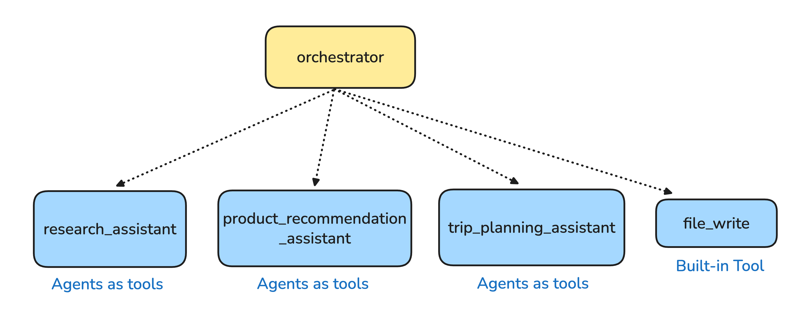

**1-1.** `02-multi-agents/labs/agents_as_tools.py` 파일을 엽니다.

**1-2.** 필요한 라이브러리를 import 합니다.

```python
import os
from strands import Agent, tool
from strands_tools import file_write

# file_write 확인 프롬프트 비활성화
os.environ['BYPASS_TOOL_CONSENT'] = 'true' 

```

**1-3.** 리서치 에이전트(`research_assistant`)를 `@tool`로 래핑합니다.

연구 관련 질문에 특화된 에이전트를 도구로 만듭니다. 이 에이전트는 국가, 주제 등에 대한 정보 조사를 전담합니다.

```python
@tool
def research_assistant(query: str) -> str:
    """
    Processes and responds to research-related queries.

    Args:
        query: Research question requiring factual information

    Returns:
        Detailed research answer with citations
    """
    try:
        research_agent = Agent(
            system_prompt="""You are a professional research assistant.
            Focus on providing only factual information with clear sources for research questions.
            Always cite sources whenever possible.""",
        )
        response = research_agent(query)
        return str(response)
    except Exception as e:
        return f"Error in research assistant: {str(e)}"

```

`@tool` 데코레이터로 감싸진 함수 내부에서 전문 에이전트를 생성하고 호출합니다. 이렇게 하면 에이전트가 하나의 도구처럼 동작합니다.

**1-4.** 제품 추천 에이전트(`product_recommendation_assistant`)를 도구로 추가합니다.

사용자 선호도를 바탕으로 개인화된 제품 제안을 제공하는 전문 에이전트입니다.

```python
@tool
def product_recommendation_assistant(query: str) -> str:
    """
    Handles product recommendation queries by suggesting appropriate products.

    Args:
        query: Product inquiry including user preferences

    Returns:
        Personalized product recommendations with reasoning
    """
    try:
        product_agent = Agent(
            model="us.anthropic.claude-sonnet-4-6",
            system_prompt="""You are a professional product recommendation assistant.
            Provide personalized product suggestions based on user preferences. Always cite sources.""",
        )
        response = product_agent(query)
        return str(response)
    except Exception as e:
        return f"Error in product recommendation: {str(e)}"

```

**1-5.** 여행 계획 에이전트(`trip_planning_assistant`)를 도구로 추가합니다.

목적지 및 여행 일정을 계획하고 여행 조언을 제공하는 전문 에이전트입니다.

```python
@tool
def trip_planning_assistant(query: str) -> str:
    """
    Creates travel itineraries and provides travel advice.

    Args:
        query: Travel planning request including destination and preferences

    Returns:
        Detailed travel itinerary or travel advice
    """
    try:
        travel_agent = Agent(
            model="us.anthropic.claude-sonnet-4-6",
            system_prompt="""You are a professional travel planning assistant.
            Create detailed travel itineraries based on user preferences.""",
        )
        response = travel_agent(query)
        return str(response)
    except Exception as e:
        return f"Error in trip planning: {str(e)}"

```

**1-6.** 오케스트레이터 에이전트를 생성하고, 실행합니다.

```python
if __name__ == "__main__":

    MAIN_SYSTEM_PROMPT = """
    You are an assistant that routes queries to specialized agents:
    - For research questions and factual information → use the research_assistant tool
    - For product recommendations and shopping advice → use the product_recommendation_assistant tool
    - For travel planning and itineraries → use the trip_planning_assistant tool
    - For simple questions that don't require specialized knowledge → answer directly

    Always select the most appropriate tool based on the user's query.
    """

    orchestrator = Agent(
        system_prompt=MAIN_SYSTEM_PROMPT,
        tools=[
            research_assistant,
            product_recommendation_assistant,
            trip_planning_assistant,
            file_write,
        ],
    )

    os.environ["DEV"] = "true"
    customer_query = "Can you research Spain for me? And I'm planning to travel there with my parents for 7 days, can you help me plan it? Please save the plan you create to a plan.md file."

    response = orchestrator(customer_query)
```

오케스트레이터는 사용자 요청을 분석하여 적절한 전문 에이전트(도구)를 선택하고 호출합니다.

**1-7.** 터미널에서 아래 명령어를 실행하여 결과를 확인합니다:

```bash
uv run --project 00-setup python 02-multi-agents/labs/agents_as_tools.py
```

오케스트레이터가 질문을 분석하여 먼저 `research_assistant`를 호출하고, 그 다음 `trip_planning_assistant`를 호출하여 여행 계획을 세우고, 마지막으로 `file_write`로 `plan.md`를 저장하는 것을 확인할 수 있습니다.

| `research_assistant`를 도구로 호출 | `trip_planning_assistant`를 도구로 호출 | `file_write` 도구 호출 |
|----------|---------|----------|
| 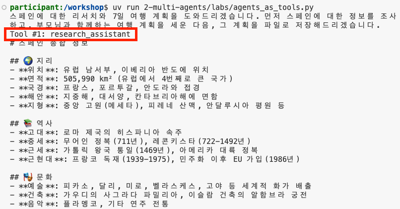 | 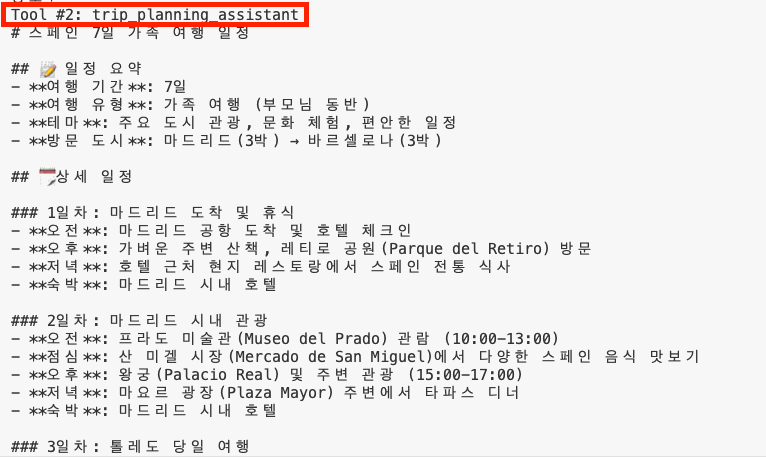 | 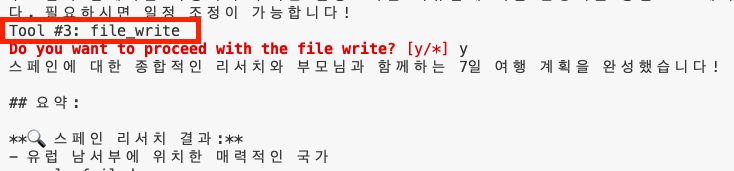 |

*최종 결과물:*


<details>
<summary>Agents-as-Tools 패턴 알아보기</summary>

Agents-as-Tools 패턴의 핵심은 **에이전트를 도구로 래핑**하는 것입니다.

방금 우리가 Tool로 정의했던 `research_assistant`, `product_recommendation_assistant`, `trip_planning_assistant`는 각각 내부에 전문화된 에이전트를 가지고 있습니다. 이 에이전트들은:

1. 오케스트레이터로부터 특정 요청을 받으면
2. 에이전트처럼 자율적으로 방법을 판단하고
3. 필요한 경우 자신만의 도구를 사용하여 작업을 수행합니다

계층 구조 시각화:

```
                        Orchestrator (최상위 - 라우터)
                                   |
        ┌──────────────────────────┼────────────────────────────┬──────────────┐
        ↓                          ↓                            ↓              ↓
   research_assistant    product_recommendation    trip_planning_assistant   file_write
   (에이전트이자 도구)         (에이전트이자 도구)           (에이전트이자 도구)          (Built-in 도구)     
```

이처럼 Strands SDK는 에이전트를 도구로 래핑하여 **계층적 멀티 에이전트 시스템**을 손쉽게 구현할 수 있게 합니다.

더 자세한 내용은 [공식 문서](https://strandsagents.com/docs/user-guide/concepts/multi-agent/agents-as-tools/)를 참고하세요.

</details>

---

## 2. Swarm 패턴

[Swarm 패턴](https://strandsagents.com/docs/user-guide/concepts/multi-agent/swarm/)은 여러 전문 에이전트가 자율적으로 협업하며 작업을 handoff(전달)하는 방식입니다. 에이전트들이 서로 필요에 따라 작업을 넘겨주며 최종 결과를 만들어냅니다.

### 실습 시나리오

**복잡한 프로젝트를 수행할 때 여러 전문가가 작업을 주고받으며 협업해야 하는 상황**을 가정해봅시다.

예를 들어 여행 프로그램을 기획할 때, 한 명의 전문가가 모든 일정을 다 짜기보다는, 리서치 전문가가 먼저 정보를 조사하고, 기획자가 창의적인 아이디어를 더하고, 비평가가 현재 자료의 문제점을 찾아내고, 마지막으로 모든 내용을 종합하는 과정을 거친다면 훨씬 더 다채로운 프로그램이 완성될 수 있습니다.

Agents-as-Tools에서는 중앙에서 오케스트레이터 에이전트가 작업을 분배했다면, **Swarm 패턴에서는 각 에이전트가 스스로 판단하여 다음 적절한 전문가에게 작업을 전달 (handoff)**합니다. 이를 통해 더욱 유연하고 자율적인 협업이 가능합니다.

이번 실습에서는 사용자가 "해외 MZ세대와 함께 대한민국 서울을 여행하는 프로그램을 구상중입니다. 3일 여행의 스케줄을 짜주세요. 최종 결과는 travel_plan.md 파일에 한국어로 저장하세요." 라고 요청했을 때, Swarm 패턴을 통해 리서치, 창의성, 비평, 요약 등 다양한 전문 영역과 성격을 가진 에이전트들이 자율적으로 협업하여 여행 프로그램을 기획하는 시스템을 만들어보겠습니다.

**구축할 시스템:**
- **research_agent**: 주제에 대한 **정보 수집 및 분석** 전담
- **creative_agent**: 리서치를 바탕으로 **창의적인 아이디어** 제안 전담
- **critical_agent**: 제안된 아이디어의 **문제점 발견 및 개선안 제시** 전담
- **summarizer_agent**: 모든 에이전트의 **결과를 종합하여 최종 결과 작성** 전담


**2-1.** `02-multi-agents/labs/swarms.py` 파일을 엽니다.

**2-2.** 필요한 라이브러리를 import 합니다.

```python
import os
import logging
from strands import Agent
from strands.multiagent import Swarm
from strands.models import BedrockModel
from strands_tools import file_write

os.environ['BYPASS_TOOL_CONSENT'] = 'true' # Disable file_write confirmation prompt

logging.getLogger("strands.multiagent").setLevel(logging.DEBUG)
logging.basicConfig(
    format="%(levelname)s | %(name)s | %(message)s",
    handlers=[logging.StreamHandler()]
)

```

**2-3.** 공통 모델을 설정합니다.

```python
model = BedrockModel(
    model_id="us.anthropic.claude-sonnet-4-6",
    max_tokens=64000
)

```

**2-4.** 리서치 에이전트(`research_agent`)를 생성합니다.

주제에 대한 정보 수집 및 분석을 전담하는 에이전트입니다.

```python
research_agent = Agent(
    name="research_agent",
    model=model,
    system_prompt="""You are a research agent specializing in information collection and analysis.
    Your role in the Swarm is to provide factual information and research insights on topics.
    Focus on providing accurate data and identifying key aspects of problems.

    Important: After completing research, you must save results to a 'research.md' file using the file_write tool, then hand off work to other agents.
    When creative input or critical analysis is needed, use handoff_to_agent to transfer work to appropriate experts.""",
    tools=[file_write]
)

```

Swarm에서는 각 에이전트가 `handoff_to_agent` 기능을 사용하여 다른 에이전트에게 작업을 전달할 수 있습니다.

**2-5.** 나머지 전문 에이전트들을 생성합니다.

크리에이티브 에이전트(`creative_agent`), 비평 에이전트(`critical_agent`), 요약 에이전트(`summarizer_agent`)를 차례로 생성합니다.

```python
creative_agent = Agent(
    name="creative_agent",
    model=model,
    system_prompt="""You are a creative agent specializing in generating innovative solutions.
    Your role in the Swarm is to think outside the box and suggest creative approaches.
    Based on information from other agents, you should add your own unique creative perspective.

    Important: After completing creative suggestions, you must save them to a 'creative.md' file using the file_write tool, then hand off work to other agents.
    When research data or critical evaluation is needed, transfer work to appropriate agents.""",
    tools=[file_write]
)

critical_agent = Agent(
    name="critical_agent",
    model=model,
    system_prompt="""You are a critical agent specializing in proposal analysis and problem identification.
    Your role in the Swarm is to evaluate solutions proposed by other agents and identify potential issues.
    You should carefully review proposed solutions and find weaknesses or improvement opportunities.

    Important: After completing analysis, you must save results to a 'critical.md' file using the file_write tool, then hand off work to other agents.
    When additional research or creative alternatives are needed, transfer work to appropriate agents.""",
    tools=[file_write]
)

summarizer_agent = Agent(
    name="summarizer_agent",
    model=model,
    system_prompt="""You are a summarizer agent specializing in synthesizing information from multiple sources.
    Your role in the Swarm is to receive input from other agents and create comprehensive, well-structured summaries.
    You should integrate insights from research, creative, and critical perspectives to create coherent final results.

    Important: After writing summaries, you must save them to a 'summarizer.md' file using the file_write tool.""",
    tools=[file_write]
)

```

**2-6.** Swarm을 생성하고 실행합니다.

```python
swarm = Swarm(
    [research_agent, creative_agent, critical_agent, summarizer_agent],
    max_handoffs=20,
    max_iterations=20,
    execution_timeout=900.0,  # 15 minutes
    node_timeout=300.0,       # 5 minutes per agent
    repetitive_handoff_detection_window=8,
    repetitive_handoff_min_unique_agents=3
)

result = swarm("I am planning a program for traveling Seoul, South Korea with the overseas MZ generation. Please create a 3-day travel schedule. Save the final result in a travel_plan.md file.")

```

Swarm은 여러 에이전트를 리스트로 받아 자율적으로 협업하도록 합니다.

**2-7.** 결과를 확인합니다.

```python
print(f"Status: {result.status}")
print(f"Node history: {[node.node_id for node in result.node_history]}")
print(f"Final result: {result.results}")

print(f"Total iterations: {result.execution_count}")
print(f"Execution time: {result.execution_time}ms")
print(f"Token usage: {result.accumulated_usage}")

```

**2-8.** 터미널에서 실행하여 결과를 확인합니다:

```bash
uv run --project 00-setup python 02-multi-agents/labs/swarms.py
```

에이전트들이 자율적으로 서로에게 작업을 전달하며 협업하는 과정을 확인할 수 있습니다. 예를 들어 research_agent → creative_agent → critical_agent → summarizer_agent 순서로 handoff가 발생할 수 있습니다.

| **최종 결과** | `creative_agent` 결과 | `critical_agent` 결과 | `summarizer_agent` 결과 |
|----------|---------|----------|----------|
| 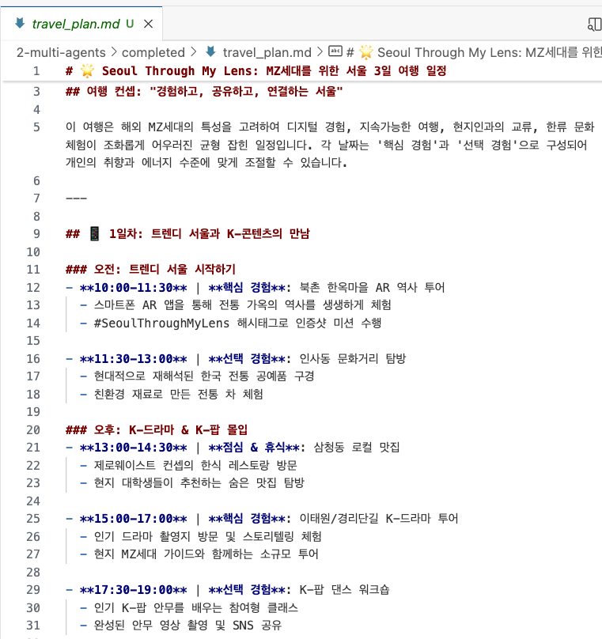 | 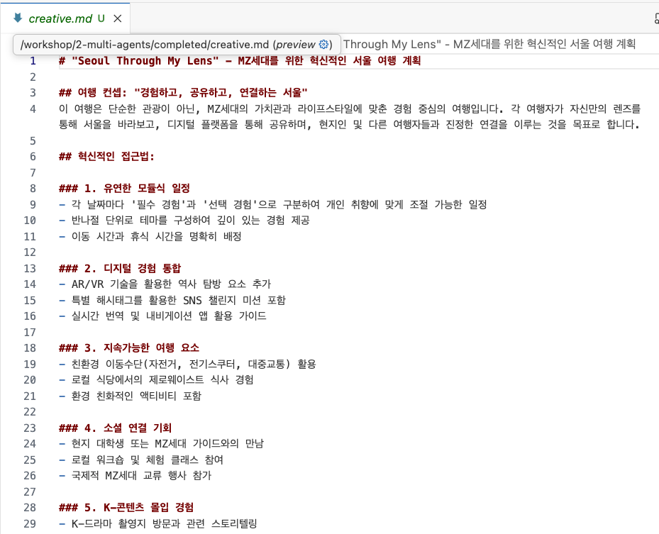 | 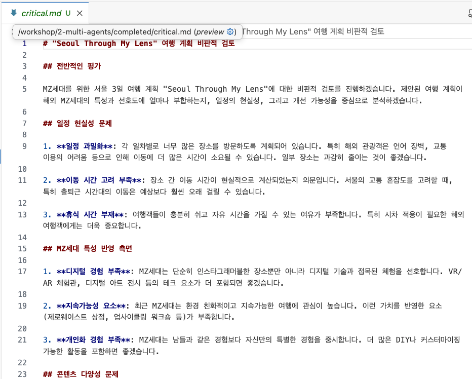 | 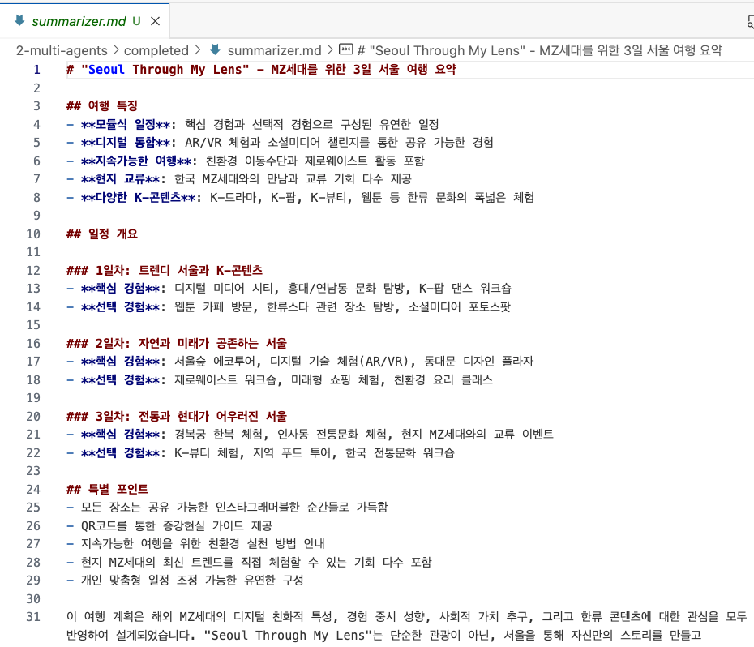 |

이 실습은 최대 5개의 마크다운 파일(`research.md`, `creative.md`, `critical.md`, `summarizer.md`, `travel_plan.md`)을 생성합니다. 결과 예시는 `completed/artifacts-swarms/` 에서 확인할 수 있습니다.

<details>
<summary>Swarm 패턴 알아보기</summary>

Swarm 패턴의 핵심은 **자율적 협업**입니다.

Agents-as-Tools와 달리 Swarm에서는:
- 중앙 오케스트레이터가 없습니다
- 각 에이전트가 스스로 판단하여 다른 에이전트에게 작업을 전달합니다
- `handoff_to_agent` 기능을 통해 동적으로 협업합니다

Swarm 실행 흐름 예시:

```
사용자 요청: "서울 3일 여행 계획을 세워주세요"
       ↓
research_agent 시작
  - 서울 관광지, 교통, 숙박 정보 조사
  - research.md 파일 저장
  - handoff → creative_agent
       ↓
creative_agent
  - 조사 결과를 바탕으로 창의적인 일정 제안
  - creative.md 파일 저장
  - handoff → critical_agent
       ↓
critical_agent
  - 제안된 일정의 실현 가능성, 문제점 분석
  - critical.md 파일 저장
  - handoff → summarizer_agent
       ↓
summarizer_agent
  - 모든 정보를 종합하여 최종 여행 계획 작성
  - travel_plan.md 파일 저장
```

더 자세한 내용은 [공식 문서](https://strandsagents.com/docs/user-guide/concepts/multi-agent/swarm/)를 참고하세요.

</details>

---

## 3. Graph 패턴: 기본 및 병렬 실행

[Graph 패턴](https://strandsagents.com/docs/user-guide/concepts/multi-agent/graph/)은 에이전트들 간의 실행 순서와 의존성을 명시적으로 정의하여 구조화된 워크플로우를 만드는 방식입니다.

### 실습 시나리오

만약 **복잡한 의사결정을 위해 여러 전문가의 독립적인 평가가 동시에 필요한 상황**이라면 어떨까요?

예를 들어, 신규 AI 플랫폼 출시를 검토할 때 재무 고문이 먼저 재무 분석을 하고, 그 다음 기술 설계자와 시장 조사원이 동시에 각자의 분석을 수행한 후, 마지막으로 위험 분석가가 모든 결과를 종합하여 위험을 평가하는 워크플로우가 필요합니다.

**Graph 패턴에서는 개발자가 명시적으로 실행 순서와 의존성을 정의**합니다. 이를 통해 예측 가능하고 일관된 워크플로우를 구축할 수 있습니다.

이번 실습에서는 병렬 실행을 활용하여 독립적인 작업을 동시에 수행함으로써 전체 실행 시간을 단축하는 시스템을 만들어보겠습니다.

**구축할 시스템:**
- **financial_advisor**: 비용 편익 분석 및 ROI 계산
- **technical_architect**: 기술적 타당성 및 구현 위험 평가
- **market_researcher**: 시장 상황 및 경쟁 환경 분석
- **risk_analyst**: 종합 위험 평가 및 완화 전략 제시


**3-1.** `02-multi-agents/labs/graph_parallel.py` 파일을 엽니다.

**3-2.** 필요한 라이브러리를 import하고 전문 에이전트들을 생성합니다.

재무 고문(`financial_advisor`), 기술 설계자(`technical_architect`), 시장 조사원(`market_researcher`), 위험 분석가(`risk_analyst`)를 생성합니다.

```python
from strands import Agent
from strands.multiagent import GraphBuilder

financial_advisor = Agent(name="financial_advisor", system_prompt="You are a financial advisor focusing on cost-benefit analysis, budget impact, and ROI calculations. Collaborate with other experts to build comprehensive financial perspectives.")
technical_architect = Agent(name="technical_architect", system_prompt="You are a technical architect evaluating feasibility, implementation challenges, and technical risks. Collaborate with other experts to ensure technical viability.")
market_researcher = Agent(name="market_researcher", system_prompt="You are a market researcher analyzing market conditions, user needs, and competitive environment. Collaborate with other experts to validate market opportunities.")
risk_analyst = Agent(name="risk_analyst", system_prompt="You are a risk analyst identifying potential risks, mitigation strategies, and compliance issues. Collaborate with other experts to ensure comprehensive risk assessment.")

```

**3-3.** GraphBuilder를 사용하여 그래프를 구성합니다.

```python
builder = GraphBuilder()

builder.add_node(financial_advisor, "finance_expert")
builder.add_node(technical_architect, "tech_expert")
builder.add_node(market_researcher, "market_expert")
builder.add_node(risk_analyst, "risk_analyst")

# Define parallel execution
builder.add_edge("finance_expert", "tech_expert")
builder.add_edge("finance_expert", "market_expert")
builder.add_edge("tech_expert", "risk_analyst")
builder.add_edge("market_expert", "risk_analyst")

builder.set_entry_point("finance_expert")

graph = builder.build()

```

`add_edge("finance_expert", "tech_expert")`는 `finance_expert`가 완료된 후 `tech_expert`가 실행된다는 의미입니다.

이 구조에서는 `finance_expert`가 먼저 실행된 후, `tech_expert`와 `market_expert`가 병렬로 실행되고, 마지막으로 `risk_analyst`가 실행됩니다.

**3-4.** 그래프를 실행하고 각 노드의 결과를 확인합니다.

```python
result = graph("Our company is considering launching a new AI-based customer service platform. The initial investment is $2 million with an expected 3-year ROI of 150%. Please provide a financial evaluation.")

print(f"Response: {result}")

for node in result.execution_order:
    print(f"Executed: {node.node_id}")

print(f"Total nodes: {result.total_nodes}")
print(f"Completed nodes: {result.completed_nodes}")
print(f"Execution time: {result.execution_time}ms")

print("Financial Advisor:")
print(result.results["finance_expert"].result)
print("============================================================\n")

print("Technical Expert:")
print(result.results["tech_expert"].result)
print("============================================================\n")

print("Market Researcher:")
print(result.results["market_expert"].result)
print("============================================================\n")

```

**3-5.** 터미널에서 실행하여 결과를 확인합니다:

```bash
uv run --project 00-setup python 02-multi-agents/labs/graph_parallel.py
```

`tech_expert`와 `market_expert`가 병렬로 실행되어 전체 실행 시간이 단축되는 것을 확인할 수 있습니다.

<details>
<summary>Graph 패턴 알아보기</summary>

Graph 패턴의 핵심은 **명시적 워크플로우 정의**입니다.

Graph 패턴의 장점:
- **명확한 실행 순서**: 어떤 에이전트가 언제 실행될지 예측 가능
- **조건부 분기**: 이전 결과에 따라 다른 경로로 실행
- **병렬 처리**: 독립적인 작업을 동시에 수행하여 효율성 향상
- **복잡한 워크플로우**: 여러 단계의 복잡한 프로세스를 구조화

Graph vs Swarm 비교:

| 특성 | Graph | Swarm |
|------|-------|-------|
| 실행 흐름 | 명시적으로 정의됨 | 에이전트가 자율적으로 결정 |
| 예측 가능성 | 높음 | 낮음 (동적) |
| 제어 | 개발자가 완전히 제어 | 에이전트에게 위임 |
| 적합한 사용 사례 | 정형화된 프로세스 | 창의적 협업 |
| 병렬 처리 | 명시적 정의 가능 | 자동 결정 |

더 자세한 내용은 [공식 문서](https://strandsagents.com/docs/user-guide/concepts/multi-agent/graph/)를 참고하세요.

</details>

---

## 4. Graph 패턴: 조건부 라우팅

조건에 따라 다른 경로로 실행 흐름을 분기하는 Graph를 만들어봅니다.

### 실습 시나리오

만약 **요청의 유형에 따라 다른 전문가에게 작업을 할당해야 하는 상황**이라면 어떨까요?

예를 들어, 보고서 작성 요청이 들어왔을 때 기술적인 보고서인지 비즈니스 보고서인지를 먼저 분류하고, 그에 맞는 전문가에게 작업을 전달하는 시스템이 필요합니다.

이번 실습에서는 조건부 라우팅을 활용하여 분류 결과에 따라 적절한 전문가로 자동 분기하는 시스템을 만들어보겠습니다.

**구축할 시스템:**
- **classifier**: 요청을 Technical 또는 Business로 분류
- **technical_report**: 기술적 관점의 보고서 작성
- **business_report**: 비즈니스 관점의 보고서 작성


**4-1.** `02-multi-agents/labs/graph_condition.py` 파일을 엽니다.

**4-2.** 필요한 라이브러리를 import하고 에이전트를 생성합니다.

분류 에이전트(`classifier`), 기술 전문가(`technical_report`), 비즈니스 전문가(`business_report`)를 생성합니다.

```python
import os, argparse
from strands import Agent
from strands.multiagent import GraphBuilder
from strands_tools import file_write

os.environ['BYPASS_TOOL_CONSENT'] = 'true' # Disable file_write confirmation prompt

classifier = Agent(
    name="classifier", 
    system_prompt="You are an agent that classifies report requests. Return only Technical or Business classification."
    )

technical_report = Agent(
    name="technical_expert", 
    system_prompt="You are a technical expert who writes reports from a technical perspective. Save reports as technical_report.md.",
    tools=[file_write]
    )
    
business_report = Agent(
    name="business_expert", 
    system_prompt="You are a business expert who writes reports from a business perspective. Save reports as business_report.md.",
    tools=[file_write]
    )

```

**4-3.** 조건 함수를 정의합니다.

```python
def is_technical(state):
    classifier_result = state.results.get("classifier")
    if not classifier_result:
        return False
    result_text = str(classifier_result.result)
    return "technical" in result_text.lower()

def is_business(state):
    classifier_result = state.results.get("classifier")
    if not classifier_result:
        return False
    result_text = str(classifier_result.result)
    return "business" in result_text.lower()

```

조건 함수는 이전 노드의 결과를 확인하여 True/False를 반환합니다.

**4-4.** 조건부 엣지를 추가하여 그래프를 구성합니다.

```python
builder = GraphBuilder()

builder.add_node(classifier, "classifier")
builder.add_node(technical_report, "technical_report")
builder.add_node(business_report, "business_report")

# Add conditional edges
builder.add_edge("classifier", "technical_report", condition=is_technical)
builder.add_edge("classifier", "business_report", condition=is_business)

builder.set_entry_point("classifier")

graph = builder.build()

```

`condition` 파라미터로 조건 함수를 전달하면 해당 조건이 True일 때만 엣지가 활성화됩니다.

**4-5.** main 문에는 유저의 요청을 `--query` 파라미터로 받아 테스트하는 코드를 붙여넣기합니다. 추가로, 어떤 Node로 요청이 향했는지, 토큰은 얼마나 사용했는지, 몇 초가 걸렸는지 등을 확인하기 위해 result 에서 다양한 메타데이터를 추출해 출력해봅니다.

```python

if __name__ == "__main__":
    
    parser = argparse.ArgumentParser()
    parser.add_argument(
        "--query",
        type=str,
        default="Please write a report on the impact of remote work on business. Summarize considerations and key risk factors."
    )

    args = parser.parse_args()
    prompt = args.query

    print(f"Input Prompt: {prompt}")
    print("\n============================================================")

    result = graph(prompt)

    print(f"Response: {result}")

    for node in result.execution_order:
        print(f"Executed: {node.node_id}")

    print("\n============================================================")
    print("Classifier:")
    print(result.results["classifier"].result)

    print(f"Total nodes: {result.total_nodes}")
    print(f"Completed nodes: {result.completed_nodes}")
    print(f"Failed nodes: {result.failed_nodes}")
    print(f"Execution time: {result.execution_time}ms")
    print(f"Token usage: {result.accumulated_usage}")
    print("\n============================================================\n")

```

**4-6.** 터미널에서 아래 쿼리를 실행하고, business_report 노드로 요청이 잘 라우팅되었는지 결과를 확인합니다:

```bash
uv run --project 00-setup python 02-multi-agents/labs/graph_condition.py \
--query "재택근무가 비즈니스에 미치는 영향에 대한 보고서를 작성해주세요. 고려해야 할 사항과 주요 위험 요소를 요약하세요"
```

*결과 예시:*

| business_report 노드를 호출 | 결과를 요약하여 business_report.md 에 파일로 저장 |
|----------|------|
| 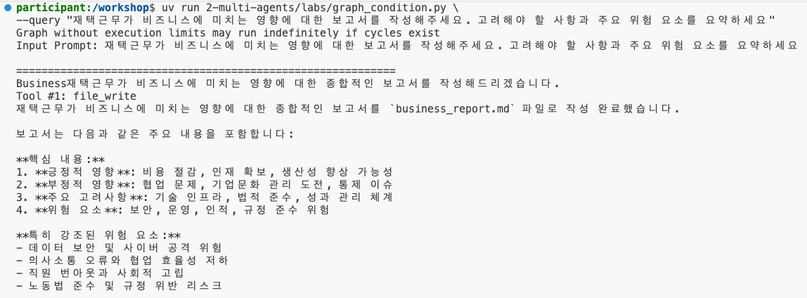 | 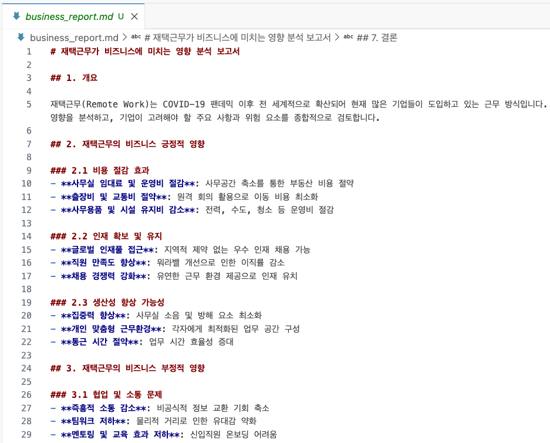 |

**4-7.** 이번에는 터미널에서 아래 쿼리를 실행하고, technical_report 노드로 요청이 잘 라우팅되었는지 결과를 확인합니다:

```bash
uv run --project 00-setup python 02-multi-agents/labs/graph_condition.py \
--query "재택근무의 기술적 측면에 대한 보고서를 작성해주세요. 고려해야 할 사항과 주요 위험 요소를 요약하세요" 
```

*결과 예시:*

| technical_report 노드를 호출 | 결과를 요약하여 technical_report.md 에 파일로 저장 |
|----------|------|
| 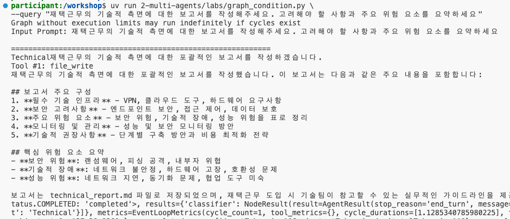 | 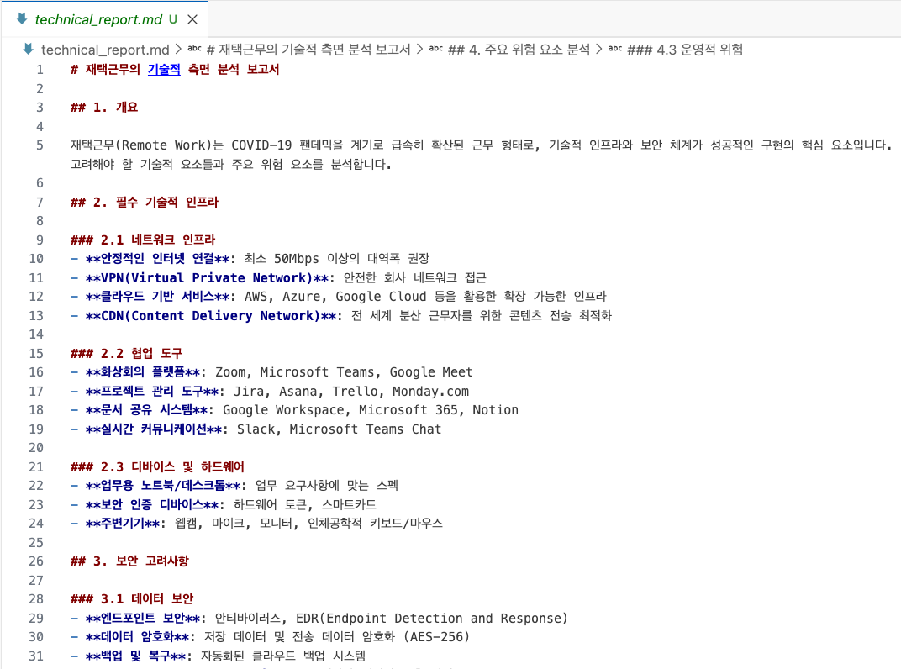 |

**4-6**에서의 테스트는 classifier → business_report 경로로, **4-7**에서의 테스트는 classifier → technical_report 경로로 실행되는 것을 확인할 수 있습니다. 두 실행 모두 명령어를 실행한 위치에 보고서 파일을 생성하며, `completed/artifacts-graph/` 에 각각의 결과 예시가 저장되어 있습니다.

---

## 패턴 선택 기준

Strands SDK의 세 가지 멀티 에이전트 패턴을 모두 학습했습니다. **Agents-as-Tools**로 계층적 시스템을, **Swarm**으로 자율적 협업을, **Graph**로 구조화된 워크플로우를 구축하는 방법을 익혔습니다. 아래 표는 이번 실습에서 확인한 차이를 정리한 것으로, 실제 프로젝트에서 상황에 맞는 패턴을 선택할 때 참고할 수 있습니다.

| | Agents-as-Tools | Swarm | Graph |
|---|---|---|---|
| 구조 | 계층형: 상위에 오케스트레이터, 하위에 도구로 래핑된 전문 에이전트 | 수평형: 중앙 오케스트레이터 없음 | 노드와 엣지로 이루어진 명시적 그래프 |
| 다음 단계를 결정하는 주체 | 오케스트레이터가 쿼리에 맞는 도구를 선택 | 각 에이전트가 다른 에이전트에게 handoff | 개발자가 엣지를 정의할 때 결정 |
| 실행 흐름 | 오케스트레이터의 도구 선택에 따라 라우팅 | 에이전트가 자율적으로 결정 | 명시적으로 정의됨 |
| 예측 가능성 | 오케스트레이터의 라우팅 판단에 의존 | 낮음 (동적) | 높음 |
| 제어 | 오케스트레이터의 시스템 프롬프트로 조정 | 에이전트에게 위임 | 개발자가 완전히 제어 |
| 병렬 처리 | 오케스트레이터가 필요한 순서대로 도구를 순차 호출 | 에이전트들이 자동 결정 | 엣지로 명시적 정의 가능 |
| 적합한 사용 사례 | 여러 전문 영역이 섞인 요청을 적절한 전문가로 라우팅해야 할 때 | 전문가를 어떤 순서로 투입해야 할지 미리 알 수 없는 창의적 협업 | 조건부 분기와 병렬 단계를 포함한 정형화된 프로세스 |
| 이번 챕터의 실습 | 1번 섹션 | 2번 섹션 | 3, 4번 섹션 |

<details>
<summary>이번 실습에서의 핵심 개념 다시보기</summary>

### 1. Agents-as-Tools 패턴

```python
@tool
def specialized_agent(query: str) -> str:
    agent = Agent(system_prompt="...")
    return str(agent(query))

orchestrator = Agent(tools=[specialized_agent, ...])
```

전문 에이전트를 도구로 래핑하여 계층적 시스템 구축

### 2. Swarm 패턴

```python
agent1 = Agent(name="agent1", system_prompt="...")
agent2 = Agent(name="agent2", system_prompt="...")

swarm = Swarm([agent1, agent2], max_handoffs=20)
result = swarm("task")
```

여러 에이전트의 자율적 협업과 handoff

### 3. Graph 패턴

```python
builder = GraphBuilder()
builder.add_node(agent1, "node1")
builder.add_node(agent2, "node2")
builder.add_edge("node1", "node2")
graph = builder.build()
```

명시적 워크플로우와 의존성 정의

**조건부 라우팅**

```python
builder.add_edge("node1", "node2", condition=lambda state: ...)
```

**병렬 실행**

```python
builder.add_edge("node1", "node2")
builder.add_edge("node1", "node3")  # node2, node3 병렬 실행
```

</details>

---

## 트러블슈팅

**Bedrock의 `ThrottlingException` 또는 요청 과다 오류**

이번 챕터의 패턴들은 여러 에이전트로 요청을 확산시키며, 특히 Graph 병렬 실습은 두 에이전트를 동시에 호출합니다. 따라서 01 챕터의 단일 에이전트 실습보다 계정 단위 Bedrock 요청 한도에 훨씬 쉽게 도달합니다. 실행이 중간에 실패하는 경우:

- 스크립트를 다시 실행합니다. 스로틀링은 일시적인 현상입니다.
- 여러 터미널에서 동시에 실행하지 않고, 실습을 하나씩 실행합니다.
- `graph_parallel.py` 에서 병렬 엣지 하나를 제거해 순차 실행으로 바꿉니다. 예를 들어 `builder.add_edge("finance_expert", "market_expert")` 를 제거하고 `tech_expert` → `market_expert` 로 연결합니다.
- Graph, Swarm 실습 마지막에 출력되는 `Failed nodes` 와 `Status` 값을 확인합니다. 노드 실패는 대부분 그래프 구성 오류가 아니라 모델 호출이 거부된 경우입니다.

**01 챕터 실습보다 토큰 사용량이 많습니다**

이번 챕터의 모든 패턴은 누적된 컨텍스트를 여러 모델에 전달합니다. 특히 Swarm 실습은 `max_tokens=64000` 으로 설정된 4개의 에이전트를 실행하며 최대 `max_iterations=20` 회까지 반복할 수 있습니다. 단일 에이전트 실행보다 토큰 사용량과 소요 시간이 눈에 띄게 늘어납니다. 각 스크립트는 마지막에 `result.accumulated_usage` 를 출력하므로 실제 사용량을 확인할 수 있습니다. 비용을 줄이려면 `Swarm(...)` 의 `max_handoffs` 와 `max_iterations` 값을 낮추거나 요청 프롬프트를 짧게 작성하세요.

**Swarm 실행이 `travel_plan.md` 를 만들기 전에 종료됩니다**

`Swarm(...)` 에는 `execution_timeout=900.0`(전체 15분)과 `node_timeout=300.0`(에이전트당 5분)이 설정되어 있습니다. handoff 체인이 길어져 이 한도에 도달하면 `result.status` 가 완료 상태가 아니며 마지막 파일이 생성되지 않습니다. 타임아웃 값을 늘리거나, `max_handoffs` 를 낮춰 요약 에이전트까지 더 빨리 도달하도록 조정하세요.

**도구가 파일 쓰기 전에 확인을 요청합니다**

`file_write` 는 `BYPASS_TOOL_CONSENT` 가 설정되어 있지 않으면 사용자 확인을 요청합니다. 이 때문에 파일을 쓰는 세 실습(`agents_as_tools.py`, `swarms.py`, `graph_condition.py`)은 import 시점에 `os.environ['BYPASS_TOOL_CONSENT'] = 'true'` 를 설정합니다. 직접 작성하는 `labs/` 버전에서 이 줄을 빼면 실행이 멈추고 파일 쓰기마다 확인 프롬프트가 나타납니다.

**모델 ID 관련 `ValidationException`**

실습 코드는 `us.anthropic.claude-sonnet-4-6` 을 사용합니다. `us-west-2` 에서 해당 모델 액세스가 없다면 Bedrock 콘솔의 **Model access** 에서 활성화하거나, 코드의 모델 ID를 사용 가능한 모델로 변경하세요.

## 리소스 정리

이번 챕터는 지속적으로 과금되는 AWS 리소스를 생성하지 않습니다. 실습 중 호출한 Bedrock 온디맨드 모델 요금만 발생하며 스크립트가 종료되면 더 이상 비용이 발생하지 않으므로, AWS 콘솔에서 삭제할 리소스는 없습니다.

다만 실습을 실행한 디렉토리에 마크다운 파일이 생성되어 남습니다. 실습을 마친 후 정리하세요:

```bash
rm -f plan.md research.md creative.md critical.md summarizer.md travel_plan.md business_report.md technical_report.md
```

> [!WARNING]
> 위 명령어는 실습을 실행한 디렉토리에서 실행하고, 삭제 전 파일 목록을 먼저 확인하세요. `02-multi-agents/completed/artifacts-*/` 에 저장된 결과 예시는 삭제하지 마세요.

---
Prev: [단일 에이전트](../01-single-agent/README.ko.md) | Next: [챗봇 애플리케이션](../03-chatbot-app/README.ko.md)
