# 6. Agent Deployment (AgentCore Runtime)

[한국어](README.ko.md) | English

In this lab, you'll learn how to deploy Strands agents that have been running locally to [Amazon Bedrock AgentCore Runtime](https://docs.aws.amazon.com/bedrock-agentcore/latest/devguide/agents-tools-runtime.html).

Without complex infrastructure setup or code rewriting, you can deploy to production with **just 4 lines of code** and gain the benefits of serverless auto-scaling and monitoring.

The lab pattern is the same as the other chapters: you write the code into the empty files in `labs/`, and `completed/` holds the reference answer.

> [!NOTE]
> **Prerequisites**
> - Environment set up per [00-setup](../00-setup/README.md), with the uv environment active
> - Amazon Bedrock model access in `us-west-2` (Claude), as in the earlier chapters
> - A container runtime (Docker Desktop, Finch, or Podman) installed and **running**. AgentCore packages your agent as a container image, and `configure()` generates a `Dockerfile` for it. Depending on your starter toolkit version, `launch()` either builds that image locally (Docker must be running) or builds it in AWS CodeBuild.
> - IAM permissions for Amazon ECR (create repository, push images), IAM (create role), Bedrock AgentCore, and CloudWatch Logs. The starter toolkit creates the ECR repository and the IAM execution role for you: see step 3.
> - This chapter creates **billable AWS resources** (an AgentCore Runtime and an ECR repository). Do the [Cleanup](#cleanup) at the end.

> [!IMPORTANT]
> Chapter [07-agentcore-observability](../07-agentcore-observability/README.md) builds on this chapter: it uses the runtime you deploy here, and it requires the CloudWatch Transaction Search setting from **step 0** below. Do not skip step 0, and do not run Cleanup until you have finished chapter 07.

**What you will learn**

- What AgentCore Runtime is and what it gives you over running an agent locally
- How to enable CloudWatch Transaction Search (once per AWS account)
- How to turn a local Strands agent into a deployable one by adding 4 lines
- How to deploy with the AgentCore starter toolkit (`configure()` + `launch()`)
- How to invoke a deployed runtime with boto3 and session IDs
- (Optional) How to deploy a multi-agent system and watch sessions scale in the console

**Estimated time:** ~20 minutes (the optional section 5 adds ~10 minutes)

## Files in this chapter

| File | Purpose |
|---|---|
| `labs/my_agent.py` | (empty) you write this: the agent wrapped with `BedrockAgentCoreApp` |
| `labs/deploy_agent.py` | (empty) you write this: `configure()` + `launch()` deployment script |
| `labs/invoke_agent.py` | (empty) you write this: invoke the deployed runtime with boto3 |
| `labs/my_agent_advanced.py` | (empty) you write this in the optional section 5: multi-agent orchestrator |
| `labs/requirements.txt` | dependencies installed into the container image (already filled in) |
| `completed/my_agent.py` | reference answer |
| `completed/deploy_agent.py` | reference answer |
| `completed/invoke_agent.py` | reference answer (the section 5 variant is included as a comment block at the bottom) |
| `completed/requirements.txt` | reference answer |
| `completed/Dockerfile` | generated by `configure()`, kept here for reference |
| `completed/.dockerignore` | generated by `configure()`, kept here for reference |

> [!NOTE]
> There is no `completed/my_agent_advanced.py`. The full code for the optional multi-agent variant is inline in [section 5](#optional-5-verify-agent-deployment-process-in-console) of this README.
>
> The files under `completed/` use Korean system prompts and print messages, matching the Korean version of the guide. The behavior is identical to the English code blocks below.

---

## What is AgentCore Runtime?

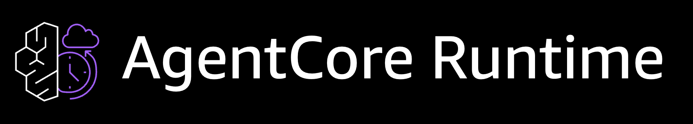

AgentCore Runtime is a serverless hosting environment for AI agents. You can deploy locally developed agent code to the cloud with **minimal changes**.

- **Framework Agnostic**: Deploy any framework: Strands, LangGraph, CrewAI, etc.
- **Session Isolation**: Each user session runs in a dedicated microVM for complete isolation
- **Auto Scaling**: Automatic resource provisioning with usage-based billing
- **Built-in Observability**: Traces, metrics, and logs automatically collected in CloudWatch
- **Up to 8 Hours Runtime**: Supports real-time conversations to long-running async tasks

---

## 0. (Prerequisite) Enable CloudWatch Transaction Search

To view traces, metrics, and session information for agents deployed to AgentCore Runtime in the dashboard, CloudWatch Transaction Search must be enabled. This is a one-time setup per AWS account.

> [!WARNING]
> You must complete this step first to properly view Session, Traces, and other data in the AgentCore dashboard during subsequent labs. It may take up to 10 minutes for spans to become searchable after enabling, so we recommend enabling it before deployment.

**0-1.** Open the [CloudWatch](https://console.aws.amazon.com/cloudwatch/) service in the AWS Console.

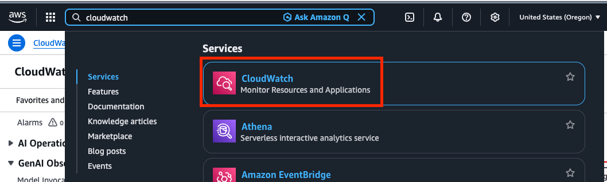

**0-2.** Click **Settings** in the left menu, then click the **Edit** button in the **Application Signals** tab.


**0-3.** Toggle **Enable Transaction Search** to enable it. **Make sure to set the Sample rate to 100%**, then click **Save**.

> [!WARNING]
> If the Sample rate is left at the default (1%), most traces will not be collected and you won't be able to see data in the dashboard. For the workshop environment, you must set it to **100%**.

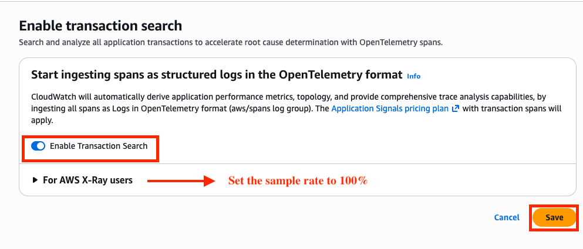

---

## 1. Review Existing Local Agent

First, let's look at typical Strands agent code running locally. (For reference only, no need to paste into a file)

```python
# Local execution agent (existing code)
from strands import Agent
from strands_tools import calculator, current_time

agent = Agent(
    system_prompt="You are a helpful AI assistant.",
    tools=[calculator, current_time]
)

# Direct local invocation
user_message = "What is the square root of 80 / 4 * 5?"
result = agent(user_message)
print(result.message)
```

How do we deploy this code to AgentCore Runtime?

---

## 2. Converting Code for Cloud Deployment

You can deploy to AgentCore Runtime by adding **just 4 lines** to existing local code.

**2-1.** Open the `06-agentcore-runtime/labs/my_agent.py` file.

**2-2.** Write the code as follows:

```python
from bedrock_agentcore.runtime import BedrockAgentCoreApp  # ← 1️⃣ Add
from strands import Agent
from strands_tools import calculator, current_time

app = BedrockAgentCoreApp()  # ← 2️⃣ Add

agent = Agent(
    system_prompt="You are a helpful AI assistant.",
    tools=[calculator, current_time]
)

@app.entrypoint  # ← 3️⃣ Add
def invoke(payload):
    """Agent invocation entrypoint"""
    user_message = payload.get("prompt", "Hello!")
    result = agent(user_message)
    return {"result": result.message}

if __name__ == "__main__":
    app.run()  # ← 4️⃣ Add
```

<details>
<summary>Detailed Before/After Comparison</summary>

### Before (Local Execution)
```python
from strands import Agent
from strands_tools import calculator, current_time

agent = Agent(
    system_prompt="You are a helpful AI assistant.",
    tools=[calculator, current_time]
)

user_message = "What is the square root of 80 / 4 * 5?"
result = agent(user_message)
print(result.message)
```

### After (AgentCore Runtime)
```python
from bedrock_agentcore.runtime import BedrockAgentCoreApp  # 1️⃣ Add import
from strands import Agent
from strands_tools import calculator, current_time

app = BedrockAgentCoreApp()  # 2️⃣ Create app instance

agent = Agent(
    system_prompt="You are a helpful AI assistant.",
    tools=[calculator, current_time]
)

@app.entrypoint  # 3️⃣ Add decorator
def invoke(payload):
    user_message = payload.get("prompt", "Hello!")
    result = agent(user_message)
    return {"result": result.message}

if __name__ == "__main__":
    app.run()  # 4️⃣ Run app
```

### Summary of Changes
1. Import `BedrockAgentCoreApp`
2. Create `app = BedrockAgentCoreApp()` instance
3. Wrap invocation function with `@app.entrypoint` decorator
4. Call `app.run()`

**The core agent logic remains completely unchanged.** The existing `Agent` object and prompts are used as-is.

</details>

> [!NOTE]
> **Check Complete Code**
> The complete code for `my_agent.py` can be found in `06-agentcore-runtime/completed/my_agent.py`.

**2-3.** Test the agent locally before deploying.

`app.run()` starts a local HTTP server (uvicorn) that exposes the same two endpoints the runtime will call: `POST /invocations` and `GET /ping`. Outside a container it binds to `127.0.0.1:8080`. Running it locally first is the fastest way to catch import errors and prompt bugs, because a cloud deployment takes several minutes.

```bash
uv run python 06-agentcore-runtime/labs/my_agent.py
```

Then, in a second terminal, send the same payload the runtime sends:

```bash
curl -X POST http://localhost:8080/invocations \
  -H "Content-Type: application/json" \
  -d '{"prompt": "What is the square root of 80 / 4 * 5?"}'
```

You should get a JSON response containing the `result` key returned by your `invoke()` function. `curl http://localhost:8080/ping` returns the health status the runtime uses. Stop the server with `Ctrl+C` before moving on, so port 8080 is free.

---

## 3. Deploy to AgentCore Runtime

Now let's deploy the agent we created to AWS cloud.

The deployment script uses the Starter Toolkit provided by AgentCore to **1) define the runtime**, **2) configure it with `.configure()`**, and **3) deploy with `.launch()`**. Follow the code below.

**3-1.** Open the `06-agentcore-runtime/labs/deploy_agent.py` file.

**3-2.** Import required libraries.

- `Runtime` is the deployment management class provided by AgentCore Starter Toolkit.

```python
from bedrock_agentcore_starter_toolkit import Runtime
from boto3.session import Session

```

**3-3.** Create a Runtime instance and configure deployment.

- `entrypoint` specifies the agent file created earlier.
- `auto_create_execution_role=True` automatically creates IAM roles.
- `requirements_file` specifies dependencies to install in the deployment environment.

```python
boto_session = Session()
region = boto_session.region_name

agentcore_runtime = Runtime()

response = agentcore_runtime.configure(
    entrypoint="my_agent.py",
    agent_name="strands_workshop_agent",
    requirements_file="requirements.txt",
    auto_create_execution_role=True,
    auto_create_ecr=True,
    region=region,
)

```

> [!NOTE]
> **What these two flags actually do**
> - `auto_create_execution_role=True`: you do not have to create or pass an IAM role. The toolkit creates one named `AmazonBedrockAgentCoreSDKRuntime-<region>-<suffix>` with the trust policy and inline policy the runtime needs, and reuses it if it already exists. If you want to supply your own role instead, pass `execution_role="<role name or ARN>"` and drop this flag.
> - `auto_create_ecr=True`: the toolkit creates an ECR repository (named `bedrock_agentcore-<agent_name>`) and pushes the built image there.
>
> `configure()` also writes three files next to `deploy_agent.py`: a generated `Dockerfile`, a `.dockerignore`, and `.bedrock_agentcore.yaml`. The first two are in `completed/` for reference.

**3-4.** Build and deploy the agent.

- `launch()` automatically performs code packaging, AWS resource creation, AgentCore Runtime deployment, and CloudWatch logging configuration.

```python
print("🚀 Starting deployment...")
launch_result = agentcore_runtime.launch()
print(launch_result)

```

**3-5.** Save the code and return to the terminal to run the deployment command:

```bash
cd 06-agentcore-runtime/labs
uv run deploy_agent.py
cd -
```

> [!TIP]
> Run the deploy script from inside `labs/`, as shown. `entrypoint="my_agent.py"` and `requirements_file="requirements.txt"` are resolved relative to the current directory, and the generated `Dockerfile` / `.bedrock_agentcore.yaml` are written there too.

When deployment completes, you'll see logs like below.

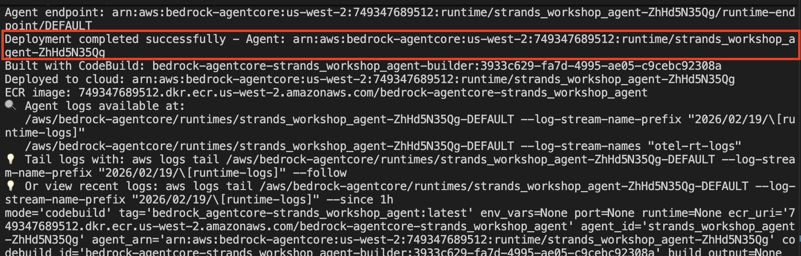

> [!NOTE]
> **About `.bedrock_agentcore.yaml`**
> The deploy step generates a `.bedrock_agentcore.yaml` file in `06-agentcore-runtime/labs/`. It holds your deploy state: agent ID, agent ARN, ECR repository URI, execution role ARN, and region. Those values are tied to one specific AWS account, so the file is **gitignored and not committed to this repo**. It is created for you on first `configure()`, and the cleanup and redeploy steps below read from it, so keep it until you are done with chapter 07.

> [!NOTE]
> **Check Complete Code**
> The complete code for `deploy_agent.py` can be found in `06-agentcore-runtime/completed/deploy_agent.py`. That file hardcodes `region="us-west-2"` instead of reading the region from the boto3 session, and its `entrypoint` / `agent_name` lines carry comments showing the values used in the optional section 5.

**3-6.** Go to AWS Console to verify the agent deployment and copy information for agent invocation.

First, access the [Amazon Bedrock AgentCore Console](https://us-west-2.console.aws.amazon.com/bedrock-agentcore/home?region=us-west-2#/runtimes) and check if `strands_workshop_agent` was created in the **Runtime** menu.

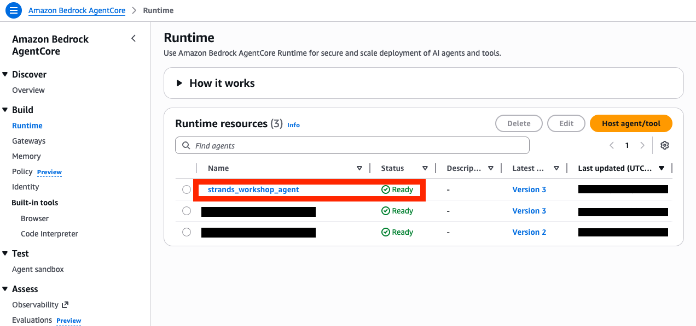

Click on `strands_workshop_agent`, then click the copy button under **Runtime ARN** to **copy the agent's ARN**. This will be used to invoke the agent in the next step.


---

## 4. Test Deployed Agent

**4-1.** Open the `06-agentcore-runtime/labs/invoke_agent.py` file.

**4-2.** Import required libraries.

```python
import json
import uuid
import boto3

```

**4-3.** Enter the Agent ARN from the deployment output.

```python
agent_arn = "<<Enter the copied Runtime ARN>>"
prompt = "What is the square root of 80 / 4 * 5?"

```

**4-4.** Create AgentCore client and invoke the agent.

- `runtimeSessionId` is a unique ID identifying the session. Using the same session ID maintains conversation context in Ephemeral Memory.

```python
client = boto3.client('bedrock-agentcore')

payload = json.dumps({"prompt": prompt}).encode()

response = client.invoke_agent_runtime(
    agentRuntimeArn=agent_arn,
    runtimeSessionId=str(uuid.uuid4()),
    payload=payload,
)

```

**4-5.** Parse and print the response.

```python
content = []
for chunk in response.get("response", []):
    content.append(chunk.decode('utf-8'))

result = json.loads(''.join(content))

print("\n" + "=" * 60)
print("🤖 Agent Response")
print("=" * 60 + "\n")

if 'result' in result and 'content' in result['result']:
    for item in result['result']['content']:
        if 'text' in item:
            print(item['text'])
else:
    print(json.dumps(result, indent=2, ensure_ascii=False))
```

**4-6.** Save the file, open a terminal, and run the command to see results:

```bash
uv run 06-agentcore-runtime/labs/invoke_agent.py
```


> [!NOTE]
> **Congratulations!**
> You deployed a locally developed Strands agent to AgentCore Runtime with **just 4 lines of code**. You can now operate agents in a serverless environment without complex infrastructure setup.

---

## (Optional) 5. Verify Agent Deployment Process in Console

> [!NOTE]
> **Optional Lab**
> This section is **optional**. It doesn't affect the core workshop flow, and you can skip to the next chapter.
>
> So far, we deployed a simple calculation agent to AgentCore Runtime and invoked it.
> In this section, we'll deploy an agent system with **longer execution time** to AgentCore Runtime and **invoke it multiple times simultaneously** to directly verify how the actual agent system **scales and runs stably** in Runtime.
>
> To do this, we'll repeat the **agent creation > deployment > invocation** process through code from **5-1** to **5-5**, then perform multiple agent executions in **5-6**.

**5-1.** Open `06-agentcore-runtime/labs/my_agent_advanced.py` and paste the following code.

<details>
<summary>Code Explanation</summary>

This code implements a multi-agent system where multiple agents collaborate to achieve a single goal. For details, see [2. Building Systems that Perform Complex Tasks through Multi-Agent Patterns](../02-multi-agents/README.md).

1. **Wrap specialized agents with `@tool`**: Each agent acts like a tool (the code below defines three: research, product recommendation, and trip planning)
2. **Orchestrator agent**: Analyzes user requests and selects appropriate specialized agents
3. **Wrap with `BedrockAgentCoreApp`**: Convert for AgentCore Runtime deployment

Execution flow:
```
User: "Research Tokyo and plan a trip"
         ↓
   Orchestrator analyzes
         ↓
  research_assistant called → Research Tokyo info
         ↓
  trip_planning_assistant called → Create travel plan
         ↓
    Return final result
```

</details>

```python
from bedrock_agentcore.runtime import BedrockAgentCoreApp
from strands import Agent, tool

app = BedrockAgentCoreApp()

# Wrap research agent as tool
@tool
def research_assistant(query: str) -> str:
    """
    Processes research queries and responds.

    Args:
        query: Research question requiring factual information

    Returns:
        Detailed research answer with citations
    """
    try:
        research_agent = Agent(
            system_prompt="""You are a professional research assistant.
            Focus on providing factual information with clear sources for research questions.
            Always cite sources when possible.""",
        )
        response = research_agent(query)
        return str(response)
    except Exception as e:
        return f"Error in research assistant: {str(e)}"

# Wrap product recommendation agent as tool
@tool
def product_recommendation_assistant(query: str) -> str:
    """
    Processes product recommendation queries by suggesting appropriate products.

    Args:
        query: Product inquiry with user preferences

    Returns:
        Personalized product recommendations with reasoning
    """
    try:
        product_agent = Agent(
            system_prompt="""You are a professional product recommendation assistant.
            Provide personalized product suggestions based on user preferences.
            Always clearly explain the reasoning behind recommendations.""",
        )
        response = product_agent(query)
        return str(response)
    except Exception as e:
        return f"Error in product recommendation: {str(e)}"

# Wrap trip planning agent as tool
@tool
def trip_planning_assistant(query: str) -> str:
    """
    Creates travel itineraries and provides travel advice.

    Args:
        query: Travel planning request with destination and preferences

    Returns:
        Detailed travel itinerary or travel advice
    """
    try:
        travel_agent = Agent(
            system_prompt="""You are a professional travel planning assistant.
            Create detailed travel itineraries based on user preferences.
            Provide practical plans including budget, transportation, accommodation, and attractions.""",
        )
        response = travel_agent(query)
        return str(response)
    except Exception as e:
        return f"Error in trip planning: {str(e)}"

# Create orchestrator agent
MAIN_SYSTEM_PROMPT = """
You are a multi-agent orchestrator that routes queries to specialized agents.

Available specialized agents:
- research_assistant: Research questions and factual information
- product_recommendation_assistant: Product recommendations and shopping advice
- trip_planning_assistant: Travel planning and itinerary creation

How to work:
1. Analyze user queries and select the most appropriate specialized agent
2. Can call multiple agents sequentially if needed
3. Combine results from multiple agents for complex requests
4. Answer simple questions directly

Always select the optimal agent for user requirements and
provide clear and useful answers.
"""

@app.entrypoint
def invoke(payload):
    """Multi-agent orchestrator entrypoint"""
    user_message = payload.get("prompt", "Hello!")
    
    orchestrator = Agent(
        system_prompt=MAIN_SYSTEM_PROMPT,
        tools=[
            research_assistant,
            product_recommendation_assistant,
            trip_planning_assistant,
        ],
    )
    
    result = orchestrator(user_message)
    
    return {
        "result": result.message,
        "agent_type": "multi-agent-orchestrator",
    }

if __name__ == "__main__":
    app.run()
```

**5-2.** Open `06-agentcore-runtime/labs/deploy_agent.py`, **delete all existing content**, and paste the following code:

```python
from bedrock_agentcore_starter_toolkit import Runtime
from boto3.session import Session

boto_session = Session()
region = boto_session.region_name

agentcore_runtime = Runtime()

response = agentcore_runtime.configure(
    entrypoint="my_agent_advanced.py",  # Changed to multi-agent file
    agent_name="strands_workshop_agent_advanced",  # Changed to multi-agent name
    requirements_file="requirements.txt",
    auto_create_execution_role=True,
    auto_create_ecr=True,
    region=region,
)

print("🚀 Starting deployment...")
launch_result = agentcore_runtime.launch()
print(launch_result)
```

> [!NOTE]
> **Check Differences from Previous Code**
> The difference from the previously written deploy_agent.py is just two lines (lines 10-11), the rest is identical deployment logic.
>
> Changed the entrypoint file from `my_agent.py` to `my_agent_advanced.py` and updated the agent name.

**5-3.** Before deploying, delete the `.bedrock_agentcore.yaml` file to reset the previous Runtime deployment configuration. Find the `.bedrock_agentcore.yaml` file in the same directory as deploy_agent.py and click the **'Delete Permanently'** button to delete it.


From the terminal, the equivalent is:

```bash
rm 06-agentcore-runtime/labs/.bedrock_agentcore.yaml
```

> [!WARNING]
> Deleting this file removes your local record of the first deployment (agent ID, ECR repository, execution role). The `strands_workshop_agent` runtime itself keeps running and keeps billing. You will have to delete it from the console or with the AWS CLI, as described in [Cleanup](#cleanup).

**5-4.** Run the command in the terminal to deploy the new Runtime.

```bash
cd 06-agentcore-runtime/labs
uv run deploy_agent.py
cd -
```

When deployment completes, you'll see logs like below.


> [!NOTE]
> You can verify that two runtimes, `strands_workshop_agent` and `strands_workshop_agent_advanced`, were created in the AgentCore Runtimes in AWS Console.

**5-5.** Go to AWS Console to verify agent deployment and copy the agent ARN.

Access the [Amazon Bedrock AgentCore Console](https://us-west-2.console.aws.amazon.com/bedrock-agentcore/home?region=us-west-2#/runtimes) and check if `strands_workshop_agent_advanced` was created in the **Runtimes** menu.


Click on `strands_workshop_agent_advanced`, then click the copy button under **Runtime ARN** to **copy the agent's ARN**. This will be used to invoke the agent in the next step.


**5-6.** Open `06-agentcore-runtime/labs/invoke_agent.py`, **delete all existing content**, and paste the following code. **Paste the ARN copied in the previous step (5-5) into the `agent_arn` variable in the code**:

```python
import json
import uuid
import boto3
from urllib.parse import quote

agent_arn = "<<Enter the copied Runtime ARN>>"
region = "us-west-2"
prompt = "Can you research Tokyo, Japan? Also plan a 3-day trip there and recommend products needed for the trip."

# Generate session ID
session_id = str(uuid.uuid4())

# Extract Agent name (from ARN)
agent_name = agent_arn.split("/")[-1]

# Construct CloudWatch Logs group name
log_group_name = f"/aws/bedrock-agentcore/runtimes/{agent_name}-DEFAULT"

# Generate CloudWatch Logs group URL
log_group_url = (
    f"https://console.aws.amazon.com/cloudwatch/home?region={region}"
    f"#logsV2:log-groups/log-group/{quote(log_group_name, safe='')}"
)

client = boto3.client('bedrock-agentcore')
payload = json.dumps({"prompt": prompt}).encode()

print(f"\n\nPrompt: {prompt}\n")
print(f"Session ID: {session_id}\n")
print("⏳ Invoking agent...\n")
print(f"📊 CloudWatch Logs (filter by session ID): {log_group_url}\n\n")

try:
    response = client.invoke_agent_runtime(
        agentRuntimeArn=agent_arn,
        runtimeSessionId=session_id,
        payload=payload,
    )

    # Consume response stream (without printing)
    for _ in response.get("response", []):
        pass

    print("✅ Agent invocation complete\n")
    print(f"📊 Check logs (Session ID: {session_id}): {log_group_url}\n")
except Exception as e:
    print(f"⚠️  Error: {str(e)}\n")
    print(f"📊 Check logs (Session ID: {session_id}): {log_group_url}\n")
```

**5-7.** Run the command in the terminal to invoke the agent deployed to Runtime.

```bash
uv run 06-agentcore-runtime/labs/invoke_agent.py
```

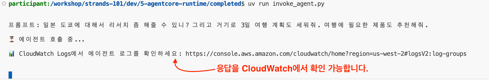

**5-8.** Access the [Amazon Bedrock AgentCore Console](https://us-west-2.console.aws.amazon.com/bedrock-agentcore/home?region=us-west-2#/runtimes) and click on the `strands_workshop_agent_advanced` runtime to see the screen below. Click **Dashboard** in the Observability section to go to the dashboard for checking agent invocation logs.

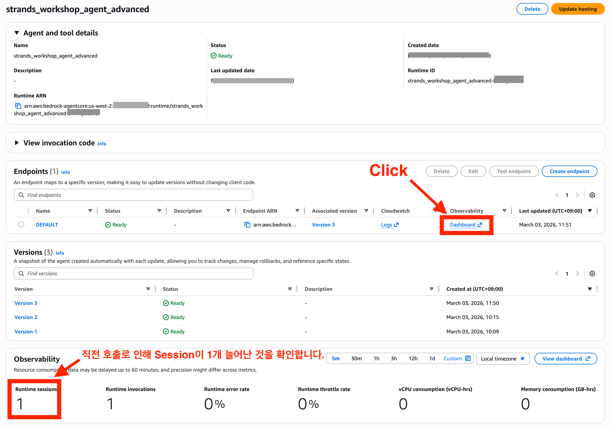

**5-9.** In the dashboard, **click the 'Session' tab** to find specific sessions. Click on a session ID to navigate.

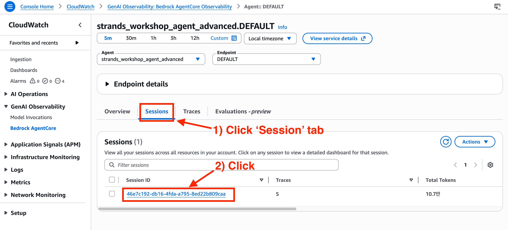

Traces are displayed by ID. Click on the most recently activated Trace ID to open a panel on the right showing the agent's workflow logs.

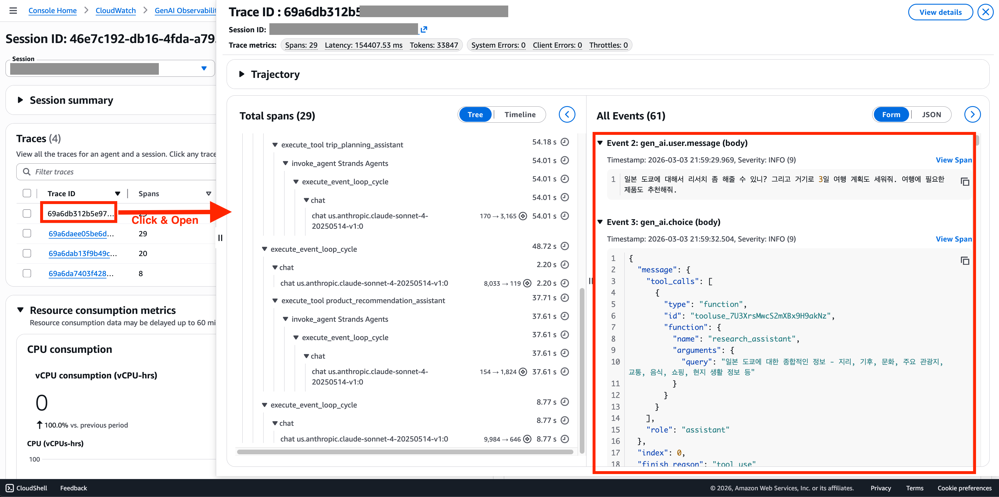

Expanding the toggle shows the Trip Planning Agent's output as in the screenshot, and you can check agent work output in AWS Console that you previously only saw in the terminal.


> [!NOTE]
> **You verified AgentCore Runtime's native visibility.**
> As shown, AgentCore Runtime allows real-time checking of agent execution flow, tool calls, and response content through CloudWatch Logs and Traces without additional configuration.
>
> More detailed Observability is covered in the next chapter [7. Agent Visibility (AgentCore Observability)](../07-agentcore-observability/README.md).

**5-10.** (Optional) Return to the terminal, open 3 or more new terminals besides the one running the agent, and execute invoke_agent.py simultaneously.

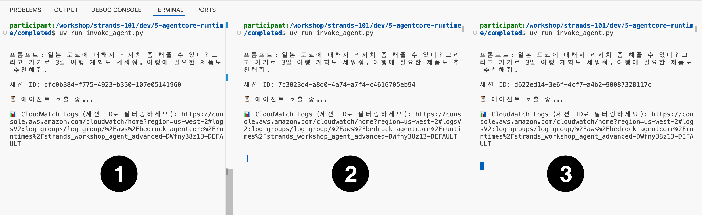

Return to the [Amazon Bedrock AgentCore Console](https://us-west-2.console.aws.amazon.com/bedrock-agentcore/home?region=us-west-2#/runtimes) and check the `strands_workshop_agent_advanced` runtime to **verify that the total sessions increased to 3** due to the previous invocations.

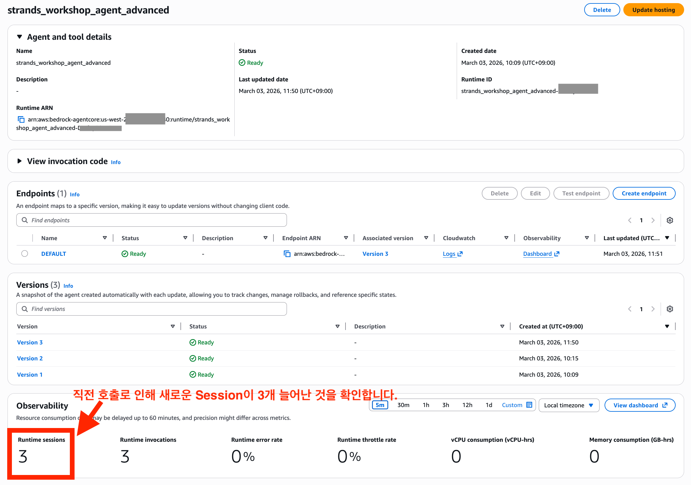

> [!NOTE]
> **You experienced AgentCore Runtime's serverless scalability.**
> As shown, AgentCore Runtime automatically provisions independent microVMs for each session during concurrent requests, automatically responding to traffic increases without infrastructure management. It maintains zero when not in use to avoid charges and scales only as needed, leveraging serverless advantages for stable operation.

---

## Cleanup

> [!WARNING]
> **Do this, and do not skip it.** A deployed AgentCore Runtime and the container images in its ECR repository incur charges for as long as they exist, even when you are not invoking the agent. If you completed the optional section 5, you now have **two** runtimes and **two** ECR repositories to remove.

> [!IMPORTANT]
> Chapter [07-agentcore-observability](../07-agentcore-observability/README.md) uses the runtime deployed here. If you are continuing, run this cleanup after you finish chapter 07.

### Resources to remove

| Resource | Name / how to find it |
|---|---|
| AgentCore Runtime | `strands_workshop_agent`, and `strands_workshop_agent_advanced` if you did section 5 |
| ECR repository (and its images) | `bedrock_agentcore-strands_workshop_agent`, `bedrock_agentcore-strands_workshop_agent_advanced` |
| IAM execution role | auto-created as `AmazonBedrockAgentCoreSDKRuntime-<region>-<suffix>` |
| CloudWatch log group | `/aws/bedrock-agentcore/runtimes/<agent-id>-DEFAULT` |

The exact names for your account are recorded in `06-agentcore-runtime/labs/.bedrock_agentcore.yaml` (fields `aws.ecr_repository`, `aws.execution_role`, `bedrock_agentcore.agent_id`, `bedrock_agentcore.agent_arn`).

### Option A: the starter toolkit (recommended)

Recent versions of the starter toolkit ship an `agentcore destroy` command that reads `.bedrock_agentcore.yaml` and removes the runtime, its endpoint, the ECR images, the auto-created IAM execution role (only if no other agent uses it), and the deployment config. Run it from the directory that holds `.bedrock_agentcore.yaml`:

```bash
cd 06-agentcore-runtime/labs

# Preview first: shows what would be deleted, deletes nothing
uv run agentcore destroy --agent strands_workshop_agent --dry-run

# Then actually delete, including the ECR repository itself
uv run agentcore destroy --agent strands_workshop_agent --delete-ecr-repo

# If you did the optional section 5, repeat for the advanced agent
uv run agentcore destroy --agent strands_workshop_agent_advanced --delete-ecr-repo

cd -
```

Without `--delete-ecr-repo` the command deletes the images but leaves the empty repository behind. If `destroy` is not available in your installed toolkit version, or if you already deleted `.bedrock_agentcore.yaml` in step 5-3, use option B or C.

### Option B: AWS Console

1. **Bedrock AgentCore**: open the [Runtime list](https://us-west-2.console.aws.amazon.com/bedrock-agentcore/home?region=us-west-2#/runtimes), select `strands_workshop_agent`, and choose **Delete**. Repeat for `strands_workshop_agent_advanced`.
2. **Amazon ECR**: open the [ECR repositories list](https://us-west-2.console.aws.amazon.com/ecr/repositories?region=us-west-2), select `bedrock_agentcore-strands_workshop_agent` (and the `_advanced` one), and choose **Delete**. This deletes the stored images, which is the part that keeps costing storage.
3. **IAM**: open [Roles](https://console.aws.amazon.com/iam/home#/roles), search `AmazonBedrockAgentCoreSDKRuntime`, and delete the role that was created for this workshop.
4. **CloudWatch Logs**: open [Log groups](https://us-west-2.console.aws.amazon.com/cloudwatch/home?region=us-west-2#logsV2:log-groups), search `/aws/bedrock-agentcore/runtimes/`, and delete the log groups for these agents.

### Option C: AWS CLI

```bash
# 1. Find the runtime IDs, then delete each runtime
aws bedrock-agentcore-control list-agent-runtimes --region us-west-2
aws bedrock-agentcore-control delete-agent-runtime \
  --agent-runtime-id <AGENT_RUNTIME_ID> --region us-west-2

# 2. Delete the ECR repository together with all images in it
aws ecr delete-repository \
  --repository-name bedrock_agentcore-strands_workshop_agent \
  --force --region us-west-2

# 3. Delete the CloudWatch log group
aws logs delete-log-group \
  --log-group-name "/aws/bedrock-agentcore/runtimes/<AGENT_ID>-DEFAULT" \
  --region us-west-2

# 4. Delete the auto-created IAM execution role (detach its inline policies first)
aws iam list-role-policies --role-name <ROLE_NAME>
aws iam delete-role-policy --role-name <ROLE_NAME> --policy-name <POLICY_NAME>
aws iam delete-role --role-name <ROLE_NAME>
```

> [!NOTE]
> The AgentCore Runtime itself has no idle compute charge when it is not handling sessions, but the runtime resource and, above all, the ECR image storage do accrue cost. Deleting the ECR repositories is the most important step. IAM roles and empty log groups are free, but removing them keeps the account clean.

---

## Troubleshooting

<details>
<summary>Deploy fails immediately with a Docker or container runtime error</summary>

Symptoms: `Cannot connect to the Docker daemon`, `docker: command not found`, or `No container runtime available`.

- Start Docker Desktop (or Finch / Podman) and wait until it reports it is running, then re-run the deploy script.
- Verify with `docker info`. If that fails, the toolkit cannot build the image either.
- If you cannot run Docker locally at all, a starter toolkit version that builds with AWS CodeBuild can deploy without a local daemon. Check `uv run agentcore launch --help` for the build options your installed version supports.

</details>

<details>
<summary>ECR authentication or push failure</summary>

Symptoms: `no basic auth credentials`, `denied: Your authorization token has expired`, `AccessDeniedException` on `ecr:GetAuthorizationToken` or `ecr:PutImage`.

- The ECR login token is valid for 12 hours. Re-authenticate and retry:
  ```bash
  aws ecr get-login-password --region us-west-2 | docker login --username AWS --password-stdin <ACCOUNT_ID>.dkr.ecr.us-west-2.amazonaws.com
  ```
- Confirm your identity and account: `aws sts get-caller-identity`. The account in the ECR URI must match.
- Confirm your region is consistent. `configure()` in the guide takes the region from your boto3 session, while `completed/deploy_agent.py` hardcodes `us-west-2`. If your CLI default region differs, the toolkit may create the repository in one region and look for it in another. Set the region explicitly:
  ```bash
  export AWS_REGION=us-west-2
  export AWS_DEFAULT_REGION=us-west-2
  ```
- Your IAM principal needs `ecr:CreateRepository`, `ecr:GetAuthorizationToken`, `ecr:BatchCheckLayerAvailability`, `ecr:InitiateLayerUpload`, `ecr:UploadLayerPart`, `ecr:CompleteLayerUpload`, and `ecr:PutImage`.

</details>

<details>
<summary>Deploy hangs or times out</summary>

The first deployment takes several minutes: it builds the image, pushes it to ECR, then waits for the runtime to reach `READY`.

- Check the runtime state directly instead of guessing:
  ```bash
  aws bedrock-agentcore-control list-agent-runtimes --region us-west-2
  ```
  A status of `CREATING` means it is still working. `CREATE_FAILED` means the container failed to start.
- Look at the runtime's log group `/aws/bedrock-agentcore/runtimes/<agent-id>-DEFAULT` in CloudWatch Logs for the container's startup output.
- A container that starts but never becomes healthy is usually failing the `GET /ping` check, which means `app.run()` never started. Confirm the file ends with the `if __name__ == "__main__": app.run()` block, and that step 2-3 worked locally.
- If the run was interrupted mid-way, re-run `uv run deploy_agent.py`. It reuses `.bedrock_agentcore.yaml` and updates the existing agent instead of creating a duplicate.

</details>

<details>
<summary>The agent works locally but fails in the runtime (missing dependency)</summary>

This is the most common post-deploy failure. Your local uv environment (from `00-setup/pyproject.toml`) has many packages installed, but the container image only installs what is listed in `06-agentcore-runtime/labs/requirements.txt`:

```text
bedrock-agentcore
strands-agents
strands-agents-tools
```

Symptoms: the invoke call returns an error or the response never arrives, and the CloudWatch log group `/aws/bedrock-agentcore/runtimes/<agent-id>-DEFAULT` shows `ModuleNotFoundError: No module named '<package>'`.

Fix:

1. Add the missing package to `06-agentcore-runtime/labs/requirements.txt`, one per line.
2. Redeploy so a new image is built and pushed:
   ```bash
   cd 06-agentcore-runtime/labs
   uv run deploy_agent.py
   cd -
   ```
3. Invoke again and re-check the log group.

To avoid the round trip: any import you add to `my_agent.py` must have a matching line in `requirements.txt`, even if it already works locally.

</details>

<details>
<summary>Invoke fails with ValidationException or ResourceNotFoundException</summary>

- Make sure you replaced the `agent_arn` placeholder with the ARN you copied from the console. The literal string `<<Enter the copied Runtime ARN>>` produces a validation error.
- The ARN's region must match the region your boto3 client uses. `boto3.client('bedrock-agentcore')` picks up `AWS_REGION` / `AWS_DEFAULT_REGION` or your CLI profile, so a runtime in `us-west-2` invoked from a client in another region will not be found.
- If you deleted and redeployed the agent, the ARN changed. Copy the new one.

</details>

<details>
<summary>No Sessions or Traces in the AgentCore dashboard</summary>

- Confirm step 0 (CloudWatch Transaction Search) is enabled with the sample rate set to **100%**.
- After enabling it, spans can take up to 10 minutes to become searchable. Invoke the agent again after that.
- Sessions only appear after at least one invocation. Check the CloudWatch log group first to confirm the invocation actually reached the container.

</details>

---

## References

- [AgentCore Runtime Documentation](https://docs.aws.amazon.com/bedrock-agentcore/latest/devguide/agents-tools-runtime.html)
- [AgentCore Starter Toolkit](https://github.com/aws/bedrock-agentcore-starter-toolkit)
- [AgentCore Runtime Quickstart](https://aws.github.io/bedrock-agentcore-starter-toolkit/user-guide/runtime/quickstart.html)

---
Prev: [5. Agent Memory](../05-agent-memory/README.md) | Next: [7. Agent Visibility (AgentCore Observability)](../07-agentcore-observability/README.md)
